# 玉米蛇宠物饲养询证指南

# 目录

[//]: # (Start of Automatic Table of Content)
- [说明](#说明)
  - [引文格式](#引文格式)
  - [链接](#链接)
  - [本指南建设中](#本指南建设中)
  - [如何转载](#如何转载)
  - [“指南”作者和意见反馈](#“指南”作者和意见反馈)
  - [用词与翻译](#用词与翻译)
  - [版权问题](#版权问题)
- [入手前需要什么](#入手前需要什么)
  - [一般原则](#一般原则)
  - [了解可能影响动物福利的变异种](#了解可能影响动物福利的变异种)
  - [经济准备](#经济准备)
  - [空间](#空间)
  - [时间](#时间)
  - [物资储备](#物资储备)
  - [知识储备](#知识储备)
  - [买蛇时的检查](#买蛇时的检查)
- [基本物种信息](#基本物种信息)
  - [俗名](#俗名)
  - [学名](#学名)
  - [分类](#分类)
  - [与常见蛇种的进化亲缘关系](#与常见蛇种的进化亲缘关系)
  - [保护状态](#保护状态)
  - [毒性](#毒性)
  - [天然分布](#天然分布)
  - [活动习性](#活动习性)
    - [空间](#空间)
    - [时间](#时间)
  - [形态与外观](#形态与外观)
    - [体型与发育](#体型与发育)
    - [花纹](#花纹)
    - [可能影响动物福利的变异种](#可能影响动物福利的变异种)
      - [无鳞变异](#无鳞变异)
      - [Sunkissed（太阳之吻）变异](#Sunkissed（太阳之吻）变异)
  - [寿命](#寿命)
- [解剖与生理](#解剖与生理)
  - [整体结构](#整体结构)
  - [皮肤](#皮肤)
    - [蜕皮](#蜕皮)
      - [识别蛇的蜕皮期](#识别蛇的蜕皮期)
      - [蜕皮期的禁忌](#蜕皮期的禁忌)
  - [骨骼与运动](#骨骼与运动)
    - [脊椎](#脊椎)
    - [“行走”](#“行走”)
      - [横向波状移动](#横向波状移动)
      - [直线运动](#直线运动)
      - [手风琴前进](#手风琴前进)
      - [Sidewinding](#Sidewinding)
    - [头骨](#头骨)
    - [牙](#牙)
    - [蛇的四肢](#蛇的四肢)
  - [心血管](#心血管)
  - [免疫](#免疫)
  - [呼吸](#呼吸)
    - [口鼻和喉部](#口鼻和喉部)
    - [味觉/嗅觉](#味觉/嗅觉)
    - [气管](#气管)
    - [肺](#肺)
    - [呼吸肌](#呼吸肌)
    - [呼吸调节](#呼吸调节)
  - [消化](#消化)
  - [泌尿](#泌尿)
  - [生殖](#生殖)
    - [蛇的性别鉴定方法](#蛇的性别鉴定方法)
  - [内分泌](#内分泌)
  - [神经和感官](#神经和感官)
    - [中枢神经](#中枢神经)
    - [听觉](#听觉)
    - [视觉](#视觉)
      - [蛇的可见光波段和色觉](#蛇的可见光波段和色觉)
- [饲养指南建设原则](#饲养指南建设原则)
  - [动物伦理](#动物伦理)
  - [可靠信息来源的鉴别](#可靠信息来源的鉴别)
    - [案例](#案例)
    - [民间饲养法](#民间饲养法)
    - [自然生境模拟](#自然生境模拟)
      - [自然生境模拟的限度](#自然生境模拟的限度)
    - [询证饲养法](#询证饲养法)
    - [信息鉴别与检索](#信息鉴别与检索)
- [动物福利总论](#动物福利总论)
  - [动物福利的定义](#动物福利的定义)
    - [一、动物福利不只是“避免负面伤害”](#一、动物福利不只是“避免负面伤害”)
    - [二、动物福利可以科学测量](#二、动物福利可以科学测量)
  - [动物福利需考虑哪些方面](#动物福利需考虑哪些方面)
  - [压力与应激](#压力与应激)
    - [压力的生理机制、症状和影响](#压力的生理机制、症状和影响)
    - [圈养蛇的典型压力因素](#圈养蛇的典型压力因素)
      - [互动导致的压力](#互动导致的压力)
      - [生物化学标记导致的压力](#生物化学标记导致的压力)
      - [不合理共栖关系导致的压力](#不合理共栖关系导致的压力)
    - [选育对压力的影响](#选育对压力的影响)
- [蛇的行为学和典型非正常行为](#蛇的行为学和典型非正常行为)
  - [蛇的常见行为状态及评估意义](#蛇的常见行为状态及评估意义)
    - [身体状态](#身体状态)
    - [运动状态](#运动状态)
    - [躲避状态](#躲避状态)
    - [警戒行为](#警戒行为)
    - [其他日常行为](#其他日常行为)
    - [疑似病态行为](#疑似病态行为)
    - [刻板行为](#刻板行为)
    - [易误解正常行为：雄性向自己求偶](#易误解正常行为：雄性向自己求偶)
    - [判断蛇是否睡觉](#判断蛇是否睡觉)
  - [动物刻板行为](#动物刻板行为)
  - [蛇的典型刻板行为](#蛇的典型刻板行为)
    - [顶墙、擦玻璃、清垫材](#顶墙、擦玻璃、清垫材)
      - [不是刻板行为的情况](#不是刻板行为的情况)
    - [挤墙角](#挤墙角)
  - [丰荣](#丰荣)
    - [什么是丰荣](#什么是丰荣)
    - [什么不是丰荣](#什么不是丰荣)
    - [丰荣的意义](#丰荣的意义)
    - [丰荣不足的行为学体现](#丰荣不足的行为学体现)
    - [从小丰荣的重要性](#从小丰荣的重要性)
    - [丰荣措施](#丰荣措施)
    - [要有耐心](#要有耐心)
    - [谣言：蛇智商低，所以不用丰荣](#谣言：蛇智商低，所以不用丰荣)
      - [蛇可以做目标训练（按按钮要食物）](#蛇可以做目标训练（按按钮要食物）)
      - [爬行动物有社会性学习能力](#爬行动物有社会性学习能力)
      - [爬行动物能认人](#爬行动物能认人)
      - [爬行动物可能会做梦](#爬行动物可能会做梦)
    - [谣言：蛇不运动，所以不用丰荣](#谣言：蛇不运动，所以不用丰荣)
    - [谣言：宠物蛇特殊](#谣言：宠物蛇特殊)
    - [谣言：蛇的洞穴里就很秃，用塑料盒正合适](#谣言：蛇的洞穴里就很秃，用塑料盒正合适)
    - [谬论：缸大丰荣多我就看不见蛇了，不能丰荣](#谬论：缸大丰荣多我就看不见蛇了，不能丰荣)
    - [谬论：只要空间够，丰荣不重要](#谬论：只要空间够，丰荣不重要)
    - [该不该把蛇养在抽屉里（蛇柜系统）](#该不该把蛇养在抽屉里（蛇柜系统）)
    - [长期居于蛇柜的蛇如何向丰荣缸转移](#长期居于蛇柜的蛇如何向丰荣缸转移)
- [玉米蛇的自然生境](#玉米蛇的自然生境)
- [最低空间需求](#最低空间需求)
  - [为什么栖地要够大](#为什么栖地要够大)
  - [谬论：小盒子模拟穴居状态，更合适](#谬论：小盒子模拟穴居状态，更合适)
  - [谣言：大栖地拒食](#谣言：大栖地拒食)
  - [谬论：蛇睡的地方比我的床还大](#谬论：蛇睡的地方比我的床还大)
  - [谬论：诉诸特殊](#谬论：诉诸特殊)
  - [谬论：大栖地铲屎特别费劲](#谬论：大栖地铲屎特别费劲)
  - [栖地的合理大小](#栖地的合理大小)
  - [栖地的种类和成本](#栖地的种类和成本)
- [一般装修原则](#一般装修原则)
  - [粘接与固定方法](#粘接与固定方法)
  - [防砸伤、倒塌](#防砸伤、倒塌)
  - [防逃跑](#防逃跑)
    - [防逃跑的重要性](#防逃跑的重要性)
    - [蛇逃跑的主要途径](#蛇逃跑的主要途径)
      - [忘了关门](#忘了关门)
      - [孔太大、缝太粗](#孔太大、缝太粗)
      - [原本没缝，但能顶出缝来](#原本没缝，但能顶出缝来)
      - [栖地自然损坏](#栖地自然损坏)
      - [外部破坏](#外部破坏)
    - [预防](#预防)
    - [蛇跑了之后如何找蛇](#蛇跑了之后如何找蛇)
    - [防止其他动物的反向越狱](#防止其他动物的反向越狱)
  - [用电安全](#用电安全)
- [光照与加热](#光照与加热)
  - [光的物理](#光的物理)
    - [波长](#波长)
    - [光强的表述](#光强的表述)
      - [使用这些物理量的例子](#使用这些物理量的例子)
    - [光谱](#光谱)
      - [发射光谱](#发射光谱)
      - [吸收光谱](#吸收光谱)
    - [黑体辐射](#黑体辐射)
    - [黑体辐射谱](#黑体辐射谱)
    - [颜色与色温](#颜色与色温)
  - [光源](#光源)
  - [可见光](#可见光)
    - [夜灯](#夜灯)
  - [紫外](#紫外)
    - [太阳紫外光谱](#太阳紫外光谱)
    - [紫外线强度的衡量](#紫外线强度的衡量)
    - [白化玉米蛇的紫外需求](#白化玉米蛇的紫外需求)
    - [维生素D相关的生化过程](#维生素D相关的生化过程)
    - [紫外对蛇的生理作用和必要性](#紫外对蛇的生理作用和必要性)
      - [UVB对维生素D合成的贡献](#UVB对维生素D合成的贡献)
      - [UVB对促进正常行为的作用](#UVB对促进正常行为的作用)
      - [UVA对蛇视觉需求的贡献](#UVA对蛇视觉需求的贡献)
    - [玉米蛇的UVB剂量需求](#玉米蛇的UVB剂量需求)
    - [紫外灯的两种布置理念](#紫外灯的两种布置理念)
    - [计算紫外剂量时的影响因素](#计算紫外剂量时的影响因素)
      - [遮挡](#遮挡)
      - [吸收](#吸收)
      - [光源距离与是否装有反射器](#光源距离与是否装有反射器)
      - [光源寿命](#光源寿命)
      - [Solarmeter的作用](#Solarmeter的作用)
    - [紫外灯的选择和安装](#紫外灯的选择和安装)
  - [红外/加热](#红外/加热)
    - [不同波长红外光的不同作用](#不同波长红外光的不同作用)
    - [常见红外光源](#常见红外光源)
      - [卤灯/白炽灯](#卤灯/白炽灯)
      - [DHP](#DHP)
      - [陶瓷加热灯](#陶瓷加热灯)
      - [加热垫](#加热垫)
      - [卤灯/白炽灯灯下放岩板](#卤灯/白炽灯灯下放岩板)
      - [爬宠加热石](#爬宠加热石)
      - [推荐的红外热源组合](#推荐的红外热源组合)
    - [栖地红外光源布置](#栖地红外光源布置)
    - [温度的测量](#温度的测量)
      - [物体表面温度](#物体表面温度)
      - [空气温度](#空气温度)
    - [适宜温度区间](#适宜温度区间)
    - [温控的种类](#温控的种类)
      - [减功率器](#减功率器)
      - [数字温控器](#数字温控器)
    - [温控故障](#温控故障)
    - [停电时的加热](#停电时的加热)
  - [光热一致性和时空梯度](#光热一致性和时空梯度)
    - [季节变化](#季节变化)
- [湿度](#湿度)
  - [湿度的测量](#湿度的测量)
  - [湿度过高](#湿度过高)
  - [湿度过低](#湿度过低)
- [垫材](#垫材)
  - [垫材的消毒](#垫材的消毒)
  - [垫材的购买](#垫材的购买)
- [攀爬、遮挡与躲避](#攀爬、遮挡与躲避)
  - [树枝的布置](#树枝的布置)
  - [“我的蛇天天在躲避里睡觉，看不着”](#“我的蛇天天在躲避里睡觉，看不着”)
  - [防止跌伤](#防止跌伤)
  - [可攀爬的背景板](#可攀爬的背景板)
  - [壁上岩石方案](#壁上岩石方案)
  - [防止跌落砸伤](#防止跌落砸伤)
  - [粗糙材质帮助蜕皮](#粗糙材质帮助蜕皮)
- [水](#水)
- [食物](#食物)
  - [野外食物构成](#野外食物构成)
  - [食物营养构成和蛇的营养需求](#食物营养构成和蛇的营养需求)
  - [食物种类](#食物种类)
  - [喂食的大小和频率](#喂食的大小和频率)
  - [要不要拿出来喂](#要不要拿出来喂)
  - [喂食的行为丰荣](#喂食的行为丰荣)
  - [喂活食还是冻食](#喂活食还是冻食)
  - [蛇的胖瘦](#蛇的胖瘦)
    - [过胖](#过胖)
    - [过瘦](#过瘦)
  - [拒食](#拒食)
  - [吐食](#吐食)
  - [饲料动物的处死和人道主义问题](#饲料动物的处死和人道主义问题)
- [探索/娱乐](#探索/娱乐)
- [同类社交](#同类社交)
- [蜕皮](#蜕皮)
  - [卡皮](#卡皮)
- [摄像头](#摄像头)
- [清洁和消毒](#清洁和消毒)
- [互动](#互动)
  - [上手](#上手)
    - [什么时候不要上手](#什么时候不要上手)
    - [遇到难以上手的凶蛇怎么办](#遇到难以上手的凶蛇怎么办)
  - [行为训练](#行为训练)
  - [被咬了怎么办](#被咬了怎么办)
- [特殊状态：冬眠和繁殖](#特殊状态：冬眠和繁殖)
- [特殊状态：隔离](#特殊状态：隔离)
- [总结：为什么我家蛇总是躲着不动、看不见](#总结：为什么我家蛇总是躲着不动、看不见)
- [伏地魔栖地](#伏地魔栖地)
  - [尺寸与结构框架](#尺寸与结构框架)
  - [地板/背景板](#地板/背景板)
  - [光源与加热](#光源与加热)
  - [躲避](#躲避)
  - [攀爬](#攀爬)
  - [摄像头方案](#摄像头方案)
  - [传感器方案](#传感器方案)
  - [建设元件清单和价格](#建设元件清单和价格)
    - [结构件](#结构件)
    - [电器](#电器)
    - [3D打印件](#3D打印件)
    - [电子元件](#电子元件)
    - [摄像头系统](#摄像头系统)
    - [丰荣物](#丰荣物)
    - [耗材](#耗材)
    - [耗电](#耗电)
    - [弃用](#弃用)
    - [拉黑商家](#拉黑商家)
  - [安装](#安装)
  - [Checklist](#Checklist)
  - [清洁方法](#清洁方法)
  - [YQ储备底线](#YQ储备底线)
- [蛇的医疗](#蛇的医疗)
  - [遇到医疗问题怎么办](#遇到医疗问题怎么办)
  - [控制蛇头的正确方法](#控制蛇头的正确方法)
  - [新蛇查体](#新蛇查体)
  - [新蛇、病蛇的隔离](#新蛇、病蛇的隔离)
  - [日常健康监测](#日常健康监测)
  - [药品箱](#药品箱)
  - [消瘦与体重降低](#消瘦与体重降低)
  - [脱水](#脱水)
  - [蜕皮问题](#蜕皮问题)
  - [吐食问题](#吐食问题)
  - [腐鳞](#腐鳞)
  - [隐孢子虫感染（Cryptosporidiosis）](#隐孢子虫感染（Cryptosporidiosis）)
  - [骨折](#骨折)
  - [蛇螨](#蛇螨)
  - [外伤](#外伤)
  - [呼吸道感染和肺炎](#呼吸道感染和肺炎)
  - [口腔炎（stomatitis）](#口腔炎（stomatitis）)
  - [卡蛋](#卡蛋)
  - [神经病](#神经病)
  - [气味腺炎症](#气味腺炎症)
  - [易误解问题：心跳](#易误解问题：心跳)
  - [爬行动物用药剂量和血液指标正常值范围](#爬行动物用药剂量和血液指标正常值范围)
- [应急预案](#应急预案)
  - [越狱](#越狱)
  - [YQ应急预案](#YQ应急预案)
  - [停电](#停电)
  - [出差](#出差)
  - [气象灾害](#气象灾害)
  - [火灾](#火灾)
  - [死亡](#死亡)
- [信息来源](#信息来源)
    - [可供借鉴的法规、书籍列表](#可供借鉴的法规、书籍列表)
    - [学者](#学者)
    - [其他可信专家](#其他可信专家)
    - [兽医](#兽医)
    - [网站](#网站)
    - [不可信列表](#不可信列表)

[//]: # (End of Automatic Table of Content)

# 说明

## 引文格式

本文中的引文采用下列格式：（<a href="https://doi.org/10.1371/journal.pone.0247082">Hollandt, 2021</a>&nbsp;&nbsp;&nbsp;）IV&nbsp;其中图标（如果存在）的含义是：

* 单击引用文本（<a href="https://doi.org/10.1371/journal.pone.0247082">Hollandt, 2021</a>）将跳转至文献原文页面。
*  ：单击这一图标将下载我所附的原文（如果你没有期刊文献资源）。
* ：这一图标是有科普工作者将相关文献翻译为了中文，点击该图标将跳转至相关翻译。
* ：这一图标是文献引用信息。将鼠标悬浮在图标上会显示引用信息，（如果你使用的是独立网页版本，不是Github Markdown版本）单击图标还会将引用信息复制到剪切版里。

本文将遵循询证的思想，尽可能列出所有论断的原始出处或依据，以使读者可以自行衡量文中每个说法的可信度。并且将用下列角标为相应论断的信息来源做证据级别标注：
* **V** 法律法规或重要团体发布的指南。
* **IV** 同行评议的合格文献记录（包括学位论文）或可信作者/出版社的书籍著作。
* **III** 较可信专家的未发表观点。
* **II** 我个人的观察。
* **I** “来自网络”的难以核实可靠性的信息（如各种论坛、贴吧、Reddit、Facebook group，和来自尚不能确定可靠性的网友、网站的论断）。

## 链接

主站链接：https://f000.backblazeb2.com/file/voldy-public/index.html

短链接：http://gg.gg/cornsnake

公开Github仓库：https://github.com/VoldyTheCorn/Cornsnake_Notes/blob/main/README.md（可以用Github下载相关文件，不建议直接在GitHub上阅读内容）

Bilibili 转载：https://space.bilibili.com/12892460

## 本指南建设中

Version: 20230918-0916

章节完成状态用下列符号表示：

* ：基本没开始做（别发）
* ：已构成基本框架，但有待添加的材料或结构较乱需要梳理
* ：目前计划中的材料已整理完毕，但还需梳理
* ：计划中的修改都已完成

计划内容将用“【】【未完成内容】【】”符号指示

## 如何转载

欢迎推广本文。欢迎转载本文内容和二次创作，但转载和二创须同时满足下列条件：

1. 非商业目的（含义含CC协议中的NonCommercial）

2. 拒绝向任何百度公司旗下的产品转载和二次

3. 不作为正式出版物出版，包括不得非评述性的作为书籍著作和科研文献的一部分。符合学术道德的正常引用除外。

4. 须在使用转载内容片段期间或全文（全视频）的开头以显著方式注明本文链接和作者ID（含义含CC协议中的By）：

> 原文作者VoldyTheCorn，链接：https://f000.backblazeb2.com/file/voldy-public/index.html

5. 以本文内容为主要内容的转载和二创作品需继承和本文相同的转载与二创规则（即CC协议中的ShareAlike）

6. Bilibili上由[聚氨酯毛的咩咩](https://space.bilibili.com/12892460)逐步改编转载，所以B站上不再由其他人做转载。但如果有人在不以本文内容为主要内容的视频中要用到部分文中内容，仍可自由取用。

## “指南”作者和意见反馈

考虑到在养蛇在本人所在国的群众意见上有特殊性，暂时保持匿名。但本着学术文献要求声明一下作者背景，本人有某理科博士学位，但所学专业与动物学、兽医学毫无关系，与其他外行相比只是多了读文献和写综述的训练。

虽然本文大言不惭的说叫“指南”，但其实叫做“接受外界审核和建议的笔记合集”更为恰当。笔者鼓励读者追读所提供的原始信源、并自行审核斟酌本文信息的可信度。

非常欢迎对本文说法提出意见，联系方式：

* 对指南的纠错和建议可登录Github后在[界面](https://github.com/VoldyTheCorn/Cornsnake_Notes)上方提出Issue。

* 如果不方便提Issue，或者有其他事项，可通过邮箱 voldythecorn@gmail.com 联系本文作者。

* 也可以通过在B站的[聚氨酯毛的咩咩](https://space.bilibili.com/12892460)转载的章节处发表评论。

## 用词与翻译
因为初学时大部分信息来自英语资料，可能会误用中文翻译，欢迎指正。专有名词翻译常参考台湾“国家”教育研究院的[乐词网](https://terms.naer.edu.tw/)检索翻译。

笔记中有时用“栖地”一词对应英文的enclosure。在爬宠饲养的语境下这个词确实更多的翻译为爬箱，但这一翻译没法体现“营造栖息环境”的含义，在某些语境下也过于窄化，因而借用动物园的概念称之为栖地。

出于科学可重复的精神，本文记录了一些用品的品牌，但全文没有任何广告。如要仿照，请自行考察相应产品的可靠性和安全性。

## 版权问题

本文涉及下列版权内容：

1. 对科研文献的翻译
2. 使用科研出版物图片
3. 总结Youtube、Bilibili视频平台中视频的内容
4. 转储Youtube、Bilibili视频平台中视频的短暂片段

本文对所有引用内容均通过链接和引文信息做明确引用。

参考下列法律法规和惯例，目前认为本文对上述内容的使用符合国内外对版权内容 fair use 的惯例规定：

[中华人民共和国著作权法（第三次修正）](http://www.npc.gov.cn/npc/c30834/202011/848e73f58d4e4c5b82f69d25d46048c6.shtml)：
> 第二十四条在下列情况下使用作品，可以不经著作权人许可，不向其支付报酬，但应当指明作者姓名或者名称、作品名称，并且不得影响该作品的正常使用，也不得不合理地损害著作权人的合法权益：
> 
>   （二）为介绍、评论某一作品或者说明某一问题，在作品中适当引用他人已经发表的作品；
> 
>   （六）为学校课堂教学或者科学研究，翻译、改编、汇编、播放或者少量复制已经发表的作品，供教学或者科研人员使用，但不得出版发行；

[Youtube fair use guildline](https://support.google.com/youtube/answer/9783148?hl=en&ref_topic=2778546)：

> 在美国，下列形式的作品可以被视为对版权作品的fair use（合理使用），而不被视为侵犯版权：评论，批评，研究，教学，新闻报道。在欧盟国家，相关行为包括：引述、批评、综述、夸大/扭曲式讽刺（caricature）、恶搞（parody）、混成作品（pastiche）。
> 
> 通常，符合下列特征的作品更容易被判定为fair use：
> 
> 1. 新的作品需相对于原有作品有变化性（transformative），即在原作品基础上加以足够的新的表达或含义。
> 
> 2. 非商业目的的使用更容易被判定为fair use。
> 
> 3. 对实事材料的引用比虚构材料更容易被判定为fair use。
> 
> 4. 使用原作的小篇幅/短暂片段更容易被判定为fair use。这些片段不能是原作的核心部分。
> 
> 5. 若对原作的使用不侵害原作的营利性则更容易被判定为fair use（但对原作的恶搞（parody）有时即使影响了原作营利性，也会被判定为符合fair use）。
> 

如有其他问题可联系作者。

# 入手前需要什么

为了刚刚决定入门的新手阅读方便，先在此总结入手前需要做什么准备

## 一般原则

如果你已经有蛇，希望改进，但能力有限，那能做一点是一点，例如：
* 如果没法马上把小抽屉换成造景缸，先换成储物箱也不错
* 如果储物箱也不能换、拿随便买点假花、树枝放到抽屉里也不错
* etc...

既然蛇已经在手里，不必因为要追求一步达到标准而放弃改进。

但如果你尚未买蛇，最好请先准备好必要条件再买蛇。因为：
* 一步到位更省钱
* 有些饲养方法的益处从小进行更明显，大了再换缸、上丰荣的收益可能没那么明显、且看到回报的时间变得很长
* 省的因为可避免的错误直接导致快速死亡

## 了解可能影响动物福利的变异种

见[这一章节](#可能影响动物福利的变异种)，避免购买这些品种。

## 经济准备

在购买/领养爬宠前，你应该有如下经济基础 （<a href="http://data.parliament.uk/DepositedPapers/Files/DEP2015-0315/Good_Practice_Guidelines_For_the_Welfare_of_Privately_Kept_Reptiles.pdf">英国两爬协会良好饲养指南, 2014</a>&nbsp;&nbsp;&nbsp;）V&nbsp;：

* 一次性投入
  * 动物价格：大多数玉米蛇相对便宜（几百块钱数量级），动物的购买费用相对其他开支几乎可以忽略。同时每年都有无数的爬宠被抛弃，可以寻求领养。
  * 栖地建设：
    * 如果不买白化蛇，应该配备UVB灯座、灯管。
  * 潜在兽医费用：有病不给医治是严重的虐待。
  * 附加设备费用：
    * 配小盒的厨房秤
    * 如果喂冻食，需要一个带冷冻的、能放小鼠的冰柜；
    * 如果喂活食，需要饲料饲养设备。
    * 如果需要UVB光源，可以考虑买一个（二手的）Solarmeter 6.5
* 持续投入
  * 电费：
  * 垫材更换
  * 设备更换：UVB灯管
  * 丰荣设施更换

如果你经济尚未独立、或者你是未成年人，应当提前向监护人说明这些费用并取得同意。没有提前说好、导致出现“我想带动物去医院、但是父母不给钱所以去不了”的情况完全是你的责任，不是父母的责任。

## 空间

参照[最低空间需求](#最低空间需求)章节考察你需要多少空间。除了栖地所占面积之外，还要考虑各种储物需求，如备用的垫材等。

## 时间

养爬宠占用的日常时间远比养猫狗要少，但跨度很大。玉米蛇的圈养寿命可超20年，圈养长寿记录32年（Mader, 2019&nbsp;）IV。

入手前想好，你能养这么长时间吗？中间外地上学、住校、租房、跨城搬家、出国是不是能带着它？如果不能，有人能替你养好吗？

养蛇这个决定可能影响你30年，花几个月的时间仔细思考之后再决定并不夸张。

## 物资储备

【】【】【】

## 知识储备

【】【】【】

注意不断更新，永远有更多的可以学

## 买蛇时的检查

见[蛇的医疗](#蛇的医疗)一章

# 基本物种信息

（以及这些信息有什么用）

## 俗名

* Corn snake 玉米蛇/玉米锦蛇（因为玉米蛇经常出现在玉米仓里，所以美国农民以为它吃玉米，其实只是玉米仓里鼠患严重，玉米蛇来吃老鼠罢了。奶蛇milk snake的命名也有类似的故事。）
* Red rat snake 红鼠蛇（玉米蛇属于鼠蛇，野生型棕红色）
* Kornnatter（德语）

## 学名

检索文献时非常有用，注意许多较早的文献还得用旧名*Elaphe guttata*才能查到

* _Pantherophis guttatus_ （2002年修改）

   （词源 Panther- 像豹子的，-ophis 蛇，guttatus 有斑纹的。）

* *P. guttatus* （缩写）

* *Elaphe guttata*（1917-2002年使用的命名。旧属锦蛇属，因为偏系问题于2002年划分至豹斑蛇属）。

## 分类

* 爬行纲 Reptilia
* 有鳞目 Squamata
* 蛇亚目 Serpentes
* 新蛇次亚目 Caenophidia
* Colubroides 演化支
* Colubroidea 科群
* 游蛇科 Colubridae
* 游蛇亚科 Colubrinae
* New World rat snakes
* 豹斑蛇属 Pantherophis

（单独查玉米蛇有时资料太少，必须参考其他蛇类的资料。分类有多近是衡量可参考性高低的一个角度。）

## 与常见蛇种的进化亲缘关系

参考[iNaturalist](https://www.inaturalist.org/)

* 游蛇科（Colubrid Snakes）Colubridae
  * 黄颌蛇亚科（Colubrine Snakes）Colubrinae
    * 豹斑蛇属（North American Ratsnakes）Pantherophis
      * **玉米蛇（Corn Snake） Pantherophis guttatus**
      * 东部鼠蛇(?)（Eastern Ratsnake） Pantherophis alleghaniensis
      * 灰鼠蛇(?)（Grey Ratsnake） Pantherophis spiloides
      * 埃默里鼠蛇（Great Plains Ratsnake） Pantherophis emoryi
      * 西部鼠蛇(?)（Western Ratsnake） Pantherophis obsoletus
      * 西部狐蛇(?)（Western Foxsnake） Pantherophis ramspotti
      * 东部狐蛇(?)（Eastern Foxsnake） Pantherophis vulpinus
    * 王蛇属（Kingsnakes and Milk Snakes）Lampropeltis
      * 加州王蛇（California King Snake） Lampropeltis californiae
      * 东部奶蛇（Eastern Milksnake） Lampropeltis triangulum
    * 松蛇属（Pine, Gopher, and Bullsnakes）Pituophis
      * 牛蛇（Gopher Snake） Pituophis catenifer
        * 牛蛇亚种（Bull Snake）Pituophis catenifer sayi
    * 锦蛇属（Northern Ratsnakes）Elaphe
      * 黑眉锦蛇（Beauty Ratsnake）Elaphe taeniura
      * 王锦蛇（King Ratsnake）Elaphe carinata
  * 游蛇亚科（Natricine Snakes）Natricinae
    * 束带蛇属（Garter Snakes）Thamnophis
      * 剑纹带蛇（普通束带蛇，Common Garter Snake）Thamnophis sirtalis
  * 异齿蛇亚科（Dipsadine Snakes）Dipsadinae
    * 猪鼻蛇属（Hog-nosed Snakes）Heterodon
      * 东部猪鼻蛇（Eastern Hognose Snake）Heterodon platirhinos

* 蟒科（Pythons）Pythonidae
  * 蟒属（Common Pythons）Python
    * 球蟒（Ball Python）Python regius
        
## 保护状态

中国大陆非保，IUCN 3.1无危。（养它不违法）

【】【相关法律法规？】【】

## 毒性

无毒。 （咬了没事）

## 天然分布

美国东南部 IV（用于参考原产地气候和环境）：

III

## 活动习性

### 空间

玉米蛇属于地栖和半树栖（semi-arboreal）蛇 V，亦有挖掘行为。【】【Ref?】【】

（所以玉米蛇需要纵向空间、攀爬物和可挖掘垫材）

有人坚称玉米蛇就是地栖、不需要攀爬物，这完全没有道理：

第一，在野外时，玉米蛇野外食物构成里有22%的鸟类（<a href="https://doi.org/10.1111/j.1095-8312.1999.tb01176.x">Rodríguez-Robles, 1999</a>&nbsp;）IV&nbsp;，不会爬树不可能有这样的食物构成。同时也有人系统的用摄像头研究过玉米蛇上树抄巢吃鸟的行为，很有意思，将在[食物](#食物)一节详细讲（<a href="http://www.herpconbio.org/Volume_11/Issue_1/DeGregorio_etal_2016.pdf">Degregorio, 2016</a>&nbsp;）IV&nbsp;。

第二，圈养条件下，只要提供攀爬物、许多蛇就会爬高，圈养监控里一条养在60cm高的栖地里的玉米蛇一晚上活动五六个小时从天上到地下爬遍了所有的攀爬物和凌空悬索（见[聚氨酯毛的咩咩](https://space.bilibili.com/12892460)的无数视频），相反不给攀爬物就会有[攀爬刻板行为](#蛇的典型刻板行为)；

### 时间

玉米蛇属于晨昏 + 夜行动物（crepuscular and nocturnal）V。【】【Ref?】【】

在野外常见于太阳刚落，地面尚暖的时间段 III。

在圈养环境下可见长时间夜间活动 III。

（这个信息用于了解：1. 什么时候去玩蛇最不会因为被打扰了休息突然惊醒而抗拒；2. 如果你觉得蛇白天一动不动，可以装个摄像头看看关灯以后的状态；3. 用于参考原产地光、热条件，比如人家是晨昏动物，阳照参数就不要参考正午时候的，也不要（蛇没长病时）一整天都按日最高温度来加热。）

## 形态与外观

### 体型与发育

成体体长1.2 \~ 1.8 m。成体体重 300\~900 g。IV 玉米蛇终生生长，但前三岁为主要生长期。

（下面会用于判断该用多大缸）

前期长得很快，有的个体大约三四个月就能达到50厘米，一岁可以达到一米 II （所以最好不要指望“幼年可以用个小缸，后面慢慢换大的”，这会像给小孩买衣服一样浪费）。

当然也有的个体长得显著更慢，与喂食情况、栖地中可活动的情况和个体差异均有关系。I

玉米蛇两岁性成熟（在蛇满一周岁之后的春天可能发情，大多数在满两周岁之后的春天）

【】【】【】

【孵化、生长、发育】

卵生，每胎【】

孵化

### 花纹

野生型的颜色是铜头蛇（Copperhead）的拟态 III。

玉米蛇的幼体和成体的体色有差别，幼体浅色部分更白，成体会逐渐变成黄-橙黄色，如下面两图。 II

一条白化玉米蛇的幼体：

同一条白化玉米蛇的亚成体：

### 可能影响动物福利的变异种

参考资料：（乌拉圭vs袋鼠, 2023&nbsp;&nbsp;）IV&nbsp;，（Qualzucht-Evidenz Netzwerk, 2023&nbsp;&nbsp;）IV&nbsp;

玉米蛇的体色变异和基因相当复杂，有大几百种，因为个人对对体色变异和基因不太关心，只记录可能有问题的变异。

#### 无鳞变异

【】【无鳞的蜕皮问题：https://www.cornsnakes.com/forums/showthread.php?t=147015 

蛇无鳞可能带来的负面影响：https://markscherz.tumblr.com/post/86199200113/can-you-list-some-of-the-negative-side-effects-of

无鳞蛇表皮缺乏β-角蛋白：https://www.researchgate.net/publication/6175316_Soft_epidermis_of_a_scaleless_snake_lacks_beta-keratin

无鳞蛇蒸发失水的研究：https://www.sciencedirect.com/science/article/pii/S0300962975801551 】【】

无鳞变异玉米蛇的背部鳞片部分或完全缺失（腹鳞仍然存在），呈现出奇异的质感。无鳞蛇可以正常生活，但很容易受伤，在栖地布置上需要仔细考虑，有不少限制IV；容易失水（鳞在进化上的一大意义就是使两栖动物祖先脱离了水源）IV。

无鳞蛇更容易导致皮肤感染和寄生虫感染；蜕皮时经常需要人工润滑。在沙土等自然垫材上饲养有风险。

无鳞个体对紫外敏感。

下方出自这篇文章（Qualzucht-Evidenz Netzwerk, 2023&nbsp;&nbsp;）IV&nbsp;（直接引用了[乌拉圭vs袋鼠](https://www.bilibili.com/read/cv21343851)的翻译）

> 无鳞玉米蛇的背部完全没有鳞片，但通常腹部还是有鳞的，因此，它们还能依靠腹鳞正常活动。所有人工环境下的无鳞玉米蛇，都是是埃默里豹斑蛇/埃默里鼠蛇（Pantherophis emoryi，以拉丁文名为准）和玉米锦蛇（Pantherophis guttatus，以拉丁文名为准）杂交的结果，因此属于种间杂交种(Soderberg 2020)。

> 鳞片提供了重要的保护，能防止受伤，还能阻挡一部分有害的紫外线辐射。鳞片和色素的存在，是为体温调节、种内交流（例如鬃狮蜥竖起胡须）和防御而服务的。此外，蛇类的鳞片也有支持运动的功能。

> 所以，为改变鳞片或干脆无鳞而进行的定向繁殖，严重限制了爬行动物的活动能力和一些物种典型行为(Shaw 2019)。

> 无鳞与表皮β角蛋白缺失直接相关，这会导致皮肤抵抗能力的下降、增加动物受伤的风险。

> 无鳞蛇被注意到一些脊椎问题，疑似是由于钙质代谢的降低；它们还更易感染体外寄生虫或发生皮肤感染(Scherz undated)，蜕皮也变得更加困难，常常需要人工手动进行润滑处理(莱比锡大学 2018)。涂抹润滑药膏，不仅会给动物造成压力，还意味着人们几乎不能把它们养在沙子或土等任何自然垫材上（Nasitta 2015）。

> 此外，鳞片的缺失，也代表着微型构造的缺失，这些微构平时能起到皮肤自我清洁、增加表面摩擦力和减少光反射的作用（莱比锡大学2018年和他们引用的文献）。近年来，越来越多的证据表明说，所有无鳞变异个体都对紫外线特别敏感(AG ARK 2015)。

> 关于无鳞蛇易脱水的程度，则在相关学者和爬宠论坛中存在争论（Scherz undated; Anon. 2019; Bennett & Licht 1975）。

> 不过，越来越多的证据表明，无鳞鬃狮蜥和无鳞蛇的预期寿命都比平均值要短一些。

> 2020年起，苏黎世爬展明确禁止展示和销售各类无鳞的爬行动物，包括无鳞蛇（terraexpo 2020）;

> 2022年12月起，德国Hamm展正在被评估是否禁止无鳞蛇（玉米蛇和球蟒等）缺陷基因参展。还有其他爬展组织者在展会上明确指出了基于《动物福利法》和BMEL动物贸易指南的缺陷基因（Dreiländereck爬展、Berlin爬展）。

> 然而，由于缺乏对爬行动物的残酷繁殖和缺陷基因症状的明确定义，执行目前还仅由各个展会组织者来操作，且各地主管兽医对此有着比较宽泛和自由的裁量权。 作者：乌拉圭vs袋鼠 https://www.bilibili.com/read/cv21343851/?spm_id_from=333.999.0.0 出处：bilibili

个人觉得无鳞蛇看起来非常难受，如同看没有指甲的人手：

#### Sunkissed（太阳之吻）变异

> 有“Sunkissed”太阳之吻基因的玉米蛇经常出现 "观星综合症"，这是于1991年被首次观察到的一种神经紊乱。这些动物有平衡问题，发病的蛇会扭着头望天，或常常仰面躺着。对该症状的描述，还有”不受控制的运动“、”方向感缺失“、”异常地直立“和”偶尔颤抖“(Cook 2017; Feathers, Scales & Tails undated) 等。（Qualzucht-Evidenz Netzwerk, 2023&nbsp;&nbsp;）IV&nbsp;（直接引用了[乌拉圭vs袋鼠](https://www.bilibili.com/read/cv21343851)的翻译）

【】【图】【】
导致神经功能障碍、出现Stargazing

有人针对这篇文章提出疑问：“观星者和太阳之吻没有分离吗？”

乌拉圭vs袋鼠回答：
“这就是我要先贴原文参考的具体数据来源和在之前的动态里说这篇文章非常极端的原因。stargazer很早就被确认是隐性基因，但目前貌似并没有新的明确证据表明它在现今的贸易市场上已经完完全全脱离sunkissed品系，毕竟它不像普通控制颜色的隐性基因那样容易测试和分辨，这需要所有人一起努力、在正式繁育前拿已知stargazer蛇对目标蛇进行测试or有完善的pcr检测手段，可实际上非breeder在道德层面是没有义务做该项测试的，也就是说还可能有携带het stargazer的sunkissed蛇一直存在并尚未被饲主确认。我认为该文章是基于此点、所以仍然指出sunkissed品系可能携带观星症状，毕竟它把所有的低概率小概率都划了进来，连免疫降低也被视作是风险因素。这里还有一些关于sunkissed与stargzer关系的讨论，按时间顺序：https://reptilefacts.tumblr.com/post/21509253254/stargazing-cornsnakes，https://deminionofscience.wordpress.com/2017/11/06/stargazing-the-upside-down-corn-snake/ ， https://lukezoology.home.blog/2019/04/16/stargazing-with-snakes-dr-thomas-d-brekke/​”

* 白化：

近几年动物福利发达的国家开始讨论白化是否算作对动物福利有影响。蛇鳞的着色有调控紫外线吸收的作用（<a href="https://www.youtube.com/watch?v=wYFVkTA0hNE">Sinclair, 2020</a>&nbsp;）III&nbsp;（这与长期在赤道地区生存的人种通常有较黑的肤色原理类似），有的蛇还会在夏天和冬天有深浅不同的肤色以调整紫外线。因此选育缺乏色素的蛇在一定程度上属于制造缺失部分生理功能的表型。（<a href="https://www.youtube.com/watch?v=wYFVkTA0hNE">Sinclair, 2020</a>&nbsp;）III&nbsp;大部分白化种可以“正常”生活，但在提供UVB上要多加考虑，白化的眼球（眼球为红色，而不是棕黑色）对紫外光敏感，相比于野生型并不倾向于寻找紫外线照射，因此更容易缺乏维生素D，要注意通过食物补充且不能过量，不如因UVB产生维生素D的自限制作用来的省心 IV。详见[紫外光照章节](#白化玉米蛇的紫外需求)。如果给予白化玉米蛇过强的UVB照射可能影响视力（<a href="https://vet.thieme.de/aktuelles/qualzucht/detail/reptilien-bunt-schuppenlos-und-krank-741">【FILL_REF_AUTHOR: Reptiles - colourful, scaleless and sick?!】, Year?</a>&nbsp;）III&nbsp;。不过将蛇的白化种视为对动物福利有影响的变异是在动物繁育的动物福利保护上比较激进的看法，蛇的白化变异的影响不如鬃狮蜥、巴西龟等的白化带来的影响大。

## 寿命

野外6\~15年，圈养可超20年，圈养长寿记录32年（Mader, 2019&nbsp;）IV。

（入手前想好，你能养这么长时间吗？中间外地上学、住校、租房、跨城搬家、出国是不是能带着它？如果不能，有人能替你养好吗？）

# 解剖与生理

【】【一些很好的视频（这个视频和旁边的相关视频），https://mediaspace.nottingham.ac.uk/media/Anatomy+of+the+mouth+in+the+snakeA+Teeth+and+glottis/1_my5btj5d】【】

了解蛇的解剖结构很有益处，比如可以：
* 理解一些饲养方法背后的原理
  * 比如知道蛇牙是倒钩，才能在被蛇咬的时候知道越往后拽越难撒嘴；
  * 比如有人看到蛇蜕上眼睛那里是个洞还觉得很正常，但如果知道蛇的眼鳞也是一片鳞，才能认识到这是眼鳞卡皮；
  * 比如知道蛇的声门在什么地方，才能在需要force feeding（强迫喂食）时避免用老鼠把蛇憋死。
* 帮助理解蛇的许多行为
* 容易识别异常状态和蛇病
* 看兽医的时候交流起来不至于懵逼，而且知道一定的解剖生理知识的时候，能抓住某些庸医叙述时的错误，此时就该高度警觉要不要换个医生。

可能现在直接看解剖和生理觉得没用，但遇到问题时回来看有时会有突然理解的感觉。

> 下文将用这种格式体现相应知识的应用意义，除特意说明外，这种格式的部分为个人理解。证据等级标记为II。

本节大部分知识引自（Mader, 2019&nbsp;）IV，下方不再于每处重复引用。

## 整体结构

众所周知，玉米蛇的身体结构如下（：

（不是

蛇在进化过程中专门为爬行、挖洞而优化，所以放弃了几乎所有外部器官，并且把身体拉长。因为身体细长，没法平行的装下对称的器官，所以左右全部错位并导致一侧器官退化。通常是右侧器官更靠近头，左侧器官较小。IV。

几张不同风格的蛇的解剖结构示意图：

（注意下图中的Coelomic fat pads被隐去了）

下面展示玉米蛇的解剖实拍图。

这是玉米蛇腹面中线切口的解剖图：

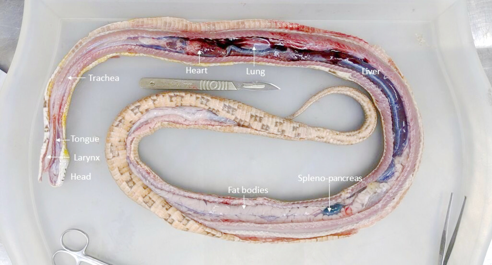

这是将玉米蛇的器官从体腔中取出后的解剖图，注意上面是颅侧，右上角是咽和舌：

这是将玉米蛇的各个器官分离后的解剖图：

## 皮肤

很多人觉得蛇很滑腻，其实正相反，蛇的皮肤非常干燥，而且不滑。蛇鳞的进化本来就是通过角质化上皮细胞覆盖皮肤以减少水分蒸发，让蛇可以在脱离水的环境中生存（所以才能不像两栖动物非得守着个水坑）【】【Blibili皮肤的进化视频】【】。蛇的皮肤腺体很少（除泄殖腔中气味腺外）。IV

> 蛇皮干燥，没有油脂腺，所以蛇皮既不滑也不油，摸起来像上等的皮革包，手感好极了。

蛇虽然皮肤腺体很少，但是一些蛇的泄殖腔附近有气味腺（musk glands或scent glands），用来分泌求偶信息素。这些腺位于尾部基部，位于雄性的半阴茎上方，它们开口在泄殖孔的后缘。有的蛇（比如被称为臭蛇的王锦蛇和美国后院最常见的蛇Garter Snake）通过气味腺分泌恶臭物质作为防御，在受到威胁时紧急排到猎食者手上【】【Snake Discovery 图】【】，把人恶心走。不过玉米蛇没有这功能。IV

气味腺发炎是比较常见的泄殖腔疾病（见[蛇的医疗-气味腺炎症](#气味腺炎症)章节）。IV

> 泄殖腔肿胀时知道气味腺炎症是可能原因

下图为雌性球蟒的气味腺。解剖时把泄殖孔以下的皮肤切掉了以展示气味腺的位置。左侧止血钳夹着的是气味腺的腺体，右侧用镊子尖指着的是气味腺的出口：

图中为蚺的解剖图片（尾朝右）。蓝色箭头指示气味腺，红色箭头指示蛇的半阴茎，黄色箭头指示蚺属有的骨盆附肢残迹。

蛇的鳞片皮肤是表皮和真皮的折叠起来构成的；鳞在进化上是异化的角质化表皮细胞。蛇鳞呈相互覆盖的关系，前方的鳞片盖住后方（但蛇头部的鳞没有相互覆盖）。蛇的腹面扁平，鳞片从左到右横跨腹部（泄殖孔以下除外），这类鳞片称为gastropeges。泄殖孔附近有一个或一对大的鳞片覆盖。IV

> 所以蛇不能倒过来撸，也不能全身同时往后倒车（但可以用身体中间部分撑住地面、先悬空倒车上半身，再改变重心，倒车另一部分）。如果蛇主动决定倒退身体的一部分，比如在头部从小洞钻出的情况下感到威胁，快速的在狭小通道后退可能导致掉鳞、折鳞。

可用蛇蜕观察蛇的鳞片分布：

下图展现了蛇的腹鳞结构，注意到前一片鳞覆盖后一片鳞的状态（<a href="https://www.youtube.com/watch?v=5CchyctRFrQ">David Hu, 2009</a>&nbsp;）III&nbsp;：

下两图为玉米蛇的微距摄影照片，展示了玉米蛇背部鳞片前一片附着后一片的状态：

蛇的表皮分三层，内层称为stratum germinatum，由产生蛋白质角质和中间层分裂细胞的cuboidal cells组成。中间层含有脂质，有助于在皮肤中提供一个水分可渗透的屏障。外层的角质层大量角化成鳞片。因为蛇的外层皮肤为鳞片，所以外皮感觉神经少，比较迟钝。IV

> 因此蛇不像人，一碰到热的东西能马上感觉出来，蛇更容易被极高温的物体烫伤。

蛇的花色既有化学色也有结构色（后者如Rainbow Snake的五彩斑斓的黑）IV。玉米蛇应该没有明显的结构色II

### 蜕皮

蛇会周期性蜕皮。幼体较为频繁，成体约1\~3月一次，吃得越多褪的越频。II 蜕皮是由甲状腺控制的皮肤脱落过程。蜕皮时全身皮肤增殖层的上皮细胞会同步增殖。这形成了新的上皮层，位于生殖层和老化的外层表皮之间。这个年轻的表皮层会角质化，并开始变得和外层（老化的）相似。在这两代上皮之间分离的过程中，外层通过厌氧糖酵解分离，酸性磷酸酶帮助分解粘合物。

分离时新旧两层皮肤之间有一层薄的液体，形成两个界面上的光学反射，因此在灯光下蛇全身呈现灰蒙蒙的状态、眼鳞发蓝，蛇会呈现出暗淡的“蓝色”。养蛇人此时会称他们的蛇为“in blue”，中文有时叫“蒙眼”。"In blue"一般有1\~2周。然后随着液体被吸收，颜色变清晰，这个过程没有现成名词，因为这像是新作月饼的回油过程，所以暂时称为“回油”。在蜕皮周期中，蛇活动减少，需要躲避、并需要温暖潮湿的场所，大部分蛇蜕皮期会拒食。蜕皮后立即恢复进食。IV 有的蛇在蜕皮开始前没有排便，会憋到蜕皮后排便。II 识别蛇进入蜕皮期最敏感的指标是活动减少（体现出了摄像头的重要性），一般活动减少后三四天才能肉眼看出微微的in blue。

一条玉米蛇蜕皮前后的头和身体的对比图：

> 了解蜕皮机制用于分析蜕皮不畅的原因；了解蜕皮的外观（不要出现蒙眼了跑去兽医那儿看眼科之类的业余行为）；了解蜕皮期习性（如何识别蜕皮期，别上手、别喂食、控制温湿度、提供湿躲避）

蛇的蜕皮通常从口鼻到肛门一次性蜕掉整片皮肤（不像许多蜥蜴是分块蜕皮）。若蜕皮不当则被称为“蜕皮障碍”，蜕皮不畅的原因和解决见蛇病-卡皮IV

> 正常的蛇蜕应该是完整一条。如果你的蛇蜕是一块一块的（先连续的褪了皮再被整碎不算），自己按相应章节信息检查出了什么问题。虽然蛇一旦已经开始蜕皮,全身就已经准备好蜕皮了，辅助撕皮没有明显伤害（与蜥蜴分块蜕皮、不能乱帮着撕的情况不同），但一般情况也根本不需要辅助蜕皮。上手蜕皮的人要么是蛇有问题、要么是环境有问题、要么是闲的没事儿手贱、无意义的造成压力。

准备好蜕皮时（“回油”后）蛇首先用嘴蹭破旧皮，在嘴的一圈形成“脱衣服”的开口。蹭破旧皮需要粗糙物，若栖地中缺乏粗糙物，会造成类似下方视频中的异常行为：

蹭破鼻尖开口后，蛇会从这个开口中爬出来。和脱衣服原理类似，蛇褪的皮是翻过来的，内面朝外。蜕下的皮肤是无色的（存疑？有的蛇蜕皮有颜色啊），因为色素细胞位于真皮层。蜕皮后新的上皮硬化形成新皮肤。IV

褪的皮上会有两个出血点，这是连接Scent Gland的地方，正常。IV

蛇没有眼皮，眼外面也覆盖有全透明鳞片（眼鳞），眼鳞上皮也会和其他皮肤一起蜕落（图8.20）IV。

#### 识别蛇的蜕皮期

可以通过蛇的颜色、反光（发白）识别蜕皮期，但这通常在蜕皮的中后期才能看出来。

一个更敏锐的指标是蛇的活动度，如果有摄像头监测蛇的日常活动、并且栖地内的丰荣度足够、蛇状态正常，蛇在平时有充分的活动可以监测，那么蛇在蜕皮期时活动减少是蛇进入蜕皮期的更敏感的指证。

还有一个特征是蛇在进入蜕皮期后，腹鳞会变得很涩，在人手上、胳膊上爬行时都没法光滑的前进，卡的一顿一顿的。这时往往皮肤已经隐约有一点白色。所以在白色若隐若现、不确定是不是真要蜕皮、又缺乏其他指证时，可以用这一触感来辅助判断。

#### 蜕皮期的禁忌

蛇在蜕皮期间有很多禁忌，例如不要喂食、不要上手、要注意维持湿度等等，因此识别蛇是否进入蜕皮期很重要。

蛇在蜕皮期间通常不会拉屎，所以知道蛇要蜕皮时不应继续喂食。蜕皮期间即使喂食也有可能拒食。蜕皮后注意清理栖地中可能存在的粪便。

蛇蜕皮期间不要上手，蜕皮期蛇的身体状态、皮肤状态、视力都不正常，因而蛇比以往更容易产生不良压力，且更具防御性。强行上手会令蛇过于紧张，还有更大的可能性被咬。

## 骨骼与运动

玉米蛇的骨骼标本

### 脊椎

爬行动物腹部着地，脊柱不用长期承受体重，所以脊柱不用非常刚性、且非常灵活（显然，龟龟除外） IV。

> 人在这个方面是另一个极端，因为要直立行走，所以人的脊柱时刻受到很大的结构应力，你腰疼的时候就该羡慕一下爬行动物，并且有一种医嘱就是（学习爬行动物）一直趴在床上。

蛇的轴向骨骼系统有120到400节（不计泄殖孔后的部分），这是蛇运动的中心机制（废话没有腿可不就是中心运动机制吗），每一节上有一对肋骨和对应的大的轴向骨骼肌，每个椎骨有五个独立的关节，形成了极其灵活的背脊。肋间肌和轴下肌不仅在运动中有帮助，而且在呼吸和吞食猎物的过程中也有帮助。从头到屁股的每一节的肋骨和椎骨都差不多（不像人，不同区域的肋骨和椎骨有显著差异）。蛇的运动非常节能，Garter snake运动时消耗的能量大约只有同样体重蜥蜴的13%。IV

蛇在进化拉长的过程中退化掉了胸骨和骨盆带（啥是骨盆带？）。比较原始的蛇类群（比如蚺和蟒）的骨骼里可以看到泄殖孔两侧有退化的盆骨附肢遗迹（但玉米蛇没有）。IV

玉米蛇不会主动断尾。IV

### “行走”

蛇的走动方式可以大致分为下列几种。当然这种分类并不是完全的，蛇可以随着栖息地、垫材或活动的改变而从一种运动形式切换到另一种，会出现中间状态：

#### 横向波状移动

英文是Lateral undulation，也叫Serpentine Locomotion。

一般人想到蛇的移动就是这种移动方式。过程是侧向弯曲脊柱，身体的对立面收缩。几种移动方式中这是较快的一种。如下方视频所示（<a href="https://www.youtube.com/watch?v=5CchyctRFrQ">David Hu, 2009</a>&nbsp;）III&nbsp;：

下面是一个因为地面太滑，玉米蛇无法前进的视频，跟在跑步机上跑步似的，这样更容易观察玉米蛇的前进体态：

有人解释说蛇能这样行走是因为蛇通过弯曲部位向身下或身后物体施力后所受的支持力所致，这种解释是错误的。Lateral undulation的行动基础有两个：一是下图所示的前一片腹鳞盖住后一篇腹鳞的结构会产生单向的不对称摩擦力，使得前向摩擦力远小于后向摩擦力：

可以通过给玉米蛇穿袜子的方式验证这一猜想，给玉米蛇穿袜子之后蛇腹部的摩擦力增大了，但各向异性消失了，此时玉米蛇无法前进：

第二个行动基础是玉米蛇会通过调整重心，使得只有身体的一部分接触地面，调整局部的摩擦力大小，这与人行走时要不断地在两脚之间调整重心是类似的：

#### 直线运动

很像毛毛虫在爬，肌肉收缩在运动中左右对称，身体不同部分周期性的分别触地施力，直线前进。肥宅蛇经常这么移动（比如咝蝰，大号的蟒之类，因为太胖，弯不过来）。直线运动相对较慢，但耗能低。下图是典型的肥宅蛇的直线运动（[链接](https://www.youtube.com/watch?v=xZ7BLcqYU_I)）：

#### 手风琴前进

英文是Concertina locomotion

先取一个上半身的固定点，把后半截身体向前半身想手风琴一样向固定点压缩起来，然后取身体后半部分某点为新的固定点，把前半身向前展开，再取前半身的某个新位置为新的固定点，重复这一过程。常见于树栖和穴居蛇；这是蛇运动中能耗最大的方法。

下面是一条玉米蛇在不同宽度的通道中进行手风琴前进状行走的视频（<a href="https://www.youtube.com/watch?v=a9y-C7LDpq0">BIRTH Lab, 2015</a>&nbsp;）III&nbsp;：

下面是一条玉米蛇在空地中进行手风琴前进状行走的视频（<a href="https://www.youtube.com/watch?v=UP2ySwOZccs">BIRTH Lab, 2015</a>&nbsp;）III&nbsp;：

#### Sidewinding

蛇在沙、泥等类似材质的平滑表面上使用这种移动模式。

这种模式很难描述，直接看视频。注意这种运动很快，视频放慢了四倍（<a href="https://www.youtube.com/watch?v=PIc_SH2ZSTo">BIRTH Lab, 2015</a>&nbsp;）III&nbsp;：

蛇以Sidewinding的模式行走时，在前进过程中创造一系列分开的平行直线，很多人看到这样的“足迹”会非常困惑，不知道是蛇的痕迹（<a href="https://www.youtube.com/watch?v=SMrgMcnVAu8">BIRTH Lab, 2015</a>&nbsp;）III&nbsp;：

这是自然环境下角响尾蛇进行Sidewinding的两个视频（<a href="https://www.bilibili.com/video/BV1tq4y1f7B1">骆老师啊, 2021</a>&nbsp;）I&nbsp;：

<a href="https://f000.backblazeb2.com/file/voldy-public/videos/角响尾蛇的Sidewinding移动.mp4">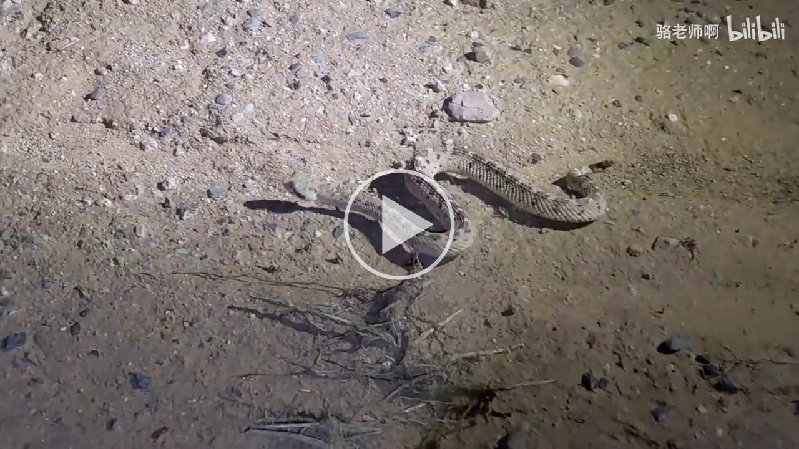</a>

在其他几种运动模式中，蛇的大部分腹部都接触底面，唯独这种运动模式中，蛇的身体基本上只有两点接触地面，所以这种运动模式可以一方面增大压强，减少打滑；一方面减少地面向蛇的热传递，有助于在滚烫的沙地上行走。角响尾蛇（Crotalus cerastes）是一种经常采取sidewinding形式行走的蛇，因此也被直接称为sidewinder。

### 头骨

美洲水蛇的头骨结构（https://www.savalli.us/BIO370/Anatomy/5.SnakeSkull.html）

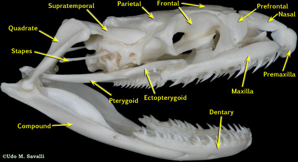

图中术语翻译
* Quadrate  方骨
* Stape  鐙骨
* Supratemporal  上顳骨
* Parietal  顶骨
* Frontal  额骨
* Prefrontal  前额骨
* Nasal  鼻骨
* Premaxilla  前上頷骨
* Maxilla  上颌骨
* Ectopterygoid  外翼骨
* Pterygoid  翼骨
* Compound  ?
* Dentary  齿骨

玉米蛇的骨骼标本

蛇缺乏下颌联合（摸摸你的下巴，左右两块骨头是连起来的，蛇是断开的），因此颌骨可以分开运动。

> 因此蛇吃东西的方式是用牙固定猎物后让猎物在嘴里“行走”，左一下右一下的把猎物往嘴里送。【】【2023.7.14伏地魔喂食视频】【】。同时脊椎和身体波浪形运动，辅助将食物向胃部推送。（<a href="https://www.bilibili.com/video/BV1eP411a7NB/">冬青-cyan, 2023</a>&nbsp;）III&nbsp;

人的颌骨关节相当于一个活页（你张大嘴时耳朵旁边需要转动的关节），蛇的在这个地方多了一块骨头，变成了两个活页中间固定起来。多出来的这块连接上颌和下颌的骨头叫方骨（quadrate bone），这两个关节转动的自由度很大，加上两活页结构本身的机械性质，有时会导致这两个关节别在一起纽不回去（找三根筷子绑起来扭一扭就理解了）IV

> 所以蛇吃了较大的食物之后有时闭不拢嘴，必须打个哈欠【】【伏地魔视频】【】才能把关节调回来。

蛇的头骨和蜥蜴祖先的头骨有很大区别。脑颅（braincase）是固实的，skull 能独立于braincase运动。IV

蛇能吞食很大的猎物有下列原因：
* 下颌和腭上颌之间由方骨形成关节（能吞下比头大的猎物）
* 缺乏下颌联合（能吞下比头大的猎物）
* 肋骨并未在腹面连接（没有胸骨，身体可以扩张容纳比身体直径大的猎物）IV

### 牙

爬行动物的牙齿由釉质、牙质和牙骨质组成，但缺乏牙周膜。蛇牙（相比人类牙齿）有这些特征：

【多牙列】：即在端生牙或侧生牙的舌侧有若干后备牙以不断替换脱落的牙。蛇用不断换牙的方式保持牙齿锋利，并减少牙齿折断带来的影响。蛇牙的折断在野外并不罕见（也包括前勾牙毒蛇的毒牙），牙齿会在生命周期中会不断更换。IV

> 所以毒蛇只拔去毒牙是不能实现毒蛇去毒的。因强行掰嘴、刻板行为等问题折断后有时会导致口腔炎。

【侧生】：人的牙齿叫槽齿，即颌骨有坑，牙齿坐在坑里，四周都有颌骨环绕。蛇的牙齿不同，称为侧生齿（Pleurodont teeth）：即牙在唇侧（labial side，就是外侧）是和颌骨融合的，在舌侧（lingual side）没有融合，由软组织黏着。IV

> 理解蛇牙的受力结构，知道何种动作会导致断牙

【数量】玉米蛇有六排牙齿，下颌骨上每侧一排，上颌区每侧两排。IV

> 被咬了之后能知道手上的牙印是怎么回事，下图能看出被玉米蛇咬伤后的六条牙印

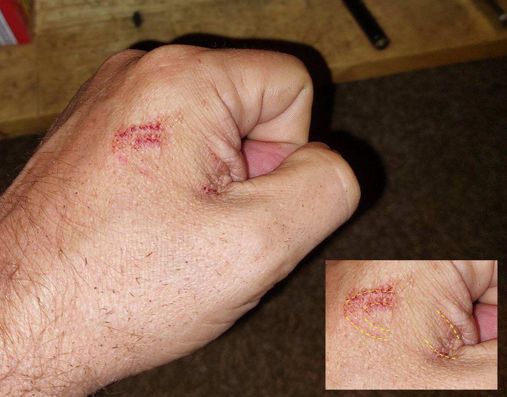

【同型齿】牙齿不区域分化，所有的牙齿都是一样的。他们的牙齿长、细且向后指，以防止猎物逃脱。IV

> 所以被蛇咬了要往前推，不要往后拽。

【生牙骨】即dentigerous bones，包括下颌骨（mandibles）, 上颌骨（maxillae）, 腭骨（palatines）, 翼骨（pterygoids）, 有时也包括前上颌骨（premaxillae）。IV

### 蛇的四肢

蛇没有前肢，但有少数种类有骨盆残肢（pelvic vestiges），包括外生距（external spurs），这些可能在交配时有用，特别是在蚺和蟒中。

玉米蛇没有spurs

## 心血管

【】【心脏解剖图】【】

蛇的心脏在身长的1/4处，在气管分叉点的颅侧。每分钟心跳60次左右。

> 知道心脏在哪儿。拿着蛇头下半身举高，让蛇头朝下时，因为回心血增多，心跳的起伏会变得明显，有时可以直接透过皮肤看到蛇的心跳【】【伏地魔视频】【】了解其状态，不要觉得异常。

蛇的心脏是三室心脏，比人少一个心室。右心房通过一个大的房室静脉窦（sinus venosus），接收循环中的脱氧血。IV

下图红色箭头是蛇的心脏，绿色箭头是甲状腺。

下图为玉米蛇的心脏和周边血管的解剖结构（<a href="http://www.acta-zoologica-bulgarica.eu/downloads/acta-zoologica-bulgarica/2018/70-1-51-56.pdf">Georgiev, 2018</a>&nbsp;）IV&nbsp;。图中标尺为0.4 mm。图中缩写：
* glth：甲状腺（thyroid gland）
* Aod, Aos：左/右主动脉弓（aortic arch）
* Accs, Accd：左/右总颈动脉（common carotid artery） 
* Vjs, Vjd：左/右颈动脉（jugular vein） 
* Av：椎动脉（vertebral artery） 
* Apd：右肺动脉（right pulmonary artery）

蛇的心血管系统传统上被认为有三个心室。然而，最近的研究已确定静脉窦（systemic arch）作为一个真正的心室，使许多专家认为蛇有四个心室。这包括静脉窦、右和左心房，以及心室。

尽管心室两半之间通着，但从心脏出发的富氧和无氧循环之间有明显的功能性分离。所以心脏在功能上等于五腔结构（左心房，右新房，心室通过流体力学性质分成两部分分别流向主动脉和肺动脉，还有一个静脉窦），两个体动脉弧和肺动脉都从心室出口。IV

未分隔的心室在热量调节和呼吸保持能力中起着重要作用，因为肺部阻力的高低可以控制血液是向肺部输送还是远离肺部。IV

爬行动物能系统性的让血液不走肺部，转向厌氧代谢，这对麻醉带来了挑战，尤其是对于可以长时间屏息的水生龟类。这也解释了为什么许多患有慢性肺炎的爬行动物恢复缓慢，因为感染增加了肺阻力，最需要血液来恢复的地方反而没血。IV

> 了解爬行动物麻醉的挑战

此外，富氧和贫氧循环之间也可能存在从右到左和从左到右的分流。IV

蛇进食后可以快速增加心脏机能，缅甸蟒喂食后可以当场开始合成新的蛋白质，在喂食后两天内把心脏的心室质量增加40%。一旦消化过程完成，心肌肥大状态马上消失，心脏会恢复到以前的大小。不过这种过程并不总是可以重复，有人认为心肌肥大可能反映了应激状态。IV

下图为缅甸蟒的心脏在喂食前（饿了30天）和喂食后三天的变化（<a href="https://www.science.org/doi/10.1126/science.1210558">Leinwand, 2011</a>&nbsp;）：

蛇体内心脏的位置随其生态位有所不同；树栖蛇的心脏更接近头部，而完全水生的蛇倾向于心脏位置更中心。心脏的长轴以头尾方向排列，心房位于头部。由于蛇没有横隔膜，心脏会在胸骨内有一定移动，这可能有利于相对较大的猎物通过。存在两个主动脉，右主动脉从心室的左侧出口，左主动脉从右侧出口；它们在心脏的尾部融合，形成腹主动脉。IV

左静脉窦比右边大，这与大多数四足动物相反。成对的颈动脉和颈静脉位于心脏前部，靠近气管。颈静脉可以通过简单的切口轻松置管，以放置静脉导管以获取样本或输注液体或药物。蛇能够反射性地控制动脉压力，但当蛇的体温高于或低于其偏好的温度时，这种控制能力会减弱。IV

此外，蛇血的氧解离曲线也可能受温度影响。IV

爬行动物的红细胞有核，红细胞寿命比哺乳动物和鸟类的长。血溶比（hematocrit）随温度和季节变化，而不是像哺乳动物那样随高海拔和缺氧变化。白细胞包括 heterophils, 嗜伊红白血球（eosinophils）, 嗜碱性细胞（basophils）, 淋巴细胞（lymphocytes）, 单核细胞（monocytes）, 和azurophils。Azurophils是爬行动物特有的。它们与单核细胞相似，但体积较小，细胞质呈红紫色。IV

蛇同时具有肝门静脉循环和肾门静脉循环。因此，建议有经肾排出途径的肌注药物打在上半身。这是为了避免潜在的肾毒性和首过效应。然而，研究表明，通过肾门静脉系统清除药物可能更多地依赖于肾脏是如何通过肾小管排出（tubular excretion）影响药物的清除，而不是肾小球滤过。IV

临床注意事项是，后肢的静脉回流直接进入肾小管。这意味着，理论上，将药物注入体后半部可能使有经肾排出代谢方式的药物血清浓度降低，并同时增加肾毒性。然而，这主要适用于通过肾小管排出（tubular excretion）排泄的药物。IV

蛇采血的主要部位包括腹面尾椎静脉和心脏穿刺。一个不常用的备选静脉穿刺部位是颈静脉。颈静脉通常位于心底和头骨底部之间的1/3到1/2的距离。

相反，通过肾小球滤过排泄的胺基糖苷类药物，如gentamycin 和amikacin，不会受到影响。尽管动物脱水时肾门静脉向肾的流量增加，但当肾小球关闭时，上皮运输（epithelial transport）停止。因此，即使有更多的药物进入肾脏，也不一定会被排泄。IV

## 免疫

爬行动物的淋巴系统比血液系统更发达。他们没有淋巴结，但在哺乳动物淋巴结的位置有广泛的网状淋巴网络和大型储存器，称为扁囊（cisternae）。由于淋巴系统发达，所以在静脉穿刺时血样常被淋巴稀释。IV

## 呼吸

### 口鼻和喉部

空气通过外鼻孔（external nares）, 鼻窦（nasal sinus）, 内鼻孔（internal nares）进入体内。

人的声门是两片声带所夹成而成的开口，在喉部，位于喉头和气管之间，气体进入体内后经过声门进入气管。蛇的声门（glottis）前置，位置与人区别较大，在口腔底部舌的尾背侧。声门在休息时保持关闭，声门扩张肌控制其开启声门时才能呼吸。IV 

蛇类的声门非常灵活，可以在进食时向侧面延伸，以便在吞食猎物时呼吸。IV 

给蛇麻醉的时候插管直接插到前伸的声门里，所以很容易。IV 

下面两图显示了蛇口腔内舌鞘（吻向，黄色箭头）和声门（尾向，绿色箭头）的相对位置，红色箭头指示的是两排牙：

> 了解声门是嘴里的哪个孔，口腔检查和force feeding的时候别压了人家的氧气管给憋死了。

有的蛇长有会厌软骨（玉米蛇没有），在呼吸时会震动，产生的嘶嘶声比没这软骨的蛇声音大得多。下图展现了佛罗里达松蛇（Florida Pinesnake，Pituophis melanoleucus mugitus）的会厌软骨，同时显示了舌鞘和声门的位置关系：

空气从鼻吸入到中鼻后孔（choana medial）到上颚（maxillae），当嘴巴关闭时，会厌（epiglottis）就能放在上颚里。IV【】【看不懂，找张图？】【】

### 味觉/嗅觉

玉米蛇的舌主体为红色，舌端色浅、分叉。

下图展示了玉米蛇的舌。

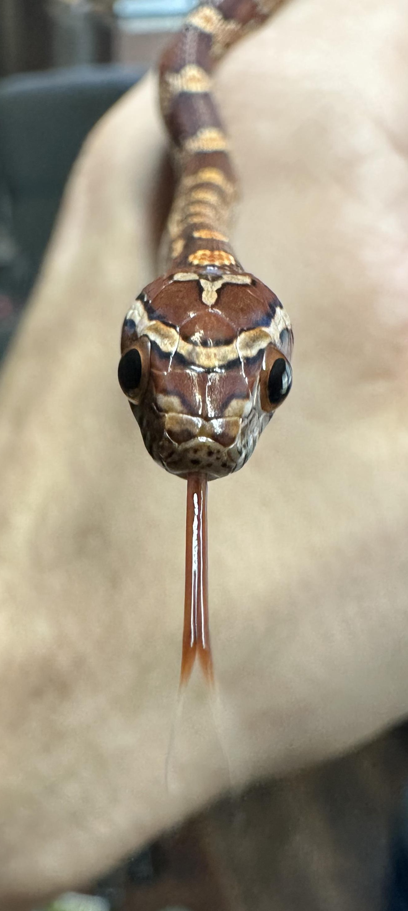

玉米蛇吐舌时应清楚的看到舌尖分叉。如果舌尖不分叉，应考虑是否有[呼吸道感染](#呼吸道感染和肺炎)。

下方的视频是玉米蛇吐舌的40倍高速摄影视频。

爬行动物的舌头和口腔上皮有味蕾。舌是味觉、触觉和嗅觉的器官。

所有的爬行动物都有一个叫做Jacobson's organ、也叫犁鼻器（vomeronasal organ）的附属嗅觉器官。这些是一对圆顶状的腔室，位于口腔前部上颚屋顶的犁形骨上，包有厚厚的感觉上皮（sensory epithelium），布有嗅神经的一个分支。蛇的嗅觉最为发达，它们通过在声门下方的鞘内用舌头快速抽动来接收信息。【】【蛇的舌鞘图】【】IV。

蛇的舌头有一个叉状的尖端，位于会厌下的鞘内，通过将颗粒状的气味传递到位于口腔顶部的Jacobson's organ，从而发挥嗅觉作用。由于创伤或感染失去舌头的蛇可能会停止进食。IV

【】【犁鼻器的图】【】

> 了解吐舌的生理意义和不吐舌时蛇头放哪儿去了。

观察蛇的口腔时，下方的声门比较显眼，导致许多人误以为声门是存储舌头的地方，其实不是。【】【图】【】

饲养蛇的人在给蛇喂食冷却（例如，冻结并解冻到室温）的啮齿类动物时常常被咬，因为蛇可能闻到猎物的气味，但是会朝向热源（在这种情况下是“活”的饲养员手的辐射热）。泪管进入Jacobson’s organs的管道。这些器官具有嗅觉功能，气味颗粒用舌叉收集，然后通过舌叉传递到Jacobson’s organs。IV

### 气管

蛇的下呼吸道气管环（tracheal rings）不完整，背侧的四分之一是膜状的。

呼吸道的黏膜纤毛内衬层（mucociliary lining）很原始，所以没法有效的清除气道渗出物。

### 肺

在进化上比较古老的蚺和蟒有两个肺，右肺比左肺稍大。进化程度更高的蛇类左肺退化，甚至可以完全缺失。右肺通常从靠近心脏的地方延伸到右肾的颅侧。

爬行动物的肺容量大、但表面积小。蛇的肺表面积只有相同大小哺乳动物的1%。蛇的肺结构简单，单室。IV

肺的头向部分被称为血管肺（vascular lung）有血管，主要用于气体交换，尾向的三分之一称囊肺（saccular lung）不能呼吸，主要作为气囊功能。有些蛇像拉风箱一样使用这个气囊。IV

注意到下图中标注的用于气体交换的右肺（Right lung，实际是右肺的血管肺部分）和其尾向的右气囊（Right air sac，右肺的囊肺部分）。

蛇的肺除用于气体交换外，还用于发声、示威和游泳时的浮力控制。

在许多蛇类中，肺的血管肺（vascular lung）部分向上延伸至气管，和背向的膜一起扩张成“气管-肺”。在极端情况下，最主要的气体交换功能部分是“气管-肺”的气管部分，而不是“气管-肺”的肺部。

肺的血管肺部分的壁由称为肺凹（faveoli）的蜂窝状单元组成，是气体交换的结构单位。注意这些肺凹（faveoli）与哺乳动物的肺泡（alveoli）不同源。IV

### 呼吸肌

蛇没有横膈膜，整个胸腹膜（pleuroperitoneal）被称为体腔（coelom），不分胸腔和腹腔。IV

蛇没有隔膜，但仍然是负压呼吸，通过胸廓肌肉的膨胀来产生负压。空气通过肋间肌（intercostal muscle）和躯干肌（Trunk muscle）的动作吸入和呼出。IV

由于缺乏隔膜和咳嗽能力，再加上支气管纤毛运输系统很原始，爬行动物容易患上呼吸系统疾病。IV

患有肺炎的爬行动物往往会寻找栖息地较冷的一端，以减少对氧气的需求。IV

> 知道蛇没法咳嗽。知道呼吸道感染对蛇额外的危险性、了解呼吸道感染的行为症状（见[呼吸道感染和肺炎](#呼吸道感染和肺炎)）。

### 呼吸调节

爬行动物的呼吸是由温度升高控制的，而不是像哺乳动物那样由酸碱平衡和二氧化碳分压控制的。温度升高会增加代谢率，从而增加氧气需求，刺激呼吸并增加潮气量。低氧水平也会刺激呼吸 - 因此在心肺停止期间需要小心不要对爬行动物进行过度通气。IV

## 消化

口腔中的腭腺（palatine）、舌腺（lingual）、舌下腺（sublingual）和唇腺（labial mucus-secreting glands）分泌唾液湿润口腔和润滑猎物。毒腺是特化的唇腺，是在几个蛇类谱系多次独立进化出来的。IV

蛇通过口腔负压吸取液体（不像蜥蜴、猫狗等靠舌头舔）。

在吞咽过程中，唾液腺会产生大量的唾液以湿润和润滑猎物。IV

在蛇类中，胃为纺锤形，贲门括约肌（cardiac sphincter）发育程度较低。IV

> 所以蛇可以麻溜的一下吐食。

蛇类的肝脏细长，体积相对较大。IV

蛇有胆囊，主要的胆色素是胆绿素。胰腺附着在十二指肠（duodenal）loop的肠系膜边缘，在一些蛇类中，胆囊与脾融合形成splenopancreas（脾胰？）。IV

蛇的食管可扩张，大约一半的长度没有肌肉附着。IV

蛇通常使用它们的轴向肌肉和骨骼来帮助将食物输送到胃中。IV

蛇吃东西不嚼，整只吞。IV

蛇缺乏明显的心脏（胃食管）括约肌。胃可以扩张。IV

爬行动物的消化道比哺乳动物的短，食肉的蛇类消化道很简单，与哺乳动物、鸟类甚至蜥蜴相比，蛇的小肠相对较直且没有卷曲。

蛇的胰腺通常位于胆囊和脾脏的三联体中，位于细长的纺锤形肝脏的后端的远侧。有些种类的蛇有脾胰。

食物消化时，经小肠排空到结肠，结肠又排空到泄殖腔。

泄殖腔有三个区域，从头到尾，顺序是粪室（coprodeum），尿殖室（urodeum），肛室（proctodeum）。它接收来自消化、排尿和生殖系统的物质。尿酸盐和粪便可以存储在结肠和泄殖腔内。IV

> 蛇是直肠子，有些图、模型其实是错的

蛇体腔内有脂肪体，每侧体腔有一排，心脏的颅侧也有一小撮。IV

> 胖蛇中这些脂肪体可能非常大，消瘦的蛇中可能非常小。所以蛇超级胖的时候经常会胖出个屁股蛋。识别身体哪里粗是长得大，哪里粗就是胖。

图中f是脂肪体，g是消化道，vc是腔静脉，t是睾丸，a是肾上腺。图中左侧是颅向。

猎物到胃里之后消化很快，但吸收很慢。包括骨骼在内的所有部分都能利用。一顿饭可能得5天才能消化完。

玉米蛇即将排便时粪便存储于泄殖腔中，可以从外观观察到玉米蛇是否即将排便。下图是一条准备好排便的玉米蛇，注意到其泄殖孔附近的突起。

排便时角蛋白组分（比如老鼠毛）会团成一团拉出来，这一团团的叫felt（毛线团）。IV

> 知道蛇粪便的正常状态，下图为玉米蛇的粪便，没有骨，其中黑色部分主要为老鼠毛组成的felt，浅黄色部分为尿酸。如果有骨、没felt、没尿酸、甚至还有老鼠的形状，那不是屎，是吐食了。

下图通过调亮展现了玉米蛇粪便中由小鼠的毛而形成的felt：

> 知道应重视给玉米蛇喂食时不能褪毛。食物的毛（羽毛）是蛇的膳食纤维，帮助排便。如果长期喂食如褪毛的鹌鹑苗，会导致排便异常。

消化取决于环境温度，食物成分和动物的身体健康状况。IV

> 喂食后要格外注意合理的栖地温度。

> 不建议向生病或虚弱的爬行动物强行喂食（force feeding）固体食物，食物消化不了会直接在肚子里腐烂，导致严重后果。

爬行动物是变温动物，因为不用消耗能量来维持体温，所以非常节能，相同情况下的食物消耗量大约只有鸟类和哺乳类的几分之一。低代谢率和高效的食物转化使蟒蛇等大型肉食蛇类（在不理想情况下）可以几个月进食一次。为了节约能量，它们的肠道和消化酶在禁食期间会处于休眠状态，然后在进食时代谢率和酶活性会迅速增加，以帮助它们消化猎物。它们还调整了自己的胃肠道，使得食物进入时，休眠的肠道会迅速肥大，心、胰、肝、肾的功能也会大幅上调。一旦消化完成，反向过程发生，所有受影响的器官都会萎缩回正常大小。IV

## 泌尿

【】【尿酸的形成机制和排出】【】

蛇有一对肾脏，呈细长的叶片状，位于肛吻长约75%处的尾背部体腔内。蛇的右肾位于左肾的颅侧。

蛇没有膀胱，输尿管直接排空到尿殖室，尿会反流到远端结肠里做重吸收。

人的肾元有一个叫亨利氏环（Loop of Henle）的结构，是一段连接从近曲小管通向远曲小管，其主要功能是建立溶质浓度梯度。蛇的肾脏缺乏亨利氏环，无法将尿液浓度提高到超过血浆的渗透压，如果排泄高溶解度的尿素会浪费大量的水。所以陆生爬行动物为了帮助节约水份进化为排泄尿酸的代谢，其沉淀为白色的尿酸盐（水生爬行动物排泄尿素）。虽然这有助于减少水分流失，但一个主要的缺点是，由于尿酸是通过肾小管分泌的，所以不管爬行动物是不是脱水都会被排泄出来。因此，脱水的爬行动物或那些有肾问题的动物很容易痛风，即血液中尿酸的积累，沉淀为尿酸盐晶体，沉积在关节（关节痛风）和内脏器官（内脏痛风）中。IV

> 了解蛇的排尿是拉出固体的尿酸，不是像人一样尿出液体的尿素水溶液。

爬行动物的肾门系统具有由肾动脉和肾门静脉组成的双向供血系统。这条静脉绕过肾丝球，进入肾小管层次，帮助分泌尿酸。它还在减少水消耗中发挥作用。当脱水时，肾小球过滤率减慢，肾门系统将保持肾小管的灌注状态，以防止坏死。肾门系统的控制方式目前还不清楚，但人们认为它可能与鸟类相似，有在压力下可关闭的阀门系统，将血直接送往心脏。IV

在雄性蛇类中，肾脏的末端部分为性段（sexual segment），指的是其末端肾曲小管（convoluted renal tubules）会受雄激素控制而在繁殖季节变得肥大并分泌液体。性段分泌的液体是精液的一部分。受影响的肾脏会增大，且显得惨白。对不熟悉的兽医可能看起来像是有病似的，其实是正常的。蛋白质消化产生的含氮废物以尿酸形式排出，为白色至黄色固体，与粪便一起排出。蛇的肾脏无法排泄比血浆浓度更高的尿液。IVIV

在大多数物种中，雌性蛇的体型比雄性的大。大多数蛇有性生殖，但盲蛇和锉蛇（file snake）可孤雌生殖。在几种北美的蛇和一种蟒中也报告了罕见的孤雌生殖IV

蛇的生殖系统结构如图所示：

雄蛇有纺锤形的睾丸，但位于体内，不外露。生殖腺位于肾脏的颅侧，右侧的生殖腺比左侧的更接近颅部。右侧睾丸紧邻下腔静脉，并通过微小的血管与之相连。左侧睾丸有自己的血供，但与左肾上腺紧密相连。IV

睾丸会随着季节变化增大/缩小。在交配过程中，精子在中肾管中被运送到尿殖室和半阴茎的基部，并沿着勃起的半阴颈外部的精沟（sulcus spermaticus）进入雌性的泄殖腔。IV

蛇有两根半阴茎（hemipenes），平时存放于尾部腹面基部的泄殖腔尾侧。各种蛇的半阴茎差别很大，可用于蛇的分类。下图中为蚺的解剖图片（尾朝右）。蓝色箭头指示气味腺，红色箭头指示蛇的半阴茎，黄色箭头指示蚺属有的骨盆附肢残迹。IV

（蛇的半阴茎收起时从体外看起来并不明显，但是蜥蜴的相同结构看起来很明显，显示为泄殖腔下方的两个鼓包，如下图所示。有人仿照人类结构叫它是雄性蜥蜴的睾丸，但其实它是藏起来的两根半阴茎）。

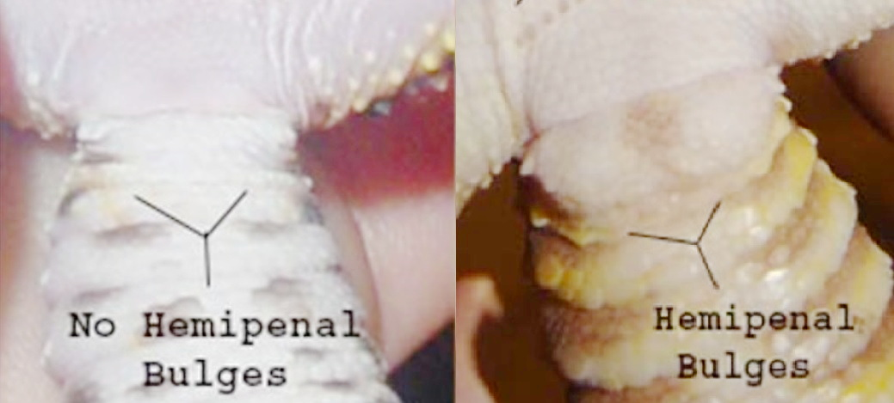

在交配期间，两个半阴茎的其中一根翻转出来（inside-out），插入雌性的泄殖腔。半阴颈收起时的内面在膨出后是接触雌性的外面。如下图所示，半阴茎在性交时一次用一根，会通过充血和肌肉运动勃起，并从泄殖腔中膨出。与人不同，蛇的半阴颈没有排泄作用，是纯粹的生殖器官，受损了或者坏死了可以直接切除，不影响生殖以外的功能。切掉一个半阴茎的蛇还可以用另一个半阴颈交配。IV

雌蛇有一对卵巢和一对输卵管，不对称分布。卵巢位于胰腺附近。每个输卵管在尿道部分都有一个独立的开口进入泄殖腔。卵巢负责产生雌激素、生成生殖细胞，它们呈囊状，表面覆卵泡。右侧卵巢靠近下腔静脉，左侧卵巢靠近左肾上腺。输卵管不仅提供卵子运输，还提供白蛋白、蛋白质和钙质以完成蛇蛋的构建。

玉米蛇卵生（不像Garter snake是卵胎生）。下图为圈养玉米蛇的蛋（<a href="https://www.youtube.com/watch?v=nAq3FN19FHw">【FILL_REF_AUTHOR: Snake Discovery, This Snake was Dropped off... And then Laid Eggs!】, Year?</a>&nbsp;）I&nbsp;：

----------

【】【蛇的蛋】【】能孵的蛋和不好的蛋的外观区别，雌蛇会不交配产蛋吗？

Wikipedia:

玉米蛇通常在冬天过后天气回暖时发情，雄性通过化学信号和触觉信号寻找雌性。交配时雄蛇翻出它的其中一个半阴茎插入雌蛇的泄殖腔并射精。受精后雌蛇于约一个月后产蛋，通常选取温暖、潮湿的隐蔽处为产蛋地点，每胎12\~24枚。玉米蛇无孵化行为，“发射后不管”。蛇蛋蛋壳质软如同皮革、形状狭长。孵化期10周，新生蛇用特化的鳞（称egg tooth）划破蛋壳后出生，新生蛇的长度约10 cm。

----------

卵生蛇不会为孵蛋而筑巢（但有例外，比如眼镜王蛇会用叶子堆一个巢）。一部分蛇有孵化行为，蛇会抱着蛋直到孵化。IV

### 蛇的性别鉴定方法

* 外观法 III：

雄性蛇的尾部（泄殖腔开孔以下部分）因为需要装下半阴茎，所以更粗、长；雌性蛇在泄殖腔开孔以下快速缩窄，且尾较短。

在许多蛇类中，由于半阴茎的存在，雄性的尾部基部比雌性的更宽且更直。IV

* 尾鳞计数法 IV【】【引文？】【】：

计数蛇的泄殖孔到尾尖的腹鳞鳞片数目，多余140片大概率为雄性，少于130片大概率为雌性，130~140片之间不能确定。

* 探针法（<a href="https://zslpublications.onlinelibrary.wiley.com/doi/10.1111/j.1748-1090.1975.tb01393.x">Laszlo, 1975</a>&nbsp;&nbsp;）IV&nbsp;：
  用圆头金属探针从泄殖腔口朝尾部插入半阴茎腔。雄性蛇可插入的更深（相应腔体要存放翻过来的半阴茎），雌性可插入的较短（可以比对插入深度对应几个鳞片的长度）。对成体蛇，这是最方便、廉价、准确的方法。
  
  蛇的半阴茎存放于体内时是翻过来的，所以Probing插入时探针接触的“墙”的其实是半阴茎的外表面。
  但是如果你现在不会，也不应该只看视频教程就照着做。得有兽医或极有经验的人手把手教你，否则可能造成严重伤害。
  
由于半阴茎的存在，可以用水溶性的润滑剂润滑一个钝头探针，然后小心的插入蛇的尾部基部和半鞘的腔内，以准确地确定性别。相较于同种的雌性，雄性的探针可以插入的更深。IV

* 半阴茎挤出法 IV：

对幼蛇，可以通过挤压蛇的半阴茎腔使雄性阴茎翻转出来，雌性翻不出来。

网上有很多教程，但是如果你现在不会，也不应该只看视频教程就照着做。得有兽医或极有经验的人手把手教你。

* 基因测试 IV：这是既准确又没有潜在伤害的方法，除了要花钱之外没什么坏处（大概几十美元）。需将蛇蜕寄到基因检测机构，比如Raregenetics.com，除了性别之外还可以鉴定其基因构成。

## 内分泌

蛇只有一个甲状腺（下图绿色箭头），甲状腺呈球形，位于气管的腹侧、心脏的颅测。甲状腺对于新陈代谢（受温度影响）起着至关重要的作用，并在蜕皮和生长中发挥重要作用。IV

与哺乳动物不同，蛇类有两对甲状旁腺。甲状旁腺控制钙磷水平。IV

肾上腺呈黄色或红色，紧密依附于蛇的生殖腺。IV

胰腺在蛇中，它通常呈金字塔形，常常与脾脏紧密联系。与哺乳动物一样，它具有内分泌和外分泌功能。IV

蛇有单个或成对的甲状腺位于心脏的颅侧。甲状腺的功能涉及控制生长和蜕皮周期。皮肤问题，如脱皮不良，持续的蜕皮周期，皮炎等，都与甲状腺功能障碍有关。与哺乳动物不同，成年蛇的胸腺并不会involute ，但可能难以在位于甲状腺颅侧的脂肪组织中找到。甲状旁腺成对存在，通常嵌入在心脏和甲状腺颅侧的胸腺中，并在钙代谢中起作用。肾上腺通常位于gonadal mesentery（性腺肠系膜）内，如图所示。脑垂腺（pituitary gland）像在哺乳动物中一样作为主宰腺（master gland）。松果体分泌褪黑素。蛇类内分泌功能和功能障碍的临床意义研究不多。IV

纺锤形的睾丸（t）在肾的颅侧，右侧的比左侧离头近。发情期时睾丸会觉醒（recrudescence），变得是平时的两倍大，在gonadal mesentery（性腺肠系膜）中可见粉红色的肾上腺（a）。图中f是脂肪体，g是消化道，vc是腔静脉，图中左侧是颅向。

作为变温动物，蛇类依赖于通过与环境的交互来行为上调节它们的体温。不同的物种有不同的优选体温（Preferred body temperature, PBT）。蛇生病、怀孕或者正在消化时可能会主动寻找热区提高提问。有些蟒在孵化期间可以体现一定的恒温性，通过骨骼肌产热来维持孵化温度。要养好蛇必须了解它们对温度的需求，同时最好提供温度梯度。IV

## 神经和感官

### 中枢神经 

爬行动物有12对脑神经。大脑占身体质量的1%，爬行动物的视叶发达，反映出它们的视力优秀。与哺乳动物不同，脊髓延伸至尾部，没有脊尾（cauda equina）。脊髓有运动中枢，使其具有一定的从大脑独立的局部自主性。这意味着爬行动物脊髓损伤的预后可能比哺乳动物更好。IV

### 听觉

蛇没有外耳、鼓膜或中耳。人们曾经一直认为蛇无法听到声音，只能感知来自底面得振动。然而，电生理学研究表明，蛇可以在150至600赫兹的低频范围内通过骨传导对空气中的声音产生反应（人的听觉范围是20\~20000赫兹）。

> 说蛇听不见声音是错误的。

蛇的鼓膜（tympanic membrane）是中耳的外缘，被改性的皮肤覆盖。中耳只有一块骨头，叫做耳柱骨（columella），它附着在鼓膜和下颌方骨上。振动从空气或地面传到鼓膜，然后传到耳柱骨，接着移动外淋巴液（peri-lymphatic fluid）产生神经冲动。一条短而宽的咽鼓管从中耳通向咽 ，咽鼓管并不是封闭的。内耳包含平衡器官，包括三个半规管（semicircular canal），椭圆囊（utricle）和球囊（saccule） 以及耳蜗（cochlea）。IV

### 视觉

眼镜是主要的视觉感受器官（废话）。蛇在进化中将眼睑融合成一个覆盖在角膜上的保护性鳞片，称为spectacle或者brille。蛇的视力较差。有些蛇有专门的热感器官（如蟒蛇嘴上密恐的一排洞洞，和pit viper的pit，玉米蛇是没有的），专门的红外接收器，，这使它们能够感知到温暖的血液猎物，并在完全黑暗中捕捉它们。这些凹坑由三叉神经丰富地支配，它们非常敏感，甚至可以检测到0.003°C的温度变化。IV

蛇的眼睛没有睫状体，这一点在脊椎动物中是独一无二的。蛇的视对焦是通过虹膜肌肉的运动将晶状体向视网膜靠近或远离来实现的。这与其他脊椎动物用睫状体肌肉改变晶状体形状得对焦方法不同。蛇的眼睑在胚胎发育期间融合，形成一个透明的眼鳞，眼鳞是角质化的，覆盖在眼睛上，并与其他部分的表皮鳞片连续。当蛇接近蜕皮时，眼鳞不再透明，并发蓝。泪液通过角膜和眼鳞之间的空间（称subspectacular space）流动，排入distal aspect of the medial maxillae。IV

与人一样，蛇的瞳孔会根据光强缩放，如果没有光度计，可以利用这一性质直观定性判断栖地内人工光源的亮度是否足够：

夏日晴天的阳光下玉米蛇的瞳孔状态

室内灯光下玉米蛇的瞳孔状态

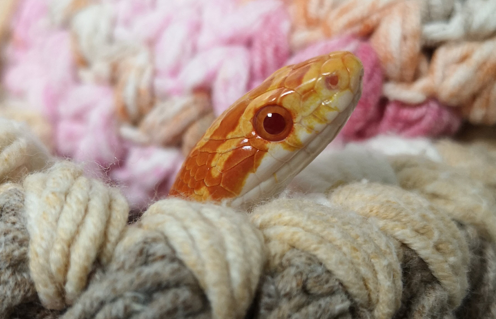

蛇的瞳孔在醒着的时候大部分时候位于中间，睡着的时候会逐渐向下漂移 II。【】【伏地魔视频】【】

> 这是识别蛇在不在睡觉的重要方法（蛇经常会在一动不动、不吐舌的前提下醒着看你，不要觉得蛇一天80%的时间都在睡觉）。

#### 蛇的可见光波段和色觉

首先回顾人的视觉。人眼的感光细胞分视杆细胞和视锥细胞，视杆细胞无色觉、但灵敏度高，视锥细胞灵敏度低，负责色觉。人是三色视觉，三种视锥细胞中的视色素的吸收波长在420 nm（蓝紫色）、534 nm（绿色）和564 nm（黄绿色）。

一些缩写：
* LWS, long-wavelength sensitive opsin
* SWS, short-wavelength sensitive opsin
* Rh, rhodopsin

夜行蛇常只有视杆细胞，无色觉；只在明亮阳光下活动的日行蛇则相反，只有视锥细胞；晨昏动物以视锥细胞为主，同时顶端有部分进化为杆状的片段（如下图所示）。蛇的视锥细胞分三种：大单锥细胞（large single cones）, 小单锥细胞（small single cones）和双锥细胞（double cones）。（<a href="https://link.springer.com/article/10.1007/s003590050096">Sillman, 1997</a>&nbsp;&nbsp;）IV&nbsp;，（<a href="http://dx.doi.org/10.1098/rspb.2015.2624">Gower, 2016</a>&nbsp;）IV&nbsp;

Sillman等人对Garter snake的视觉做了详细的研究。Garter snake是日行动物，无视杆细胞，视锥细胞的最大吸收波长在360 nm（small single cones）、482 nm（small single cones）和554 nm（large single cones and double cones），说明它是三色视觉，但和人类完全不同，其中一色为紫外色。（<a href="https://link.springer.com/article/10.1007/s003590050096">Sillman, 1997</a>&nbsp;&nbsp;）IV&nbsp;

Arizona elegans（Glossy snake）是在美国西南部和墨西哥分布的一种晨昏动物（见下图），其视锥细胞部分特化，有一部分顶端出现过渡的杆状结构。它的三种视锥细胞最大吸收波长在366 nm，484 nm和538 nm。Arizona elegans的视锥细胞/视杆细胞中间态是视锥/视杆细胞是其二者为进化中迁变关系的证据。（<a href="http://dx.doi.org/10.1098/rspb.2015.2624">Gower, 2016</a>&nbsp;）IV&nbsp;

球蟒的视锥细胞时是360 nm, 494 nm, 551 nm。和人有截然不同的色觉，并且延伸入UVA的区域。（<a href="https://journals.biologists.com/jeb/article-lookup/doi/10.1242/jeb.202.14.1931">Sillman, 1999</a>&nbsp;）IV&nbsp;

Gower等人的文章中总结蟒和蚺有吸收波长在\~360 nm（紫外，SWS1）、\~494 nm（蓝绿，RH1）和551 nm（黄绿色偏绿，LWS）。有些游蛇的LWS蓝移到了536 nm（绿色）。（<a href="https://onlinelibrary.wiley.com/doi/abs/10.1002/9780470015902.a0026519">Gower, 2017</a>&nbsp;）IV&nbsp;

Boa constrictor的视锥细胞是357 nm, 495 nm, 549 nm，和球蟒非常接近。（<a href="https://doi.org/10.1002/jez.1076">Sillman, 2001</a>&nbsp;）IV&nbsp;

【】【这篇还没看】【】
Bruno F. Sim~oes,*,1 Filipa L. Sampaio,1 Ronald H. Douglas,2 Ullasa Kodandaramaiah, Nicholas R. Casewell,4 Robert A. Harrison,4 Nathan S. Hart,5 Julian C. Partridge,6 David M. Hunt,6,7 and David J. Gower*,1 Molecular Biology and Evolution, Volume 33, Issue 10, October 2016, Pages 2483–2495, https://doi.org/10.1093/molbev/msw148 Published: 16 August 2016

# 饲养指南建设原则

## 动物伦理

动物福利（welfare）与动物伦理（ethics）是正交的两个学科，动物福利是回答“怎样做”的学科，动物伦理是回答“为什么要做”的学科。动物福利是科学、是可以客观测量的。动物伦理更接近哲学讨论。

例如动物福利科学可以客观衡量用活食和死食给蛇喂食时对蛇各有什么优劣，也可以客观衡量小鼠被以不同方式处死时（包括事先处死的二氧化碳法、颈椎脱位法、也包括直接被蛇捕食绞杀的方法等）对小鼠带来的压力和痛苦程度；但动物福利科学无法回答“是否应该牺牲小鼠的福利，换取蛇的福利”，“在什么程度上牺牲小鼠的福利是可以接受的”，“用多少小鼠的福利换多少蛇的福利是划算的”等问题，这些问题就需要动物伦理来回答。

动物福利是科学，本文的询证指的是动物福利的询证；动物伦理更接近哲学，其讨论无法询证。本节简要说明本人的动物伦理观念作为基础。本人非常欢迎基于科学方法论的动物福利讨论，但对关于动物伦理的辩论不感兴趣：

本文的动物福利讨论以”宠物”饲养为前提，以宠物饲养者为目标人群。“宠物”当然是拿来“宠”的。在可行范围内尽可能提高被饲养动物的动物福利水平是饲主的义务。（如果你是畜牧业从业者、将蛇作为产品，或者你只是将养蛇作为一项静物收藏活动，那么你并不是本文的目标受众。本文无意讨论畜牧业生产中的动物福利问题。）

和养孩子一样，宠物的饲养水平没有上限，永远可以养的更好，永远有东西可学、可改进，“爱折腾”才会养的好。如此日新月异的领域一般人不可能避免所有错误，好的饲主会经常认错。如果有人说“我就是这么养了十年、二十年，从来没变过，一直没问题”，或者“这么养就**够了**”，这人水平大概率不咋地。

本文的目标是“养好”，而不是“养活”，请不要再用形如“不这样做也能活”的逻辑作为意见。

蛇的“性格”有个体差异，不要指望所有一般经验都能应验。应该以“XX可能对它有好处，可以试试”的心态来优化，而不是“XX做了可能也没用，干脆不试了”。宠物饲养应该准备过剩的条件，而不是比烂。

饲料动物的动物福利牺牲以必要为限度；可以在一定程度上牺牲饲料动物的动物福利换取宠物动物的福利，但应避免无意义的动物福利损失。例如，决定喂食死鼠时，应当尽可能的减少处死老鼠的过程对老鼠带来的负面体验；为实现食物丰荣，可以以更多只幼鼠代替少量成鼠。若喂食活食未能带来宠物动物的福利提升，应使用更人道的办法处死老鼠；反之，例如宠物动物除活鼠外拒食，可以使用被蛇绞杀的方法致老鼠死亡。

## 可靠信息来源的鉴别

### 案例

首先用一个案例来距离说明三种可能的饲养方法信息来源。

例如我们要研究球蟒的栖地有多大，该如何布置。（注意国内养球蟒违法，此处是直接翻译外国例子）

你可能在网上看到有人说：“球蟒就该住在光秃秃的抽屉里。”

你问他：“有什么依据？”

他会告诉你一堆**观点**，而不是**依据**，比如：

* “球蟒经过人工筛选和野蛇需求不同”
* “抽屉可以模拟球蟒的洞穴”
* “球蟒本来就一动不动、更不会上树，环境大了也没用”
* “球蟒就一个脑细胞，特蠢，给了丰荣也没用”
* “大环境会导致拒食”

如果你再问：“上述每个论点怎么得出来的？依据什么信息来源、什么数据？如果是观察结果，是在什么条件下观察的？”你可以得到几种典型回复：

* “我家的球蟒就不动/就蠢/就拒食。”
* “某某某是大神，用抽屉养了十年了，养好多条，他说的。”
* “你个杠精！”

这都不是可靠证据。

设想此时另一批人说“我的造景缸养球蟒比你养的好”，一样只有观点、没有证据，那该信谁的呢？

是随便挑一个信？谁说的好听听谁的？谁字多听谁的？甚至“谁说的和我想法一样”听谁的？或者谁说的省事省钱听谁的？

这样的研究方法就是“民间饲养法”，即“不追求任何高质量证据的饲养方法论”。

另一种做法是基于自然生境模拟的饲养方法。对上面的问题，可能采取的思路有：
* 可以通过观察球蟒的野外食性，例如雄性球蟒的饮食中有70%(!)是鸟类，并且所捕食鸟类并不是地栖的鸟，其所捕食的鸟类是通过抄巢捕食幼鸟而来的。（<a href="https://doi.org/10.1080/11250009809386744">【FILL_REF_AUTHOR: L. Luiselli, F. M. Angelici, Sexual size dimorphism and natural history traits are correlated with intersexual dietary divergence in royal pythons (Python regius) from the rainforests of southeastern Nigeria. Ital. J. Zool. 1998, 65, 183.】, 1998</a>&nbsp;&nbsp;）IV&nbsp;这在野外也能发现在树上的球蟒。都说明球蟒虽为地栖，但其实有攀爬需求，而且并不是团在一个黑暗的洞里一动不动度过一生。一个主动（而非伏击）型捕食者必须有运动、探索的欲望才能生存下来。
* 可以通过iNaturalist网站观察特定种类蛇的自然栖地，可以让你看到每个动物物种的自然栖息地信息，再观察这些栖息地的原始生态。最然我们不应该机械的复现自然生境，但如果你看的饲养指南与自然生境毫无相似之处，那应该警惕其一定有什么问题。

 

而更靠谱的方法是询证的饲养方法。例如通过查阅文献，可以找到Hollandt在2021年发表的文章，作者通过对照试验观察不同栖地大小和丰荣水平下的球蟒行为，严谨的确定了栖地大小和丰荣水平对动物行为的影响（具体将在[这一章节](#谣言：蛇的洞穴里就很秃，用塑料盒正合适)介绍相关实验）。（<a href="https://doi.org/10.1371/journal.pone.0247082">Hollandt, 2021</a>&nbsp;&nbsp;&nbsp;）IV&nbsp;

我们还可以将思路扩展至其他物种，例如Burman等人用玉米蛇研究了类似问题。（<a href="https://www.sciencedirect.com/science/article/abs/pii/S0168159121001118">Burman, 2021</a>&nbsp;）IV&nbsp;

 

这就是三种典型的饲养方法研究策略：民间饲养法、自然生境模拟法和询证饲养法。下面说明这三种思路有何利弊。

### 民间饲养法

（这方面的科普视频：（<a href="https://www.youtube.com/watch?v=o9Io6dt4MRQ">Arbuckle, 2020</a>&nbsp;），（<a href="https://www.youtube.com/watch?v=d-NiN8V1fP4">Sinclair, 2020</a>&nbsp;），（<a href="https://www.youtube.com/watch?v=wYFVkTA0hNE">Sinclair, 2020</a>&nbsp;）III&nbsp;）

有一个专门的说法叫“folklore husbandry”，在此翻译为“民间饲养法”。其定义是“不追求任何高质量证据的饲养方法论”。其特点是信息来源不明、无法核实可靠性，一问就都是“网上说的”。

K. Arbuckle在2010年的一篇文章中定义了“Folklore husbandry”一词，（<a href="https://dx.doi.org/10.1111/j.1439-0396.2010.01011.x">Arbuckle, 2010</a>&nbsp;&nbsp;）IV&nbsp;并在2013年的后续文章中予以完善。（<a href="https://ssarherps.org/herpetological-review-pdfs/">Arbuckle, 2013</a>&nbsp;&nbsp;）IV&nbsp;。这篇文章学术引用次数很少（至笔记时只有36次），但在期刊网站上的下载量却非常大，是少有的只在学术圈之外起到作用的科研论文。

Folklore husbandry的定义是饲养员（包括专业的饲养员和私人饲主)不批判的接受他人叙述的饲养方法，或者一成不变的延续既往传统，在缺乏恰当评估、仅因为“一直以来就是这么干”或其他质量较差的证据就被确定下来的“最佳饲养方法”

有人可能会问，为什么要纠正“民间饲养法”？已经用了这么长时间的方法、如果有问题应该早就被发现了。但实事并非如此，有以下几个原因造成：
* 爬宠不善于表达，很可能长期处于不良状态却没有被人意识到。Tracy Langkilde的文章【】【在附件里未处理，在压力章节放了个图】【】也提供了询证证据与一般印象违背的典型例子。（<a href="https://dx.doi.org/10.1242/jeb.02112">Langkilde, Year?</a>&nbsp;）IV&nbsp; 常有人对各种情形下动物感受压力的大小有不同看法，这些看法多数是通过以拟人和谣传为基础的主观臆断。T. Langkilde等人对不同压力因素对warm-temperate water-skink （Eulamprus heatwolei）血中皮质酮的影响，她研究发现将动物移至新的栖地中所带来的压力比人们想象中大很多，换栖地的压力甚至高于上手、嗅到天敌的气味、甚至是高于被剪掉一个脚趾的个体标记方法；在给爬行动物做标记时，剪掉脚趾的方法和断尾的方法相比，反而是后者带来了更高的压力。这体现出使用你的直觉来决定饲养方法的正确性很可能并不科学。因为爬行动物的行为和哺乳动物的差别太大了。

很多饲主并不理解爬宠行为的含义。比如球蟒的团球行为，对专业人士来说这是非常明显的捕食者躲避行为，是为了让捕食者不发现自己、或者看到自己后无法攻击头部的最后方法。但许多饲主觉得“呀！好可爱！”、“这玩意儿叫球蟒，那团成球当然很正常”，甚至是“他喜欢团成球，所以我就弄个栖地让它只有团成球才能放得下的空间”。这都是人们不依赖证据、只依据经验对动物行为做出错误解释的例子。
* 与猫狗不同，人本并不清楚很多爬行动物的自然史（natural history）情况和生态学背景，不容易发现问题。
* 饲养方法的好、坏不是二元选项，民间饲养法可能只是合格的选择、而不是最优选择，你可能根本没见过养的好的动物是什么样子，自然也不会觉得当前的饲养方法有缺陷。
* 当前的饲养方法可能可以简化、或者可能更便宜。你的动物可能状态很好，但有些工作可能是完全多余的，例如用鸟类饲料动物喂食爬行动物时不必剪去鸟的喙、喂食许多草食动物时不必将食物切碎。（Plowman, 2009&nbsp;）IV&nbsp;人们还曾认为给饲料昆虫在死前饲喂含特定矿物质的食物（Gut loading）是最有效的保证矿物质摄入的方法，这些gut loading昆虫的食物通常比较贵。Arbuckle等人发现可能简单的撒上营养素粉的效果比前者又方便又便宜，效果可能还更好（【FILL_REF_AUTHOR: Arbuckle, K. 2009. Influence of diet on mineral composition of crickets used as prey for captive amphibians, specifically Hylidae. Unpubl. MSci dissertation. University of Glasgow. 51 pp.】, 2009&nbsp;）IV&nbsp; Arbuckle曾经发表过一篇用一日龄的鸡仔喂蛇的论文（<a href="https://dx.doi.org/10.1111/j.1439-0396.2010.01011.x">Arbuckle, 2010</a>&nbsp;&nbsp;）IV&nbsp;，这是通过询证饲养的思路否定“民间饲养法”长久错误观点的例子。作者通过科学的实验设计发现用鸡仔作为主粮喂蛇不但没有造成营养问题，还有助于解决许多球蟒的拒食问题。并且鸡仔其实比等质量的小鼠、大鼠便宜，即使蛇吃了鸡仔之后不再吃老鼠也不是大问题。鼠确实有比鸡仔更高的钙，但只要营养本身能达标，稍少一点并不会造成营养问题，尤其是多种食物混合喂养的时候。混合喂养还增加了食物丰荣。

### 自然生境模拟

自然生境模拟即基于动物已有的自然生境、生态学和生物学信息尽可能的模仿其自然环境，并期待这能带来最好的结果。

自然生境模拟从效果和获取难度上是介于民间饲养法和下面要讲的询证饲养之间的方法。这一方法的好处是相比民间饲养法来说更加靠谱，容易提示做的有缺陷的地方，相比询证饲养法的优点是有更多资料可查，在询证饲养证据缺乏时能给出指导。但它有两个重要缺点：
* 一是必须确定你模仿的到底是哪个物理量。比如在模仿自然营养时，你可能忠实的按照自然环境下的捕食物种比例做了模仿，但其实你喂的昆虫的营养组成和自然捕食的同种昆虫的营养组成完全不同，所以模仿目标应该是事物的营养构成，而不只是食物的物种和数量。再比如模仿自然光照时，人们目前根本不可能真实的模拟热带地区正午的阳光，它比几乎任何人造日常光源都要亮，完全模拟阳光一是电费受不了，二是因为饲养箱空间、散热和环境复杂度的局限性，可能直接把动物烤死；因此必须决定好你要模仿阳光的哪些方面，比如在紫外的UVB波段，应该以合成恰当剂量维生素D3的UVB剂量为标准。
* 二是圈养动物，尤其是多代人工繁育的物种的需求与野生种可能不同。这就需要考察到底哪些地方不同，哪些地方相近。

在很多方面，模仿自然目前仍然是优化圈养蛇饲养环境的重要思路。

#### 自然生境模拟的限度

每次用“接近自然环境”论证某饲养措施的正确性时——如把报纸垫材换为更接近自然的可挖掘的土质垫材——总有人抬杠，比如问“野外蛇大多还感染寄生虫呢，为什么不故意植入寄生虫？”虽然大部分人能直观感到这其中的区别，但并不明确其根本原则：

模仿自然只是为你提示该考察什么方面的因素，自然是提示、而不是答案。某个自然因素是否对蛇有益的检验标准仍然与之前所说的一致：是否满足了蛇的各项需求、是否有助于使蛇展现出正面物种行为。相应的，模仿自然的限度是至少不对其他需求造成损害、至少不干扰蛇的正面行为。（<a href="https://www.youtube.com/watch?v=6yOISQ5sQtQ">Sinclair, 2022</a>&nbsp;）III&nbsp;，（<a href="https://www.youtube.com/watch?v=wYFVkTA0hNE">Sinclair, 2020</a>&nbsp;）III&nbsp;

例如：
* “模仿自然环境使蛇感染寄生虫”显然干扰了蛇摄取营养、有健康皮肤的生理需求，且无助于蛇展现正面物种行为。
* 使用土质可挖掘垫材（相比报纸垫材）在一般情况下使蛇展现了挖掘行为，是正面物种行为；崎岖不平的土质地面使蛇延缝行走，减少了腹部压强，也满足了蛇的生理需求；其在正常情况下没有明显的反面作用，因此应该模仿自然环境、提供可挖掘的土质垫材。但在特殊情况下，如蛇发生[腐鳞](#腐鳞)时，土质垫材就干扰了蛇有完整皮肤的生理需求，模仿自然环境不再合理，应该换为厨房纸等比较干燥而易于清洁的垫材。
* 再如Bioactive的栖地模拟了自然环境下的昆虫环境，模拟了昆虫吃掉蛇类粪便和蛇蜕的自然行为，不但节约了饲主清扫的精力，还使环境保持清洁，如此模拟自然环境是锦上添花。但Liam Sinclair 发现不恰当的昆虫物种可能对蛇造成困扰，比如发现正在热区晒灯（正面物种行为）的蛇会用身体抖动反复的把靠近的昆虫弹走，最终蛇不胜其烦选择离开热区，此时正面物种行为被模拟自然的因素破坏，就应该调整昆虫种类、或退回非bioactive栖地。（<a href="https://www.youtube.com/watch?v=TZm99xc2Fpg">Sinclair, 2021</a>&nbsp;）III&nbsp;

有些人通过模仿自然来解释动物行为或环境因素的利弊。这是一个好的起点，但绝不是终点。有的时候并不容易区分动物是需要某种自然因素，还是只是在忍受一种自然因素。此时就需要对相应问题保留开放的态度，尽可能获取更高级别的证据。

一种比“自然行为”（naturalistic behaviors）更先进的概念是“物种特定行为”（species-typical behaviors）。比如有动物爬到栖地里的爬架上，透过透明栖地外面的窗户，看门口开过去的车。这显然不是爬行动物的自然行为，但这是一种积极的行为，因为动物“he's finding some motivation to elicit that behavior”（？）。这虽然不是自然的，但这体现出动物在它的日常中能主动做出选择。（<a href="https://www.youtube.com/watch?v=wYFVkTA0hNE">Sinclair, 2020</a>&nbsp;）III&nbsp;

需要注意的是，“不是所有自然行为都是最优解”不能用于论证“可以把动物养在和自然环境一点都没关系的地方”（比如抽屉、人渣盒）。我们应该避免自然中的有害因素，比如不适宜的温度、过强的紫外线、寄生虫、疾病等。比如球蟒会在晨昏时晒太阳，此时UVI约为2，相应产地中午的UVI会非常高，但人家中午不找大太阳底下晒、中午可能就躲起来了。我们不应该机械的照搬原产地的UVI和中午的温度极值，相反，我们可能要模仿它选择的它晒太阳的条件（如果你的栖地里复杂度不够高，只能提供相对单一环境的话）。

### 询证饲养法

询证饲养法是三者中的金标准。指的是通过科学实验，一般是符合统计标准的对照试验验证某一假设。人们可以衡量相关研究的假设、方法、数据处理和结论，并为其得出的结论赋以科学的置信度。

通过询证饲养法，谁对、谁错、谁更可信都有明确标准，免去了无意义的吵架。

使用询证饲养思路不是说我们要抛弃自然生境模仿和民间饲养法。正确饲养方法设计思路应该结合询证饲养证据、自然生境模仿和民间饲养法。

询证饲养法的研究也依赖民间饲养法和自然生境模仿方法来提供科学假设供科学家验证。如果一项询证实验验证了某个民间饲养法是正确的，应该认为这个实验提升了相应饲养方法的证据级别，非常有意义，不应该认为“做了半天说了些我已经知道的事情”。

### 信息鉴别与检索

好的原始信息来源应该有如下几个特征：
* 应该可以核实作者身份，并且作者应该有合理的资质（常常是相关专业的博士、硕士，在这方面比你我水平高的多）
* 应是基于良好设计的科学证据（可核查文章设计、方法、数据、和数据处理方式；即使你没有能力核查，仅仅是“他敢写出来”就完成了一部分核查功能）
* 经过同行评议
* 发表时间应该较为现代（解剖学等客观知识除外）

好的综述类信息（网站、书籍、综述论文）应该主动提供：
* 信息来源（明确引用）
* 撰文作者（应该知道教育背景如何、其他作品如何、别人评价中有无恶名）
* 发表日期（同时注意发表日期和所引用信息的日期，书籍中的信息可能比较陈旧）

由于爬宠资料远不如猫、狗之类物种丰富，查阅资料时不应局限于某一物种、甚至不需要局限于蛇类，不同问题不同对待II：
* 对一般福利和动物行为问题，许多原则非常普适，例如在[刻板行为](#蛇的典型刻板行为)一章的举例中，在某种特定需求没有满足时，许多不同种类的蛇、甚至包括守宫、蜥蜴都表现出了极为相似的异常行为。
* 对提供适宜的温湿度和丰荣场景来说，相似地区、相似生境的蛇的资料都可以参考。
* 大部分蛇的疾病都是相通的，查询一种疾病的资料时不必局限于某一蛇种（当然还是物种越接近越好）；某些物质、药物的安全性也可以将检索范围扩大至所有蛇乃至所有爬行动物
* 只能检索当前物种的信息几乎只有基因和花色变异问题

不应该仅仅看Youtube视频、B站视频、Reddit或其他论坛等能看到的care guide。要是依赖类似的网络care guide搞饲养，即使遵循再好也不能达到很高的水平。这些care guide可以帮你搭起一个框架，但不能是终点，搭好框架后应该尽快去查阅书籍和同行评议的文章，以补充细节、修正错误。

我们不应该守着一条结论视为真理，反而应该为通过高质量证据推翻之前的结论而高兴，这才是科学的精神。我们不应该迷信某个“专家”、“大神”，应该以证据为准绳。

# 动物福利总论

## 动物福利的定义

下面内容参考自：（<a href="https://www.reptileforums.co.uk/threads/animal-welfare-science-reptiles.1294146/#post-13412752">Sinclair, 2021</a>&nbsp;&nbsp;），（<a href="https://www.youtube.com/watch?v=6yOISQ5sQtQ">Sinclair, 2022</a>&nbsp;）III&nbsp;，（<a href="https://www.youtube.com/watch?v=wYFVkTA0hNE">Sinclair, 2020</a>&nbsp;）III&nbsp;，（<a href="https://www.youtube.com/watch?v=XjLeUr3EhK4">Sinclair, 2021</a>&nbsp;）III&nbsp;

“动物福利”是一门科学，不是“动物生活质量”这种主观的东西。Liam Sinclare 认为 AZA Animal Welfare Committee在2012年定义的动物福利最为恰当，即：

> **动物福利是一段时期内动物的身体、精神和情绪的综合状态，其状态可以从负面到正面连续测量。**

这条定义有两个要点：

### 一、动物福利不只是“避免负面伤害”

很多人觉得动物福利就是避免对动物产生负面影响的因素，但其实动物福利的正确模型应该是从负面到正面的连续坐标，其终点不是“无负面因素”，而是可以无止境的向正面状态努力：

【负面状态】 ---- 避免负面因素 --> 【中性状态】 ---- 提供正向福利 --> 【正面状态】

这看起来似乎是废话，但其实并非如此。动物福利标准是从畜牧业制定起来的，例如让圈养动物可以转身、可以躺下、可以站直，这些都是在避免负面因素。因为这个历史惯性，许多旧有的饲养方法也仅注重了“避免负面因素”的部分，而不注重给予正面福利。Vicky Melfi在2009发表了一篇有深远影响的论文，论证动物园学是从差到好的连续坐标，动物园学过于重视在从负面到正面的连续坐标上避免负面、达到中性状态，而没有注重超越中性状态，达到正面福利。

类比到人身上，这二者的区别就如同说：吃米饭可以避免饥饿，所以“饲养人类”的过程中可以只提供米饭做为食物。吃米饭让人达到了不饥饿的中性状态，但要达到正面状态，还要有咸菜、有炒菜，有肉；食物有口味、有营养，有新鲜程度。有了后面这些才是突破了中性状态，向正面状态努力。如果以“饿不着”这个中性状态为目标，确实很容易达到终点；但如果以提供正向福利为目标，就有无止境的追求空间。

具体到蛇身上，以温度要求为例，许多饲养教程中仅列出“控温24\~28 °C，晒点35°C”就算完，这确实保证了在一般情况下蛇不会因为温度不合适而得病死亡，但这只是通过避免负面因素达到了中性状态。而先进的饲养应当追求进一步提供正面因素，例如：

* 选择卤灯比选择加热垫更能模拟阳光行为，提供IRA光线，使其可穿透皮肤、直接加热内部器官、并发挥免疫等生理作用；
* 选择足够大的栖地并适当安排热源布置可以实现温度梯度，让动物能在不同温度区间中做出选择；
* 通过布置躲避和遮挡物，可以让蛇在部分躲藏的情况下仅露出部分身体接收上方热源，增加蛇在或许热量时的安全感。

英国福利法的圈养动物福利五原则的历史变化就经历了这样的过程。起初它们只注重避免负面因素，提出了所谓“五个避免”（Five Freedoms）；而后近几年才在此基础上提出了“五个提供”（Five Provisions），即对应提供正面因素，达到较高的福利水平。经过这番改动后的五个方面的福利包括（<a href="https://4ca8cce6-b649-4f5d-8bce-a3b15fb870e6.usrfiles.com/ugd/4ca8cc_8a3d7f870e5e48c68b36937403bd30bd.pdf">英国两爬协会饲养箱准则, 2022</a>&nbsp;&nbsp;&nbsp;）V&nbsp;，（<a href="https://www.legislation.gov.uk/ukpga/2006/45/contents">英国福利法, 2006</a>&nbsp;&nbsp;）V&nbsp;，（<a href="https://www.mdpi.com/2076-2615/6/10/59">Mellor, 2019</a>&nbsp;&nbsp;）IV&nbsp;：

1. 【营养】避免饥渴和营养不良，提供干净的水和食物以保持完全的健康和活力。
2. 【环境】避免不适和过分暴露，提供包括躲避区、阴影区、休息区、居所、新鲜空气在内的适当环境。
3. 【健康】提供疾病预防和及时的疾病诊断、治疗，避免疼痛、受伤和疾病，保证动物具有正常的肌肉、身体形态和心肺功能，减少动物发生呼吸困难、恶心、呕吐或其他症状，使动物具有活力和协调的运动机能。
4. 【恰当行为】减少行为上的不良限制和威胁，提供充足空间、恰当设施、丰荣和恰当陪伴（如果动物需要同种/异种陪伴），促进动物表现出正面行为、满足社群和发展需求。
5. 【愉悦精神体验】提供安全、愉悦且适合相应物种的活动机会让动物有好的体验，使动物感到舒适、愉悦、自信、感兴趣、并可以自主选择适宜环境环境。

具体到蛇身上，以一个身长120 cm的玉米蛇为例，正向的动物福利可以体现在如下方面（<a href="https://www.reptileforums.co.uk/threads/animal-welfare-science-reptiles.1294146/#post-13412752">Sinclair, 2021</a>&nbsp;&nbsp;）：

1. 提供多样化的饮食，如喂食多种解冻后的冻鼠、冻禽鸟。喂食时可以拖拽食物以形成气味踪迹，令蛇主动追逐觅食，通过晃动捕食夹等方式促进蛇表现绞杀行为。蛇有袭巢（nest raiding）行为（见[野外食物构成](#野外食物构成)一节），即爬到鸟巢里等幼鸟孵化后捕食幼鸟。因此可以在高处放置一个鹌鹑蛋，促进蛇反复查看巢穴中是否有幼鸟，增加捕食乐趣。
2. 提供令蛇有安全感的空间，例如离地的躲避、软木树皮卷（cork rounds，即西班牙栓皮栎剥皮时的树皮，其木制常被用来制作软木塞）、terrestrial logs、植物（假植）和铺在地面上的树叶，以使得玉米蛇可以选择舒适而有安全感的地方展现多样的自然行为。
3. 每周称重、做外观健康检查，关注蛇的状态。为蜕皮提供湿度较高的微环境和湿躲避。
4. 提供4 * 2 * 4英尺（120 * 60 * 120 cm）的栖地，以使得蛇可以以自然的频率做出地栖和树栖行为。
5. 在一个横放树枝的上放提供晒灯和UVB，并实现从晒点向远点的光照和温度梯度，使得蛇可以在是否接收光热上做出选择，提供一个地面上（而不是空中）的暖区躲避，使得蛇可以同时展现出触温性和日温性的热调节行为。

下图是Liam Sinclare为他的墨西哥黑王蛇建造的栖地，着重于通过环境复杂度提供各种环境参数的选择。注意到通过这样的布置，栖地有1/3是明亮温暖的，并在另外的2/3范围内逐渐过渡到昏暗凉爽。并通过环境布置让蛇可以在有无UVB，有无光照，温度冷暖，湿度高低之间做出选择。同时，因为垫材够厚，蛇通过挖洞还可以在地下创建新的微环境。

图中软木树皮卷放置的位置经过设计，上方有灯，可以通过吸热后的二次辐射创造一个阴暗温暖的微环境。

图中从热区到冷区都有遮蔽，可以让蛇在不觉得暴露的情况下从热区移动到冷区，不用在安全性和温度之间做妥协。否则如果只在栖地两边放冷区躲避和热区躲避，蛇就会因为要跨越中间的开阔地而感到压力，从而使蛇不倾向于直接选择适宜的环境，而是实在受不了了才换。

中间的树让蛇可以爬高接收紫外线照射，也可以在较低的位置减少紫外线暴露。

好的饲主不应该想“我要给XX温度，XX湿度”，而是“我要建立这样的温度和湿度梯度和微环境选项。”饲主的工作不应该是帮蛇做出决定，而是应该尽可能在大环境中提升环境复杂度，让蛇自己选择它想要的环境。蛇知道自己想要什么环境，它不傻，你提供选项，它们就会做选择。

有人说（他的）蛇天天像静物一样盘在栖地一角、一整天一动不动（并且还误以为“蛇就是智商低，就是该这样”），这就是不提供正面福利、不提供选择的典型结果。通过提供“正面福利”，我们能让蛇在“活下去”的基础上活的更精彩，展现更多自然行为，养蛇的人也能看到更多有趣的内容。

积极的动物福利的一个重要指标是可以让动物展现出物种特定行为（species-typical behavior）。一个现代的合格饲主应该主动了解高规格的饲养条件下蛇会表现出哪些物种特定行为，并且持续的尝试新的方法提升动物福利，而不是自信地说我的动物已经养的没问题了。不能因为动物在你手上从来没有展现某种行为，就说这动物没有相应需求、不会表达这些行为。

### 二、动物福利可以科学测量

动物福利是科学，是客观的、询证的。一项措施在各个角度是带来正面福利还是负面福利可以最终得到明确的答案，与人的主观看法无关。

动物福利与动物伦理是两个正交的方面，不应用动物伦理问题的不确定性衡量动物福利科学的客观评价体系。具体可见[动物伦理](#动物伦理)一节的简短讨论。

应当习惯于用询证手段而不是主观感受来评价动物福利措施，例如对比如下两个观察结论：

A. 这条球蟒给了攀爬物就一只在爬，它肯定喜欢攀爬。

B. 相比提供攀爬物前，这条球蟒在提供攀爬物时表现出了统计学上显著更多次的各种物种典型行为（species-typical behaviour），因此应当为动物提供攀爬物，以保持动物当前的正向行为水平。

这二者描述了同一问题，但区别是前者是主观的，后者是（尽可能）客观的。对前者的观点常有主观争议而难有结果，后者则有明确的含义和清晰的测量标准。好的饲主应该做基于证据的饲养选择，致力于给爬宠提供选项、让其自己选择什么是恰当的环境、让它有机会做想做的事情，再通过观察动物的反馈迭代优化环境。

## 动物福利需考虑哪些方面

[德国动物饲养条例]列举了爬行动物饲养的基本要求，可以视为一个大纲，考虑了这些因素才能为爬行动物提供基本动物福利（<a href="https://www.ris.bka.gv.at/GeltendeFassung.wxe?Abfrage=Bundesnormen&Gesetzesnummer=20003860">德国动物饲养条例, 2022</a>&nbsp;&nbsp;）V&nbsp;：

1. 对于饲养爬行动物，适用附件3中的最低要求以及以下各条款。
2. 购买爬行动物前，必须获取有关该种类生物学的知识以及由此产生的饲养要求，并准备适合其种类的爬行动物箱。应研读相应的专业文献，以便对爬行动物饲养进行持续学习。
3. 原则上应优先购买繁殖后代。
4. 应按照自然环境的条件，通过灯光和热源设置适合特定种类需求的环境气候，通常是在饲养系统中设定温度梯度和降低夜间环境温度。必须遵守这些最低和最高温度的范围，以及所饲养动物种类的首选温度。
5. 应通过通风确保新鲜空气。应避免出现气流。根据生产形式，爬行动物箱的侧壁或顶部必须有网格部分。
6. 对于无法保持恒定体温的爬行动物，应提供符合其种类特定需求的热源，最好是通过光与辐射热的结合。
7. 只能使用正确安装和适当的灯泡和荧光管。必须有适当的设备来测量温度和湿度。
8. 空气和地面底质的湿度以及环境因素必须适应原产地生物群落的自然季节条件。必须考虑原产地生物群落的宏观气候和微观气候参数，其中微观气候可能与宏观气候大不相同。
9. 必须确保动物得到适合其种类的饮食。所使用的食物必须含有符合营养需求的维生素、矿物质、必需氨基酸和纤维素。如果需要喂食脊椎动物，应尽可能使用新鲜死亡的饲料动物。昆虫应尽可能活着喂食。必须提供适合其种类的饮水方式。
10. 人工生活空间的设计和基础设施必须根据所饲养种类的需求，例如挖掘、翻动、攀爬、游泳或寻找不同的气候参数。禁止使用有锐边、能造成伤害或刺激皮肤的物质。对于需要或可能的种类，最重要的最低设备包括：
	1. 足够高的适合地面底质，
	2. 隐藏的可能性，
	3. 水盆，浴盆，
	4. 适当大小和尺寸的攀爬设施，如岩石、树枝或树枝，
	5. 通过种植植物创造适当微气候或作为隐藏处，
	6. 对于饲养成熟产卵雌性的特殊产卵设施，
	7. 根据需要在一个或多个围栏内设置视线阻隔设施。
11. 动物应得到适合其种类的护理，污物应定期清理。必须注意通常的清洁。
12. 为避免配对和群体饲养中的社会压力，必须遵守动物的自然社会结构。在将具有相同生物群落要求的不同种类混养时，动物不能互相负面影响。
13. 对于隔离和治疗生病的动物，以及在模拟休息期和育雏期，允许有专业理由的不同饲养条件。

## 压力与应激

下文信息主要来自：（Mader, 2019&nbsp;）IV，不再于每处重复引用。

在动物福利研究中，压力被定义为任何干扰动物稳态的物理、化学或情感影响，同时也包括为了消除这些影响回到稳态的努力。当压力严重到会导致精神或身体伤害的时候，动物福利就受到了损害，所以研究压力对动物福利非常重要。

### 压力的生理机制、症状和影响

长期的压力可能对免疫、繁殖和生长产生影响。

压力反应的生理机制：正常的压力反应是交感神经系统和下丘脑-垂体-肾上腺轴的反应结果，随后释放出去甲肾上腺素（交感神经系统）和肾上腺素（肾上腺髓质），使身体为战斗或逃跑做好准备。下丘脑释放促肾上腺皮质激素释放因子，这触发了垂体腺释放促肾上腺皮质激素（adrenocorticotropic hormone, ACTH），然后刺激肾上腺皮质释放糖皮质激素。

> 要了解这个机制是因为阅读与压力相关的文献时，会使用相关的血液指标作为客观衡量压力水平的指标。

爬行动物的压力迹象不如哺乳类、鸟类动物容易识别，其可能造成营养不良、提供减轻、易感寄生虫、嗜睡或过度活动、不能调节体温、不能适应环境变化等等。不能适应圈养环境经常可以导致非特异性的退行性病变，比如有文献报道研究称圈养压力造成了一个蜥蜴群体从（无症状的）沙门氏菌携带者变成了沙门氏菌病。

圈养导致的心里和行为限制可能导致动物持续、频繁的尝试逃跑，或导致刻板行为（将在另一章节集中举例蛇类的刻板行为），这些行为可能导致自残损伤（如球蟒常见的吻鳞损伤）。蛇无法理解“透明物体”的概念，因而常见蛇尝试通过顶撞玻璃找到出口。在某些物种中会导致异食行为，例如导致龟鳖类的食粪。

在爬行动物疾病的治疗中，必须考虑是否有带来疾病的深层压力因素，否则治标不治本。

有些压力因素很明显，比如蛇嘶嘶你、呈卷曲状态、喷气鼓肚皮/扁颈、咬人、摇尾、应激排便、喷臭腺液、吐食、装死等等。但并不是所有压力因素都容易识别。例如不合理的共栖关系导致的一条比另一条长的慢，有的动物在受压时会找到寒冷的区域尝试降低身体消耗，或异常长时间的泡澡、晒太阳。

识别爬行动物的疼痛并不容易，可能包括flinching，肌肉收缩，躲避特定刺激的动作和咬人。长期的疼痛可能体现于拒食，嗜睡，和体重减轻。

急性的压力反应是可以帮助动物生存的，但是圈养条件下长期的不恰当压力反应会威胁动物生存，尤其是本来就得病的动物。理解哪些（看似无害的）行为和环境因素可能带来压力对解决和预防爬行动物福利问题非常重要。

并不是所有造成压力的因素都要避免，有些压力反而可以带来福利。比如许多动物园通过增加觅食难度提供行为丰荣。对蛇来说，如果喂食时不是直接拿镊子把老鼠放到嘴边，而是通过在栖地里拖动老鼠形成气味踪迹，然后让蛇在栖地里觅食。这样的延迟享受过程可以增强蛇的认知能力、也可以增加找到食物时的心理奖励程度。完全缺乏压力、缺乏挑战可能降低动物的行为丰荣度。

有些压力不只是福利要求，对诱导某些自然行为还是必须的，例如求偶行为中的追逐过程。

因此我们必须区分好的压力和坏的压力。

即使压力的来源和种类不变，压力的强度过高、时间过长也可能让好的压力转变为坏的压力。（<a href="https://www.reptileforums.co.uk/threads/animal-welfare-science-reptiles.1294146/#post-13412752">Sinclair, 2021</a>&nbsp;&nbsp;）

急性压力指的是对即刻发生的威胁做出的响应。这样的威胁可能是真实的（例如对人的接近感到紧张）、也可能是动物想象出来的（例如响应自己的倒影）。急性压力一旦撤除，动物的生理和行为变化也就恢复受压之前的状态。

有实验表明严重的急性压力可能造成长期的负面影响。

慢性（长期）压力是当因素延长、且动物无法自行选择或解决压力因素所致的。长期压力可能造成免疫缺陷状态、行为异常、和活跃度缺乏。

### 圈养蛇的典型压力因素

压力源可以分为生理和心理两类。生理压力直接影响动物生理健康，心理压力短期内不影响动物生理，但长期的心理压力可能诱发生理问题。

* 生理因素：
  * 不恰当的温湿度和光照时间
  * 饥、渴、脱水和营养不良
  * 缺氧
  * 疾病和外伤
  * 繁殖行为（包括产卵和繁殖期雄性间斗争）

* 心理因素
  * 不合理共栖关系、社群地位竞争、栖息地竞争
  * 栖地过于拥挤
  * 圈养行为本身
  * 移入新的圈养环境
  * 人-爬宠的互动，家中其他宠物（如猫、狗、鸟）和爬宠的互动
  * 缺乏视觉隔障
  
T. Langkilde等人对不同压力因素对warm-temperate water-skink （Eulamprus heatwolei）血中皮质酮（corticosterone）的影响做了测试，对下列压力因素给出了客观分区。（<a href="https://dx.doi.org/10.1242/jeb.02112">Langkilde, Year?</a>&nbsp;）IV&nbsp; 其结果与人们想象中不同。例如更换到新的栖地是在压力大小排名中十分靠前，甚至与断尾和抽血较为接近。这不但提示我们需要重视特定行为带来的压力，还提醒我们用主观感受衡量压力水平的方法是很不靠谱的。

#### 互动导致的压力

圈养还有一个明显的压力来源是人的上手。在野外，被比自己更大型动物进行肢体运动限制通常意味着被捕食，所以进化上显然会将上手作为压力因素。上手会导致圈养动物体内的皮质酮和肾上腺儿茶酚胺的增加，即使对一些已经适应了上手的动物也是如此。

> 同时也告诉你不该上手的时候不要上手。

注意如果你家有猫狗、鸟类等其他动物，这些动物对蛇类的注视也可能导致严重的压力。蛇类不能理解透明物体的存在，因而蛇在被这些动物长期注视时，会一直处于被捕食的警戒状态，可能造成严重的压力问题。

> 有人发视频说“你看我家蛇和我家猫在对视，多好玩啊”，这一点都不好玩，蛇要被吓死了。

#### 生物化学标记导致的压力

栖地的常规清理也可能造成压力。有研究表明蛇会在报纸垫材上释放信息素以标记自己的领地，清理圈养红背蝾螈的粪便会影响其繁育。与报纸相比，使用更自然地垫材（尤其是通过建立bioactive系统而不必频繁清理更换垫材）会通过减少清理频率、保留气味信息、提供微气候、增加自然行为（如挖掘觅食）减少压力。

#### 不合理共栖关系导致的压力

心理压力可能由不恰当的共栖关系导致。如果把不适宜共栖的两个个体关在环境不够大、不够复杂的一个栖地中，会形成主导-从俯关系，从俯个体无法使自己远离主导个体（即此时的压力因素），导致长期压力。

下图中的栖地里只有一个好的晒点、且过于狭小空旷。导致共栖动物缺乏个人空间和个人晒点，使得动物之间争抢舒适区域，造成长期压力。

许多人在共栖蛇类时会发现蛇类挤在一个栖地中互相倚靠/拥抱的行为（如下图），于是按照人类行为对其进行解释认为它俩关系很好。但这其实是错误的拟人化解释。当栖地不够复杂时，可能一共只有有限的几个躲避地点，这些躲避地点的温度、湿度、视觉隔障等情况各不相同，因而可能只有其中一个是最为合适的。所以共栖蛇类的拥抱行为其实是在争抢最合适的躲避地点或晒点，挤在一起这个行为本身就会造成压力。

如果你的栖地足够大，像是动物园那种好几米宽的栖地、且环境足够复杂，那可以安全的共栖，但这对一般人来说做不到。

### 选育对压力的影响

相同的环境可能在不同个体中导致不同的压力相应。人们也观察到通过（主动或被动的）选育，多代圈养个体比野生个体更能适应圈养压力（因为不适应者的基因未能得到保留）。

> 这是野苗很难养大的原因之一。野蛇便宜，但不要买。

即使动物的生理需求被满足了，圈养仍然可能导致压力。圈养条件影响了逃避、觅食、求偶等活动，所以即使圈养条件合格，圈养本身可能就是压力来源，尤其是对未经选育、从小也未适应圈养环境的蛇。

# 蛇的行为学和典型非正常行为

猫狗不舒服或者得病时不停叫唤、上蹿下跳、坝门刨地很容易识别出来；但某个物种离人类行为越远，就越容易被误解。有的人养猫头鹰，发现撸到应激就会瞪大眼睛一动不动的样子“特别呆萌”，还觉得猫头鹰特别舒适；有的人把淡水龟往海里扔，龟逃离海水游回岸上被人说是“报恩”；这都是缺乏知识、想当然的对动物行为做拟人化的解读。

爬行动物也有这种问题，爬行动物不会叫，且其低能耗的进化方向和被捕食者的地位使其在不适、病痛时倾向于隐藏自己的脆弱残损状态，要么静静的找个角落躲着、要么安静的到处找出路。不熟悉爬行动物行为的人还觉得蛇挤在角落里很正常、拿鼻子顶门顶天花板很活泼可爱。这样的对动物反馈的错误解读会在某些错的饲养方法上越走越远，可能造成严重伤害。因此知道蛇怎么表达自己对环境的不满可能比学会“标准的环境布置”还要重要，能看得懂蛇的“语言”才能动态的、个性化的调整环境。

## 蛇的常见行为状态及评估意义

### 身体状态

蛇有几种常见的身体状态：

* 紧密蜷缩：蛇不在躲避内，蜷缩起来且蜷缩的没有缝隙 

* 部分蜷缩：蜷缩着，但是有缝隙，或部分身体暴露在蜷缩范围之外
* 贴墙：除头以外的大部分身体延地面贴着墙
* 舒展：基本没有和自身的接触
* Scoping（所谓潜望镜姿势）：身体大部分处于躲藏状态，但露出头部和一部分脖子，脖子抬起，微低头。

* 立墙角：身体尽可能挤在某个墙角，以至于有一部分身体立了起来，沿着墙角向上排列
<a href="https://f000.backblazeb2.com/file/voldy-public/videos/冬青-ZooZajac1-太平洋地蟒因为光热条件不合适缩在远端角落.mp4">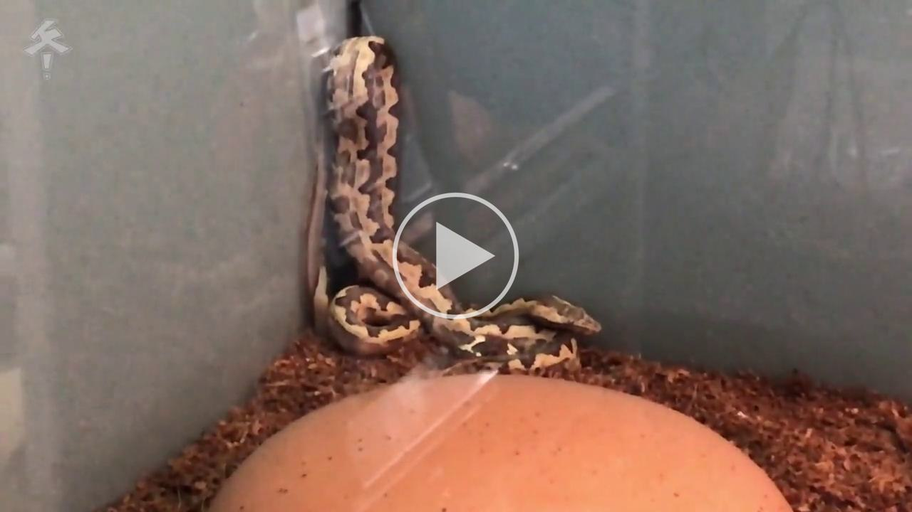</a>

舒展状态和Scoping状态能体现出蛇对当前环境有安全感。部分蜷缩也是一种比较正常的休息状态。

紧密蜷缩和贴墙状态一定程度说明蛇并不放松，对当前状态感到紧张。

长时间立墙角说明蛇对当前环境极为不适，希望尽可能远离当前环境但无处可逃，经常是光、热等条件不合适造成的。

### 运动状态

* 休息：基本不动，只有调整姿势的短暂动作
* 部分移动：比如只有头动
* 运动：整个蛇都在移动
* 爬高：玉米蛇有攀爬并舒展全身的需求
* 挖土：玉米蛇有挖掘需求，可以全身没入土下，并且可以在土下长时间休息。

除了蜕皮、刚吃饭等特殊时期外，玉米蛇应该有相当大的活动量，如果玉米蛇经常一动不动（装了红外摄像头、加上晚上关灯后的情况都观察过了，还是缺乏活动），应该警惕是否出了什么问题。

### 躲避状态

* 躲避中完全隐蔽
* 躲避中隐蔽但露头观察
* 躲避中隐蔽但露出较多身体
* 在外活动或晒灯
* 挤在墙角或其他非隐蔽的狭小位置
* 于非躲避的隐蔽处休息（如吊床、遮蔽物的阴影处）

长时间的完全隐蔽、几乎完全不出来说明环境还是有一些问题；身体在躲避里但是露个头往外看是很常见的行为；能放心的在外面活动、晒灯是环境合适的一种表现；长时间挤在角落里是对环境有强烈不满，希望尽可能远离某种因素；如果环境合适、有足够的视觉隔障，有时能见到蛇直接在外面睡觉，这是环境较好、使蛇有安全感的体现。

### 警戒行为

* 上半身S型警戒
* 喷气发出声音
* 尾部抖动拍地
* 防御性咬人：包括闭口咬人（只做出strike的动作、但根本不张嘴）和tag（张嘴并攻击咬人，咬完马上收回恢复S型体态），但咬了人死活不撒嘴的不应视作警戒行为，咬人不撒嘴那是把你当成可以吞下去食物的捕食行为。
* 拉屎、气味腺排液：除正常排便外，在受到压力、感到威胁、希望逃离时拉屎是一种警戒防御行为，让你觉得它恶心，不想吃它了。（玉米蛇不会通过气味腺排出臭液，王锦蛇会）

下方视频同时展现了玉米蛇的S型警戒、抖尾威慑和防御性咬人（此处为张嘴攻击的tag）行为（SnakeDiscovery, 2023, https://www.youtube.com/watch?v=mDPfeyCGw7c），视频中为刚孵化的人工繁育幼蛇，刚孵化的蛇通常很凶，这条尤其凶，一般脱离孵化期的人工繁育玉米蛇不会这么凶：

下图展现了一条野生玉米蛇的（加强版）S型警戒：

### 其他日常行为

* 吐舌：可以通过蛇吐舌的频率、长度和弯曲状态判定蛇处于哪种行为模式。日常探索状态时吐舌频率较低，长度不长；警戒状态时吐舌采样的频次增加；有食物时吐舌会特别长，而且有时会向有食物一侧弯曲。
* 喝水
* 晒灯：在开阔地晒灯一般是一种正常行为，而且表现出对栖地状态有安全感。变温动物有体内感染时，有时会寻找更高温度的环境提高体温、促进免疫系统工作（与人的发烧原理一致），不过仅凭晒灯一个行为不应该视为疾病征兆。
* 打哈欠：常常出现在进食后，但也可能在其他时间自行发生。

### 疑似病态行为

* 张嘴呼吸：见[蛇的医疗-呼吸道感染](#呼吸道感染和肺炎)
* 泡澡：指大部分身体长时间不动的浸没于水盆中的状态。蛇的泡澡不一定是异常状态，但许多时候确实表达了某种问题，应该重视。蛇有时会主动在水盆里泡澡，这有时表示栖地内湿度太低（<a href="https://www.bilibili.com/video/BV1564y1276y">冬青-Cyan, 2021</a>&nbsp;）III&nbsp;: 

 【】【也有可能蛇螨】【】丰荣度太低+可能太干+缺乏躲避导致蛇在水盆里睡觉 II
https://www.bilibili.com/video/BV1g14y1U7LS?spm_id_from=333.880.my_history.page.click
* 摇头观星：“摇摆wobbling”和“观星stargazing”：不正常行为，大多出现在某些颜色变异（如蜘蛛）中，或随着疾病而产生（如沙状病毒Arenavirus感染）；指的是一种无方向感的震颤，身体螺旋状扭结，或仰着、靠背部爬行。这些动作往往会被外界刺激所激发，比如喂食前后。这些动作常指示神经系统受损，非常危险，马上就医（而且不一定能治好） III【】【视频？】【】

### 刻板行为

见[蛇的典型刻板行为](#蛇的典型刻板行为)

### 易误解正常行为：雄性向自己求偶

雄性发情时有时会向自己求偶，表现为蛇自己的身形形成一个闭合轨道（可能是个⚪型，也可能是个∞，可能叠好几层），不断地沿着这个轨道爬动。

<a href="https://f000.backblazeb2.com/file/voldy-public/videos/玉米蛇向自己求偶的行为2.mp4">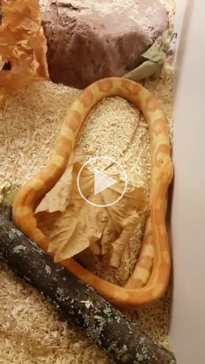</a>

### 判断蛇是否睡觉

蛇没有眼皮且正常情况下呼吸不明显，所以判断蛇有没有睡着并不容易。有动作、正在吐舌时当然是没睡；但是醒着的时候也可能一动不动。
 
一个有趣的方法是观察眼球位置，下图中左侧是在睡觉，右侧是拍摄过程中醒了。注意左右两种状态的蛇都是一动不动的。基本只有眼球有差别。

下方视频是某个下午的缩时视频，懂得看眼球的方法后能感觉到它和你上课打瞌睡的感觉是一摸一样的：

<a href="https://f000.backblazeb2.com/file/voldy-public/videos/如何知道蛇在睡觉.mp4">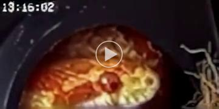</a>

睡着的蛇直接上手会比较激动（“起床气”）因而上手前可将手靠近蛇的鼻子，但不接触。蛇问到气味后会醒，并且通常会吐舌检验你是谁，然后可能选择向你移动、或向远离你的方向缩脖子。此时再上手更安全，且带来的压力更小。

## 动物刻板行为

（<a href="https://doi.org/10.1371/journal.pone.0247082">Hollandt, 2021</a>&nbsp;&nbsp;&nbsp;）IV&nbsp;

（Melfi, 2013&nbsp;）IV&nbsp;

刻板行为指的是动物做出重复的、无目标的、无实际功能的动作。刻板行为几乎只在圈养动物中出现，野外动物几乎没有刻板行为。动物做出刻板行为是动物在现在或此前的福利受损的体现。

出现刻板行为的本质原因都是圈养环境无法充分满足动物需求，动物出于内源性或外源性的刺激有进行某项行为的欲望，但因为环境不允许而无法进行相应行为，所以这种欲望无法得到满足而无法释放，这种需求和环境的冲突产生了补偿性行为，动物会寻求替代行为来缓解需求无法满足导致的沮丧和不满。

这些替代行为一开始通常体现为某种攻击性行为。如果攻击性行为受挫（环境没有改善），会因为某些刺激发展为一些为无目标、无意义的重复动作；这些重复动作变得越来越频繁的时候就形成了刻板行为。

刻板行为有两种。一种是改向行为（redirected action），即在缺乏动作对象时对并不适宜的对象进行相应动作，比如有交配需求的雄龟对着皮鞋交配。另一种是真空行为（vacuum activity），即不依赖任何对象进行动作，比如动物园老虎转圈走路，这种转圈走路的初衷可能是觅食或逃跑，但因尝试后受挫，发展为刻板行为。

动物的圈养环境应该使得动物可以表达物种特定行为，并具有自己解决可能问题的选项。同时应该提供丰荣设施，以促进正面福利。

## 蛇的典型刻板行为

### 顶墙、擦玻璃、清垫材

“顶墙”（包括顶玻璃、顶天花板）指蛇在环境的边缘爬行、同时用吻部去顶侧壁或天花板等障碍物的行为，可能只是轻轻地触碰，也可能是会用力到吻部都暂时变形的程度。“擦玻璃”英文叫 glass surfing，体现为反复、长时间的贴着垂直面玻璃游走。“清垫材”是擦玻璃的水平方向版本。

下方视频中的侏儒蟒的行为非常典型，展现了类似刻板行为的典型流程：首先用吻部点触想出去的地方，然后用力顶，如果面前顶不动，就爬高继续找。此时如果栖地不够高（比如只到视频中金属横杆的高度），蛇就可以持续朝箱顶发力，导致吻部损伤。如果箱子够高，蛇爬高之后就无法发力，这样减少了因顶墙而损伤吻部的可能（虽然该行为仍然是不正常的），蛇爬高了以后撑不住，就会弯曲下来，倚靠在玻璃接缝处继续探索。反复如此爬累了就会在玻璃前面休息，甚至直接在玻璃前面睡着（<a href="https://www.bilibili.com/video/BV1564y1276y">冬青-Cyan, 2021</a>&nbsp;）III&nbsp;：

下面的黄水蚺也展现了异常行为的典型流程：点墙角、拔高、摔在玻璃前面休息（<a href="https://www.bilibili.com/video/BV1564y1276y">冬青-Cyan, 2021</a>&nbsp;）III&nbsp;：

对于光源在地板下面的情况，蛇可能不在垂直面上“擦玻璃”，而是改到水平面上擦。体现为蛇把光源方向上的垫材都推光了。下面是玉米蛇因为丰荣不足在地下有光方向刨开垫材寻找出口（<a href="https://www.bilibili.com/video/BV1564y1276y">冬青-Cyan, 2021</a>&nbsp;）III&nbsp;：

这是另一条玉米蛇因为丰荣不足在地下有光方向刨开垫材寻找出口（<a href="https://www.bilibili.com/video/BV1564y1276y">冬青-Cyan, 2021</a>&nbsp;）III&nbsp;：

这些行为是最常见的动物焦虑的体现，应尽可能通过调整环境来改善，不应该当“有趣的行为”看。

严重的类似刻板行为会导致吻部附近的鳞片、皮肤状态异常。如下左图体现了蚺因为长期顶墙造成的吻部肿胀坏死（去国内动物园的时候看一看有多少蛇类的鼻子有类似问题），右侧是外科清创去除坏死组织后的状态，可见创伤极深。

这些现象是蛇要找出口、想要逃离栖地。造成这些现象的可能原因有（<a href="https://www.bilibili.com/video/BV1564y1276y">冬青-Cyan, 2021</a>&nbsp;）III&nbsp;：

* 温湿度、光照情况不适宜；
* 攀爬物不足：有攀爬天性的蛇（玉米蛇属于地栖和半树栖蛇，有攀爬习性）在缺乏攀爬物丰荣时，因为找不到可攀爬的地方，导致只能反复延爬箱一角拔高。
* 视觉隔障不足，动物过于暴露；
* 太饿

造成蛇顶墙擦玻璃行为的除了蛇有逃走的意愿之外，还有两个辅助条件（<a href="https://www.bilibili.com/video/BV1564y1276y">冬青-Cyan, 2021</a>&nbsp;）III&nbsp;：
* 蛇不能理解“透明隔障”的概念，使得蛇希望穿过玻璃走出去；
* “外界某方向有强光”，使蛇认为有光的方向是出口。蛇本来“均匀用力”，结果变成可能朝一个方向努力。

这种行为在居住条件欠佳的栖地种极为常见，而且不分物种广泛存在。下面列举一些非常类似的行为模式：

下面的视频是某种鼠蛇因为丰荣不足而在强光方向寻找出口（<a href="https://www.bilibili.com/video/BV1564y1276y">冬青-Cyan, 2021</a>&nbsp;）III&nbsp;：

下面视频中的蚺因为攀爬需求未被满足而在玻璃角上拔高（<a href="https://www.bilibili.com/video/BV1564y1276y">冬青-Cyan, 2021</a>&nbsp;）III&nbsp;：

下方的球蟒在栖地中长时间的展现出一样的刻板行为（<a href="https://www.patreon.com/posts/deep-dive-log-18-87991587">Sinclair, 2023</a>&nbsp;）III&nbsp;，或许因为栖地大小和攀爬空间不够II：

下方的球蟒因攀爬需求未被满足、爬玻璃爬累了之后摔在玻璃缝上休息（<a href="https://www.bilibili.com/video/BV1564y1276y">冬青-Cyan, 2021</a>&nbsp;）III&nbsp;：

下方的哥伦比亚红尾蚺由于攀爬物不足体现出在玻璃缝上休息的异常状态（<a href="https://www.bilibili.com/video/BV1564y1276y">冬青-Cyan, 2021</a>&nbsp;）III&nbsp;：

<a href="https://f000.backblazeb2.com/file/voldy-public/videos/冬青-ZooZajac1-哥伦比亚红尾蚺在玻璃缝上休息.mp4">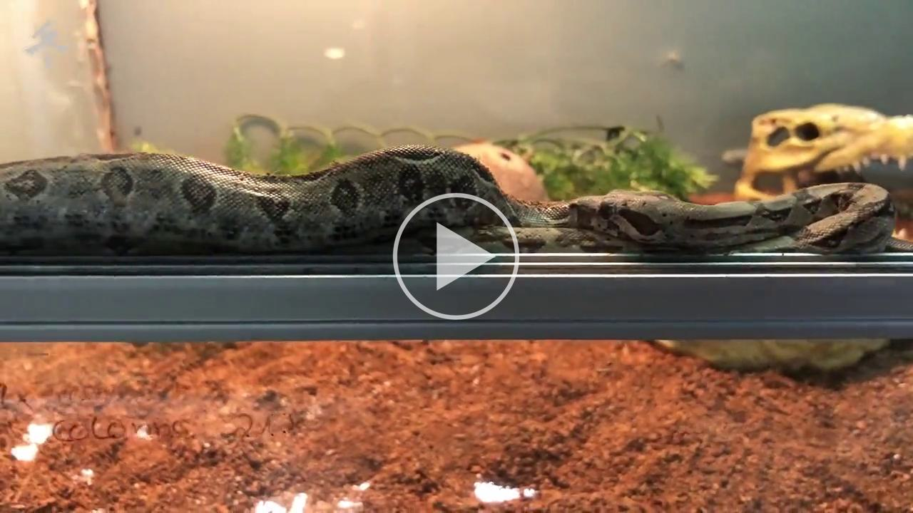</a>

下方的另一条哥伦比亚红尾蚺在低丰荣场景下体现出在玻璃缝上休息的异常状态（<a href="https://www.bilibili.com/video/BV1564y1276y">冬青-Cyan, 2021</a>&nbsp;）III&nbsp;：

<a href="https://f000.backblazeb2.com/file/voldy-public/videos/冬青-ZooZajac1-哥伦比亚红尾蚺在玻璃缝上休息2.mp4">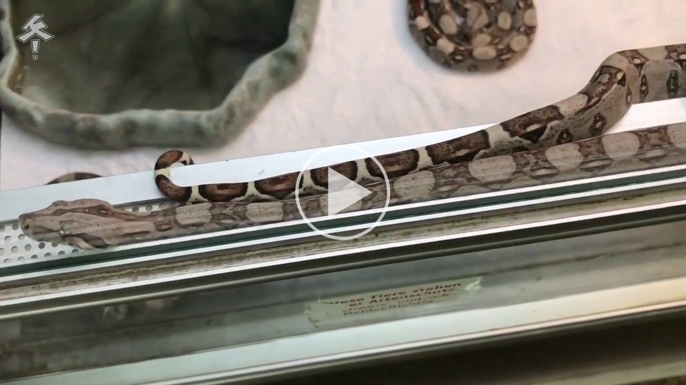</a>

 

几乎一样的行为模式在蛇以外的爬宠上也有体现。

比如下面几个视频是不同丰荣状态下的变色龙行为。在第一个视频中，变色龙因为缺乏遮蔽物、无法满足隐蔽需求，而出现在玻璃缝上焦虑的Glass Surfing的行为（<a href="https://www.bilibili.com/video/BV1564y1276y">冬青-Cyan, 2021</a>&nbsp;）III&nbsp;：

第二个视频中有一些遮蔽物，但遮蔽物（相比动物大小）不够大，无法充分遮蔽，导致变色龙焦虑的Glass Surfing行为（<a href="https://www.bilibili.com/video/BV1564y1276y">冬青-Cyan, 2021</a>&nbsp;）III&nbsp;：

<a href="https://f000.backblazeb2.com/file/voldy-public/videos/冬青-ZooZajac1-变色龙在遮蔽物不够大、无法遮蔽动物时产生的焦虑行为.mp4">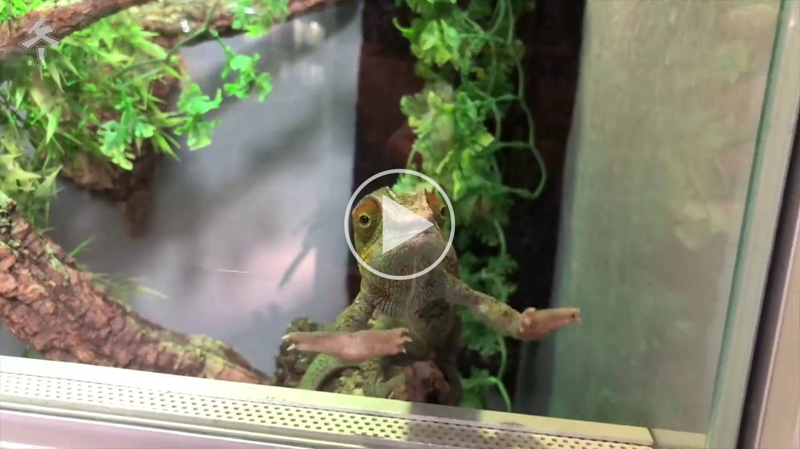</a>

而第三个视频中环境丰荣度就高得多，变色龙体现出正常的隐蔽于树叶间的行为（<a href="https://www.bilibili.com/video/BV1564y1276y">冬青-Cyan, 2021</a>&nbsp;）III&nbsp;：

#### 不是刻板行为的情况

需要注意前面的刻板行为判断需要“长时间”、“反复”的条件，并不是只要在玻璃前面探索就是刻板行为。区分“对玻璃外面好奇”和“必须要出去”。在玻璃前短暂探索后还会继续探索其他区域的丰荣物，没有盯着一个角落、或对着某一点反复作动，并且不是把擦玻璃作为每日活动的主要内容，就不是刻板行为。

如下面的带纹斐济鬣蜥短暂的来玻璃前探索、或者响应箱外的事件来玻璃前面转的，并不是刻板行为（<a href="https://www.bilibili.com/video/BV1564y1276y">冬青-Cyan, 2021</a>&nbsp;）III&nbsp;：

下方的黑喉巨蜥年纪还小，不知道玻璃是怎么回事，短暂的在玻璃前面探索，这不是刻板行为（<a href="https://www.bilibili.com/video/BV16y4y1g7kW">冬青-Cyan, 2021</a>&nbsp;）III&nbsp;：

下面的例子中前半部分平原巨蜥把玻璃边沿当作攀爬空间使用、中间回到丰荣物中探索、后半部分看到了玻璃外面的拍摄者，这虽然也是在玻璃前面走来走去、还有挠玻璃的行为，但这不是刻板行为。注意它们并且玩累了之后会在”正常的地方“休息，如丰荣物下方或者躲避处，而不是直接觉得玻璃前面就是爬箱里“最不差”的地方，在玻璃前面就睡着了（<a href="https://www.bilibili.com/video/BV16y4y1g7kW">冬青-Cyan, 2021</a>&nbsp;）III&nbsp;：

### 挤墙角

虽然挤墙角也是对着墙角使劲，但与前述行为不同的是较长时间呈一个姿势不动，并且常有部分身体（而不是头部）沿着墙角向上摆放。这通常不只是缺乏丰荣、攀爬物等“进阶问题”，而是基础环境严重不适的体现。诸如挤在远离热灯的角落即很可能是温度实在太高，蛇实在是受不了。必须立即纠正环境问题。

下面的太平洋地蟒即因为光热条件不适宜而挤在远端角落（<a href="https://www.bilibili.com/video/BV1564y1276y">冬青-Cyan, 2021</a>&nbsp;）III&nbsp;：

## 丰荣

### 什么是丰荣

---

【】【丰荣】【】
The term "enrichment" is often used in the hobby, but what does it really mean? It refers to providing something that gets the animal cognitively working. It's most effective when the enrichment is new and novel. For example, a leaf or branch that was added to the enclosure a week ago soon becomes part of the habitat and is no longer enrichment. We need to constantly think of new ways to keep the animal engaged.

“丰富性”这个词经常在这个爱好中使用，但它真正的含义是什么呢？它指的是提供让动物进行认知工作的东西。当丰富性的内容是新的和新颖的时，效果最好。例如，一周前添加到围栏中的一片叶子或一根树枝很快就会成为栖息地的一部分，不再具有丰富性。我们需要不断思考新的方式来吸引动物的注意力。

---

【丰荣不止体现在装饰物上，在各种动物需求方面都可以有丰荣措施】
【丰荣的定义】

### 什么不是丰荣

不是“让栖地里丰富”就叫丰荣。丰荣物必须能让动物展现物种特定行为，设计丰荣物时应该考虑你想满足动物的什么需求，不能瞎放。当然，你完全实施仅为人类的感官服务的设计，比如摆放仅为美观的装饰物，但不要以“这是丰荣，是为了动物”的名义来做这件事，否则容易遗漏真实的动物需求。

### 丰荣的意义

### 丰荣不足的行为学体现

### 从小丰荣的重要性

### 丰荣措施

### 要有耐心

### 谣言：蛇智商低，所以不用丰荣

经常有人说：“爬行动物很蠢，不需要丰荣娱乐”，这些人对爬行动物的智商有误解（所谓“只有一个脑细胞、有的时候还不用”）。爬行动物“节能”的生存策略让人觉得它们很呆，什么也不做。但你看不到不等于它们不能。爬行动物比你想象的聪明得多，比如：

#### 蛇可以做目标训练（按按钮要食物）

【】【】【】
Sherri A. Emer • Cordula V. Mora • Mark T. Harvey • Michael S. Grace, Predators in training: operant conditioning of novel behavior in wild Burmese pythons (Python molurus bivitattus). Animal Cognition volume 18, pages269–278 (2015)

E:\My_Program\Voldy_Notes\附件\缅甸蟒按按钮.pdf

E:\My_Program\Voldy_Notes\images\缅甸蟒按按钮.png

【】【Lori Torrini的视频】【】

https://www.youtube.com/watch?v=RkqjqaIJEEA&list=PLNbZzsRecQ2ZBjRjqF1bIwFnR8tPqM5jG&index=3

下面是一条玉米蛇的成功目标棒训练视频

#### 爬行动物有社会性学习能力

社会性学习指的是通过观察其他同物种个体的行为获得新知识的过程，模仿是一种重要的社会性学习能力。人们曾经认为这是人类独有的能力，有人曾经建议把智人Homo sapiens命名为Homo imitans（会模仿的人）。模仿行为在认知过程上其实非常复杂，因为观察者不仅需要获取信息，还必须对观察到的行为、情境的限制以及模型的意图或目标进行推断。

Anna Wilkinson等人用双向对照试验证明鬃狮蜥有模仿学习行为。（<a href="https://dx.doi.org/10.1007/s10071-014-0803-7">Kis, Wilkinson, 2015</a>&nbsp;&nbsp;）IV&nbsp; 它们用了下面的实验装置，实验区域用隔板隔开，隔板有门，门既可以向左推动，也可以向右推动。鬃狮蜥受试在门的一边，另一边地上有虫，还有一个屏幕可以用来播放示范视频。

实验人员先用一只鬃狮蜥做示范，他们用了三周时间教它学会了开门吃虫。获得了三个示范视频，均为11秒，第一个视频是一只鬃狮蜥向左推开门；第二个视频是第一个视频的镜像，鬃狮蜥向右推开门；第三个视频的鬃狮蜥没动，是人从画面以外把门滑开（注意到视频里**没有**展示滑动开门可以得到食物）：

实验中（除示范的一只外）有12只鬃狮蜥，分为左滑组、右滑组和对照组。受试在做实验前没有经过认知训练。实验时取一只鬃狮蜥，放在测试区内，首先适应30秒，然后播放给相应组别的示范视频（同类示范向左滑，同类示范向右滑，人类向左滑），11秒的视频只播放一次。随后鬃狮蜥有5分钟时间自由尝试。

上面的流程每天每只做2次，连续做5天。

【实验结果】

* 看了鬃狮示范视频的都开了门。
  * 8只看了视频的动物最迟的在看**第五次**视频的时候就都学会了开门；有5只只看了一次或两次就学会了。。
* 看了人类示范视频的4只鬃狮蜥在10次实验一共50分钟的时间内没有任何一只成功开门。
* 看了右滑视频的实验组共40次实验，15次向右开了门，2次既向左开了门又向右开了门，23次没开门，没有一次是只向左开门的。
* 看了左滑视频的实验组共40次实验，18次向右开了门，3次既向左开了门又向右开了门，19次没开门，没有一次是只向右开门的。

实验说明鬃狮蜥有明确的社会性模仿学习行为。

【】【其他类似实验结构】【】

red-footed tortoise （Chelonoidis ——carbonaria）能够通过观察同类的行为学习完成任务（Wilkinson A, Kuenstner K, Mueller J, Huber L (2010b) Social learning in a non-social reptile (Geochelone carbonaria). Biol Lett 6:614–616）。Florida redbelly turtle (Pseudemys nelsoni)能够通过观察已经学会这项任务的同类来学习向视觉物体移动的行为（Davis KM, Burghardt GM (2011) Turtles (Pseudemys nelsoni) learn about visual cues indicating food from experienced turtles. J Comp Psychol 125:404–410）。还有，young male skinks (Eulamprus quoyii)在有示范时可以显著更快的学会移动盖子的行为（Noble DWA, Byrne RW, Whiting MJ (2014) Age-dependent social
learning in a lizard. Biol Lett 10:20140430）。

#### 爬行动物能认人

Wilkinson等人曾做实验发现玉米蛇可以认人；并且说明如果蛇傻，很可能是你把它养傻的。（<a href="https://www.sciencedirect.com/science/article/pii/S0168159121000654">Wilkinson, 2021</a>&nbsp;&nbsp;）IV&nbsp;

他们移除栖地里其他不对称因素，在特定位置摆放两块海绵，两块海绵一块是主人握过的，一块是陌生人握过的；然后把蛇放在中线上，一段时间后通过摄像头统计蛇位于不同分区的时间（在熟人海绵的区域、在陌生人海绵的区域、和在两区域之外）。作者发现，观察蛇，长期饲养在丰荣缸中的蛇能够区分主人的气味和陌生人的气味（35% ± 3% vs 22% ± 3%）；但长期饲养在无丰荣栖地中的蛇则无法区分两种气味（28% ± 5% vs 26% ± 7%）。这个实验一方面说明蛇能对不同人类的气味做出区分，还说明丰荣直接影响蛇的这种细致分辨能力 IV。

#### 爬行动物可能会做梦

人的睡眠分快速眼动期（REM）和非快速眼动期（NREM），在快速眼动期时，大脑活动和醒着的时候类似，但和肌肉运动相关的部分被麻痹。梦就是大脑仿照清醒时的运行模式、但不控制肌肉运动、不处理外界输入的状态，因此快速眼动期和做梦紧密相关。如果把快速眼动期的人突然叫醒，它们常表示正在做梦，而且对梦境的记忆比睡眠自然结束后的记忆清晰生动的多。之前一直认为只有哺乳动物和鸟类才有REM睡眠。但2016年发在Science上的工作通过给鬃狮蜥植入电极，发现鬃狮蜥的睡眠也有和恒温动物类似的REM和NREM分区，表明蜥蜴的睡眠比以前想象的更为复杂，把睡眠结构的进化位点后推到了羊膜动物（含哺乳纲、鸟纲、爬行纲）。（<a href="https://dx.doi.org/10.1126/science.aaf3621">Shein-Idelson, Ondracek, 2016</a>&nbsp;）IV&nbsp;

### 谣言：蛇不运动，所以不用丰荣

经常有人说：“我的蛇在抽屉里/人渣盒里也天天不动，换了大的也没用”。这搞反了因果关系。如果蛇从小就生活在缺乏足够空间、缺乏丰荣、无法攀爬的空间中，经年累月导致蛇的习得性无助、同时也缺乏外界感官刺激而缺乏大脑锻炼，导致蛇缺乏探索行为。用抽屉养蛇本来就是蛇不活动的原因，用此论证欠丰荣环境的合理性是循环论证 IV。

正确的思路是看看养在造景缸里的蛇是不是有探索行为 IV，如果造景缸里的蛇普遍都有，你养在抽屉里的蛇普遍都没有，这说明什么？

另一方面可能是疏于观察。玉米蛇在圈养环境下常在夜间活动，关灯后的活动你看不到。所以非常推荐安装一个摄像头。发布在[聚氨酯毛的咩咩](https://space.bilibili.com/12892460)频道中的许多早期监控视频说明玉米蛇一晚上能上天下地转四五个小时，绝不是不愿意活动 II。

实际上有充分证据表明环境丰荣对圈养爬行动物有正面影响，比如Burman等人的文章是个验证丰荣对动物行为影响的典型案例，下面详细解释（<a href="https://www.sciencedirect.com/science/article/abs/pii/S0168159121001118">Burman, 2021</a>&nbsp;）IV&nbsp;：

实验中使用了15条救助来的玉米蛇，体重110 – 375 g，每周喂食一次，每天上手2\~5分钟，爬箱尺寸83 × 35 × 39 cm，每天光照12 h，温度22\~31 °C。爬箱布置的对照如下图所示。

无丰荣环境：
* 一个小水碗
* 一个仿岩躲避
* 报纸垫材

有丰荣环境：
* 一个可以泡澡的水碗
* 一个仿岩躲避
* 一个树枝攀爬物
* 一个插有攀爬棒的洞洞板
* 白杨木屑垫材
* 悬挂在高处的椰子壳躲避
* 一个有湿苔藓和土的湿躲避，可以满足湿度和挖掘需求

作者发现，相比于欠丰荣的爬箱，有丰荣的蛇有显著更多的时间：
* 呆在明处、不躲藏 (p < 0.001) （为什么“我家蛇天天躲窝里看不见它”）
* 在走动 (p = 0.001)（为什么“我家蛇天天一动不动”）
* 呈舒展姿态 (p < 0.001)
* 呆在垫材上面（而不是窝在报纸下面）(p < 0.001)
* 在引入新的丰荣物时有探索行为

把欠缺丰荣的爬箱和有丰荣的爬箱连接起来，让已经经历过两种爬箱的蛇自由选择，在一段时间后统计蛇位于不同爬箱的时间。研究发现蛇有82.5 ± 5.9%的时间选择了有丰荣的爬箱。说明蛇对爬箱的丰荣度是有主观倾向的。

这篇论文说明“蛇在爬箱里躲着不动”并不是不提供丰荣的理由，反而躲着不动是缺乏丰荣的结果。并且驳斥了下面将要说的“蛇智商不够，并不能意识到丰荣成度”的传统说法 IV。

他们发现，有选择时，玉米蛇会使用丰荣物，且丰荣环境中的蛇展现的行为体现出使用丰荣物改善了动物福利。丰荣并不导致焦虑，相反，当给予选择时，蛇表现出对丰富环境的强烈偏好。这些发现表明，为圈养环境提供环境复杂性对圈养玉米蛇的行为和福利有益。因此，我们建议在圈养蛇时丰荣 IV。

在另一篇文章中
（<a href="https://jzar.org/jzar/article/view/23/28">Rose, 2014</a>&nbsp;&nbsp;）IV&nbsp;作者报道了三组学生实验。作者将两组各两只少年玉米蛇分别饲养于有攀爬物的蛇箱中和欠丰荣的蛇箱中（如下图），

实验发现丰荣程度较低的栖地中，玉米蛇大部分时间在躲避；丰荣度较高的蛇则经常可以被看见，还会在不同躲藏位置之间变换地点。这不但满足了蛇在感到安全的前提下选择不同微环境的需求，还使得人能更好的观察到蛇的活动，增加饲养乐趣，避免“养成块石头”。

### 谣言：宠物蛇特殊

常有人说：多代繁育的宠物蛇和野蛇不同，已经习惯了生活在盒子里，不需要大环境/丰荣/自然垫材。

实际上人工饲养的性格确实更“温顺”，也更能耐受较差的丰荣条件，但空间和丰荣并没有明显改变。

没有经验不要买野蛇。

不要参考国内动物园，不要参考宠物店（包括国外的宠物店）。

但许多动物行为学实验都说明正确丰荣下的爬宠展现出更“正常”的行为。 （<a href="https://www.sciencedirect.com/science/article/abs/pii/S0168159121001118">Burman, 2021</a>&nbsp;）IV&nbsp;，（<a href="https://doi.org/10.1371/journal.pone.0247082">Hollandt, 2021</a>&nbsp;&nbsp;&nbsp;）IV&nbsp;

可以观察到异常行为

任何你能买到的爬行类都有探索行为，丰荣就是给它们这个机会。尤其考虑到一般饲养着并不能通过合理互动进行行为丰荣，也不做取食难度的丰荣，只能定期改变丰荣环境布局。否则再好的丰荣也会腻。（<a href="https://www.bilibili.com/video/BV1oR4y147p8">冬青-Cyan, 2021</a>&nbsp;）III&nbsp;

### 谣言：蛇的洞穴里就很秃，用塑料盒正合适

常有人说：“蛇喜欢躲在阴暗狭窄的地方，蛇更喜欢抽屉/人渣盒黑暗狭窄的穴居环境。”这逻辑很扯淡，等同于：“看你天天躺卧室床上，你在监狱单身牢房待一辈子一定很舒适。”

因为球蟒“团球”的习性，对球蟒的这个误解比对玉米蛇还要普遍，许多人觉得球蟒在栖地里就应该一动不动、就应该只给个抽屉。但下面的严谨对照试验证明连球蟒都能充分用得上丰荣物和栖地空间，而且立竿见影。

Hollandt等人用球蟒直接对比了蛇柜（抽屉）和爬箱里蛇的不同行为（<a href="https://doi.org/10.1371/journal.pone.0247082">Hollandt, 2021</a>&nbsp;&nbsp;&nbsp;）IV&nbsp;：

作者用一批35条球蟒做对照试验：
* 首先把蛇养在抽屉里。抽屉里有：
  * 躲避
  * 小水碗
  * 没有单独照明（用透入的屋内灯光照明）
  * 尺寸 70 × 40 × 16 cm
* 在抽屉里养两个月后，把蛇转移到爬箱里，爬箱大小与蛇身长相关。爬箱包配备：
  * 垫材：soil (60%), sand (20%), bark mulch (15%), and loam powder (5%)。前半部分垫材厚度10 cm，后半部分35 cm。（不要觉得三五厘米垫材就够用，让铺十厘米垫材并不过分）
  * 躲避
  * 攀爬物
  * 能泡澡的水盆
  * 接近紫外光灯的晒台
  * 活植
  * 可见光和紫外线灯
  * 尺寸 100-150 × 50-80 × 50-80 cm，取决于蛇的身长。

Hollandt等人用球蟒直接对比了蛇柜（抽屉）和爬箱里蛇的不同行为。

文章用的行为指征有：
* 运动爬行：
  * 向前爬动：包括横向移动（lateral undulation）、直线运动（retilinear locomotion）和两者的组合；
  * 向后爬动：指的是身体局部或整体的运动；由于鳞片构造的原因，真正的”向后爬行“对蛇来说是不存在的，所以这种运动其实是依靠抬起部分或全部身体来进行的一种推挤运动；
  * 上身抬起
  * 爬高
  * 挖土
  * 仅头部运动
  * 探索摄像机：是指蛇靠近摄像机，用嘴触碰或用舌头探查/嗅闻的行为。
* 舒适行为：
  * 晒太阳
  * 泡澡
  * 躲避里休息
  * 在躲避外面休息：能很好地体现出蛇的舒适程度，因为与“藏在躲避内”相反，在躲避外休息体现出蛇对环境的安全感。
* 防御行为：在大多数情况下，防御行为是一连串的系列行为。比如蟒蛇把身体前半部分摆成S形，还可能会发出明显的嘶嘶声；“防御性击咬”包括闭嘴咬和张嘴咬两种情况。
* 喝水
* 打哈欠：常常出现在进食后，但也可能在其他时间自行发生；
* 顶墙擦玻璃：蛇在环境的边缘爬行、同时用吻部去顶侧壁或天花板等障碍物（Pushing the mouth against a barrier）的行为，可能只是轻轻地触碰，也可能是会用力到吻部都暂时变形的程度；
* “摇摆wobbling”和“观星stargazing”：不正常行为，大多出现在某些颜色变异（如蜘蛛）中，或随着疾病而产生（如沙状病毒Arenavirus感染）；指的是一种无方向感的震颤，身体螺旋状扭结，或仰着、靠背部爬行。这些动作往往会被外界刺激所激发，比如喂食前后。

研究发现两种环境中蛇体现出截然不同的行为（p < 0.05）:
* 在爬箱中，蟒蛇才能表达出晒太阳、攀爬、钻洞和洗浴的行为。并且这些行为都是有时间依赖的，集中在白天发生
* 刻板行为几乎只在架式系统中出现。

实验中发现，相比于抽屉中的蛇，住在爬箱里的蛇体现出显著更多的下列行为：
* 向前爬行（15% vs 7%）、上身抬起、挖土打洞（1% vs 0%，蛇柜种无法挖土打洞）、在躲避外呈伸展状态（18% vs 14%）
  * 爬箱可以展现更多自然的物种行为，爬行和伸展状态说明蛇在有丰荣的爬箱中更为放松、更不紧张
* 攀爬（7% vs 0%，蛇柜中无法攀爬）
  * 这展现出“球蟒是地栖蛇、所以球蟒不用爬高”的理论是错误的。
* 晒灯（9% vs 0%，爬柜没法装晒灯），在爬箱中的蛇会每天晒灯144 ± 13分钟。
  * 这展现出球蟒会主动追求UVB，结合其他证据（如照射UVB产生的血清学变化），表明应该为球蟒提供UVB。
  * 白化球蟒的晒灯行为远少于原色球蟒，约为10 ± 3分钟。
  * 蛇去有UVB的晒点的时间高于无UVB的晒点，说明蛇可以感知UVB带来的舒适性，不只是追求光照和温度】
* 泡澡（爬柜无法泡澡）体现出泡澡是球蟒的自然行为，最然不常出现，但仍然应该提供相应条件。
  * 体现出泡澡是球蟒的自然行为，最然不常出现，但仍然应该提供相应条件。

而蛇柜中的蛇下列行为显著更多：
* 探索摄像头：这体现出在丰荣缺乏的环境中，球蟒会把任何好玩的东西当作丰荣物，使劲玩，进一步体现出球蟒对丰荣的需求。
  behavior
* 在躲避里窝着（53% vs 33%）
* 表现出顶缸擦玻璃等刻板行为（11% vs <1%）
  * 爬柜中表现出顶缸、擦玻璃、贴边爬行、顶通风口行为的蛇移入爬箱后都不再体现类似行为。

虽然球蟒确实大部分时间都在休息，但爬柜中的休息时间比爬箱中多（80% vs 64%），而且球蟒在爬箱中更多以伸展的方式休息。

老的书籍中（如Kevin McCurley的2011年的书）认为相比爬箱系统，蛇柜系统中的蛇更不容易拒食，且生长更快，性成熟年龄低，有助于繁殖、爬箱明亮的光线会造成压力、蛇柜还可以模拟洞穴。这些观点被本文推翻。研究没有发现养在抽屉里的蛇更容易接受食物（即不接受大爬箱会导致拒食）。文章认为虽然养在抽屉里的蛇（在喂食相同食物的情况下？）生长更快，但这是因为长在抽屉里蛇比爬箱里的蛇运动更少（7% vs 15%），所以能投入生长的能量更多。虽然养在抽屉里的蛇生长更快，但活动量少的蛇肌张力会明显更低。本文还也发现蛇会主动选择晒灯，所以光线明显没有造成压力，反而是缺失光线有问题。

### 谬论：缸大丰荣多我就看不见蛇了，不能丰荣

【】【】【】
不丰荣看到的是刻板行为
不丰荣更不容易看到，天天躲着不动
丰荣了反而更容易看到蛇活动（聚氨酯毛的咩咩视频，自己的对照试验把丰荣拿掉后就不玩了，丰荣放回去马上出来玩；文献实验一样，丰荣了更多实验被看到）

### 谬论：只要空间够，丰荣不重要

>  “造景和丰荣其实不太重要，饲养箱简单布置一下就行。最关键的还是保证活动空间足够。（就像金鱼一样，你可以造景种植物养，也可以放裸缸里养。只要水体和空间足够大，水质够好，鱼一样游得那么开心。）”

冬青-cyan：和水族不同的是，鱼可以游到任何有水的地方，因为水就是它们行动的媒介，让空间利用率极高。
而如果没有攀爬物的话，箱体里的上层空间很多两爬是利用不了的，利用率就要比鱼小太多了，所以建议配置一些攀爬物来让它们可以像鱼一样“游”到各个角落  III

【】【II: 不丰荣太空旷，会导致紧张】【】

### 该不该把蛇养在抽屉里（蛇柜系统）

除了上述特殊用途之外，不应该用蛇柜（rack system），因为蛇柜几乎不可能满足合格的空间要求，严重影响蛇的正常活动。（<a href="https://4ca8cce6-b649-4f5d-8bce-a3b15fb870e6.usrfiles.com/ugd/4ca8cc_8a3d7f870e5e48c68b36937403bd30bd.pdf">英国两爬协会饲养箱准则, 2022</a>&nbsp;&nbsp;&nbsp;）V&nbsp;

有人对球蟒醉了严谨的对照试验，说明布置简单的蛇柜就是不能满足蛇类需求。（<a href="https://doi.org/10.1371/journal.pone.0247082">Hollandt, 2021</a>&nbsp;&nbsp;&nbsp;）IV&nbsp;具体见之前章节的讨论 。

（但如果非要养在蛇柜中，尽可能丰荣仍然可以相对促进蛇的正常行为）

很好的讲座，已转录，未整理：【】【（<a href="https://www.youtube.com/watch?v=PSOwCDUKMlA">Sinclair, 2023</a>&nbsp;）III&nbsp;】【】

网上有论调说蛇柜是设计来模仿蛇的穴居行为的，这是错误的，蛇柜本来就不是为蛇而设计的。Freedom Breeder公司曾经发布过一个讲历史的视频，蛇柜原来是给养老鼠设计的，有托盘有水嘴。之后它们把这个设计交给了Tracy Barker，才逐渐变成了蛇的设施。人们用蛇柜就是为了优化养蛇的空间和效率，不是什么福利设施。如果你必须要用蛇柜，也应该承认这是一种为了经济和空间条件而做的妥协，不应觉得这就是“为了蛇好”、“蛇很乐于住蛇柜”。（<a href="https://www.youtube.com/watch?v=OGqPejRyt9E">Sinclair, 2023</a>&nbsp;）III&nbsp;

【】【已转录，未整理：（<a href="https://www.youtube.com/watch?v=K-RqJ0AUAk8">Sinclair, 2022</a>&nbsp;）III&nbsp;】【】

### 长期居于蛇柜的蛇如何向丰荣缸转移

【】【已转录，未整理：（<a href="https://www.youtube.com/watch?v=lh5sFzQ-5y8">Sinclair, 2022</a>&nbsp;）III&nbsp;

# 玉米蛇的自然生境

https://www.inaturalist.org/observations?place_id=any&taxon_id=73887

# 最低空间需求

## 为什么栖地要够大

栖地够大是几乎其他一切日常福利的基础，有足够大的栖地才能实现如下目标（<a href="https://4ca8cce6-b649-4f5d-8bce-a3b15fb870e6.usrfiles.com/ugd/4ca8cc_8a3d7f870e5e48c68b36937403bd30bd.pdf">英国两爬协会饲养箱准则, 2022</a>&nbsp;&nbsp;&nbsp;）V&nbsp;：

* 【建立活动空间】文献表明蛇在舒适环境下会完全伸直身体（<a href="dx.doi.org/10.7120/09627286.31.2.004">Rooney, 2022</a>&nbsp;&nbsp;）IV&nbsp;，应该给蛇提供这样的机会。V 不能因为蛇平时卷曲就按卷曲状态设计栖地，正如你平时喜欢坐着、躺着，但你喜欢层高1.5 m的房间吗？
* 【提供环境梯度】蛇在不同时候需要不同的环境，消化时希望有较高温度和IRA光源，缺乏维生素D时希望有较高的UVB，蜕皮时希望有较高的湿度。一个好的栖地应该让蛇有得选，光、热、湿度、视觉屏障都应该有其梯度，各因素的梯度交织在一起才能让蛇总能选择到所希望的环境。正如不论让你全年呆在家里、还是让你全年呆在某个商场/饭馆/电影院，你都不会很满意。一个小屋不论怎么装修都不可能满足多样化的生活需求，必须在更大的区域里造出差异，每个区域满足一种生活情景。V
* 【提供足够丰荣】蛇休息时希望有假植遮挡，玩耍时希望能攀爬、能挖土，喂食时的追逐捕食行为可以提高进食的满足感。栖地不够大或不够高这些就实现不了，不可能提供丰富的丰荣环境。V
* 【减少卫生问题】蛇是讲究干净的生物，常可以观察到蛇选择原理躲避的区域排便，若排便后未处理，则排便区域的经过频率会相比其他区域明显减少 II。在很小的栖地中，常能见到蛇挤在角落里拉屎、或钻到报纸垫材下面去拉屎，体现出其自身的卫生需求未被满足，也难以让蛇在活动期间避免开自己的排泄物。
* 【大栖地本身就是一种安全措施】在温度控制器损坏时，如果栖地过小，蛇只能被烤死；但如果栖地较大、可将加热器设计于栖地的一侧，过热时蛇可以向另一侧躲藏。V
* 【大的、有丰荣的栖地可以促进蛇的生长发育】总有人问自己的蛇为什么养了一年还是一点点大。这可能与栖地大小和丰荣水平有关。（<a href="https://www.youtube.com/watch?v=3xPrMqYXSnM">Sinclair, 2021</a>&nbsp;）III&nbsp;有研究表明，在有丰荣的较大爬箱中养殖的黑鼠蛇、相比于小爬箱无丰荣的对照组来说体重和身长都更大。【】【只看了RR的介绍，还没看原文：（<a href="https://trace.tennessee.edu/cgi/viewcontent.cgi?article=3176&context=utk_gradthes">Almli, 2004</a>&nbsp;）IV&nbsp; 】【】作者使用下图所示的两种不同布置水平的爬箱，实验组9条、对照组7条，其他饲养条件相同，试验结束后发现对照组平均增重46 ± 5 g，实验组增重67 ± 7 g；对照组身高增长175 ± 8 mm，实验组身高增长221 ± 11 mm。两组有显著性差异。同时作者发现丰荣栖地中的蛇完成学习任务的时间更短。

## 谬论：小盒子模拟穴居状态，更合适

常有人说：“蛇的洞穴就很小，所以给蛇很小的栖地更符合天性。”但野外的玉米蛇不是天天窝在洞穴里，否则 herping 的时候在草丛中甚至马路上发现的玉米蛇是在干什么？即使是洞穴中的环境也不等于抽屉+厨房纸，至少它还有挖土打洞的生性需求没有满足。同时，你提供的栖地是蛇一辈子生活场所的总和，而不只是卧室。蛇的卧室应该只对应于栖地里的躲避。

有实验明确表明玉米蛇可以受益于更大的栖地。Burman 和 Wilkinson 等人将12条蛇分别在长度等于身长2/3的小爬箱里（这“小爬箱”的尺寸已经比很多人的人渣盒大很多了）和长度超过蛇长度的大爬箱里饲养一个月。并通过行为标准衡量不同环境下玉米蛇的行为状态。（<a href="https://doi.org/10.1016/j.applanim.2021.105435">Burman, 2021</a>&nbsp;&nbsp;）IV&nbsp;

作者通过录像分析，发现更大爬箱里的蛇有显著更多的时间：
* 在活动，而不是休息 (p = 0.001)（为什么“我家蛇天天一动不动”）
* 呈相对舒展的姿态，而不是紧密蜷缩的状态 (p < 0.001)，在大爬箱里的蛇不在躲避里的时候有19%的时间是完全舒展的（“Stretched”），这说明蛇舒展身体确实是它的需求，这样的需求在小爬箱里根本无法实现。
* 把两个爬箱相连时，蛇只要“醒着”（除去在躲避里的时间），蛇就选择更多的待在大爬箱里（P = 0.001）。

他们在两个不同大小的爬箱里摆放了同样的丰荣设施（这其实更偏向于小爬箱，因为面积变大、设施不变会导致大爬箱过于空旷。一般人增大爬箱的时候也会摆更多东西）。我个人认为下面的差别是空旷程度的差异导致的：
* 小爬箱里的蛇有更多时间在外面（能被人看见，p = 0.008），大爬箱里的蛇有更多时间呆在躲避里（p = 0.002）。

这都说明，只要栖地布置合理，蛇主观上会选择较大的栖地，客观上满足蛇的需求也需要较大的栖地。“蛇更黑暗狭窄的环境”是谬论 IV。

## 谣言：大栖地拒食

有人说大的栖地会导致蛇的压力而拒食。但野生蛇有整个地球可以用，那野生蛇是不是都拒食灭绝了？导致拒食的不是“爬箱**太大**”而是“爬箱**太空旷**”。

蛇有趋触性（thigmotaxis），即类似“趋光性”的原理，蛇会追求使尽可能多的身体部位接触自己或墙壁，并为此。这是进化过程中促进蛇躲开捕食者的生理机制。哺乳动物、包括人也都有趋触性，例如有的人必须要盖着厚重的被子才能睡觉，或者人在应激状态下希望抱着自己的膝盖缩在墙角等等。（<a href="https://www.youtube.com/watch?v=3xPrMqYXSnM">Sinclair, 2021</a>&nbsp;）III&nbsp;

空旷的栖地会使蛇无法满足趋触性，所以应当提供足够的丰荣物和躲避空间。在不同的躲避空间之间应该设置足够的丰荣物和视觉隔障，使得蛇可以在选择不同栖息位置时保持隐蔽。较小的栖地确实可以更容易的实现这一点，但较小的栖地无法满足许多其他需求（将在[为什么栖地要够大](#为什么栖地要够大)一节讨论），所以正确的做法就是大栖地+足够丰富化的设施。
（<a href="https://www.youtube.com/watch?v=3xPrMqYXSnM">Sinclair, 2021</a>&nbsp;）III&nbsp;

如英国两爬协会对此做出的解释（<a href="https://4ca8cce6-b649-4f5d-8bce-a3b15fb870e6.usrfiles.com/ugd/4ca8cc_8a3d7f870e5e48c68b36937403bd30bd.pdf">英国两爬协会饲养箱准则, 2022</a>&nbsp;&nbsp;&nbsp;）V&nbsp;

>在大型**开阔**空间中，一些物种会表现出压力类型的行为，例如拒食或将自己推到玻璃上，因此重要的是不仅仅要专注于提供大空间，还要考虑空间的布置。这些问题通常可以通过增加藏身和掩护的地方以及增加饲养箱内的可用区域（即增加环境的复杂性）来缓解。

实际上，有文章描述，在较大的、丰荣完善的栖地里生活的蛇可以增加他们对外界压力的抗性(Young, R.J., 2003. Environmental Enrichment for Captive Animals. UFAW, UK.)，在将来不会因为突然的环境因素改变导致应激 IV。

一个例外情况是如果某条蛇自幼就生活在小而秃的环境中，它在短时间内确实可能无法适应较大的、含有较多感官元素的环境。但其原因不是蛇喜欢小而秃的环境，而是蛇从小没有受到感官刺激，限制了大脑发育、难以处理复杂信息，蛇的探索欲望也因为长期习得性无助而被抑制。（<a href="https://www.youtube.com/watch?v=PSOwCDUKMlA">Sinclair, 2023</a>&nbsp;）III&nbsp;对这类个体需要逐步增加丰荣程度，辅以”箱子套盒子“的栖地设计，让蛇慢慢的在几个月到一年的时间里逐渐学习与大的、复杂的环境互动的方式 III。

另一个特殊情况是有特定神经性疾病的蛇 IV，这里不做讨论。

## 谬论：蛇睡的地方比我的床还大

向有的人说明先进国家的福利法规定的栖地大小是，这些人觉得太大，声称“我自己的床才 1.8 m × 1 m，结果给条小蛇还得 1.2 m × 0.6 m，显然不合理”。但是与你自己的床对应的不是栖地，是栖地里的躲避，躲避当然可以很小。蛇一生都活在你建设的栖地里，所以栖地的建设目标应该是蛇的“小社区”，而不仅是蛇的“卧室”，更不是蛇的“床”。

很多人特殊时期被封在家里俩月就憋得不行了。把你手机电脑没收，让你连床都不下，四面白墙啥都没有，每天三顿吃一样的东西，让你待个20年，感觉体验会很不错？是不是没几个月就疯了？人疯了之后会怎样？目光呆滞、无精打采、一整天除了吃饭一动不动，对外界毫无反应。这行为模式在蛇上熟悉吗？

## 谬论：诉诸特殊

有人使用诉诸特殊的谬论来论证用小栖地的好处：“大栖地并不总是好的，比如生病环境或有基因缺陷、神经发育不良的蛇。”

生病了当然有单独的隔离设施，这与平时用大栖地无关。

至于基因缺陷，如果是一般饲主，明知有缺陷你为什么还要买它呢？购买有基因缺陷的蛇只会助长出更多有同样问题的蛇。至于有能力救助缺陷蛇的专业人士，这些人也不需要阅读本笔记。

## 谬论：大栖地铲屎特别费劲

在正常情况下，造景缸其实比厨房纸抽屉更容易铲屎。

* 找屎 II

厨房纸抽屉满足不了蛇的挖土需求，经常看到蛇故意钻到厨房纸下面拉屎。

蛇是爱干净的，常需要离开常用躲避和水源一定距离后才会拉屎。抽屉、小盒里的蛇因为空间不够，常会故意拉在犄角旮旯的地方，反而不容易清洗。

蛇经常会定点拉屎，在土壤垫材的造景缸中，观察几次就能发现蛇拉屎的规律。只要通过定期称体重确定好蛇已经拉屎了，大多数情况下并不难找。

* 铲屎

造景缸的铲屎很容易，土会吸收液体使粪便干燥。铲屎时只要用小簸箕清除周围土壤就可以了。

垫材还会很大程度吸收屎的臭味（在外面拉在手上的屎就远远比栖地里铲出来的屎臭）。造景垫材和抽屉养蛇在铲屎上区别、类似于猫拉在猫砂上 vs 猫直接拉在地板上。尤其是用抽屉养蛇的人经常一柜子就十多条、几十条蛇，外人一进屋真的气味明显。

* 粪便取样

怀疑蛇有疾病时或新蛇隔离时需要对粪便取样，此时不宜使用土质垫材。应该养在隔离场所中。

## 栖地的合理大小

（因为玉米蛇通常[不宜多条共栖](#同类社交)，因此下面仅列出独居的数值。）

英国两爬协会准则针对豹斑蛇属的最低要求是 （<a href="https://4ca8cce6-b649-4f5d-8bce-a3b15fb870e6.usrfiles.com/ugd/4ca8cc_8a3d7f870e5e48c68b36937403bd30bd.pdf">英国两爬协会饲养箱准则, 2022</a>&nbsp;&nbsp;&nbsp;）V&nbsp;：
  
> 蛇全长的 0.9倍长 × 0.45倍深 * 0.3倍高。
> 
> 玉米蛇成体体长按 150 cm 计算时，合 **135 × 68 × 45 cm**，体积413升 = 109加仑（美制爬箱常用加仑表示大小）

（对地栖蛇）栖地地面的对角线应该超过蛇的体长。地面为 0.9 倍体长 × 0.45 倍体长的来源是因为该形状的对角线正好是一倍体长。

地面形状可以在: a) 对角线长度 > 1倍体长，b) 最短边不少于蛇的0.3倍体长这两个前提下适当调整地面形状。

例如可以调整为1.0倍体长 × 0.3倍体长（对 150 cm 长的玉米蛇合 **150 × 45 × 45 cm**），或0.7倍体长 × 0.7倍体长（合 **105 × 105 × 45 cm**）。

栖地的高度不应小于0.3倍体长，且不应小于30 cm。这是因为小于这个数值就很难提供适宜的光照、热量和紫外线（因为这些光源通常需要一定距离才能发散到足够的面积），对于将光源装在栖地内的情况，还应额外留出灯具的高度。

[德国动物饲养条例]针对玉米蛇栖地大小的最低要求（<a href="https://www.ris.bka.gv.at/GeltendeFassung.wxe?Abfrage=Bundesnormen&Gesetzesnummer=20003860">德国动物饲养条例, 2022</a>&nbsp;&nbsp;）V&nbsp;：

| 成员             | 最小地面面积               | 最小高度     |对应体积|
|----------------|----------------------|----------|---|
| 成体独居           | \> 0.9 m2 | \> 60 cm |540 L = 142 gallon|
| 亚成体（<100 cm）独居 | \> 0.5 m2 | \> 40 cm |200 L = 52 gallon|
| 幼体（<50 cm）独居   | \> 0.2 m2 | \> 30 cm |60 L = 16 gallon|

购买成品爬箱时，一般符合上述要求的最小尺寸是所谓“4×2×2”的爬箱，即4 feet × 2 feet × 2 feet = 122 cm × 61 cm × 61 cm，体积450升 = 120加仑。

上面的最低空间需求指“永居”需求，其他特殊情况有：
* **短期饲养居所**：对于饲养不超过三个月的环境（比如短期售卖展示的时候）可以提供更小的环境和有限的丰荣。
*  **隔离场所**：当发现蛇有疾病时、有外伤或刚做手术时、或在新蛇隔离期间，都需要把患者隔离。隔离场所应该简洁而容易消毒，因此其尺寸可以较小、并且应当减少丰荣物、选择容易消毒的垫材。
*  **冬眠场所**：自然界中冬眠中的蛇几乎不移动，它们常选择狭窄的洞穴冬眠，并且在空间受限时可发现多条蛇共栖一个洞穴的情况。所以人工冬眠中的蛇可以提供更小的栖地、有限的丰荣、并且可以多条蛇共用一处冬眠居所。注意应该事先逐步降温、使其进入冬眠状态后再转入冬眠住所。
*  **孵化盒**：刚孵化的蛇可以短暂生存在孵化盒中（通常空间很小，且温、湿度与蛇的生存状况不同）。孵化完成后应尽快转移至更合适的居所。
*  **幼年居所**：幼年蛇可以根据相应尺寸计算较小的栖地。但不建议这么做，一是小号栖地浪费钱；二是常因“惯性”导致蛇大了还居住在过小的栖地里；三是经济能力有限的人觉得“等长大了就有钱换合格的栖地”，但到时候又无力更换。有人表示大的栖地会导致幼蛇拒食，这是错误的，参见[这一章节](#谣言：大栖地拒食)。需注意幼年蛇的栖地设计要格外注意[防逃跑问题](#防逃跑)。

## 栖地的种类和成本

【】【】【】
成品爬箱【】【】【】

自建爬箱【】【】【】

超大透明储物盒（有很大的）【】【】【】

人渣盒【】【】【】

我个人认为饲养箱必须透明，否则难以观察行为、发现问题；蛇缺乏栖地外物体和人物活动的视觉丰荣；另外饲主看都看不见还养它干什么？

不过如果你不介意不透明，大的栖地可以非常廉价的解决方案，比如菜市场养水产的“带盖牛筋箱”；路边种花的“三联种植箱”+自己钉顶盖；都可以在百元出头建好120 * 60 * 60 cm的箱子。

# 一般装修原则

## 粘接与固定方法

**在任何情况下，栖地里有胶尚有粘性时，不能把蛇放入栖地 IV。**

很多胶带、双面胶、海绵胶对蛇鳞有极强的粘性，但对其他表面的粘性较弱。蛇喜欢拱各种角落、缝隙，因而很容易把胶带翘起后粘到身上。被粘住后蛇会奋力挣扎，导致胶带越缠越紧，最后团成一团无法解开的胶带和蛇混在一起的球。这对蛇产生很大体力和精神压力，且如果不正确取下，几乎一定会造成皮肤损伤 IV。

许多人用双面海绵胶粘背板，这极其容易出问题。因为双面海绵胶有弹性，蛇会顶背板翘出缝来，然后钻到缝中，正好被胶粘住。又因为在背板后面。常常发现的很晚，粘的久了掉鳞、应激一大堆问题。

https://www.bilibili.com/video/BV1g14y1U7LS

固定器材时可以选用螺丝、尼龙扎带或【铁丝拧？】来固定

【花园铁丝拧】

用胶种类：

热熔胶：方便、但强度有限，可以粘贴较轻的物体，如用于固定温度计探头或填上缝隙，禁止在没有其他承力元件时粘接需要受力的结构件（包括蛇可能会反复顶的顶盖） II。热熔胶一是对粘接温度有要求，枪不好时没法保证粘接质量，可能你每扣一下按钮、前半段是粘的牢、后半段不牢 II；热熔胶时间长了受光、水、氧的影响会分解 IV，刚沾上想掰都弄不下来，但可能一年后粘接力减弱，不知道那天就被蛇顶开了。并且减弱脱胶前常是一起脱胶、没有明显征兆，无法检查。II

硅氧树脂（silicone）：对所需强度更高的使用场景，如粘接箱体。注意硅氧树脂会释放挥发性有机污染物，所以必须在其完全凝固、充分通风之后才能将蛇放进去 。III

泡沫胶：充分干燥充分通风后使用，可以用于粘接背板、可用于造型造景。表面一般要美化一下，比如喷漆、喷砂，否则太丑。另一缺点是粘错了就很难弄下来搞干净了。

【蛇被胶带粘住的处理方式】

## 防砸伤、倒塌

Bilibili铝型材视频

【】【】【】
丰荣物的固定方法

带孔螺丝

不锈钢纱窗+铁丝

D型扣

尼龙扎带

吸盘（终究会漏气，只能用于吸“掉了也没事”的东西）

船型螺母

3d打印

适当松一些的固定攀爬物，可以增加攀爬难度（Reptile And Research 视频）

防止卡住（尤其是悬吊的用不上力的环状结构）看似卡住时先尝试固定它卡在里面的东西（如果是未完全固定的），可能可以自己爬出去，也可尝试用食用油润滑，买来的东西有和蛇的身体差不多大小的孔时，必须考虑卡住之后如何破坏相应结构。

下面是一个被骷髅躲避的鼻孔卡住的王蛇：

下面是喜欢钻圆圈的玉米蛇（注意左下角的尼龙扎带圈，此次没有卡住，但如果圈再小一些，就有卡住的可能）：

前面开盖的箱子可能比上面开盖的好，让动物有机会平视或者俯视你。因为自然界的天敌大多是从上方发起攻击的，你也从上方开盖看低处的蛇，蛇就会以看到捕食者的态度来对待你。（<a href="https://www.bilibili.com/video/BV1oR4y147p8">冬青-Cyan, 2021</a>&nbsp;）III&nbsp;同时前面开盖的躲避设计在防逃跑、丰荣物摆放、日常清洁等方面都更方便。

## 防逃跑

### 防逃跑的重要性

必须重视蛇的逃跑问题。因为 IV：

* 一旦逃跑，**很难找回**：蛇逃跑后经常**非常非常难找**。逃跑后经常躲在你根本想不到的黑暗的犄角旮旯里，最后发现的时候可能你自己都不知道那儿还有个缝，一个小屋就能让你搬了家都找不到，常需要等它自己出来（[蛇逃跑后怎么办](#越狱)）才能找到（有时要好几个月之后才能发现）。
* 一旦逃跑，**容易致病**：蛇跑出去很容易得病（进而可能要花不少钱来治），包括而不限于过热、过冷、饥饿、脱水、肾病、吃野生生物导致的消化系统疾病、各种寄生生物导致的皮肤病、钻到犄角旮旯导致的呼吸道细菌/真菌感染、吃药死的死老鼠导致的中毒等等。
* 一旦逃跑，**影响他人**：会吓到别人。宠物玉米蛇、加州王蛇跑到小区里吓人屡次导致报警、上新闻，每几个星期就发生一次。这不但不利于爬宠合法化。
* 一旦逃跑，**很可能死**：家里有猫狗或扫地机器人的，你的蛇跑出来会很快散成各种零件；许多怕蛇的人发现蛇会直接打死；没有这些情况也很可能冻死、热死、渴死、饿死、被家里其他地方的杀虫剂或吃了鼠药的老鼠毒死、感染疾病病死。

应该以“**跑出去就会死**”的程度来重视防逃跑问题。

应该以“**跑出去就会死**”的程度来重视防逃跑问题。

应该以“**跑出去就会死**”的程度来重视防逃跑问题。

### 蛇逃跑的主要途径 

#### 忘了关门

总有人说“很难避免蛇逃跑”，这是无稽之谈。其实忘了关门、没盖好盖子占了网上蛇越狱原因的至少90%。

应该采取额外措施使得你忘不了关门，永远不要相信你自己的记忆力，永远不要相信“就这一会儿不关门，它跑不出来”。

经常出现的情况是正弄着栖地的时候被其他事情打断（比如来个快递、或老板给你打个电话）就忘了。

可以搞一个微动传感的闪灯/蜂鸣电路【】【Link】【】；或者养成习惯在栖地没锁的时候把自己手机挂在锁上等等 II。

#### 孔太大、缝太粗

所有通风孔、走线孔、门缝等通道尺寸必须**显著小于蛇的头部大小**。蛇的形变能力很强，即使看起来身子很粗，基本上只要头能过去，身体使使劲就能挤出去。而且蛇是escape artist，有孔有缝必钻 IV。注意通风孔、排风扇、走线孔是否有足够密的防护罩。幼蛇要格外注意，几毫米的缝隙就可以逃跑。

下方的视频中孔洞只要再大一点点蛇就能跑出去：

下方照片中的玉米蛇从小于身体直径的缝中逃走：

#### 原本没缝，但能顶出缝来

很多人栖地框架的材料太薄（尤其是门、盖子），蛇的力气很大，可能能顶开缝隙爬走。亚克力板做的门得足够厚（有足够刚性）或者有较厚的框；顶盖式栖地的顶盖必须用足够多的夹子夹住（用手掰不出缝才行）或者在上面压上重物（不推荐，因为很容易忘）。II

#### 栖地自然损坏

例如螺丝自己松了、玻璃碎了、铁网腐蚀了。也包括诸如跨度太大的亚克力板夏天安装、冬天尺寸缩小，从槽中掉出。II

#### 外部破坏

家有猫狗、小孩的饲主要格外注意防止故意破坏。家有猫狗、儿童者的栖地设计必须考虑故意破坏的因素，要比无上述因素的家庭使用更可靠（robust）的栖地。例如下图中的猫把固定不紧的纱窗踩坏，导致绿瘦蛇逃逸后在扫地机器人里被挤成了碎肉块。

不要用密封条利用摩擦力固定的纱窗，建议选用带硬质不锈钢框的硬质窗网，框和网之间用点焊机焊接。

II

### 预防

鼓励在蛇的栖地周边和上方放一些轻质杂物，比如一般的养蛇用品、或小手办摆件等等，这样既方便使用，又使得蛇逃跑时碰倒有一定概率能被听见。

【】【开灯警示系统】【】

### 蛇跑了之后如何找蛇

见[应急预案-越狱](#越狱)

### 防止其他动物的反向越狱

注意让栖地没有较大的缝还有一个目的是防止外面的东西爬进去。在屋内的“其他动物”（如蟑螂、壁虎、甚至老鼠）多的时候，这些野生动物可能钻入蛇的栖地中。在野生爬行动物通过缝隙进入栖地后（如壁虎）可能被蛇食用（注意玉米蛇的食谱中有爬行动物），而野生爬行动物几乎100%带病，接触或者被吃很可能导致寄生虫、细菌感染或肠道疾病等问题。

## 用电安全

【】【】【】
非安全电压的不要放在栖地内部（如加热垫），防止打翻水导致触电

不要相信商家说的防水、防炸等；即使新的产品能防水，用一段时间不注意检查可能就不防水了。

下图为使用一段时间后露出220 V电压电线的加热垫。如果此加热垫被放在栖地内，可能因有水导致触电：

# 光照与加热

目前的认识中，自然光仍然是最好的光源。所以我们目前提供光照的标准就是尽可能模仿动物在自然生境下所接受的自然光。

不过我们所说的模仿阳光只是模仿光谱的横坐标（即波长分布），在纵坐标方向（即功率）离阳光还是很远。目前在爬箱里模拟阳光功率不现实。

介绍本节知识的优秀视频：（<a href="https://www.youtube.com/watch?v=TqAVbP5ARVY">Griffiths, 2023</a>&nbsp;&nbsp;）III&nbsp;

待看：
很好的视频，已转录，未整理：【】【（<a href="https://www.youtube.com/watch?v=EhbDx11OMfM">Baines, 2022</a>&nbsp;）III&nbsp;】【】

## 光的物理

（本节与本人专业有一定关系，且非常基础，因而并无参考资料）

光是电磁波，由光子构成。

描述一束光有两个指标：波长和强度。光的波长决定了每个光子的能量，波长越短功率越高；光强决定了有多少光子，光强越强功率越高。光的功率由二者同时决定。

波长和强度这两个能量指标不能相互弥补。以10 km/h的速度撞墙100次并不等于以100 km/h撞墙一次。一个150 nm远紫外线光子的能量是一个1000 nm近红外线光子的7倍，但是不能说一束150 nm的远紫外线与7倍光强的1000 nm近红外线效果一致：后者会让你感觉有点热，前者会让你得癌症。

所以在爬宠光源设计时要仔细考虑光源的波长分布，了解物质对不同波长光的不同响应。

### 波长

光的波长单位是纳米。不同波长的光可以引发不同的生化过程。

阳光中的可见光、紫外光、红外光各有其生理作用。越短的光单个光子的能量越高，通常来说，所能引发的物理过程就越猛烈：
* 紫外光、尤其是较为短波的紫外光可以通过导致电子跃迁引发光反应，如维生素D的合成中需要UVB引发的逆6π电环化反应。短波紫外光也可以通过引发光照[2+2]反应破坏皮肤的DNA。
* 可见光可以导致较大共轭体系的电子跃迁，如可见光的视觉是因为可见光可以诱发视黄醛的电子跃迁导致的Z/E互变，进而产生神经信号。
* 红外光基本不能导致电子跃迁，可以通过导致振动能级跃迁产生热量。同时较为短波的IRA能引发一些特定生理过程。

我们称向短波长移动称为“蓝移”，向长波长移动称为“红移”。

下面实际设计光源的章节会分紫外、可见光、红外来解释。我们关心的波长分区自短到长是：

* UV（紫外）
  * UVC (100 – 280 nm)
  * UVB (280 – 320 nm)
  * UVA (320 – 400 nm)
* Vis（可见光）
  * 紫 (380 – 450 nm)
  * 蓝 (450 – 495 nm)
  * 青 (495 – 520 nm)
  * 绿 (520 – 565 nm)
  * 黄 (565 – 590 nm)
  * 橙 (590 – 625 nm)
  * 赤 (625 – 750 nm)
* IR（红外）
  * IRA (700 – 1400 nm)
  * IRB (1400 – 3000 nm)
  * IRC (3000 nm – 1000000 nm)

### 光强的表述

光的强度有许多描述单位，在科学讨论和购买商品时经常用到，区分清楚很有益处。虽然一开始看上去眼花缭乱，但其实了解各单位的用途就很好理解：
* 【辐射功率】（Radiant flux，Φe）：某个光源单位时间发出的所有波长的电磁波的能量总和。单位瓦。与人眼特性无关，与光束粗细无关，与成像距离无关。
* 【光通量】（Luminous flux，Φv）：人眼对不同波长的光有不同的敏感成度，比如对红外、紫外完全看不见，看同样功率的绿色光比对红色光要觉得量。所以人们测量了很多正常人对光源亮度的响应，搞出来一个响应函数，把辐射功率和响应强度乘起来就得到了“假设一个光源的光都收集到人眼里，人眼看起来有多亮”。单位是流明（lm）。与人眼特性有关，与光束粗细无关，与成像距离无关。买投影仪和灯泡的时候包装上印的都是这个数值。下方图中蓝色曲线显示了人眼响应函数的定义，后面的背景曲线是海平面的太阳光谱，可见绿色部分最高，与人眼对绿色光最敏感匹配。

* 【辐射发光效率】（Luminous efficacy of radiation，K）：不同光源的光谱不同，如果我要买灯来看书，搞一个纯红外灯，辐射功率是10 kW我也还是啥都看不见；搞一个辐射功率是10 W的LED可见光灯就够用了。所以要需要定义一个【辐射发光效率】用于回答一束特定功率的光人觉得会有多亮。单位lm/W。与人眼特性有关，与光束粗细无关，与成像距离无关。
* 【电源发光效率】（Luminous efficacy of power source，η）：【辐射发光效率】是【光通量】与总【辐射功率】的比值，实际上灯的耗能不止用来发光，还有部分能量被发热浪费掉了，因此电源发光效率是光通量和所用总功率的比值。其比辐射发光效率低，单位lm/W。与人眼特性有关，与光束粗细无关，与成像距离无关。
* 【光强】（Luminous intensity，Iv）：光通量衡量光源的总发射功率，但同样发射功率，光束狭窄的灯显然更强。光强是单位角度（立体角）内的【光通量】。单位坎德拉（cd = lm / sr，sr是球面度）。与人眼特性有关，与光束粗细无关，与成像距离无关。
* 【照度】（Illuminance，Ev）：前面仨都是衡量光源的。但从用光的角度，我不管你是2000 lm的灯泡吊在头顶，还是4*1028 lm的太阳吊在一个天文单位之外，只要我的桌面接收到的光线一样亮就行。所以定义照度衡量单位面积接受到的【光通量】，单位勒克斯（lux或lx = lm / m2）。与人眼特性有关，与成像距离有关，和光束粗细间接相关。
* 【辐照度】（Irradiance，Ee）：和【照度】类似，但和人眼无关，是单位面积接收到的辐射功率。单位W/m2。与人眼特性无关，与成像距离有关，和光束粗细间接相关。
* 【光谱辐照度】（Spectral irradiance，Ee,λ）：是光谱的纵坐标，指的是一束光中，每个特定波长的光有多少【辐照度】。单位W/m3。与人眼特性无关，与成像距离有关，和光束粗细间接相关。

另有一些物理量专用于描述特定波长分布的紫外光的强度，详见[紫外光强度的衡量](#紫外线强度的衡量)

#### 使用这些物理量的例子

设想我要决定在栖地中模拟适当强度的阳光，我们要做如下的推算（这不是用光的指导，只是用于解释概念，具体灯具的布置请见下面各章节）：

因为我们关心单位受光面积的强度，所以我们需要的物理量是其栖息地日照的【照度】（当然也可以查阅别人测的值，注意如果所需查找的动物生活在树荫下、或者是晨昏动物傍晚才出来，那就不应该以大白天空地上正午的阳光强度来测量），照度可以用照度计测量*。

*用照度计测量其实有它自己的问题，因为照度计是对人的视觉校准的，爬宠的视觉响应曲线与人不同。

假设对某林荫动物，我们希望模拟500 lux的【照度】。

为了在栖地中模拟这样的【照度】，我们选择使用一个光照角度为180度LED灯泡，悬吊在栖地地面以上高90 cm的地方，此时可计算出灯正下方的【光强】是（灯正下方是光强最高的地方，这里略低估了所需的功率，最终结果可以适当提高。）：

Iv = r2 Ev = (0.9 m)2 * 500 lm/m2 = 405 cd

假设LED灯泡在其180°发光角度内的发光是均匀的，其【光通量】需有：

Φv = Iv * 2πr2 / r2 = 2500 lm

查到LED灯的【电源发光效率】大约是80 lm/W，因此如果需要2500 lm的【光通量】，应该购买大约32 W的LED灯。

### 光谱

#### 发射光谱

发射光谱体现的是一束光的物理组成，即一束光中各波长的光分别有多高强度。

因为不同波长光衍射能力有差异，可以令光束通过合适大小的狭缝，把一束复合光拆为组成它的单色光。记录每个波长单色光的强度就得到了这束光的（发射）光谱。

横坐标是波长，纵坐标是强度（准确的说是多高的【光谱辐照度】）。以下面的太阳黑体辐射谱为例，能看出太阳光中主要以可见光强度最高，但红外和紫外区也有分布。最强的地方（也称λmax）是绿色。

#### 吸收光谱

吸收光谱体现的是一个物体对不同波长的光过滤能力如何。

吸收光谱的横坐标是波长，纵坐标的物理量是吸光度（Absorbance）是用一束特定波长的光照射物体时、入射光和出射光辐照度之比的对数。例如纵坐标为1，就表示穿透这个物体时，光的强度降为原来的10^(-1) = 10%（或者说反射+吸收了90%）；如果纵坐标为2，就表示强度降为穿过前的10^(-2) = 1%。

横坐标

### 黑体辐射

黑体辐射听起来很物理，但其实对爬宠光源的讨论极有实用价值。

我们都知道把一个东西烧到“红热”的时候会发光，烧的越热光越亮，而且光的颜色会由红、变黄、到白色（再热到显著超过太阳温度还会变成蓝色）。这就是黑体辐射。

黑体辐射是非常“基础”的物理学规律，这种热物体的发光特性和物体本身的材料没什么关系。3000 °C的钢水、3000 °C的钨丝和3000 °C的氢氦气体恒星发射的光谱大致都一样。

理想黑体指的是不反射、不透射电磁辐射的物体。为建立对黑体辐射近似的概念，下表中列出了一些材料的发射率（Emissivity），理想黑体的发射率是1，越偏离1越不能近似为黑体辐射。

|Material |Emissivity                  |
|---|---|
|氮气、氧气（除去水、二氧化碳等的空气）|0  |
|铝箔|0.03                   |
|铝（磨光）|0.04      |
|铜（磨光）|0.04                 |
|铁（磨光）|0.06                   |
|铝（粗糙、表面氧化）|0.2        |
|雪地|0.8–0.9                          |
|聚四氟乙烯（特氟龙）|0.85 |
|铜（表面氧化）|0.87                 |
|沥青|0.88                          |
|白纸|0.88–0.86     |
|大理石（光滑）|0.89–0.92            |
|石膏（粗糙）|0.89                   |
|砖墙|0.9                             |
|颜料（包括白色颜料）|0.9            |
|铝（阳极氧化）|0.9               |
|混凝土（粗糙）|0.91                  |
|植被|0.92-0.96                  |
|石灰石|0.92                        |
|冰|0.97-0.99                         |
|玻璃（光滑）|0.95           |
|纯水|0.96                      |
|人的皮肤|0.97–0.999                |

从上面可以看出，常见材料中不能被近似为黑体辐射的几乎只有两类，光滑的金属和空气。这个知识对于后面介绍用红外温枪测量温度时有用。

注意黑体近似不一定必须是肉眼看上去为黑色，也不是“（可见光）看起来越黑就越接近黑体”。黑体“黑”的含义是物理定义上的，不是视觉上的。

打磨光滑的固体相对粗糙表面的固体更远离黑体的概念，但是不能反过来说“光滑反光物体不是黑体”，比如上表中的玻璃和冰近似成黑体的效果也不错。

### 黑体辐射谱

根据普朗克黑体辐射定律，黑体辐射光谱满足单位波长的辐射功率为：

I = (2 h c2) / (λ5 exp(h c / λ k T - 1))

给出特定温度，就能绘制出各温度光源的黑体辐射谱。下图是各温度下的黑体辐射谱。可见随着温度的升高，发光功率会提高。同时最大发光波长会缩短（即蓝移，从红外向可见光、紫外光移动）。

### 颜色与色温

【】【颜色的光谱定义】【】

色温是对光源发光光谱的一种简要描述，即这种光源的发光光谱接近于哪个温度的黑体辐射谱。（对可见光灯，有时会仅对人类眼睛的特性来衡量三种波段颜色的比例。）

下图展现了各光源的发光光谱。可见日光、白炽灯、卤灯的光谱非常接近黑体辐射（因为它们本来就是物体加热所发出的光），其中日光接近于5700 K的黑体辐射，白炽灯和卤灯接近于3300 K的黑体辐射。所以我们说日光的色温是5700 K，白炽灯和卤灯的色温是3300 K。

注意色温越高的灯越蓝，发出冷光；色温越低的灯越红（或者说越黄），发出暖光。

与之相反，LED和荧光灯的光谱可以说和黑体辐射没有一毛钱关系，因为它们的发光根本不是物体加热导致的。但是如果我们按照人眼的三种视锥细胞对各光谱进行投影，计算各个光源的红绿蓝的比例，可以与特定温度的黑体辐射的投影结果接近。

许多生物的视锥细胞与人的情况不同，比如许多鸟类是四色视觉，而蛇类在可见光区是两色视觉（见[视觉](#视觉)一节）。根据黑体辐射的规律，我们可以知道在人和蛇眼中，白炽灯、卤灯都很接近它们各自看到的3300 K黑体辐射；但LED和荧光灯并不是直接模拟黑体辐射谱，而是只模拟了人眼三种颜色的比例，所以如果你买来一根6500 K色温的LED灯，你看着觉得很像6500 K日光的白色，但其实在蛇的眼里是某种人类无法描述的颜色，但反正不是白色，和它们看起来的6500 K黑体辐射的颜色是完全不同的，不像日光。

同时当你不止考虑人眼所见的可见光颜色、而是要考虑真实的光物理过程时，应该谨慎使用色温的概念。比如3300 K的热灯会让你感到很暖，这是因为3300 K的热灯发出大量的IRA/IRB。但是你找一个3300 K色温的LED灯泡来，那一点也不会觉得暖和，因为LED灯泡只模拟了可见光部分的颜色比例，根本不管你红外的部分。

## 光源

下图展示了5800 K的黑体辐射谱（黑色曲线）、和大气层外的太阳光谱（黄色曲线）。太阳光谱大约是5778K的黑体辐射谱，拟合极好。

大气层内测量的太阳光谱与黑体辐射谱有一定距离，是因为阳光透过大气层后因大气层内物质的吸收在特定波长有减弱。

【】【】【】

下图展现了一些爬宠加热光源的红外区发光，可以见到温度对黑体辐射的影响。图片下方的表格是不同红外光源的各波长总功率比例。这一组数据非常有实践意义，仅根据黑体辐射定律、不需要任何具体材料信息就能从最基本的黑体辐射公式计算出来。（这组数据会在红外光源章节再出现一次。）

从图表中可见，低温物体的发光（如室温附近的加热垫）主要以长波红外IRC为主；增加温度到1000 °C左右，会出现中长波的红外线IRB和少量短波红外线IRA；增加到3000 °C，会辐射少量可见光，并有大量的IRA和IRB。太阳温度更高，主要是更短波的可见光。

| 商品名     | 英文名称                      | 黑体辐射温度 | 紫外/可见 | IRA | IRB | IRC  |
|---------|---------------------------|--------|-------|-----|-----|------|
| (太阳)    | (Sun)                     |5700 K| 52%   | 32% | 14% | 2%   |
| 白炽灯泡/卤灯 | Incandescent              | 3300 K | 10%   | 40% | 40% | 10%  |
| 远红外加热灯 | Deep heat projector (DHP) | 1450 K | 0%    | 10% | 50% | 40%  |
| 陶瓷加热灯   | Ceramic heat emitter      | 500K  | 0%    | 0%  | 1%  | 99%  |
| 加热垫     | Heat mat                  | 300K | 0%    | 0%  | 0%  | 100% |

【】【】【】

野外的红外光光源有两种：

* 太阳辐射，其光谱约为6000K的黑体辐射谱，以IRA为主；
* 热物体的热辐射，如太阳晒热的岩石产生的热辐射，其光谱约为数十摄氏度的黑体辐射谱，几乎完全是IRC。

为爬行动物饲养箱提供热量的目标是尽可能准确地模拟其在野外体验到的热量形式。

目前栖地中的加热灯所用的发光原理都是热物体的黑体辐射（加热垫还有显著成分是热传导）。特定波长的黑体辐射强度满足如下规律：

Intensity = (2 * h * c^2) / (λ^5 * exp((h * c) / (λ * k * T)) - 1))

下图是利用黑体辐射公式制作的人工红外光源（热源）的光谱（已对红外波段部分做了归一化），这张图非常重要，可以非常直观的理解各种光源优劣的原因：

| 商品名     | 英文名称                      | 黑体辐射温度 | 紫外/可见 | IRA | IRB | IRC  |
|---------|---------------------------|--------|-------|-----|-----|------|
| (太阳)    | (Sun)                     |5700 K| 52%   | 32% | 14% | 2%   |
| 白炽灯泡/卤灯 | Incandescent              | 3300 K | 10%   | 40% | 40% | 10%  |
| 远红外加热灯 | Deep heat projector (DHP) | 1450 K | 0%    | 10% | 50% | 40%  |
| 陶瓷加热灯   | Ceramic heat emitter      | 500K  | 0%    | 0%  | 1%  | 99%  |
| 加热垫     | Heat mat                  | 300K | 0%    | 0%  | 0%  | 100% |

【】【把各种灯集中到一起，积分各部分波长占比】【】

## 可见光

玉米蛇的光照要求是：每日12-14小时。如有条件，可以让夏季光照比冬季更长。（<a href="https://www.ris.bka.gv.at/GeltendeFassung.wxe?Abfrage=Bundesnormen&Gesetzesnummer=20003860">德国动物饲养条例, 2022</a>&nbsp;&nbsp;）V&nbsp;

下图是 35 °N 纬度上的太阳起落时间（注意日出前和日落后还有额外的光、热）。

有人说因为玉米蛇夜行，所以不必提供灯光。这是错误的，一方面玉米蛇有晨昏动物属性，会在尚有阳光时活动；另一方面即使是夜行动物也需要有光照提供昼夜节律。正如同你自己是日行动物，但24小时开着和太阳灯照你那是审犯人才有的酷刑，照上四五天就疯了。

有人通过实验在爬宠上验证了类似现象，如果不给ruin lizard提供直射光，动物的昼夜节律直接消失了。（<a href="http://dx.doi.org/10.1081/cbi-120039813">Foà, 2004</a>&nbsp;）IV&nbsp;

可见光是调节晒背行为和体温调节的主要刺激形式。

可见光源的光强亮度应当合适。实际亮度可以利用光度计测量 IV，还可以利用蛇的瞳孔根据光强缩放的性质直观定性判断栖地内人工光源的亮度是否太暗或太亮 II：

夏日晴天的阳光下（相隔玻璃）玉米蛇的瞳孔状态（用于模拟阳光可见光部分的光源强度应大致以此为上限）II：

夜间卧室顶灯下玉米蛇的瞳孔状态（此种可见光光强过低，不足以模拟白天的阳光照射）II：

Liam Sinclair认为如果没有光度计，可以用一些与特定型号手机适配的app来测量；但Thomas Griffiths认为不该相信手机上的光度计，因为手机镜头是个数字信号，而光度计是个模拟信号，转换时可能有问题。

同时还应注意人的lux和爬行动物的lux不是一回事，因为视觉响应函数不一样。

很多人的爬宠栖地中可见光光通量是严重不足的。【】【所以玉米蛇需要多少可见光光通量？】【】比如鬃狮蜥的环境中，人们常常只设置一个UVB灯和一个卤素灯。这其实是不够的。在Liam Sinclair的实验中，这样设置的可见光光通量只有8000 lux左右，它在户外实测的阴影区域是15000 lux，在阳照区有100000 lux。我们不太可能直接模仿太阳，但是可以通过加装两个24 W的高密度LED灯管实现约30000 lux的可见光光照。（<a href="https://www.youtube.com/watch?v=Q_-B7yBUMbY">Sinclair, 2020</a>&nbsp;）III&nbsp;（个人注：这个算起来似乎不太对。待查）

根据这个采访，一般LED灯实现的就是4000 lux，阳光是100000 lux以上。这个作者通过八九盏灯，两个卤素，两个LED，一个热灯，一个T5 UVB灯，一个长条LED灯，才搞到了65000 lux。所以模拟阳光的强度不现实。（<a href="https://www.youtube.com/watch?v=TqAVbP5ARVY">Griffiths, 2023</a>&nbsp;&nbsp;）III&nbsp;

### 夜灯

有人喜欢给蛇的栖地里装有色光，比如红灯。他们的理论是蛇看不见红光，所以不干扰蛇休息。这纯粹是胡说八道，蛇完全可以看见红色光。装常亮的有色光会打乱昼夜节律，严重的还可能直接损伤视力和精神状态。不要安装任何有色可见光光源，白光灯在晚上应该定时完全熄灭。（<a href="https://reptifiles.com/corn-snake-care-guide/corn-snake-temperatures-humidity/">Reptifiles, Year?</a>&nbsp;）III&nbsp;况且装了红光的栖地人看着也难受。

## 紫外

【】【还没看：https://www.youtube.com/watch?v=L83RApPPri8】【】

### 太阳紫外光谱

紫外区可以进一步细分（<a href="https://www.youtube.com/watch?v=TqAVbP5ARVY">Griffiths, 2023</a>&nbsp;&nbsp;）III&nbsp;：

* UV（紫外）
  * UVC (100 – 280 nm)
  * UVB (280 – 320 nm)
    * 非自然UVB（280 – 290 nm）：在自然阳光中含量很少，从饲养爬宠的目的来说认为是UVC也差不多。
    * 罕见UVB（290 – 295 nm）：在什么澳大利亚大沙漠晒死个人的地方才有，一般地方也没有。
    * 非自然UVB（295 – 320 nm）：这是爬宠饲养中有生理作用，需要提供的UVB。对比如维生素D的合成有重要作用。
  * UVA (320 – 400 nm)：
    * UVA2（320 – 340 nm）：和维生素D的合成有关。对维生素D的合成起到调控作用（负面调控）
    * UVA1（340 – 400 nm）：和爬行动物的紫外视觉有关。
    
海平面的太阳光谱一般就截止到300 nm左右，以UVA1为绝大多数。UVB只占5%。

下图显示了紫外区太阳光谱和与UVB相关的化合物的吸收曲线。

### 紫外线强度的衡量

紫外线的强度用UVI表示，UVI定义为一个响应函数（下图红色曲线）与阳光光谱乘积的积分（并乘以一个系数）。英国的晴天大概UVI有4，多云的时候有1\~2。（<a href="https://www.youtube.com/watch?v=TqAVbP5ARVY">Griffiths, 2023</a>&nbsp;&nbsp;）III&nbsp;

我们常用Solarmeter 6.5来测量爬宠饲养中的UVI。其也是通过仪器设计使用一个特定的响应函数测量其与阳光光谱乘积后的加权总功率的设备。仪器其实很简单，就是一个测量功率的光敏二极管加一个过滤片，光敏二极管测量所有来光的总功率，所有的科技都在于如何让那片过滤片选择性的按想要的响应曲线透过相应的光，并阻挡其他的光（其响应曲线如上图所示）。注意UVI的响应函数和Solarmeter 6.5的响应函数其实不是一回事，但对于爬宠饲养来说足够用了。Solarmeter的使用方法是把检测器放于动物将要所在之处，将检测器朝向光源，按按钮测试。（<a href="https://www.youtube.com/watch?v=TqAVbP5ARVY">Griffiths, 2023</a>&nbsp;&nbsp;）III&nbsp;

Solarmeter有很多种型号，用6.5是因为它响应的波段最接近维生素D3的合成所需的紫外波段。下图中绿色是合成维生素D3所需的吸收光谱。Solarmeter不需要校准，历史上第二台被生产出来的solarmeter 6.5（No. 00002）一只到现在还是准确的。不推荐购买Solarmeter之外品牌的更便宜的UVI检测仪，Thomas Griffiths等人测试了很多人手中的紫外线检测仪，发现一个叫RG的便宜牌子数据满天飘。（<a href="https://www.youtube.com/watch?v=TqAVbP5ARVY">Griffiths, 2023</a>&nbsp;&nbsp;）III&nbsp;

另外有一种卡片叫UV测试卡，原理是卡片上涂了一些有可逆光致变色性能的染料，但是它的响应谱（上图亮黄色）和爬宠维生素D3合成的响应谱可以说是毫无关系，所以用它反而被误导，不要用。（<a href="https://www.youtube.com/watch?v=TqAVbP5ARVY">Griffiths, 2023</a>&nbsp;&nbsp;）III&nbsp;

### 白化玉米蛇的紫外需求

此处首先单独提出白化玉米蛇的问题，因为白化玉米蛇的紫外耐受能力低，若不事先声明可能造成伤害。

关于白化蛇紫外需求的高质量证据很少。其中一个重要数据是在前述[球蟒实验](#谣言：蛇的洞穴里就很秃，用塑料盒正合适)中，白化种主动选择的的晒灯时间（10 ± 2 min/day）远远低于非白化种（144 ± 13 min/day）（<a href="https://doi.org/10.1371/journal.pone.0247082">Hollandt, 2021</a>&nbsp;&nbsp;&nbsp;）IV&nbsp;.IV 实验中观察到非白化种球蟒每天都会主动去晒点，每日平均晒灯时间144分钟。由于白化蟒蛇对光有着高敏感性，在本文的研究数据中，相比色素正常的球蟒，白化球蟒去含紫外线晒点的次数少、停留时间也要短得多，只有10分钟。该文章认为这个实验展现了白化基因应当属于限制正常行为的基因，因为白化使他们的光敏感性增加，导致长时间接受紫外线光照会导致不适。这意味着我们应该考虑是否应该把白化基因归入德国动物福利法中的“torture breeding”之列中。

[冬青-Cyan](https://www.bilibili.com/read/cv21357242#reply149251356464)对相应问题做了回复，有网友询问：“
> “色素变异的‘非自然变种’对UVB的需求应该与野生种不同，也难以参考自然情况下的紫外线照度。照搬野生种的需求或许还会有害，比如有人说白化玉米蛇补充UVB有导致眼睛受损的风险。该如何决定白化种的UV需求呢？”

冬青-Cyan对此问题做出下列回答：

> “需求是不变的，只是补钙方式发生了变化。白化个体确实存在视力问题，所以通过食补维D/给予高钙食物就成了最优解。
>
> 但如果有紫外线的话，白化蛇其实是受影响最小的——因为它们可以把头压在身子下来接受照射。这行为蜥蜴就很难做到。而且如果环境足够开阔，它们也会选择留一节身子在外面晒，把头藏洞里。德国动物园经常会收治一些弃养宠物，其中不乏白化蛇类。有时就能看到白化蛇这样自己解决“刺眼”的问题。
>
> 但为了照顾白化眼，最好还是减少光照，靠食补钙。毕竟玉米对维D需求量较低，很容易通过食物满足需求。而不像白化鬣蜥 白化鳄鱼那样又要琢磨灯，又要食补。
>
> 所以我个人也更推荐养非白化品系，因为要顾虑的事更少。”

目前本人决定不对自己的白化玉米蛇装置UVB灯。

### 维生素D相关的生化过程

本节参考：（<a href="https://onlinelibrary.wiley.com/doi/abs/10.1002/zoo.20255">Ferguson, 2010</a>&nbsp;&nbsp;&nbsp;）IV&nbsp;，（<a href="https://www.youtube.com/watch?v=ePPWzMAFTRA">Sinclair, 2023</a>&nbsp;）III&nbsp;，（<a href="https://www.youtube.com/watch?v=vO7eqoGhI5w">Sinclair, 2020</a>&nbsp;）III&nbsp;，（<a href="https://www.youtube.com/watch?v=fa6YSREtV-Y">Sinclair, 2020</a>&nbsp;）III&nbsp;

下图总结了与维生素D3相关的生化过程

维生素D3前体是7-脱氢胆固醇，产生于真皮层中，经UVB照射发生激发态的逆-6π-电环化转化为前维生素D3，吸光波长是290\~315 nm。在体温加热条件下，前维生素D3会发生1,7-氢迁移转化为维生素D3。这个过程在温暖的动物体内需要几个小时才能慢慢进行，直到前维生素D3被转化为维生素D3。

维生素D3从皮肤中入血后到达肝脏，肝脏将其氧化羟基化为骨化二醇，并重新释放入血。

维生素D3也可直接从食物中获取，维生素D3会被肠吸收，随后转移至血中，并被肝脏转化为骨化二醇，后续过程与皮肤合成途径一致。

食源维生素D3和内源性维生素D3的区别是通过接受UVB照射合成维生素D3不会过量，因为UVB照射增加时，会产生惰性的光化学产物（【】【是什么？】【】），这些产物可以抑制维生素D3的进一步合成，产生负反馈的效果。

从食物中获取维生素D3没有这种负反馈，可能过量。多余的维生素D会在脂肪中蓄积，并可能达到中毒剂量。所以用UVB补充维生素D是比食补维生素D更安全的做法。食源维生素D3的摄取量很难控制，因为喂食的食物中的维生素D3含量你不知道。每个供货商差别很大，供货商喂老鼠的食物得营养充足；同一个供货商不同老鼠个体也有差别。

没有数据表明蛇有能力通过选择食物来调节维生素D3的摄入计量（这我都不能啊。。。），也缺乏通过食物摄入维生素D的数据。所以虽然通过食补调节维生素D3的摄入量是可行的，但很难控制。所以最好提供合适的UVB照明，可以佐以非常低剂量的维生素D3补充剂。

骨化二醇是维生素D3最稳定的代谢产物，可以在血浆、血清中蓄积，是维生素D3的主要体内储存形式，因此测量血中的骨化二醇含量是衡量维生素D3状况的典型生化指标。有些骨科疾病就诊时会被医生要求血检25(OH)D项目，就是骨化二醇（即25-羟基维生素D3）。

一些骨化二醇会在肾中被转化为骨化三醇，即1,25-二羟基维生素D3，这些骨化三醇会和副甲状腺激素一起控制肠道吸收钙的过程。有骨化三醇钙才能被肠道吸收，保持血钙水平，它也使得钙在骨骼中沉积、使肌肉可以生长。钙也是肌肉纤维能收缩的必要条件。

维生素D3的作用不止于此，他还有自回分泌（autocrine）和旁分泌（paracrine）功能。（啥意思？）

维生素D3在肝脏中被转化为骨化二醇并入血后，如果体内的维生素D3的含量超过维持钙代谢所需的量，多余的维生素D3会被用于其他用途。很多器官有将维生素D3和骨化二醇从血中吸收进细胞的功能，并在细胞内转化为1,25-二羟基维生素D3，从而避免过量维生素干扰其他地方的钙代谢过程。这些维生素D3和衍生物在其他器官中，如皮肤中，还有增强免疫系统、调节细胞分裂，防止癌细胞形成的作用。

### 紫外对蛇的生理作用和必要性

注意白化玉米蛇的特殊情况，以下的部分讨论不适用于白化玉米蛇。

经常有人觉得蛇不需要UVB，而且没有UVB也确实能活。但是最近的研究，尤其是Frances Baines的工作越来越表明，UVB对蛇的精神和身体健康非常有益。这属于超越了动物福利概念中的中性状态、转而提供正向福利的范畴。（<a href="https://onlinelibrary.wiley.com/doi/abs/10.1002/zoo.20255">Ferguson, 2010</a>&nbsp;&nbsp;&nbsp;）IV&nbsp;

这篇文章直接建议为圈养的玉米蛇提供UVB照明。（<a href="https://www.semanticscholar.org/paper/Does-exposure-to-UVB-light-influence-the-growth-and-Palmer/0014580c213ab41081af864d56ed6bae3332c81d">Palmer, 2011</a>&nbsp;&nbsp;）IV&nbsp;

有人说玉米蛇夜行，所以不可能需要UVB。这是错误的。一是玉米蛇是晨昏动物，不是完全的夜行动物。二是即使是夜行动物，在睡觉时也会有“cryptic basking”（隐蔽晒背）的行为，就是大部分身体躲藏，但是露出一小节晒背。（<a href="https://www.youtube.com/watch?v=6yOISQ5sQtQ">Sinclair, 2022</a>&nbsp;）III&nbsp;，（<a href="https://www.youtube.com/watch?v=ePPWzMAFTRA">Sinclair, 2023</a>&nbsp;）III&nbsp;，（<a href="https://www.youtube.com/watch?v=fa6YSREtV-Y">Sinclair, 2020</a>&nbsp;）III&nbsp;

#### UVB对维生素D合成的贡献

有人说玉米蛇可以从食物中获得足量的维生素D3，这很可能是错误的。

在一篇论文中，作者研究了玉米蛇体内的骨化二醇浓度是否上升。作者用十二条玉米蛇做受试，一半照射UVB，一半不照，并测试骨化二醇的浓度，实验持续20天。实验结束后，照射组的平局浓度时196 ± 17 nM（实验起始时是63 nM）, 对照组是57 ± 15 nM，增长显著。（<a href="https://avmajournals.avma.org/view/journals/ajvr/69/2/ajvr.69.2.294.xml">Guzman, 2007</a>&nbsp;）IV&nbsp;

另一项实验中作者用四条缅甸蟒实验310天。其中两条蛇完成了实验。这两条蛇在一开始时骨化二醇浓度为39 nM，310天后是244 nM，增长显著。（<a href="https://doi.org/10.1638/2017-0243.1">Oonincx, 2018</a>&nbsp;）IV&nbsp;

这些实验与“蛇可以从食物中获取足量维生素D3”的说法不符，前面讲过UVB照射下产生维生素D3有负反馈机制，能增长这么多倍说明他们在实验开始时离最佳状态很远。

缺乏维生素D3可能重要的健康问题：

骨化二醇有重要生理作用，包括心血管、免疫、细胞分裂和防止癌症。（<a href="https://www.youtube.com/watch?v=fa6YSREtV-Y">Sinclair, 2020</a>&nbsp;）III&nbsp;

一项研究发现在喂食一样食物的前提下，照射UVB可以促进幼年玉米蛇的生长，可能是因为维生素D3充足，骨骼的生长和代谢更好。蛇经常选择在最暴露的地方接受UVB照射。这意味着蛇在进化过程中可能有即使冒着暴露的风险也要接受UVB照射的进化压力，说明UVB可能有显著作用。（<a href="https://www.youtube.com/watch?v=fa6YSREtV-Y">Sinclair, 2020</a>&nbsp;）III&nbsp;，（<a href="https://www.semanticscholar.org/paper/Does-exposure-to-UVB-light-influence-the-growth-and-Palmer/0014580c213ab41081af864d56ed6bae3332c81d">Palmer, 2011</a>&nbsp;&nbsp;）IV&nbsp;

维生素D可能影响生育力、精子质量和蛋的合成（因为蛋壳要用钙来合成），胚胎也需要钙。缺乏维生素D3可能导致蛇的孵化失败，因为缺乏维生素D代谢钙可能导致缺钙，使蛇没法改变身位、破壳出蛋。

有外伤时维生素D3可能可以帮助神经的修复。

有很多人发现玉米蛇呼吸道感染，尤其是养在抽屉里的人。UVB照射可能可以增强免疫减少呼吸道感染、细菌感染、烂嘴和腐鳞，省去看兽医的费用。在出现这些问题后增加UVB照射可能会促进恢复。（<a href="https://www.youtube.com/watch?v=OxgJVFYjC0Y">Sinclair, 2021</a>&nbsp;）III&nbsp;

UVB通过刺激皮肤内的白细胞来调节免疫反应。还调节皮肤细胞的分裂，或许有抑制癌症的作用。

除了合成维生素D3之外，UVB对蛇的皮肤有直接好处，可以杀死病原体。紫外线可以皮肤的刺激白细胞、淋巴细胞、黑色素细胞，发挥免疫调节作用。皮肤受光照后会分泌β-内啡肽，使动物对晒太阳感到愉悦（这也是人类喜欢晒太阳的原因）

#### UVB对促进正常行为的作用

褪黑素的合成是UVB波段吗？

夜行动物受阳光照射会导致睡眠，其原理涉及褪黑素的浓度变化。褪黑素对人的作用是促进睡眠，但对夜行动物是使其精神起来。受到UVB光照可以阻断褪黑素的合成，在melatonin-serotonin cycle中有重要作用，控制昼夜节律，调节活动水平，减轻压力。

一项对玉米蛇的研究表示，玉米蛇的自然行为（比如警惕行为）显著增加。这不但对蛇是正面福利，对饲主也是能让养蛇更有趣的措施。很多人的蛇一动不动，像是养了一块宠物石头似的，这除了缺乏丰荣以外可能和缺乏UVB也有关系。（<a href="https://abwak.org/wp-content/uploads/2018/09/RATEL0613.pdf">Hackett, 2013</a>&nbsp;）IV&nbsp;

UVB可能可以改善蛇的拒食，一项1969年的研究发现接受UV照射的拒食的蛇有一部分可以喂食了。（Laszlo, 1969&nbsp;）IV&nbsp;

#### UVA对蛇视觉需求的贡献

有研究表明许多蛇有紫外视觉（见[蛇的可见光波段和色觉](#蛇的可见光波段和色觉)一节）即有对360 nm左右紫外光敏感的视锥细胞（笔者注：不过注意不是看UVB的，是看UVA的），不提供紫外光源的话相当于世界少了一个元色。如同你从生到死只给黄光和绿光混合成的偏色灯，从来没见过蓝光一样。（<a href="https://onlinelibrary.wiley.com/doi/abs/10.1002/zoo.20255">Ferguson, 2010</a>&nbsp;&nbsp;&nbsp;）IV&nbsp;

### 玉米蛇的UVB剂量需求

确定UVB的剂量很重要。Ferguson等人测量了蛇类自然栖地中的UVB水平，并将其划分为福克森区。（Ferguson zone）（<a href="https://onlinelibrary.wiley.com/doi/abs/10.1002/zoo.20255">Ferguson, 2010</a>&nbsp;&nbsp;&nbsp;）IV&nbsp; Baines 总结了不同物种的UVB分区，并给出了相应灯具紫外线强度的表格，这是一个非常重要的工具。玉米蛇位于Ferguson 1\~2区，夏日光照13小时，冬日11小时，对应的 UVI 是日平均0~1.0，最大 UVI 0.6\~3.0。（<a href="https://doi.org/10.19227/jzar.v4i1.150">Baines, 2016</a>&nbsp;）IV&nbsp;

可以通过观察动物行为作为调整UVB水平的参考。如果蛇选择长时间接受UVB照射，可以增加UVB的光通量。如果蛇避开UVB区域，应该尝试降低光通量或关掉看看动物是不是恢复前去这个区域。注意不光要评估UVB的量，还应该考察可见光光通量和温度，并排除短时间应激的影响。

有的时候给从未接受过UVB照射的蛇提供UVB时，可以马上看到差别。比如从来没晒灯的蛇开始晒灯，显得更活跃等等。（<a href="https://www.youtube.com/watch?v=wYFVkTA0hNE">Sinclair, 2020</a>&nbsp;）III&nbsp;

### 紫外灯的两种布置理念

有两种布置紫外强度的方法，必须先决定采用哪种方法再决定需要提供的紫外强度（<a href="https://www.youtube.com/watch?v=RY9vNgAQ1EA">Sinclair, 2020</a>&nbsp;）III&nbsp;
：

一个是阴影法（Shade method），即在整个栖地内提供一个比较低强度的UV，这种方法不太好，因为动物不想晒的时候也不得不晒着；

另一个是光束法（Sunbeam method），这是模拟林间地面大部分地方是阴影，只有小部分地方有斑驳的阳光区域。对应到栖地内，就是在栖地的一部分（1/3\~1/2）提供一个比较高的UVI指数，然后提供一个梯度逐渐衰减到0。后者的UVB晒点要足够大，让动物可以自行决定是否晒灯，更推荐后者的方法。

灯泡安装的位置，使用阴影法时应该占据爬箱的3/4长度或者全厂，前提是必须有UVI为0的阴影区；使用阳光法应该让灯照范围不超过栖地一半，以保证动物可以方便的找到阴影区。

更建议使用光束法，提供UVB的梯度（注意这需要栖地够大），提供避光的躲避，使得动物可以针对自身需求进行调节（有证据表明爬行动物可以自己调节接受UVB照射的程度，文中有个引文）。建议可以按相应区域UVI的最大值（对玉米蛇是0.6\~3.0）确定离UVB最近点的UVI值。（<a href="https://onlinelibrary.wiley.com/doi/abs/10.1002/zoo.20255">Ferguson, 2010</a>&nbsp;&nbsp;&nbsp;）IV&nbsp;

要注意温度和UVB的匹配性，不要让动物为了获得高温，就必须接受超剂量的UVB辐射，或者相反。栖地里的UVB梯度应该有能衰减到0的位置。

### 计算紫外剂量时的影响因素

可以通过UV-Tool查询一些因素的影响。（<a href="https://doi.org/10.19227/jzar.v4i1.150">Baines, 2016</a>&nbsp;）IV&nbsp;

#### 遮挡

例如上面的两种灯在网格之上安装的时候应该距离晒点25\~35 cm（假设遮挡率35%），如果没有网格遮挡，应该距离晒点35\~45 cm

有的顶盖纱网可以挡住35%、甚至50%的光，这个时候就要换大一号灯泡。

#### 吸收

塑料、玻璃会吸收UVB，所以UVB灯管要么直接装到箱体内部，要么放在顶网上面，隔着塑料或者玻璃材质的顶面就没用了。

下图为我测得的不同材料在200~950 nm的吸收光谱（注意受光谱仪限制，吸光度超过2时透过光太弱，仪器无法测出具体的吸光度有多高）。可见6 mm玻璃会极为有效的吸收330 nm以下的绝大多数光；而亚克力更夸张，8 mm的亚克力板直接吸掉了380 nm以下的大部分光，所以UVB灯绝对不能隔着玻璃或者亚克力照射。（有趣的是，相机的“UV镜”比普通玻璃和亚克力的吸收截止波长还要低。）

#### 光源距离与是否装有反射器

注意光通量随距离的关系是平方反比定律，即光强与灯距被照射表面距离的-2次方成正比。

要注意网上的数据是否带反射器，带了的强度大不一样。所引文献中分别列出了有/无反射器的情况。

#### 光源寿命

紫外灯泡必须按说明所写的时常做更换，否则很可能开着开了，其实UVI已经降得很低。

#### Solarmeter的作用

上面这些因素考察起来很繁琐，另一个方法是买个仪器直接测量有效强度，需要花几百块钱买一个Solarmeter 6.5紫外光度计来测量。Solarmeter很贵，不建议就养一只动物的入门玩家卖这个，还不如买好点品牌的UVB灯，可靠品牌的灯出场时每一只都会测试UVB强度，所以只要在寿命以内，你可以根据测试数据和公式。很好的预测动物接收到的UVB剂量。（<a href="https://www.youtube.com/watch?v=RY9vNgAQ1EA">Sinclair, 2020</a>&nbsp;）III&nbsp;

如果动物多的话推荐买个Solarmeter，因为紫外灯管必须经常换，厂商标注的使用年限是最低年限，有的灯管能用好几倍的时间还不显著影响UVI，所以买个Solarmeter 6.5能省下灯管钱，UVI衰减到不能接受了再换。

### 紫外灯的选择和安装

确定好紫外灯的布置方案，根据布置时晒点的位置、光源距离、光通量分布、光屏障的形状和吸收特性来系统考察动物实际能接收到的UVB计量如何，即可计算出需要把灯装在哪儿、买什么灯。

Reptifiles推荐了下面两种UVB灯给玉米蛇用（<a href="https://reptifiles.com/corn-snake-care-guide/corn-snake-temperatures-humidity/">ReptiFiles, Year?</a>&nbsp;）III&nbsp;，这也符合上述文献中的表格查询结果推荐（<a href="https://doi.org/10.19227/jzar.v4i1.150">Baines, 2016</a>&nbsp;）IV&nbsp;：
* 60cm 18W Zoo Med Reptisun T5 HO 5.0
* Arcadia D3 Reptile Lamp 6% UVB 60cm 18W
  灯管应该每12个月更换一次，或者如果你有紫外光度计可以定时检测，不合格时及时更管。

Arcadia Reptiles有一个非常有用的[照明指南](https://www.arcadiareptile.com/lighting/guide/)，填写物种就会告诉要某个距离需要哪种灯泡。比如输入玉米蛇，可以从下面的图中看出，他们在使用阳光法的晒太阳区需要UVI为2-3。所以在25厘米的距离，你可以使用一个小小的8瓦T5阴影良好的7，但在45厘米的距离，你需要一个更强大的24瓦T5 6灯泡。我们必须强调的是，这并不一定是从活体箱的顶部到底部的距离，而是从灯泡到晒太阳的地方的距离。所以如果你有一堆石头，那就是从那个灯泡到石头堆的距离。如果是一根树枝，那就是从那根树枝到灯泡的距离。

有些灯（比如FS太阳灯）不是给爬宠设计的，会选择性产生偏短波的UVB（280\~290 nm），这会因波长太短造成伤害。不该使用不为爬行动物设计的UVB灯，所购买的UVB灯必须每个都（由厂家或自己）测试过。（<a href="https://www.solarmeter.com/wp-content/uploads/paper3.pdf">Pinder, 2008</a>&nbsp;）IV&nbsp;，（<a href="http://www.uvguide.co.uk/phototherapyphosphor-tests.htm">Baines, 2009</a>&nbsp;）III&nbsp;

紫外灯有不同的标记方法。Komodo和Arcadia的灯用百分比标注紫外强度，Exoterra用星级。也有比较先进的厂商开始用福克森区。总之最后都要换算成UVI检查是否合适。Arcadia提供了一个照明指南，输进去物种就能告诉你用什么灯、隔多远。Reptile Systems给灯标了福克森区，但是其实还是要根据距离、纱网遮挡物等自己换算一遍，不要盲从。（<a href="https://www.youtube.com/watch?v=RY9vNgAQ1EA">Sinclair, 2020</a>&nbsp;）III&nbsp;

不要盲从厂商自己对特定物种的指导，还是区查Ferguson的文献和数据库。比如Exoterra认为boa constrictors, crested geckos, leopard geckos, or pythons都不需要照灯，这是错误的。（<a href="https://www.youtube.com/watch?v=TqAVbP5ARVY">Griffiths, 2023</a>&nbsp;&nbsp;）III&nbsp;

Facebook有个群组叫Reptile Lighting，很专业，不断更新测试灯泡的结果。（<a href="https://www.youtube.com/watch?v=TqAVbP5ARVY">Griffiths, 2023</a>&nbsp;&nbsp;）III&nbsp;

还有的标什么热带型灯泡，沙漠型灯泡，这个别管他，没啥用，还是去看UVI和福克森区。（<a href="https://www.youtube.com/watch?v=TqAVbP5ARVY">Griffiths, 2023</a>&nbsp;&nbsp;）III&nbsp;

所有UVB灯都必须装在隔热网罩里。（<a href="https://www.youtube.com/watch?v=TqAVbP5ARVY">Griffiths, 2023</a>&nbsp;&nbsp;）III&nbsp;

## 红外/加热

温度的时间和空间梯度

爬行动物是变温动物，**不是冷血动物**（有的爬行动物在晒点的时候比你的血还热）

### 不同波长红外光的不同作用

红外光常被等同于热，这其实不对，不同波长的红外线有截然不同的生理响应。尤其是接近可见光的短波红外线有除了加热之外的重要作用。

即使是在相同气温下把皮肤表面加热到相同温度，用不同波长的红外线加热时人的感觉截然不同。人在冬天走到阳光下之后会产生“深入肌肤”的温暖，这就是短波红外（IRA）的作用。皮肤对IRA有一定的透明度，所以IRA可以直接温暖深层肌肉组织。但是如果你只是用同样温度的暖宝宝，就没有这种功效，只能感到从外自内的热传导。这种差别对变温动物更为重要。（<a href="https://www.youtube.com/watch?v=wYFVkTA0hNE">Sinclair, 2020</a>&nbsp;）III&nbsp;

IRA/B/C（近/中/远）红外的作用主要差别在皮肤穿透性上。参考人的皮肤的可见-红外吸收光谱（<a href="https://www.sciencedirect.com/science/article/pii/S0022202X15411327">Crowson, 2001</a>&nbsp;）IV&nbsp;，可见皮肤在600 nm\~1100 nm左右的红光-近红外区域有一个半透明窗口（有手机闪光灯照手指，可以看到只有红光透过）。所以IRA可以穿透皮肤，直接加热深层的器官和肌肉，提高爬行动物的消化效率。（<a href="https://www.youtube.com/watch?v=nyD37t-KnCs">Sinclair, 2020</a>&nbsp;）III&nbsp;

即使是在相同气温下把皮肤表面加热到相同温度，用不同波长的红外线加热时人的感觉截然不同。人在冬天走到阳光下之后会产生“深入肌肤”的温暖，这就是短波红外（IRA）的作用。皮肤对IRA有一定的透明度，所以IRA可以直接温暖深层肌肉组织。但是如果你只是用同样温度的暖宝宝，就没有这种功效，只能感到从外自内的热传导。这种差别对变温动物更为重要。（<a href="https://www.youtube.com/watch?v=wYFVkTA0hNE">Sinclair, 2020</a>&nbsp;）III&nbsp;

只要存在上方发射的IRA/IRB光源，在自然界和圈养环境下都能观察到蛇在晨昏时的晒太阳行为，因为短波红外线能更有效地通过爬行动物的鳞片，通过皮肤，通过脂肪组织，达到血管。被加热的血液被泵送到身体的其他部分。这比长波红外线更有效，因为它几乎不能穿透鳞片。（<a href="https://www.youtube.com/watch?v=wYFVkTA0hNE">Sinclair, 2020</a>&nbsp;）III&nbsp;

对体型较小（较薄）的爬行动物，IRA可以直接加热器官，起到帮助消化、免疫等作用。（<a href="https://www.youtube.com/watch?v=wYFVkTA0hNE">Sinclair, 2020</a>&nbsp;）III&nbsp;

人在受伤后进行红外线理疗也有类似原理。在哺乳动物实验中，近红外线IRA有除加热以外的生理作用，虽然没人在爬宠中重复这些实验，但类似的机制可能也存在。比如有研究表明近红外线可以增加细胞线粒体中的ATP，可减少炎症并有助于愈合。例如提供IRA可以减少小鼠随年龄增长的视网膜衰退，甚至可能延长寿命。红外线在医学实验室和马匹产业中的应用有其原因。当一匹马受伤时，他们常常将热灯对准伤口以帮助愈合。（<a href="https://www.youtube.com/watch?v=wYFVkTA0hNE">Sinclair, 2020</a>&nbsp;）III&nbsp;

IRB穿透皮肤的能力比IRA差，但还勉强算是优质热源。

更长波长的IRC几乎不能穿透皮肤，只有表面加热作用。要达到同样的内部温度，动物晒IRC的时间要远比IRA长，因为IRC无法穿透鳞片和皮肤，只能靠热传导加热身体内部。（<a href="https://www.youtube.com/watch?v=wYFVkTA0hNE">Sinclair, 2020</a>&nbsp;）III&nbsp;

太阳光产生的红外以IRA为主，物体吸收后会被加热，直到达到热平衡。物体被加热后也会释放热辐射，一般以IRC为主。

### 常见红外光源

野外的红外光光源有两种：

* 太阳辐射，其光谱约为6000K的黑体辐射谱，以IRA为主；
* 热物体的热辐射，如太阳晒热的岩石产生的热辐射，其光谱约为数十摄氏度的黑体辐射谱，几乎完全是IRC。

为爬行动物饲养箱提供热量的目标是尽可能准确地模拟其在野外体验到的热量形式。

几种常见的加热灯有如下特点：

#### 卤灯/白炽灯

这是最好的加热光源。卤灯（暖光、非LED、灯下有炙烤感的那种射灯）或白炽灯（就是50\~100 W的浴霸灯泡），能提供更多的有生理作用的IRA。

卤灯其实也属于白炽灯，只是卤灯的灯丝被稀薄的卤素气氛包裹，使得它的灯丝可以比白炽灯烧的更热，提高了可见光的发光效率。

> 注意搜“卤灯”可能搜出“金卤灯”，这俩不是一个东西，千万！不要买错！金卤灯的发光原理不是黑体辐射，是电弧放电，发射的光是孤立线状光谱；爬宠金卤灯一般是6500 K的色温（但只能称之为色温，不宜说是6500 K的黑体辐射谱，其光谱离黑体辐射谱相差太远），其中含有显著量的UVA和UVB，几乎不含IRA，红外区几乎只发射IRC，所以买错了不但没有提供IRA，还可能把白化种照瞎。金卤灯的“金”不是黄金的金，是“金属卤化物”的缩写。

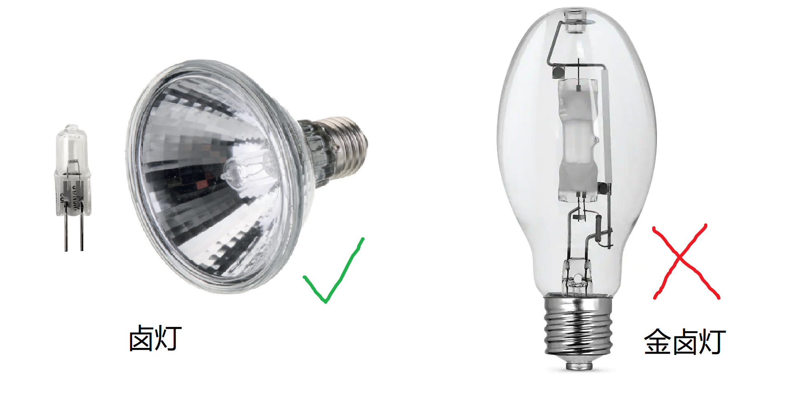

这种灯同时发出可见光和红外线，所以没法把可见光和红外光分别控制 III。也因为它有可见光，所以无法正常使用on/off型的温控器（即热了就完全关上、凉了就完全打开）直接控制，否则蛇和人都要闪瞎了。带可见光的灯调温有两种方案：

一是使用调光型温控器（dimming thermostat），其原理可能是使用triac削去部分交流电波形，使有效电压降低，削去的量受变阻器控制，进而根据温度经PID之类的控制逻辑控制该削去多少电压。（这种控制器在国外有卖，几百一个，但是国内似乎没找到）。II

二是使用正常的on/off型控制器，但使用额外的串联在控制器输出端的调光型开关使卤灯恰好不会出发控制器的关闭信号。如控制器设置36 °C，用调光器调整灯泡功率使得持续打开时温度也只有35 °C左右。温控器的作用使提供保护。好处是便宜，缺点是受环境温度影响，可能要在不同季节手动调整功率。II

卤灯的一个参数叫PAR，这里的PAR指的是Parabolic Aluminized Reflector lamp，其实就是把灯珠塞到一个反射的杯子里了（见上方的图）。所谓PAR38等等指的是杯口的直径是38/8 inch = 12 cm（这计量方法真变态。。。），PAR20就是6.5 cm，即纯粹是这杯子有多大。（<a href="https://www.youtube.com/watch?v=TqAVbP5ARVY">Griffiths, 2023</a>&nbsp;&nbsp;）III&nbsp;

注意PAR还有另一个相关缩写是Photosynthetically Active Radiation，不要只搜PAR灯给买错了（<a href="https://www.youtube.com/watch?v=TqAVbP5ARVY">Griffiths, 2023</a>&nbsp;&nbsp;）III&nbsp;

有的卤灯有棱镜，作用是使光束更舒展或更聚集，可以按需选择。（<a href="https://www.youtube.com/watch?v=TqAVbP5ARVY">Griffiths, 2023</a>&nbsp;&nbsp;）III&nbsp;

#### DHP

退而求其次是DHP，它和白炽灯泡的发光原理相同，只是它的灯丝温度只有一千摄氏度左右，基本不发出可见光（可以见到微弱的红光，在红外摄像头下很亮），它的红外波长分布结构也比较合理。加热的利用效率比较高III。

欧美市场经常在deep heat projector（DHP）上标注IRA/IRB，这其实是错误的，DHP发出的光中IRA很少。国内国内市场把deep heat projector称作远红外加热灯其实比欧美市场更合理，但是又反映出另一个误区，就是人们觉得“远红外加热”似乎比近红外、中红外效果更好，但其实是近、中红外有更重要的生理意义。

DHP不发出可见光，在这一点上算是相比卤灯/白炽灯的一个优势，一是不需要调光型温控器，二是可以在夜间使用。可以把DHP作为备份热源，设为夜间最低温度（如18度）作为备份，以防止冬季夜间室温过冷。

#### 陶瓷加热灯

陶瓷加热灯应该淘汰，它就是把一个灯泡周围包上陶瓷，憋热了来发出红外线，发出的红外光方向性差，浪费严重，很多热都被上升气流带走了，同时造成湿度降低。而且因为表面温度低，波长组成也不合理 III。

#### 加热垫

单独使用加热垫的效果差，如果要用，应该配合其他热源使用。

加热垫大部分只通过热传导提供温度，几乎不提供任何有生理作用的红外线。在室内基础温度特别低时可以用加热垫提升基础温度，然后再佐以其他光源，平时不需要用。平时的腹部热源可以通过在卤灯或DHP下放置岩板等深色物体模拟，用一个光源同时实现两种自然光源。

自然界的爬行动物有从腹部获得热量的习性（称为触温性动物，thigmothermy），晨昏动物、夜行动物从具有白天余温的物体上通过热传导和热辐射吸收热量。这被许多人用作使用加热垫作为热源的理论依据，但这个说法是偏颇的。 （<a href="https://www.youtube.com/watch?v=KOoAMsoFIcg">Sinclair, 2021</a>&nbsp;）III&nbsp;

在自然界中，温暖来自太阳（上方），而不是地面（下方）。事实上，爬行动物会逃到地下来躲避太阳并寻找凉爽，而不是温暖。因此，像热垫那样从下方提供温暖是不自然的，会促使动物产生不自然的行为。热灯通过模拟太阳的效果并加热空气和下方的地面来解决这个问题。

#### 卤灯/白炽灯灯下放岩板

只要在卤灯/白炽灯晒灯下面提供有一定储热能力的物体（如岩块或粗树枝），它自己就可以变成一个被动的热源，就可以用一个光源同时提供顶部辐照加热（白天）和腹部加热（关灯后的夜晚）。这也更接近自然界的情况，既有上方热源也有下方热源，并且。阳光消失后热并不会马上散去。一块厚重的岩板可以储热半个晚上以上。蛇会趴在岩块或者树枝上晒灯，同时接收上方和下方的热源。 Sinclair测试发现白天被热灯加热到27\~30摄氏度的岩板，在晚上9点关灯后，于凌晨四点还能维持20\~24摄氏度，早上开灯之前会降到接近室温的18摄氏度。（<a href="https://www.youtube.com/watch?v=nyD37t-KnCs">Sinclair, 2020</a>&nbsp;）III&nbsp;

相比于加热垫，有热灯和高处的攀爬晒点可以让你更多的在白天见到蛇 （<a href="https://www.youtube.com/watch?v=KOoAMsoFIcg">Sinclair, 2021</a>&nbsp;）III&nbsp;

#### 爬宠加热石

爬虫加热石英文商品名叫Heat rock，这是个很缺德的东西。就是一块石头一样的东西里面填上加热丝，使用时直接放在栖地里面。因为heat rock在栖地里会被爬宠折腾、被淋水后腐蚀等等原因，经常很不可靠，有时会加热失控。又因为爬宠可以直接接触热源，一旦失控可能导致烫伤。并且它的加热通常很不均匀，可加热的面积太小，热点又太热，从安全性和加热效果上都还不如加热垫。不要用。

#### 推荐的红外热源组合

使用卤灯/白炽灯作为主要加热热源提供IRA，晒点正下方提供岩板，岩板被加热后会释放IRC；增加一DHP作为备用，设置为夜间允许的最低温度，防止栖地过冷。（<a href="https://www.youtube.com/watch?v=nyD37t-KnCs">Sinclair, 2020</a>&nbsp;）III&nbsp;

### 栖地红外光源布置

注意加热灯座必须是陶瓷/金属的，不能是普通照明灯里塑料的。否则可能引发火灾 III。

热灯必须有额外的安全罩。不能把热灯装在箱子里面、把热灯直接扣在顶网上面也不安全。要做到蛇能碰到的所有地方你都能用手指头长时间的放着（不至于烫的受不了）才行 III。

一种安全的做法是用支架把热灯悬挂在顶网上方5 cm左右的地方
【】【图】【】

如果必须装在栖地里面（栖地上方空间不足）就必须选择**足够**安全的灯具罩。我发现网上黑色的这种声称是爬宠晒灯安全罩的产品根本没法用，黑色会吸收红外线，导致黑色金属网极其热 II。

注意隔离网的网眼大小和网格结构，隔离网的开门方式。比如有一种国内卖的灯罩有弹簧式易拆卸底网，这个弹簧不够强，蛇可能拱开弹簧钻进去（如下图一名Reddit网友的蛇钻到加热灯隔离网内（[原帖](https://www.reddit.com/r/snakes/comments/13x8dvd/woke_up_to_this_at_five_in_the_morning)）。蛇一般不会在灯热的时候往里钻，但是如果钻进去的时候是夜间，天亮了到定时时间一开热灯，你的蛇就熟了 III。

注意玻璃会吸收部分IRA，不应该将红外光源隔着玻璃照射（见[紫外吸收](#吸收)章节）：

更好的选择是订购这种304不锈钢材质的消毒框，这种材料反射红外，因而不会很热，可以让卖家焊四个耳朵，用螺丝拧到栖地上即可。
【】【注意隔离网到灯的距离】【】
【】【图】【】

加热垫不能放在栖地里，要在底面以外。【防水不可靠】

非安全电压的不要放在栖地内部（如加热垫），防止打翻水导致触电

### 温度的测量

本节部分参考：（<a href="https://www.youtube.com/watch?v=8Ln_BrS83FE">Sinclair, 2022</a>&nbsp;）III&nbsp;

栖地内的温度有多种数值，分别有其测量方法：

#### 物体表面温度

物体表面温度一般用红外测温枪测量。测温枪瞄准了按按钮就能立刻测出温度。红外测温枪的原理是假定被测物体在相应波段是黑体*，测量一个锥角内特定波段红外辐射的总能量（注意它只是量能器，不是光谱仪；许多中文资料瞎扯淡，说测温枪是根据红外光谱测出来的，哪儿来的100块钱就能买到的手持红外光谱仪？），将这个能量发射角密度去求解黑体辐射公式。越热的物体辐射功率密度越大。把辐射功率拟合到黑体辐射公式上就知道温度了。

根据以上原理你能知道：
* 【有外源红外线时不能用】“红外测温枪会受红外光干扰”，这听起来是句废话。但是确实很多人在远红外加热灯还开着的时候就拿着测温枪测温度；还有人栖地放在阳台窗户边上，大太阳光照着就拿枪测温度；显然都不靠谱。有外源红外线的时候一部分信号是物体本身热辐射发出的，一部分信号是反射红外灯的红外线的，这还测个毛？
* 【隔着对红外不透明的物体时不能用】：空气对红外几乎是透明的；但玻璃、亚克力都不是，所以隔着玻璃和亚克力测量目标物体时，目标物发射的红外信号有一部分被玻璃、亚克力阻挡；另有一部分信号是玻璃、亚克力本身发射的，因此结果不够可信。【】【实验？】【】
* 【不是黑体不能用】红外测温枪**不测量空气温度**，只能测物体表面温度。因为红外枪测的是**黑体**辐射，空气吸收能力太差，离“黑体”太远，空气的信号都淹没在空气后面的背景信号里了。一个有趣的实验是找个：气温很热 + 无云大晴天 + 大半夜的时候，拿红外枪对着天测一下，你会测到一个低的不合理的温度。比如我现在是七月份凌晨两点的北京，气温27度，但朝天测量时温枪示数是 -3 °C。这是因为从我手上一直到太空的空气层都几乎不发射黑体辐射，导致温度计测得的能量密度很低。

和气体一样，光滑的金属也不能用红外温枪测量，详见黑体辐射(#黑体辐射)一章的表格。

我们常说的晒点温度就是晒台的固体表面温度，不是晒台上方的空气温度。

物体表面温度也可以用数字温度探头测量，如加热垫温控器的温控探头，但要注意必须加强固体导热（至少要有充分的固体接触，有时用热导胶固着），否则测到的一部分是周围空气的温度。

#### 空气温度

空气温度用数字温度探头测量。其原理一般是测量热敏电阻的阻值。

和红外温度计相反，空气温度应该排除红外辐射的影响。气象测量里的百叶箱气温计测量有如下要求：

* 置于白色遮阳箱中避免阳光直射
* “百叶箱”保证空气流通
* 离地一定距离避免地温影响
* 减少温度探头与其他固体的接触
* 距离建筑物、树木一定距离（障碍物多高、就离它们高度两倍远的距离）

可以参照这个理想情况设置栖地的温度探头，比如：
* 市售的探头通常是黑色的，会吸红外线和可见光，导致测量结果偏高（在我的测试中视位置不同会高1\~4度，但这显然和光照环境有关系，别人不能直接参考）。尤其是开着热灯的时候。必须在遮荫的地方测量。
* 气温探头接触物体时会受到热传导影响。就不再是气温了。所以想测气温时最好把探头吊起来悬空。

温控探头应该放在受加热器影响最快的地方。加热灯的温控应该悬吊在加热灯下面，加热垫的温控应该吸在栖地底面之上、垫材之下。 II

【】【图】【】

不要使用表盘式模拟（非数字）温度计。不准、有胶

【】【表盘温度计图】【】

温控必须等待充分稳定才能走开，更换温控系统的任意部件后应该在蛇不在栖地时充分原位测试、等待其稳定后再将蛇放入。

注意调节加热灯本身的功率限制，使得温控不过于频繁的开关，即节约灯泡寿命，又防止温控失效导致过热。

### 适宜温度区间

玉米蛇的推荐饲养温度如下（<a href="https://www.ris.bka.gv.at/GeltendeFassung.wxe?Abfrage=Bundesnormen&Gesetzesnummer=20003860">德国动物饲养条例, 2022</a>&nbsp;&nbsp;）V&nbsp;：

* 白天 **24\~28 °C**
* 晒点 **35 °C**
* 夜晚 **18\~22 °C**（注意对幼蛇可适当提高。）
* 如果要冬眠，在 **8-15 ºC** 冬眠**2\~5个月**。

【】【晒点温度或许不是晒点附近的气温，可能是晒点地面的表面温度？】【】

下图是玉米蛇原生生境中的某个城市（Tallahassee, Florida）2022年每日最低/最高温度的周平均值（[Weather Underground](https://www.wunderground.com/history/monthly/us/fl/tallahassee/KTLH/date/2022-6)）。灰色部分是大致的冬眠期。从图中容易理解上述推荐温度。

下图是该城在玉米蛇分布统计上的位置表示（图钉位置是Tallahassee，分步频次统计于iNaturalist）

### 温控的种类

#### 减功率器

许多加热垫、加热灯座可以选装功率控制器。其原理是通过一个可变电阻和triac削去交流电的部分波形，改变了交流电电压。这样的控制器属于开环控制，没有测量反馈，单独使用很不可靠。 II

连续调整的功率控制器：

挡位式功率控制器：

#### 数字温控器

另一类控制器是带有温度探头的闭环控制器，在单独使用时比单一功率控制可靠的多。但也有失控的案例。

数字温控器分两种

一种是市面上常见的on/off型数字温控器，其原理很简单，达到某个温度就完全接通电源，低于某个温度就完全断开电源。

另一种是调光型温控器（dimming thermostat），其原理可能是使用triac削去部分交流电波形，使有效电压降低，削去的量受变阻器控制，进而根据温度经PID之类的控制逻辑控制该削去多少电压。对于发射可见光的电器，只能用这种温控器来控制（不然就要闪瞎了），同时即使是不能发射可见光的用电器，比如DHP，用调光型温控器也能延长使用寿命，避免了on/off型控制器不断地升温降温导致的器件疲劳。

国内卖调光型温控器的店家非常非常少，而且很多不是为爬宠卖的。目前我只找到一个，是徐州睿德电器的DTC-130（绝无广告关系，列在这里只是因为确实找了很长时间才找到）.

注意温控器和功率限制器的瓦数限制，不要过载。

### 温控故障

所有的单一控制系统都不够可靠，有无数悲惨案例因为加热系统的温控失效导致蛇被活活烤死。

常见的加热失控的原因有：
* 【控制器故障】比如可变电阻原件突然短路/断路，开关型温度计的继电器被电火花焊死在接通状态，
* 【机械问题】比如温度探头脱落，吸盘型探头位置移动（有时能被蛇顶走），臂式悬吊的加热灯松动、导致直接搭在箱网上面。
* 【加热电路】比如加热垫中相邻线路短路，导致等效电阻变低、功率变大。

增加可靠性的措施：
* 【控制器冗余】每个加热电器必须受到至少两个控制器的控制。最廉价的方法是购买一个数字温控器+一个带功率控制的热源。在不用温控器的前提下调节热源功率使其即使长通也不会太热（不能在栖地里有蛇时做此实验）。然后再单独设置温控器。这样二者坏掉任何一个都不会导致过热。
* 【热容/梯度冗余】大栖地、厚垫材本身就是一种冗余。如果把蛇养在抽屉里，温控失效时蛇无处可逃；如果栖地有一米长，热区通常在栖地的一侧，与冷区还有相当的距离，此时蛇会自己爬到温度更适宜的边角上。如果用报纸做垫材，加热垫一失效地面温度飞涨，蛇还没反应过来就快要烫伤了；但如果有几厘米厚的垫材，把垫材烤热需要好一会儿，让蛇有机会跑掉。
* 【机械冗余】加热灯、加热灯罩、温度探头的机械固定都应该有一定冗余。例如用螺丝拧好之后再绑个尼龙扎带。
* 【加热系统冗余】如果屋里会非常寒冷，应该配备两套加热装置。比如用一个加热灯和一个加热垫既能保证一套坏掉的时候还有暖和的地方，也可以在平时让蛇选择它喜欢的加热方式。

### 停电时的加热
见[应急预案-停电](#停电)章节

## 光热一致性和时空梯度

自然界就一个太阳，光和热几乎总是在同一个地方出现的，所以有可见光的地方就有UVB和IRA。我们尚不完全清楚动物调节光照的感受器情况，但是保证光热一致性一定是更正确的选择。如果相反，很亮的地方不热，有紫外的地方不亮，动物可能经过一定时间之后或许也能学习到这个规律，但是这很反直觉，没必要这样折腾动物。（<a href="https://www.youtube.com/watch?v=TqAVbP5ARVY">Griffiths, 2023</a>&nbsp;&nbsp;）III&nbsp;

光照应该有阴影区（或者暗区），应该有梯度、有遮挡。提供的选择越丰富越不容易出错。

例如下图是Liam Sinclair的王蛇栖地（<a href="https://www.reptileforums.co.uk/threads/animal-welfare-science-reptiles.1294146/#post-13412752">Sinclair, 2021</a>&nbsp;&nbsp;），它通过布置光源的位置和遮蔽物提供了十分丰富的、交错的、有梯度的微环境。在IRA和UVB灯下放置了木头，让动物可以选择更高照度的环境，向角落移动时光线强度逐渐衰减。灯下方有热区躲避，使得动物可以选择不接受日温性加热，转而接受岩板和躲避被晒热后提供的触温性加热。

### 季节变化

光照的变化是蛇感知季节变化的方式之一（除温度/冬眠之外），所以正确的提供每日光照时间的变化可能有助于调整激素水平，进而有助于繁殖。（<a href="https://reptifiles.com/corn-snake-care-guide/corn-snake-temperatures-humidity/">Reptifiles, Year?</a>&nbsp;）III&nbsp;

# 湿度

玉米蛇的推荐湿度 60%\~90%，始终保持1/4左右的垫材潮湿。（<a href="https://www.ris.bka.gv.at/GeltendeFassung.wxe?Abfrage=Bundesnormen&Gesetzesnummer=20003860">德国动物饲养条例, 2022</a>&nbsp;&nbsp;）V&nbsp;

Reptifiles推荐相对湿度 65\~75%。（<a href="https://reptifiles.com/corn-snake-care-guide/corn-snake-temperatures-humidity/">Reptifiles, Year?</a>&nbsp;）III&nbsp;

有些较旧的指南指出湿度应该控制在60%以下，并认为超过60%会导致scale rot，但这一结论与自然条件不符。下图是玉米蛇原生生境中的某个城市（Tallahassee, Florida）2022年每日最低/最高湿度的周平均值（[Weather Underground](https://www.wunderground.com/history/monthly/us/fl/tallahassee/KTLH/date/2022-6)），可见自然生境中每日**最低值**就是40\~60%，最高值可超过90%。因此更新的指南中大多给出了超过60%的湿度要求。

（个人观点→）注意自然生境的60-90%不是某一温度下的60\~90%，空气中的水分绝对含量不变时，温度越高、相对湿度越低。所以如果某日的湿度最低值是60%、最高值是90%，很可能是中午60%、晚上90%。所以虽然有60-90%这个区间，在栖地设计时，如果开着晒灯还有80%，那还是太湿；晚上18度的时候还只有60%，很可能还是太干。

为了维持合适湿度，应该用保湿性较强的垫材和辅助保湿的地面丰荣物，III见[垫材](#垫材)章节。

可能需要靠喷雾提高湿度，视室内自然湿度不同可能要两天一次、一天一次甚至一天两次。III

建议买一个几十块钱的电动浇花泵，不然手捏非常累。II

每次用完水泵后应该排空管路中和泵中的剩水。II

不建议用雾化器，原因有I：
* 短期内湿度太高
* 维持时间太短
* 不是蒸馏水时充分雾化的矿物质是一种空气污染物（悬浮无机盐粒子），不但让所有玻璃表面都凝结一层盐，还可能造成肺炎。

建议每周用F10SC兽医消毒剂清洁一次水泵。III

提供一个湿躲避。有两种方案，一个是用一个塑料盒，留一个小孔，垫上吸湿物（如厨房纸或者苔藓）然后喷水；III 另一种是购买带有陶瓷渗水盆的躲避，往陶瓷盆里加水，能维持一两天都是潮湿的。III 后者还有一个好处是可以同时充当水碗，我的玉米蛇似乎很喜欢从“屋顶”喝水。II

苔藓在持续潮湿环境下很容易发霉（长出白毛并结块），一定注意定期更换苔藓，否则可能导致肺炎。

为您的蛇提供一个湿润的藏身处也是一个好主意。只需在藏身盒/洞穴内铺上湿润的泡沫苔藓，并定期更换苔藓以防止霉菌积累。

## 湿度的测量

个人使用ESP32和5个SHT20传感器做湿度测量。II 也可以买现成的电子湿度计。不要用指针式机械湿度计。III

要注意湿度的测量结果与湿度传感器的摆放位置有很大关系。躲避中（不只是湿躲避）测湿度几乎总是接近100%，直接放在垫材上测试会远远高估湿度，放在通风口或晒区又会大大低估湿度。建议在离开地面10\~20 cm处测量湿度更具代表性。II

## 湿度过高

## 湿度过低

可能导致蜕皮困难，体现为蛇蜕不是完整的一条，中间断裂，部分蛇蜕留在身上（卡皮，stuck shed）。尤其要注意蛇尾巴尖和蛇的眼鳞是否卡皮。并且蜕皮后的新皮发皱。长期湿度过低可能导致便秘，对小蛇致命。（<a href="https://www.bilibili.com/video/BV1564y1276y">冬青-Cyan, 2021</a>&nbsp;）III&nbsp;

下图是太干的紫晶蟒导致卡皮和新皮发皱（<a href="https://www.bilibili.com/video/BV1564y1276y">冬青-Cyan, 2021</a>&nbsp;）III&nbsp;：

湿度过低可能导致蛇的泡澡行为，（但是from reddit蛇泡澡并不一定是湿度有问题？)。

解决：增加遮蔽物以增加阴影区、更换锁水能力更好的垫材

湿躲避

# 垫材

树皮垫材长期潮湿时会发霉，下图中上方是新的杉树树皮、下方是在潮湿土壤上放置数周后的杉树树皮显微图像，可见疑似霉菌菌丝生长。II

类似的，插到潮湿土壤中的松果也会发霉，长期杵在土里的树枝也发霉。

下面是椰土和苔藓的显微照片：

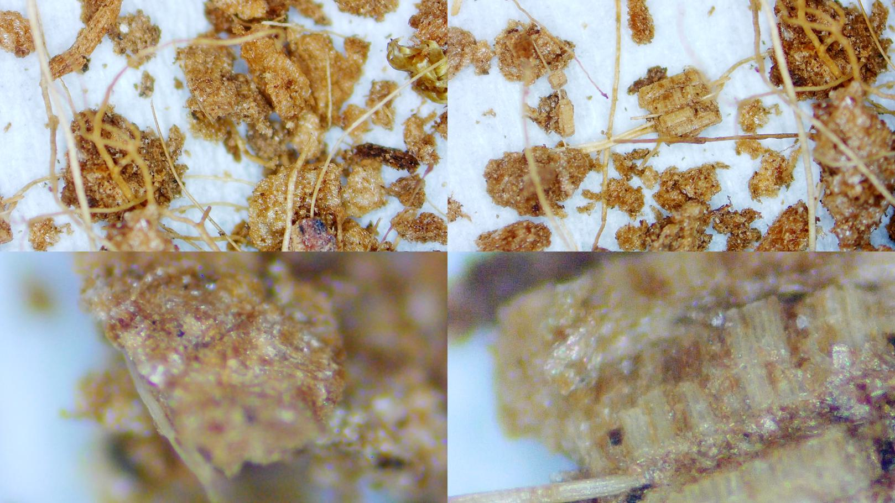

选择垫材要考虑几个需求：V
* 提供支撑
* 提供挖掘行为丰荣
* 控制并选择微生物
* 热量
* 维持湿度

垫材厚度应该有8 cm以上。因为垫材的几种作用都需要足够厚才行：III
* 容易保湿，表层土壤干燥后底层土壤还能保湿很长时间
* 玉米蛇非常喜欢挖洞（找老鼠窝的自然行为），足够厚的垫材才能满足挖掘需求，否则有时能看到顶底板、顶躲避角的刻板行为。
* 有一定崎岖度的垫材可以让玉米蛇延“凹槽”爬行，分散、减轻腹部压力。
* 作为攀爬跌落缓冲

下图展示了蛇沿崎岖地面上的缝隙爬行以分散腹部压力的自然行为

玉米蛇挖土很常见，应该列为蛇的基本需求：

聚氨酯毛的咩咩的视频

https://www.bilibili.com/video/BV1XV411T7Xb?spm_id_from=333.880.my_history.page.click

垫材材料的选择（注意这里只提长期饲养选择，不考虑诸如隔离、冬眠、孵化等特殊情况）：

德国动物饲养条例建议：Peat, peat-sand mixture, earth。 （<a href="https://www.ris.bka.gv.at/GeltendeFassung.wxe?Abfrage=Bundesnormen&Gesetzesnummer=20003860">德国动物饲养条例, 2022</a>&nbsp;&nbsp;）V&nbsp;

Reptifile 建议：

建议：

* 自己混合：40%有机表层土 + 40% Zoo Med ReptiSoil（成分是腐殖质+泥炭藓+沙） + 20% 沙。III
* 椰土：便宜且保湿性好。最好保持湿润（否则起尘）。III

一般的：

* Lugarti Natural Reptile Bedding（泥炭藓，细沙，粘土）：保湿性好，但是不够亲水。III
* Zoo Med ReptiSoil（腐殖质+泥炭藓+沙）：保湿好，吸味，但是湿了会活泥，用长了会变得不疏松。III

这些垫材很垃圾别用：
* 爬宠毯：合成纤维垫子，可以扔洗衣机洗后消毒（高温或消毒剂）重复使用。价格低。但是很容易滋生细菌，不自然、经常是绿色的很丑、并且无法满足挖掘需求。III
* 厨房纸：吸水、一次性、便宜。有人觉得这样容易清理粪便，但其实没有方便到哪儿去。一是因为满足不了挖掘需求，玉米蛇经常会钻到纸下面去，或者对着没有纸的犄角旮旯拉屎，并没有起到清洁作用；二是清洁的时候得整张换新，方便程度还不如造景缸中将周围一块土都以下铲走（类比猫拉屎时你选择让它拉在地板上、还是拉在猫砂里？）。III
* 白杨木屑：有很多人用，但其实很垃圾。保湿性能差，很干；如果维持在合适湿度下又很容易发霉。III
* 松木屑：除了上面的缺点，还多了一个木头中含很多挥发性有机污染物（VOC，你闻到的木香就是这污染物的气味）。可以通过特高温烘干的方法除去这些VOC，即使出去了也还有不亲水、易发霉的缺点。III
* 木片、树皮：有误食问题。III
* 砾石：粗糙导致划伤。III

【】【下面是机翻未整理】【】
为了获得最佳效果，在顶部撒一层清洁的落叶！III

在基质的顶部提供一层干净，无化学物质的落叶。落叶非常适合保持湿度，并且还可以让您的蛇有所探索。

秋叶是增强玉米蛇的观赏性的好方法，提供了新的感官体验。它们可以闻到，滑过，甚至在叶子中挖洞，而且最好的是——这些叶子是免费的！只需确保它们来自干净，干燥，没有接触过化学物质的地方，然后在您的烤箱中以200°F/100°C的温度烘烤1小时以杀死微生物。

土壤湿度的控制

The playsand is rounded, very smooth and not sharp, so it has less of an impact internally.

（<a href="https://www.youtube.com/watch?v=6yOISQ5sQtQ">Sinclair, 2022</a>&nbsp;）III&nbsp;

许多蛇有挖掘需求（包括玉米蛇），所以应当采用可挖掘的垫材，最好至少有几英寸泥土垫材、上面盖有落叶。

即使买不起较贵的垫材，只要控制好湿度，就算是木屑也可以维持挖掘形状，也比用卫生纸、报纸或者宠物尿垫好。

【】【（<a href="https://www.youtube.com/watch?v=TZm99xc2Fpg">Sinclair, 2021</a>&nbsp;）III&nbsp;】【】

不应该以垫材本身像不像自然环境来评价垫材，应该用蛇是否能表现出物种自然行为来评价。

Lignocel（某种品牌的木屑）每公斤几块钱，而且密度很低，所以铺的很厚也没有经济负担。木屑在被挖掘后可以保持形状（只要湿度合理），可以促进蛇展现挖掘的自然行为，并且挖好的隧道可以复用，进一步对挖掘给予鼓励。但是，蛇有挖掘需求的一个原因是希望在土下找到湿润的微气候区域（microclimate），而木屑吸湿性很强，所以木屑里挖出的洞穴缺乏这个作用。

清洁上木屑非常容易，可以吸收粪便和尿酸，能容易的把沾污的区域抓起来扔掉。然后补一把干净的就可以了。

爬宠木屑从爬宠用品店购买，所以可能携带有爬宠病原体。因此应该对垫材采取“隔离”措施，比如提前买一大袋，存放一两个月、等爬宠病原体（如寄生虫）死绝了再用。因为类似商品一般都是大包装的，所以其实不难。

木屑会发霉，不能泡水，因此相比topsoil有劣势

和top soil相比，木屑很容易搞大扫除。Top soil很难把角落里都搞干净（笔者注：有吸尘器就行），木屑不会卡在角落里，所以很容易把所有的旧垫材都大嫂出来。

木屑不会聚成团，所以容易搞得栖地周围一团糟，一把木屑没抓住掉地上就和发射了彩条纸一样到处都是，有地毯的人士没法用。

另一种垫材是80%的top soil混合20%的play sand，价格便宜，而且有个优势是不用从爬宠用品店购买，几乎没有携带爬行动物病原体的可能，在这点上相比爬宠木屑有优势。

这样的混合垫材还可以调整比例适应不同物种，要湿就增加top soil的比例。

这类垫材可以完全浸湿而没有不良后果（不像木屑会发霉），所以可以选择每周彻底喷湿一次（模仿间歇性降雨），如果垫材够厚，彻底淋湿过后表层土几天内干燥，底层土可以保持湿润很长时间，蛇可以选择通过挖掘行为选择不同的微气候

topsoil和play sand的混合物垫材在大扫除换垫材的时候工作量较大（相比木屑来说），一是要达到固定的厚度比较重，二是因为其含有植质，而许多消毒剂会受到有机物影响而失效，所以必须彻底将垫材去除后才能消毒。

另外此类垫材在比较干的时候会爆尘，导致玻璃有时看起来比较脏，需要用湿纸巾擦拭。湿润的时候会粘在其他东西下面（比如水盆底下），增加情节的工作量（笔者注，其实只要是光滑底面，水一冲就没了）；可以选择找块石片垫着，石头一直在栖地里，水盆放在石片上面，就可以避免这个问题。

topsoil和play sand的丢弃在有的地方成问题，有的垃圾站不收大量的土。有时不得不找后院化院之类的地方倒掉储存。

Bioactive的栖地，即通过垫材的选择+特定的昆虫使得昆虫把蛇的排泄物吃掉，然后植物可以消耗昆虫的屎，完成氮循环。

好处是几乎不用做清洁工作，几个月也看不见一次屎。好几个月也不用换垫材。

Bioactive有很多细节要注意才能循环起来，不建议新手用。

Bioactive的昆虫主要包括isopod和springtail，milliped，beetles

缺点是换水的时候水碗地下不仅有土，还沾着昆虫，而且你还想要这些昆虫，就得把它们清理下去。

还有问题是昆虫可能会打扰蛇。比如Sinclair观察到他的bioactive的栖地里的王蛇晒太阳时会一次一次的拿身体“弹走”爬过来的milliped和beetles，最后直接不晒太阳了走人。这体现出王蛇觉得爬过来的milliped和beetles很恼火，干扰了晒灯的物种特定行为，因此对动物福利有负面影响。不过Sinclair没有见到过isopods和springtails造成类似问题。

Bioactive的维护几乎不要钱，但建立比较费钱，Sinclair在英国花了两三百人民币才建起来。

（<a href="https://www.youtube.com/watch?v=oewVMnMBpL4">Sinclair, 2021</a>&nbsp;）III&nbsp;

关于松木（pine）的木屑对爬虫是否有毒的问题，有些群体里在说松木木屑有毒，但很多人用松木木屑养动物，似乎并没有问题。这可能是因为松木木屑在制作时一般需要烘干，烘干时酚类物质会分解蒸发，烘干后一般就不构成健康威胁。所以更应该警惕的是未经高温处理的木材，比如松木树枝攀爬物，此时可能就不如软木树皮好用安全。

## 垫材的消毒

有时这些昆虫会开始在蛇的栖地中大量繁殖，某一天你一翻土、可能发现土下面全是密密麻麻的某种昆虫的白色幼虫在动（如下图是笔者遇到的某种虫，用蒸煮法消毒垫材后约2个月又会重新长回来。。。），虽然绝大多数情况下对蛇没有影响，但非常膈应，这也是要定期消毒/更换垫材和丰荣物的原因

## 垫材的购买

尽量从与爬宠无关的渠道购买垫材。

# 攀爬、遮挡与躲避

【】【好的、复杂的遮挡本身就可能成为躲避，见20230803照片】【】

复杂空间和躲避可以满足蛇的趋触性，就像有些人冬天盖着厚被子容易睡着，夏天的气温适合不盖被子，但是失去了沉重被子的触觉，即使温度合适也睡不着，把空调开冷了盖被子睡更舒服。这就是一种对人体的趋触性。动物也一样，进化使得被捕食者在休息时有躲藏欲望，其生理实现就是让动物在更大比例的身体接触墙壁、地面时感到舒适。

如果缺乏复杂的环境或合适的躲避空间，动物满足趋触性的唯一方法就是接触自己，对人来说是抱着膝盖蹲坐在地上、头埋在两腿中间，对蛇来说是盘成特别紧的一团（一盘）；最外圈贴不到自己，就挤在后墙角，贴墙。

## 树枝的布置

【】【（<a href="https://www.youtube.com/watch?v=uW7yBpxTt28">Sinclair, 2023</a>&nbsp;）III&nbsp;】【】

一部分树枝可以直接用螺丝固定，

但也可以使用吊钩固定木头，让木头不是固着不不动的，活动的木头可以在攀爬时轻微摇晃，增加攀爬难度。提供更好的丰荣效果。自然界的树枝也不是结结实实一动不动的。同时这样可以很容易的把树枝取下来消毒。

## “我的蛇天天在躲避里睡觉，看不着”

【】【】【】

玉米蛇是地栖和半树栖物种，提供攀爬物是很好的丰荣措施。可以增加玉米蛇的运动量，充分利用垂直空间，满足玉米蛇的舒展需求，

【】【】【】

食物丰荣的scent trail方法（在食物一节说了）

## 防止跌伤

之前解释栖地够高的时候，蛇拔高顶墙时难以用力，可以避免顶坏吻部。那么增加攀爬物是否会让蛇借力攀爬物继续用力顶天花板？答案是不会，因为蛇的需求并不是要尽可能的高，而是要伸展身体。增加攀爬物也不会让蛇继续往高顶，而是会让蛇在纵向伸展身体时更省力。满足了伸展身体的需求也就不会反复向上顶。（<a href="https://www.bilibili.com/video/BV16y4y1g7kW">冬青-Cyan, 2021</a>&nbsp;）III&nbsp;

## 可攀爬的背景板

## 壁上岩石方案

缸体壁上的泡沫仿真岩石

## 防止跌落砸伤

## 粗糙材质帮助蜕皮

吊床做晒点

吊床，注意吊床的温度问题。吊床应该是晒点，干燥炎热。若使用加热垫而不是加热灯可能有问题。

动物园文章表明吊床可以增加看到它的几率

因为针织物的孔洞大小可以刚好适合玉米蛇。

针织袋子

吊床

动物园论文加吊床

同时应该提供阴影区使蛇可以选择不同强度的UVB区域

遮蔽，阴影
躲避，正常的躲避，用物体剩余空间产生的躲避，有重量被压住的躲避
毛线袋：躲避，晒点，隔离近地湿度大的区域，锻炼身体，

喜欢身体贴着墙的感觉（要有这样的空间可供选择，不是直接把栖地搞成这样。你觉得躺着舒服，不代表人应该住在棺材里。）

爬行动物只有足够信任自己的躲避区域，才会在活动时间当着你的面出来活动。在饲养初期没事不要掀躲避，过几个月再玩。（<a href="https://www.bilibili.com/video/BV1oR4y147p8">冬青-Cyan, 2021</a>&nbsp;）III&nbsp;

毛线袋

遮挡视线

雌性蛇需要一个下蛋的躲避

玉米蛇至少需要三个躲避，一个热区，一个冷区，一个湿躲避。III

植物

（从蛇的角度看）栖地里的植物丰荣物可以说有多少放多少，不会嫌多。植物同时充当了视觉隔障、攀爬物和红外/紫外的阴影区。

植物有真假两种。在蛇的栖地里种活真的植物非常困难，因为蛇很喜欢挖土，植物还没扎好根早就被蛇翻了。Reptiles and research有一个如何把草种活的视频

---
【】【未翻译】【】
https://www.youtube.com/watch?v=4HGZZHoG3co
How I Grew Grass in a Bioactive Snake Enclosure

Role: assistant
So, how do we get a vivarium to grow like this? Well, I think I've managed it. Let me show you. We're back in the room with Charlie. I've turned on these lights because I thought it might be too dark. Now I'm thinking I might be a bit overexposed, but we'll roll with it. Let's look at Charlie's vivarium. It's a three by two by two enclosure with grass on the floor and a kitchen board meant to resemble nature. Charlie is up on his custom-made habitat, a Universal Rock sent by a customer. Charlie is a typical Cali king. He's going to come flying forward as soon as I try to open this door, so let's see how this goes. I do have a mouse to offer him to keep him occupied, but we shall see how this goes. 

那么，我们如何让爬箱像这样生长呢？我想我已经做到了。让我给你展示一下。我们回到了房间，和Charlie在一起。我打开了这些灯，因为我担心可能会太暗。现在我在想我可能有点过曝，但我们会随之而变。来看看Charlie的爬箱。这是一个三乘二乘二的爬箱，地板上有草，还有一个厨房板，意在模仿自然。Charlie在他的定制栖息地上，这是一个由客户送来的通用岩石。Charlie是一个典型的加州国王。他会在我试图打开这个门的时候立刻向前飞，所以让我们看看这会怎么样。我有一只老鼠可以给他，以保持他的占领，但我们将看看这会怎么样。

Next, let's talk about the vivarium. I mixed a bag of potting mix, not topsoil, with a bag of Leo life. I mixed it thoroughly and spread it in the enclosure, put all my equipment in, and my water bowls. I wanted it to grow up and around all the sticks so it looked really grown in. You can see here where I've planted some more stones. I used a big bag of lawn seeds repair kit and sewed it in there, as well as watercress which is growing really well. I heavily sprayed it for the next few days to water it. I took a sprig of mint from the garden, which is growing really well, and used a log at the back to wedge it under another ledge so that he couldn't dig it out. The Cali king is really inquisitive, so when he wants to investigate something, he'll root around the new thing. I didn't want him to dig it up. 

接下来，我们来谈谈爬箱。我混合了一袋种植土，而不是表土，和一袋Leo life。我把它混合均匀，铺在爬箱里，放进所有的设备和我的水碗。我希望它能在所有的棍子上下生长，让它看起来真的长了进来。你可以在这里看到我种了一些更多的石头。我用了一大袋草坪种子修复包，把它缝在那里，还有水瓜，它们长得非常好。接下来的几天我大量喷水。我从花园里取了一根薄荷，它长得很好，我用后面的一根木头把它楔在另一个岩石下，这样他就挖不出来。加州国王非常好奇，所以当他想去调查一些东西的时候，他会在新的东西周围挖根。我不希望他把它挖出来。

I believe the biggest success for why this works is the fact that there are numerous LEDs. Up top, it's a screen top so I'm also using this as a bit of a storage area. I've got two jungle Dawns up here, linked up. I've had to add more visible light to make sure that the grass can grow. The grass really needs this high amount of visible light otherwise it won't grow very far. I think a lot of the time that I've failed in the past with grass, it's because I've tried to do it in a vivarium with a screen top where the heat gathers and the ambient air temperature rises. I think it's just too warm of an ambient air temperature for the grass to survive. In this vivarium, the screen top releases all the excess hot air and it comes up and goes, allowing all of this growth to look plentiful and healthy. I think it looks fantastic. I love the way it's growing up and around the board. 

我认为这个方法成功的最大原因是有许多LED灯。上面是一个屏幕顶，所以我也把它当作一个存储区。我在这里有两个丛林黎明，连在一起。我不得不增加更多的可见光，以确保草能够生长。草真的需要这么高的可见光，否则它不会长得很远。我认为我过去在草地上失败的很多时候，是因为我试图在一个有屏幕顶的爬箱中做这个，热量聚集，环境气温升高。我认为环境气温对草的生存来说太暖和了。在这个爬箱中，屏幕顶部释放出所有多余的热气，它上升并消失，使所有的生长看起来丰富和健康。我认为它看起来很棒。我喜欢它在板子上下生长的方式。

I'm hoping over time that this board looks really weathered and rotting so it looks like a board that's been left out. That's what I was going for with this sort of California Coastal herping area archetype. I have got some aloe vera growing there as well, so hopefully that grows really well and then we'll have a nice ecosystem growing in it. This plant at the back is a curry plant but it died. I've still put it in there because I think even if it dies it still looks good. But what I'm hoping for is that even though all this grass might die, this mint is going to take off. I think it's going to be the saving grace for this entire setup. 

我希望随着时间的推移，这块板子看起来真的很破旧和腐烂，就像一块被遗弃的板子。这就是我想要的加利福尼亚沿海区域原型。我也有一些芦荟在那里生长，所以希望它能长得非常好，然后我们将有一个很好的生态系统在里面生长。后面的这株植物是咖喱植物，但它死了。我还是把它放在那里，因为我认为即使它死了，它看起来还是很好。但我希望的是，即使所有的草都可能死掉，这个薄荷会蓬勃发展。我认为它将会是这整个设置的救赎。

The really cool thing about this as well is the watercress. This shot up and the sprouts were showing overnight. Even if it constantly dies, it's like 79 pence a packet of watercress seeds so I'm just going to keep re-sewing just to keep the look. It doesn't matter to me and I think I've shown now that I can keep it alive for weeks at a time. I'm just going to keep re-sewing, it doesn't matter. That's what I've done with the grass. The lawn seed is just doff fast acting lawn seed, the first thing I grabbed from the range. I'm pretty sure that anything you use would work as well. 

这个也很酷的一点是水瓜。这个一夜之间就长出了芽。即使它不断死亡，它就像79便士一包的水瓜种子，所以我只是会不断的重新播种，只是为了保持这个样子。这对我来说无所谓，我想我现在已经证明了我可以让它活几个星期。我只是会继续播种，这无所谓。这就是我对草的处理方式。草籽就是doff快速作用的草籽，是我从范围内抓到的第一样东西。我很确定你使用的任何东西都会起作用。

Role: assistant
First, let's examine the lawn seed, which is the first thing I grabbed from the range. In all honesty, it's doff fast-acting lawn seed, and I'm pretty sure that any seed would work as long as you meet the right conditions to prevent it from overheating and dying. This seed is meant to be sowed directly, and you just scatter it about. The combination of effects here is because the air releases upwards and out, providing a lot of ventilation to release excess heat. Additionally, there's a lot of lighting on top, so you have to ensure that the plants receive plenty of visible light to grow. That's the difference I think it's made.

首先，我们来看看草籽，这是我从产品系列中随手抓起的第一样东西。说实话，它是doff快速发芽的草籽，我非常确定只要你为它创造正确的环境条件，防止它过热和死亡，任何种子都可以有效地生长。这种草籽需要直接播种，你只需随意撒播。这里的效果组合是因为空气向上并向外释放，提供了大量的通风以释放多余的热量。另外，顶部有很多照明，所以你必须确保植物接收到充足的可见光以促使其生长。我认为这就是它产生的差异。

The way I've sown it is to shake some seeds out of the box and onto the floor, then I repeatedly spray it with a heavy pressured sprayer, making sure I keep it moist until it sprouts. As the grass matures, I'll reduce the amount of spraying to let the surface dry out again. Hopefully, the roots of the grass will remain humid, but the top will dry out as it matures and strengthens. Then, I'll start to spray less because it's not so delicate. In my opinion, all of this is just trial and error. I'm no expert on growing grass or anything like that. I've just scattered it and sprayed it, hopefully creating a nutritious soil using a potting mix made for growing plants, as well as using the Leo life for that clay texture, which hopefully adds to the drainage.

我播种的方式是把一些种子从盒子里摇出来撒在地上，然后我用高压喷雾器反复喷洒，确保我保持它的湿润直到它发芽。随着草的成熟，我将减少喷洒的量，让表面再次干燥。希望草的根部将保持湿润，但顶部将随着它的成熟和强壮而干燥。然后，我会开始减少喷洒，因为它不再那么娇嫩。在我看来，这一切都只是试错过程。我并不是种植草或其他任何事情的专家。我只是撒播和喷洒，希望使用专门用于种植植物的种植混合土壤，以及使用Leo life来增加粘土质地，这希望能增加排水性。

What's really nice for the animal, in this case, Charlie, is that when the clay is moist, it goes soft and allows for easy digging. There's the start of a burrow down there, dug out under this board. Over time, the soil dries out again and the clay hardens, which means it holds its burrow completely. I've seen him reusing these same burrows because they're holding structure. More often than not, he's choosing not to use it for whatever reason. He's always sitting around up top, either cruising around and licking everything and sniffing everything, or sits up top basking as he is now.

对于动物来说，这里的动物是查理，当粘土湿润时，它会变得柔软，方便挖掘。下面有一个洞穴的开始，挖出来在这个板子下面。随着时间的推移，土壤再次干燥，粘土硬化，这意味着它完全保持了洞穴的形状。我看见他一次次地重复使用这些同样的洞穴，因为它们保持了结构。他更多的时候选择不去使用它，无论什么原因。他总是在顶部周围坐着，要么四处逛逛，舔舐一切，嗅嗅一切，要么像现在一样在顶部晒太阳。

For anyone who thinks that they don't need UV or shouldn't have UV or they won't even want UV, look at him. He's got all these areas down here to be in the shade at the back and in the corner or even under this board, yet he's choosing to be out under lights, specifically under this one T5 kit. He's choosing to bask for UV for whatever reason. I think this is really cool. As the setup matures even further, I'm going to introduce a blue death feigning beetle and some giant orange isopods. But for now, I think it's in a really sweet spot and it looks really nice.

对于那些认为他们不需要紫外线，或者不应该有紫外线，或者甚至不想要紫外线的人，看看他。他在这里有所有这些阴影区域，可以在后面，在角落，甚至在这个板子下面，然而，他选择在灯光下出来，特别是在这一个T5套件下。无论什么原因，他选择晒紫外线。我认为这非常酷。随着设备进一步成熟，我将引入一种蓝色昆虫和一些巨大的橙色等足虫。但是现在，我认为它处于一个非常好的位置，看起来非常漂亮。

Many people have asked about how I managed to grow the grass. I hope this inspires some of you to give it a try. If it doesn't work, it doesn't work. But if you combine this with the watercress, you can keep re-sowing because even if it dies, it will keep growing back. And it's cheap. So just keep doing it. Even if it's not a bioactive setup, and you just want a nice grass look, if it keeps dying, just re-sow it. It will maintain those fresh shoots. Who cares if it dies? 

许多人问我是如何成功种植草的。我希望这能激励你们中的一些人去尝试。如果不行，那就不行。但是如果你将这个与西洋菜结合，你可以不断地重新播种，因为即使它死了，它还会继续生长。而且它很便宜。所以就继续做。即使它不是一个生物活性的设置，你只是想要一个漂亮的草地，如果它不断死亡，只要重新播种。它将保持那些新鲜的嫩芽。谁在乎它是否死亡呢？

That's all I have for you. I plan to make more videos on these other setups, like the one behind me here. I've built this whole swinging climbing structure that's been complete for a while now, and I think it's finally time to show you guys how I did it. I also plan to go through the bearded dragon's advanced lighting and his setup. So, all the things I've been holding off on, we're going to start filming everything, and I'm going to start showing you it all. Thanks for watching, and I'll see you in the next video.

这就是我为你们准备的所有内容。我计划制作更多关于这些其他设置的视频，比如我身后的这个。我已经建造了这个整个的摇摆攀爬结构，现在已经完成了一段时间，我认为现在是时候向你们展示我是如何做到的了。我也计划详细介绍鬃狮蜥的高级照明和他的设置。所以，我一直搁置的所有事情，我们将开始拍摄一切，我将开始向你们展示所有的一切。感谢你们的观看，我们下个视频再见。
Process finished with exit code 0

---

如果你选择使用真实的植物，你需要在你计划使用它们的两周前购买它们，以便清除任何化肥和农药：
从盆子中取出植物，用凉水冲洗掉根球上的多余土壤，洗涤叶子，用有机表土重新种植，让它们静置两周以消散任何剩余的化学物质，这些可以种植在基质中，或者放在重的陶瓷盆中。真实植物自然会增加环境湿度，如果养了真实植物需要注意减少喷水量。

假植相比真的植物有几个优势：
* 不怕死
* 容易清洁消毒（可以拿出来水冲，可以高温蒸汽消毒，可以上消毒剂）
* 耐爬、耐拱

要注意假植的材质有时不合格，尤其在被红外灯烤的时候会释放塑化剂、染料等物质。如果没有可信来源，可以选用可靠品牌的爬宠专用假植。

假植内部通常有铁丝塑形，要经常看一看有没有（即将）断裂，断裂后可能裸露出铁丝导致严重外伤。

# 水

biofilm问题

水除氯剂Reptisafe

-------
水盆应该够大，栖地里至少应该有一个水盆可以让蛇泡进去，满足泡澡需求。（泡澡是特殊行为，有时表示栖地内有问题，但有时也是正常的，见[这一章节](#疑似病态行为)）

不要用透明水盆（如玻璃碗、透明塑料碗）。蛇处理不了透明的概念，看到透明的东西就觉得前面可以走，所在盆里喝完了水就从水下直接往前顶，顶到“结界”又出不去，就转着圈在水下顶，得等到偶尔抬头才能从碗延出去，对蛇造成压力（比如这个[Reddit视频](https://www.reddit.com/r/cornsnakes/comments/t6lnan/what_the_hell_is_he_doing_its_giving_my/hzctwy5/)就生动的展示了这个现象）。

一定要用透明水盆时（比如一次性塑料盆）可以选择外面套一个不透明壳子。

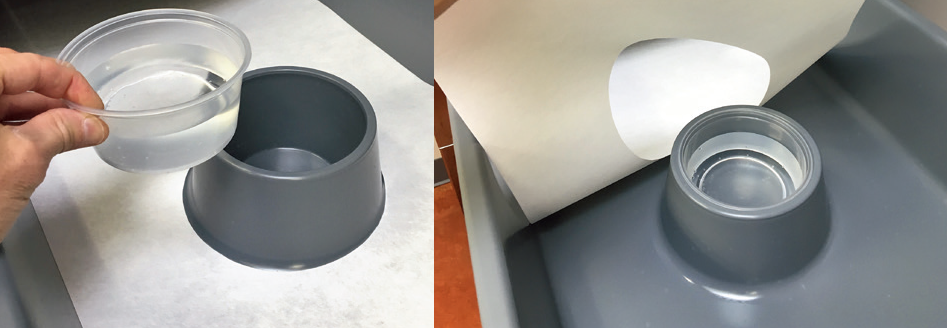

水盆要够重、够宽，蛇在挖掘时有时会挖到水盆下面并往上拱，小而轻的水盆可能洒一地。

水每日一换，水盆定期消毒（详见[清洁和消毒](#清洁和消毒)一章）

栖地喷淋/喷雾时经常可以选用纯净水（或反渗净化水），这样可以避免留下盐渍；但是蛇的饮用水不要用纯净水，而是应该含有合理的矿物质。但是缺乏矿物质会在蛇体内食入后产生渗透压失衡。长此以往，即使蛇经常喝水，这也可能实际上导致脱水。

【】【Reptisafe水处理剂】【】

-------

较深的水盆应该有个斜坡出口【】【伏地魔的水盆】【】，因为蛇更喜欢尝试从水平方向脱离水盆。如果水盆又深、又只有垂直的壁，蛇可能要拿鼻子转着圈顶半天才知道抬头。如果有个斜坡那想走就直接出去了。

脱水的处理见[蛇病-脱水](#脱水)章节

# 食物

应当记录体重和食物重量，需要精确至0.1 克（尤其对于小蛇）的厨房秤，不要使用只精确到1克的厨房秤。

做食物丰荣时使用scent trail可以大大增加蛇的运动量（Reptiles and Research），可以用多只小鼠分散于栖地各处，并拖拽老鼠形成scent trail。蛇会不断探索栖地（尤其是它不知道一共有多少老鼠，所以它不知道啥时候是找完了）。因此即使已经吃完了所有老鼠，还是会转很长时间。这不但增加了你看到蛇的概率，还增加了蛇的运动量和活动丰富性。

【】【未整理】【】

K. Arbuckle曾经发表过一篇用一日龄的鸡仔喂蛇的论文【】【】【】，这是通过询证饲养的思路否定“民间饲养法”长久错误观点的例子。作者通过科学的实验设计发现用鸡仔作为主粮喂蛇不但没有造成营养问题，还有助于解决许多球蟒的拒食问题。并且鸡仔其实比等质量的小鼠、大鼠便宜，即使蛇吃了鸡仔之后不再吃老鼠也不是大问题。鼠确实有比鸡仔更高的钙，但只要营养本身能达标，稍少一点并不会造成营养问题，尤其是多种食物混合喂养的时候。混合喂养还增加了食物丰荣。

## 野外食物构成

玉米蛇完全肉食。

玉米蛇并不是只吃老鼠，野外食物构成有（<a href="https://dx.doi.org/10.1111/j.1439-0396.2010.01011.x">Arbuckle, 2010</a>&nbsp;&nbsp;）IV&nbsp;，（<a href="https://doi.org/10.1111/j.1095-8312.1999.tb01176.x">Rodríguez-Robles, 1999</a>&nbsp;）IV&nbsp; ：

* 哺乳类：64%
* 鸟类：22%
* 爬行类：10%
* 两栖类：4%

实际上，绝大对数蛇都不是只吃一个类群的食物：

玉米蛇只吃老鼠确实可以活，但说玉米蛇就是应该只吃老鼠、甚至说玉米蛇吃鸡、吃鹌鹑会造成营养问题是错误的。

有文献通过给900英亩范围内的206个鸟巢（共13个鸟类物种）安装摄像机详细记录了97起玉米蛇的鸟类捕食行为（其他蛇的捕食行为有40起，说明在相应区域玉米蛇是幼鸟的主要猎食者）。（<a href="http://www.herpconbio.org/Volume_11/Issue_1/DeGregorio_etal_2016.pdf">Degregorio, 2016</a>&nbsp;）IV&nbsp;

研究发现：

* 玉米蛇夜间捕食，抄巢捕鸟的时间绝大部分在20:24到24:00之间

* 玉米蛇捕食巢中有幼鸟的鸟巢的概率是巢中有蛋的鸟巢的概率的5倍，说明玉米蛇可能白天就看好了晚上要去干哪个鸟巢。

* 可以观察到玉米蛇多次（4次）在其他蛇抄巢之后就去巢里捕食，说明玉米蛇可能可以通过观察其他蛇的行为决定自己的行为。

* 虽然观察中的玉米蛇大小足够吃下成鸟，但没有观察到玉米蛇攻击成鸟的行为，只吃幼鸟。虽然不直接攻击成鸟，但有把睡着的成鸟用头推出巢的行为，也有钻到成鸟下面捕食的行为。

* 相比只有蛋的巢，玉米蛇有4.5\~5倍的概率攻击有雏鸟的巢。

* 玉米蛇攻击的鸟巢既有森林边缘的，也有森林深处的。（不要因为herping的时候玉米蛇主要被发现于草地和路边，就觉得玉米蛇就只爬草不上树）

* 玉米蛇每次抄巢的时间在28\~45分钟（食物丰荣时可以考虑用各种方法增加捕食时间，不要让捕食行为十秒钟就结束了。）

	
摄像机覆盖的鸟巢有：Cardinalis cardinalis（85巢），Passerina caerulea（25巢），Toxostoma rufum（27巢），Passerina cyanea（19巢）

用于参考的成体体重（不过注意玉米蛇吃的大多是刚孵化的幼鸟）：
Cardinalis cardinalis：33-65 g
Passerina caerulea：26-31.5 g
Toxostoma rufum：61-89 g
Passerina cyanea：11.2–21.4 g

## 食物营养构成和蛇的营养需求

（<a href="https://www.msdvetmanual.com/management-and-nutrition/nutrition-exotic-and-zoo-animals/nutrition-in-reptiles">Nijboer, 2022</a>&nbsp;）IV&nbsp;

Nutrition in Reptiles
By Joeke Nijboer , PhD, Nijboer Consultancy
Reviewed/Revised Aug 2020 | Modified Oct 2022
Vitamin D and Ultraviolet Light
Prey
For More Information
Topic Resources
3D Models (0)
Audios (0)
Calculators (0)
Images (0)
Tables (3)
Videos (0)
Also see Management of Reptiles.

Appropriate husbandry of reptiles is as important as providing adequate nutrients See table: Composition of Animal Foods that May Be Offered to Reptiles. Photoperiod, temperature, humidity, substrate, stress, and cage “furniture” can affect feeding behavior and, thus, nutrient intake. Temperature and humidity gradients within a reptile enclosure allow the animal to select warm, dry spots or cooler, moist areas. Competition for preferred sites and for food pans in an enclosure with multiple animals should also be assessed. Sufficient numbers of warm spots, UVB exposure spots, and food pans should be available for all animals within an enclosure. Visual barriers may be useful to reduce competition for preferred sites or food dishes.

Prey such as rabbits, rats, or mice should come from commercial breeding centers and be offered dead to prevent injury to the reptile and for welfare reasons of the offered prey. Although it is not common, prey have been known to attack predators and can inflict serious bites. Offering dead prey can also reduce the chance of injury to the predator caused by striking the walls of the enclosure. However, some reptiles may initially need the stimulation of live prey, particularly if they are not adapted to captivity. The possibility of disease or parasite transmission from prey to predator should be considered.

TABLE
Composition of Animal Foods that May Be Offered to Reptiles	
Vertebrate prey should be fed nutritionally complete diets appropriate for the species (eg, mouse diet, rabbit diet, rat diet, etc). The nutrient content of the prey depends on what it is fed (eg, mice raised on a diet deficient in vitamin A have decreased liver storage of this essential nutrient). Additionally, if frozen mice or rats are routinely used to feed carnivorous reptiles, freezer storage conditions should be optimal (eg, ≤6 months and in thick, plastic bags to retard deterioration, stored at -20°C). Methods of thawing that minimize water loss are also important. Because many carnivorous reptiles rely on their prey not only as sources of nutrients but also as sources of water, the state of hydration of the prey can be very important. Thawing should be done in a cooler at < 8°C.

Familiarity with a species’ food habits in the wild is essential if appropriate foods and nutrient levels are to be offered. Common practice has been to offer two or more different prey species, because differences in nutrient content exist among vertebrate and invertebrate prey. Reduced dependence on a single food or prey species is also desirable, because some prey items may be periodically difficult to obtain. Dependence on a single prey item is frequently seen in snakes and may be unavoidable.

Many commercial diets for reptiles are marketed. Products for carnivorous, herbivorous, and omnivorous reptiles are now available in frozen, freeze-dried, canned, extruded, pelleted, or sausage forms. Acceptability may be better when the commercial diets are offered to reptiles when they are young. Appropriately formulated, manufactured diets for reptiles are a potentially simpler and more economical alternative to feeding fresh produce or live prey. However, some of these diets may not be formulated rationally, and frequently little information concerning micronutrient concentrations is provided by the manufacturers. When selecting a commercial product, the buyer should obtain accurate information about product formulation and specific nutrient concentrations. Unfortunately, little controlled research has been conducted on nutrient requirements of reptiles, and claims of product superiority may not have a scientific justification. ( See table: Composition of Animal Foods that May Be Offered to Reptiles)

Herbivorous reptile pellets should make up 25%–50% of the diet of herbivorous reptiles. Animals should be fed 1%–4% of their body weight on a dry-matter basis. Vegetables with a low amount of oxalate should be fed to prevent kidney stones. A good quality grass hay or a so-called herbs-hay should be fed. No more than 50% of the diet should consist of fresh greens, fruits, and vegetables. The amount of fruit should be no more than 5%. In Europe, often herbs and dandelions are fed to herbivorous reptiles. Fresh, clean water must be available at all times.

See table: Recommended Nutrient Concentrations for Reptiles for recommended nutrient concentrations for reptiles.

TABLE
Recommended Nutrient Concentrations for Reptiles	
Vitamin C synthesis has been reported in many reptile species. It has been suggested that ulcerative stomatitis seen in snakes and lizards may be associated with a vitamin C deficiency, although there is no supportive evidence. In controlled studies with garter snakes (Thamnophis sp) fed supplemental vitamin C, tissue levels and body stores remained stable, although synthesis by the snakes was reduced.

Although most reptiles excrete nitrogen primarily as uric acid, aquatic reptiles typically excrete excess nitrogen as urea or ammonia. The relative proportions of various nitrogenous wastes may depend on the amount and composition of feed, frequency of feeding, and state of hydration. The excessive precipitation of urate crystals in joints, kidneys, or other organs (gout) can be a common condition in some species of captive reptiles. The etiology is not clear, but it is commonly thought that diets high in protein may predispose reptiles to gout. Impaired renal function and dehydration have also been suggested as possible causes.

If poor-quality protein is fed (unbalanced amino acids) or when tissue is catabolized for energy, uric acid excretion increases. Although gout in some reptiles is associated with increased circulating levels, postprandial transient increases in circulating uric acid may be seen in some species and confound the diagnosis. Assuring an adequate state of hydration in a susceptible animal may help prevent uric acid precipitation in joints and organs. Feeding diets low in protein to carnivorous reptiles is unwise, because they are adapted to feeding on high-protein prey.

Vitamin D and Ultraviolet Light for Reptiles
Most vertebrates can either absorb vitamin D from the diet or synthesize it in the skin from 7-dehydrocholesterol using energy from ultraviolet (UVB) light of certain wavelengths (290–315 nm) in a temperature-dependent reaction. Thus, vitamin D is required in the diet only when endogenous synthesis is inadequate, as develops when animals are not exposed to UV light of appropriate wavelengths.

Many captive basking species appear susceptible to rickets or osteomalacia (metabolic bone disease). Bone fractures, soft-tissue mineralization, renal complications, and tetany can develop. Reptiles frequently show few premonitory signs, although lethargy, inappetence, and reluctance to move are commonly reported. Serum calcium concentrations may not be diagnostically useful. Although blood levels of vitamin D can be measured, normal values for most species are not known. Supplementation with injectable calcium and vitamin D may provide some short-term relief. However, exposure to UV light, or lack of it, may be an important, yet often overlooked, factor in the differential diagnosis. Complicating the diagnosis may be soft-tissue mineralization, seen radiographically or at necropsy.

In green iguanas, metastatic calcification may not result from vitamin D toxicity. Iguanas with both fractured bones and extremely low or undetectable levels of circulating 25-hydroxycholecalciferol also had calcified soft tissues. The etiology of the metastatic calcification is not understood and is contrary to conventional understanding of the signs of vitamin D deficiency and toxicity in domestic species. Dietary sources of vitamin D may not be sufficient to prevent rickets and osteomalacia. Diets with as much as 3,000 IU vitamin D3/kg did not prevent bone fractures and cortical thinning in green iguanas. Bulbs emitting UVB placed over the lizards at ~12–18 in. for 12 hours/day appeared to reverse the signs in the least severely affected lizards.

Because some lizards seek a warm spot to increase body temperature, placement of a warming bulb, usually incandescent, adjacent to a UVB bulb helps ensure adequate exposure to UVB light. Exposure to unfiltered natural sunlight, depending on latitude, during warmer months and use of UVB bulbs during the rest of the year usually eliminate the risk of bone disease caused by insufficient absorption of calcium (due to a vitamin D deficiency). Some reptiles can accumulate 25-hydroxycholecalciferol when exposed to UVB emission of bulbs, so UVB exposure every day is not necessary, but it is not clear yet how much exposure is needed and how much time can pass before another UVB bath is needed.

Some lizard species may be unable to absorb sufficient dietary vitamin D3, although the reason is poorly understood. New World primates are believed to have exceptionally high dietary requirements for vitamin D, which may be related to lower numbers of vitamin D cellular receptors than are present in Old World primates. Similar metabolic differences may exist in some basking lizard species, although this has not been established. UVB bulbs are sold in pet stores, but label claims may not be reliable.

UVB Lighting
Three types of UVB lighting are on the market: fluorescent tubes, compact fluorescent lamps, and mercury lamps. Fluorescent tubes supply a diffuse light with a low amount of visible light. Heat radiation is low, and the UVB gradient is fairly uniform. The light from fluorescent tubes resembles more or less the natural UVB in the shade of a sunny day spread over a relatively large area. Compact fluorescent lamps provide a more intensive UVB gradient focused on a small area. These lamps are characterized by fairly low intensity visible light and little heat. Mercury lamps (vapor spot and narrow spots) produce an intensive UVB gradient on a smaller area, producing heat and an intense light.

Mercury lamps can become very hot. Reptiles must be prevented from getting burned during UVB basking. It is important to recognize that when a UVB lamp is added to a terrarium, the emission of UVB drops with the square of the distance; this explains the low exposure level of UVB at the level of the reptile when the lamp has been hung too high.

The radiation of UVB declines during the lighting time. In general, UVB lamps should be replaced once a year. However, it is best to regularly measure the amount of UVB with meters used in the artificial sunbath industry. A “D3 Yield Index” that compares the vitamin D3–producing ability of the lamp with the sun has been developed, and the results show that there can be huge differences between UVB lamps, which according to the manufacturers should emit high amounts of UVB.

Tests have been done with LED-emitting UVB lights showing that the optimal wavelength for synthesizing provitamin D in the skin is 293 nm. Some products containing UVB LEDs are now on the market. More products with UVB LEDs will certainly be marketed, and more research will be done on the effects of UVB LEDs on reptiles and other animals such as birds, primates, and other mammal species. An important consideration is that UVB LEDs are expensive and the amount of emitted of UVB is high, which can be toxic if an animal is overexposed.

How long and how much exposure to UVB is needed in reptiles is not exactly known. In general, reptiles that need UVB must be exposed to 30 minutes to 2 hours of UVB each day when older types of lamps are used. It is still unknown how much UVB reptiles and other animals should be exposed to when using modern LED UVB lamps. Enlisting the assistance of a specialist is advised, because there is no ideal UVB bulb yet ( see Environmental Lighting).

For example, bearded dragons do not develop metabolic bone diseases if they are exposed only a few times a week to UVB for a limited time. Similar effects of UVB may also apply to other reptiles; more research is needed.

Prey
TABLE
Proximate Analysis of Whole Prey	
Many reptiles, as well as some birds and mammals, are fed prey. The prey can consist of different species of rodents, birds, insects, and larvae. The analyses on the fed prey comes from research publications and anecdotal literature and is scattered. A lot of analyses are performed on a single prey, which means that most are not statistically validated analyses. Also there can be a variation in analysis techniques. In the associated table (Proximate Analysis of Whole Prey), where no value is added it means that no data are available. The table is a summary of the most important values on prey. More information (eg, on fatty acid, amino acid and vitamin and mineral composition on several prey species can be found on the Feedipedia website.

Composition of Animal Foods that May Be Offered to Reptiles
|Food Item|Dry Matter (%)|Protein (%)|Fat (%)|Energy (Kcal/g)|Calcium (%)|Phosphorus (%)|Ca:P Ratio|
|---|---|---|---|---|---|---|---|
|Chicken muscle|25.6|20.5|4.3|1.21|0.01|0.2|0.05|
|Egg whole|25.2|12.3|10.9|1.47|0.05|0.22|0.02|
|Mice, 1-2 days old|—|—|—|—|1.6|1.8|0.88|
|Mice adult|—|19.86|8.81|2.07|0.84|0.61|1.37|

Recommended Nutrient Concentrations for Reptiles
|Nutrientb|Carnivorous Reptiles|
|---|---|
|Crude proteinc|30%–50%|
|Fat||
|Crude fiber||
|Arginine|1.00%|
|Isoleucine|0.50%|
|Lysine|0.80%|
|Methionine|0.40%|
|Methionine + cysteine|0.75%|
|Threonine|0.70%|
|Tryptophan|0.15%|
|Linoleic acidd|1.00%|
|Calcium|0.8%–1.1%|
|Phosphorus|0.5%–0.9%|
|Potassium|0.4%–0.6%|
|Sodium|0.20%|
|Magnesium|0.04%|
|Manganese|5 ppm|
|Zinc|50 ppm|
|Iron|60–80 ppm|
|Copper|5–8 ppm|
|Iodine|0.3–0.6 ppm|
|Selenium|0.3 ppm|
|Riboflavin|2–4 ppm|
|Pantothenic acid|10 ppm|
|Niacin|10–40 ppm|
|Vitamin B12|0.020 ppm|
|Choline|1,250–2,400 ppm|
|Biotin|70–100 ppb|
|Folacin|200–800 ppb|
|Thiaminee|1–5 ppm|
|Pyridoxine|1–4 ppm|
|Vitamin Af|5,000–10,000 IU/kg|
|Cholecalciferol (vitamin D3)g|500–1,000 IU/kg|
|Vitamin Eh|200 IU/kg|

a Nutrient concentrations are recommended minimums for carnivorous reptiles and averages for omnivorous reptiles.	
b Nutrient levels expressed on a dry-matter basis.	
c Taurine requirements have not been determined for reptiles (the requirement for cats is 400–500 mg of taurine/kg dry diet).	
d A dietary source of arachidonic acid at 200 mg/kg dry diet may be necessary.	
e Thiamine concentrations should be increased to 10–20 mg/kg if frozen, thawed fish constitute >25% of the diet offered.	
f A source of preformed vitamin A may be required because it is not known if reptiles can convert carotenes to retinol (vitamin A), although it is likely that herbivorous reptiles can.	
g Requirements for vitamin D may be partially or totally satisfied by exposure to sunlight or appropriate sources of artificial ultraviolet light. These suggested concentrations are not sufficient to prevent signs of vitamin D deficiency in green iguanas.	
h 300 IU/kg dry matter is advisable if the diet is high in fat, especially unsaturated fat.	

Proximate Analysis of Whole Prey											
|Species|Scientific Name|Dry Matter (DM)|Crude Protein (% in DM)|Crude Fat (% in DM)|Ash (% in DM)|Ca (% in DM)|P (% in DM)|Cu (mg/kg DM)|Fe (mg/kg DM)|Zn (mg/kg DM)|Mn (mg/kg DM)|
|Rodents||||||||||||
|Rat, adult|Rattus norvegicus domestica|29.8 (20.8–34.4)|59.7 (56.1–62.8)|26.5 (22.1–32.6)|11.7 (9.8–14.8)|2.8 (2.1–3.5)|1.7 (1.5–1.9)|4.5|58.9|43.3||
|Rat, baby||20.8|65|20.9||1.7|1.1|27.5|171.5|106.7|5.2|
|Rat, 11 weeks||35.7|63.4|34.9|7.5|2.3||||||
|Mouse, adult|Mus musculus|281. (18.2–35.6)|54.9 (44.2–64.2)|28.4 (17.0–46.5)|9.6 (7.6–11.8)|1.9 (1.2–3.0)|1.5 (1.2–1.7)|11.8 (6.7–19.2)|139.4 (34.6–181.3)|68.3 (47.7–82.5)|6.3 (0.2–13.1)|
|Mouse, baby||20.7|68.7|20.1|9.9|1.5|1.8|22.4|247.6|103.6|4.8|
|Mouse, 25–35g||40.4|56.1|27.1|9.7|3.5|1.8|14.7|204.7|0.4|7.8|
|Guinea pig, adult|Cavia porcellus|33.6|46|39|11.1|2|3.1|||||
|Guinea pig, baby||29.1|51.2|34.7|14.1|||||||
|Guinea pig, 10 weeks||31.3|51.4|46.1|9.2|3||||||
|Rabbit, adult|Oryctolagus cuniculus domestica|31.8|59.9|22.5|14.2|2.3|2.3|||||
|Birds||||||||||||
|Day-old chick|Gallus domesticus|25.7 (25.0–27.7)|64.4 (60.0–72.4)|24.1 (22.4–28.1)|7.1 (6.4–7.4)|1.3 (0.8–1.7)|0.9 (0.5–1.2)|2.6|52.3|||
|Chicken, whole||33.5|43.1|35.2|12|2.7|2.1|3.6|122.2|11.6||
|Chicken leg||40.3|49.9|36.7|6.4|1.7|2.7|||||
|Chicken liver||26.3|81|10.5|5|0|1.2|18.7|358.8|125.6||
|Quail|Coturnix japonica|34|63.7|28.7|10.3|3.7||||||

（<a href="https://www.msdvetmanual.com/management-and-nutrition/nutrition-exotic-and-zoo-animals/nutrition-in-snakes">Nijboer, 2022</a>&nbsp;）IV&nbsp;

Snakes feed almost exclusively on vertebrate or invertebrate prey. A few species are specialized egg feeders. Most boids, pythons, vipers, colubrids, crotalids, and elapids are fed mouse pups, mice, chicks, hamsters, rats, guinea pigs, chickens, ducks, or rabbits. Frozen, thawed prey are usually used in zoos; thawing under refrigeration is recommended. After thawing, prey should not be fed cold but at room temperature, or preferably warmer. Some species (eg, king cobra, hognose snake, garter snake) feed primarily on other poikilotherms in the wild. Some of these species can be switched, at least in part, to homeothermic prey, which is often more available and less expensive.

Minced prey is sometimes fed in agar, gel, or sausage form. Advantages include the ability to formulate and feed a nutritionally complete diet, to add a balanced vitamin and mineral mixture, and, if needed, to add antibiotics or coccidiostats. Mostly a complete diet is fed in a sausage; however, tests are also being done with gel feeding to reptiles.

The scent of preferred foods can be rubbed on the new item. Alternatively, the preferred foods can be inserted into, or attached to, the new food. Anoles, yellow rat snakes, frogs, and smelt, depending on natural feeding habits, can be fed when homeotherms are not accepted. Prey size is usually proportional to snake size and should not be much larger in diameter than the snake’s head. Snakes that are routinely handled can be fed in a separate tank to reduce biting. To reduce the chance of regurgitation, snakes should not be handled for 3 days after feeding.

Most species should be fed every 1–2 weeks. Some large, less active snakes may typically go 6 weeks between feedings. Force-feeding should be used only if necessary. Animals can be force-fed whole prey lubricated with egg white by gently inserting the food a few inches down the throat using forceps. Tube feeding is also possible using ground (homogenized) prey.

（<a href="https://www.msdvetmanual.com/all-other-pets/reptiles/providing-a-home-for-a-reptile">Divers, 2022</a>&nbsp;）IV&nbsp;

Diet of Reptiles
The nutritional requirements of reptiles are still being investigated. Most recommendations are based on experience and observation.

Feeding behavior and digestion are related to the environmental temperature. Because reptiles have a lower metabolism than mammals and other “warm-blooded” animals, they feed less frequently. Humidity, light, food type, and the presence of other animals also affect feeding behavior. In turtles and some plant-eating lizards, the color of the food contributes to food acceptance; red and yellow are often preferred colors. Some reptiles become accustomed to certain foods and are unwilling to accept alternatives. Providing a variety of foods at each feeding, especially to younger reptiles, may lessen this problem.

Quality is important when feeding whole-animal foods. Goldfish, mealworms, crickets, wax moth larvae, mice, or rats intended for use as reptile food should be fed a complete and balanced diet so that they provide adequate nutrients. Herbivores (animals that eat plants) and omnivores (animals that eat meat and plants) also require balanced rations. Vegetarian diets are often lacking in calories, protein, and calcium. Insects and grubs lack calcium, and supplementation is required.

Gut loading is a common technique that involves giving insects a nutritious mixture of cereals and vegetables immediately before being fed to the reptile—thus loading their gut with nutrients. Another common practice is the use of powdered vitamin and mineral supplements. Crickets brought home from a pet store and never fed have little nutritional value. Placing them in a bag with vitamin and mineral powders and shaking the bag will coat the insects with the powder. Although some of the powder will fall off, the newer microfine powders adhere remarkably well. Adding calcium and calcium-rich foods to the diet of crickets and wax moth larvae is another way to provide more calcium to the reptile.

Nutrient Requirements
The recommended minimum protein content of a reptile diet is about 30% to 50% for meat-eaters and about 18% to 22% for plant-eaters. Inadequate protein levels result in weight loss, muscle wasting, increased chance of infection, failure to reproduce, and slower healing after injury. An infection that will not go away after treatment can be the result of inadequate nutrition. High-protein commercial diets may prompt rapid growth but can have severe longterm consequences such as hyperuricemia (see below).

Carnivores (meat-eaters) should be fed whole animals, not just muscle meat. Feeding large amounts of high-protein cat foods has been shown to cause increased levels of protein and vitamin D3. Many nutritionists recommend not feeding cat foods to reptiles. Dog food, especially low-fat varieties, can be used sparingly as part of a complete and balanced diet in both meat eaters and plant eaters. Feeding excess protein can result in a condition called hyperuricemia, in which uric acid is deposited in internal organs. This may lead to gout of the affected organs, which can be fatal.

Protein deficiencies can occur in reptiles with poor appetites or in herbivores (plant-eaters) eating diets deficient in protein. Diets for herbivorous reptiles should include plant proteins from vegetables and legumes. Reptiles that refuse to eat may require a change in their environment or enough variety in the diet to identify a preferred food item.

Fiber is required for the normal functioning of the digestive tract. In large land tortoises and other plant-eating species, adding roughage (such as hay) to the diet may eliminate chronic, smelly diarrhea.

Specific fatty acid requirements have not been determined for reptiles. Dietary linoleic acid is recommended for some species.

Mineral deficiencies are seen frequently in captive reptiles, especially turtles, tortoises, and lizards. Vitamin and mineral deficiencies are rare in snakes that are fed nutrient-rich whole prey. A vitamin and mineral supplement should be added to the diet of every captive reptile; many products designed for use in reptiles are available in pet stores. Properly balanced calcium, phosphorus, and vitamin D3 levels are necessary to maintain good health in reptiles. If the balance is upset, hormonal disorders or bone diseases can occur.

Calcium imbalance is a common mineral imbalance in reptiles. For carnivores, a diet of only muscle meat (not whole prey) is deficient in calcium and rich in phosphorus. Including whole prey or a low-fat dog food in the diet is recommended. Calcium should be supplemented with products developed for reptiles.

The exoskeleton of insects does not contain calcium. Therefore, reptiles that feed primarily on insects must obtain dietary calcium from insects “gut loaded” and powdered with calcium supplements. Plant-eating reptiles should be encouraged to eat items rich in calcium, including cabbage, kale, okra, sprouts, collard greens, and bok choy. These foods typically are also rich in vitamin A. A calcium supplement developed for reptiles should be routinely given to plant-eaters.

Vitamin D is also required for proper calcium metabolism and balance. Animals housed outside with access to natural, unfiltered sunlight usually have adequate levels of vitamin D3. Access to ultraviolet light is strongly encouraged for reptiles that are not exposed to unfiltered sunlight ( see Lighting Requirements, above). Reptiles that are fed whole mammals (such as mice) as prey generally consume adequate levels of preformed vitamin D3. The food of reptiles that eat mostly insects should be fortified by gut loading and powdering. Plant-eating reptiles that have limited exposure to ultraviolet light should receive supplemental vitamin D3. Most reptile supplements that contain calcium also contain vitamin D3. Care should be used when providing supplements, however, because excessive levels of vitamin D3 in the diet can lead to excessive absorption and use of calcium.

Inappropriate levels of calcium, phosphorus, or vitamin D can result in an imbalance in the hormone that regulates calcium, phosphorus, and magnesium levels within the body. If these levels are not balanced, the bones may become weak and begin to bow outward. This condition is most often seen in the jaw bones. Eating becomes difficult and then impossible as the jaw bones become soft. Tube feeding is needed in extreme cases. Osteomalacia (softening of the bones), kidney stones, cloacal calculi (accumulated mineral deposits, similar to kidney stones), and rickets (which also leads to weakening of the bones) are also possible results of a diet deficient in calcium or vitamin D3. Broken bones, bone deformities, and soft or deformed shells in turtles may occur. Affected animals may develop muscle twitching or muscle contractions.

Treatment consists of correcting the balance of these minerals and giving vitamin D3, if necessary, either by exposure to an appropriate ultraviolet light source or by an injection given by a veterinarian. Your reptile's dietary history would help the veterinarian evaluate for deficiencies and determine possible courses of treatment. If a calcium supplement is used in the initial stages of treatment, it should not contain phosphorus. An excellent calcium source is calcium glubionate, given on the recommendation of a veterinarian. Other sources of dietary calcium include crushed cuttlebone, crushed oyster shells, crushed or pulverized calcium lactate, or commercially available products. In severe cases, a veterinarian can give a calcium injection before giving extra calcium by mouth.

Feeding of certain green foods that contain goiter-causing compounds, such as bok choy, broccoli, Brussels sprouts, cabbage, and soy, may cause an iodine deficiency. Signs of deficiency include a lack of normal energy and activity and an abnormal swelling (goiter) at the base of the neck where it meets the chest. The imbalance is corrected by supplementing with a balanced vitamin-mineral mixture containing iodine or iodized salt (0.5% of the diet).

Vitamin A deficiency is common in captive plant-eating turtles. Box turtles appear most at risk usually because of improper diets that do not contain enough vitamin A. Signs of vitamin A deficiency include swollen eyelids, eye discharge, chronic respiratory disease, and kidney disease. The eyes may eventually remain closed, impairing the ability of the turtle to find food. Treatment consists of short daily soaks to allow the turtle to drink and wash its eyes, application of an antibiotic ointment to the eyes, and vitamin A injections given by a veterinarian. For less severe cases, vitamin A can be supplied by adding a drop of cod liver oil to the reptile’s food twice a week. Commercial vitamin products are also available for reptiles. Dietary levels of vitamin A should be increased for up to 6 weeks before hibernation in turtles and tortoises. However, caution should be used when supplementing because too much vitamin A can cause severe thickening and irritation of the skin as well as incomplete and inadequate shedding of the skin.

Vitamin B1 deficiency can result from diets containing fish with high thiaminase levels. Giving extra vitamin B1 is required in such cases. Weight loss even though the reptile is eating enough food is a common sign, but neurologic problems (such as paralysis and lack of coordination or balance) can also occur. Some fish species contain more thiaminase than others. Frozen fish have increased thiaminase levels. Deficiencies of the water-soluble vitamins often involve more than one vitamin and require treatment with a multivitamin preparation.

Deficiencies of other vitamins and minerals sometimes occur in reptiles and can be diagnosed and treated by your veterinarian.

已下未读：【】【（<a href="http://www.nal.usda.gov/awic/zoo/WholePreyFinal02May29.pdf">Dierenfeld, Year?</a>&nbsp;&nbsp;）IV&nbsp;】【】

已下未读：【】【（<a href="https://dx.doi.org/10.1111/j.1439-0396.2010.01011.x">Arbuckle, 2010</a>&nbsp;&nbsp;）IV&nbsp;】【】

下图对比了一日龄鸡（DOC，day-old chick）的营养与小鼠大鼠的对比结果。

整体食用，需要带毛、带骨

小鼠和大鼠的区别

食物丰荣

鹌鹑苗

Reptilink

喂食时间表

蛇是机会觅食者，总是非常饿

下文中的“冻食”指充分化冻后的冷冻食物，不是冰着喂给蛇。

长时间冷冻的食物会导致营养流失，维生素减少、且可能被冰箱内的细菌环境沾污。冷冻食物的储存最好不超过6个月（成体两周喂食一次，每次购买食物不应超过12只）。

蜥的知识：钙磷比问题，磷会剥夺身体吸收钙的机会，长期使用钙磷比较低的食物会导致缺钙

在窝里喂还是拿出来喂

在栖地里用盘子把盘子反过来的方法，如何让蛇上盘子

所谓误食垫材问题

冻食的解冻方法

冻食如何夹

食物的种类
食物大小的变化

How to tell if your snake is a proper weight

Power feeding 问题，寿命减半

生长曲线

已转录，未整理：【】【（<a href="https://www.youtube.com/watch?v=0WIO_C3PaoE">Sinclair, 2021</a>&nbsp;）III&nbsp;】【】

【】【本段未整理】【】

（<a href="https://www.youtube.com/watch?v=6yOISQ5sQtQ">Sinclair, 2022</a>&nbsp;）III&nbsp;

不要觉得眼睛能看出来就不称蛇，一定要用称称，并做好记录，及时发现问题。蛇一斤重的时候少二三十克体重肉眼是看不出来的，等到肉眼看出来的时候可能问题已经严重了。

## 食物种类

圈养下玉米蛇的主要食物是小鼠（mice），注意不是大鼠（rat）。幼年至成年玉米蛇的食物正好对应幼年至成年的小鼠 III。

作为丰荣措施，不应该让蛇一辈子只吃一种食物，可以偶尔喂食合适大小的带毛鹌鹑苗。也可以考虑偶尔喂食大鼠，但是因为大鼠的脂肪含量比小鼠高（25~30% vs 15~20%），（<a href="http://www.nal.usda.gov/awic/zoo/WholePreyFinal02May29.pdf">Dierenfeld, Year?</a>&nbsp;&nbsp;）IV&nbsp; 所以大鼠“更好吃”，因此喂食大鼠有一定可能造成后续拒食小鼠I。

Reptifiles表示也可以喂食鹌鹑蛋，待考察。

可以考虑喂食幼龄鸡，如一日龄鸡（<a href="https://dx.doi.org/10.1111/j.1439-0396.2010.01011.x">Arbuckle, 2010</a>&nbsp;&nbsp;）IV&nbsp;，注意鸡仔出生就三四十克，养一周就60克了。

Reptilink是用动物肉搅碎后制成的香肠，对蛇来说更好吃，有时可以用于开食 III。

【】【Reptilink图】【】
【】【Snake Discovery Reptilink视频】【】

食物应该完整投喂，包括内脏、骨骼、头部、毛发或羽毛。不要去除内脏、不要褪毛。III

食物不应该脱毛，食物的毛起到膳食纤维的作用，帮助消化的排便。
【】【大便的图】【】

## 喂食的大小和频率

没有找到高证据级别的喂食时间表

下列表格来自Reptifile非常存疑，来自一个Facebook社区，什么乱七八糟的？ I

|状态|身长 (cm)|体重|喂食重量|喂食间隔（日）|
|---|---|---|---|---|
|幼体|20\~50|||5-7|
|少年|50-115|||7-10|
|亚成|90-130|||10-12|
|成体|>90|||14-21|
|老年|年龄>18岁|||10-14|

蛇超重或者过瘦的时候可以在上下限的基础上再调整1/3。例如肥胖的成体可以28天喂一次，消瘦的成体可以10天喂一次。同时可以调整食物的重量  III

来自Roy Munson，被称为“Munson plan” I，广为流传，但，一些人批评这个计划 I：
幼蛇阶段喂的非常激进（超过了20%体重，一般认为不应该超过15%）
喂的过于频繁，成体可2\~3周喂一次。
根据重量的喂食计划不合理，因为在太重、太瘦的蛇身上会形成正反馈“失控”，根据身长或年龄更合理。

| 身长 (cm)  | 体重        | 喂食重量  |喂食间隔（日）|
|----------|-----------|-------|---|
|| <25 g    | 25% 体重    | 5-6   |
|| 25-50 g  | 20% 体重    | 5-6   |
|| 50-90 g  | 15% 体重    | 6-7   |
|| 90-170 g |10\~15% 体重| 7     |
|| >170 g   | 10% 体重    | 10-14 |

Reptifile 喂食大小 III：
提供的猎物大小应在蛇体最宽处的1-1.5倍之间。

一般来说一顿饭不应该超过蛇体重的大约10%。这个比例要根据蛇的胖瘦调整。

对于是否适宜喂多只鼠，有争议。

Reptiles and research ：Cali king wild diet implication for care 根据对加州王蛇野外食谱的大规模研究认为在野外常有一次吃很多只幼崽的情况（nest raid），也有先把妈吃了、再把窝里小的都吃了这种一大多小的情况。所以认为可以多只喂食，并且建议通过喂食大小的波动提供喂食丰荣。（个人疑问：饥一顿饱一顿是自然界常态，但在人身上认为威胁健康；这一现象是否应该划入可模仿自然而不带来负面影响的范畴？）

Snake Discovery依据相同“长度”下的营养总量认为应该尽量选一只大小合适的，不要分开喂两只。

应当记录喂食的时间，食物的重量，每天+喂食前测一下体重（除了刚喂食后的48小时），记录捕食状况，是否需要辅助进食，记录拉屎的时间和拉屎后的体重，注意屎的状态，注意吐食问题。【】【吐食链接】【】  III

如果出现体重减少、或者小蛇的体重增长停滞，尽快寻找原因，很可能有病要找兽医

钙粉、维生素粉？
一般认为不需要，
Reptiles and Research喂鸡的视频里有文献。
注意长期冷冻导致的营养流逝
UVB问题
小鼠、大鼠、鸡苗的钙磷比都合适

不要用手接触老鼠，否则手上有鼠味可能会被咬

## 要不要拿出来喂

【】【】【】
蛇的饲养者中有一种普遍的误解，认为在蛇的家里喂食会使蛇变得“栖地内攻击性”。现代对蛇心理的理解认为，我们对“攻击性”的认知是错误的；那些已经学会将开笼子与食物（由于处理不频繁）联系起来的蛇会向它们看到的第一个物体发起攻击，以为那是食物——并无对饲养者的手有任何伤害的意图。 III

【健康蛇、健康环境】蛇不会因为误食一般垫材而Impaction。 III

因此，不应该将蛇移到别处喂食，而应该训练蛇分辨喂食时间和处理时间。最可靠的方法是在处理前用纸巾卷轻轻敲蛇，或者用蛇钩轻轻划过其身体。如果蛇攻击，没有伤害。如果没有，它知道不要期待食物。

总之，应该在蛇的家里喂食。与人类不同，蛇并不特别喜欢“外出就餐”。

【翻转盘子栖地里喂食的方法】

【】【】【】

## 喂食的行为丰荣

【】【下面未整理】【】

https://www.youtube.com/watch?v=wd95C_abSZE
Use This Snake Enrichment Idea To Encourage Hunting Behaviour

Role: assistant
In the wild, snakes can spend large proportions of their time hunting and engaging in natural behaviors, anything from following the rodents entrails to rodent urine around nests sites highlighted by UVA vision. However, in captivity, the amount of time spent engaging mentally is short compared to that of the wild. In this video, we will look at how you can extend the amount of time your snake engages in these behaviors. This channel is dedicated to improving reptile welfare with science and good information sources. If you want to stay up to date with science-based care for your reptiles, click the subscribe button and press the bell icon for future information.
在野外，蛇可能会花大量的时间进行狩猎和自然行为，这些行为包括追踪啮齿动物的内脏到巢穴周围的尿液，这些都被紫外线视觉突出显示。然而，在圈养环境下，精神参与的时间相比野外要短很多。在这个视频中，我们将探讨如何延长你的蛇进行这些行为的时间。本频道致力于用科学和优质的信息来源改善爬行动物的福利。如果你想跟上基于科学的爬行动物护理的最新信息，请点击订阅按钮并按下铃铛图标以获取未来的信息。

The time an animal spends in any given day is called an activity budget, and that is the time it allocates to different behaviors on a daily basis. This strongly affects its fitness by deterring interaction rates with resources, predators, and competitors. According to this study in ethology, studies are carried out by observing different behaviors, defining them, then observing the animal for an extended period of time and recording the amount of time the animal spends doing what behavior. In captivity, the activity budget of the wild counterparts has been studied. We can utilize methods such as enrichment and enclosure design to try and encourage the animal to behave as close to that of being natural.
动物在任何给定的一天里花费的时间被称为活动预算，这是它每天分配给不同行为的时间。这通过阻止与资源、捕食者和竞争者的互动率，强烈影响其适应性。根据这项在行为学中的研究，研究是通过观察不同的行为，定义它们，然后观察动物一段较长的时间并记录动物花费在什么行为上的时间来进行的。在圈养环境下，我们已经研究了野生对应物种的活动预算。我们可以利用丰富的方法和爬箱设计来尝试鼓励动物表现得尽可能接近自然状态。

While the exact activity budget for your chosen species of snake might not be known or studied, we can safely say that they're spending more time hunting in the wild than those few moments it takes for a snake to strike at food presented in tongs. That's why it's important to try our best to extend the amount of time our animals spend hunting. During this time, they are mentally stimulated. While I have not tested this on species many considered to be sedentary ambush hunters like Gaboon vipers or blood pythons, the vast majority of colubrids and other pythons etc. will benefit from this. I have seen this used from anything from corn snakes to retics, some carpet pythons.
虽然你选择的蛇种的确切活动预算可能未知或未被研究，但我们可以肯定地说，它们在野外的狩猎时间比用钳子呈现食物时攻击的那几刻要多。这就是为什么我们要尽量延长我们的动物的狩猎时间。在这段时间里，它们得到了精神刺激。虽然我没有在很多被认为是驻足伏击猎者的物种上测试过这个，比如加布恩蝰蛇或者血蟒，但大多数的游蛇和其他蟒蛇等都会从中受益。我已经看到这个从玉米蛇到网纹蟒，一些地毯蟒等都有应用。

So what I'm doing here is placing food around the enclosure to encourage the animal to engage in those hunting behaviors. This extended the portion of the snake's activity budget to an hour and a half searching for food. To be fair, it actually carried on searching for ages after, but I only counted that from the time I put food in to the time the final pinky was consumed. It can be frustrating to watch if they really take the time of it. For that reason, I have cut sections out to make this video shorter. So what I'll do here is I'll speak sparingly so you can get the idea of how it is to watch your snake forage around the enclosure.
所以我在这里做的是在爬箱周围放食物来鼓励动物进行那些狩猎行为。这将蛇的活动预算的一部分延长到了一个半小时的寻找食物。公平地说，它实际上在之后的时间里还在寻找，但我仅从我放入食物到最后一只小鼠被消耗的时间里计算。如果他们真的花时间的话，看起来可能会令人沮丧。因此，我剪掉了部分片段以使这个视频更短。所以我在这里会少说些话，这样你就可以了解观察你的蛇在爬箱周围觅食是怎样的。

She kind of pauses here and just kind of sits under the UV for a little bit and then carries on her search. And once she found one pinky after around 40 minutes, she kind of picked it up and really took up a gear in the way she's moving around hunting. A quick wipe of the mouth and she continues with the hunt. This one was the most frustrating because it's clearly alright but yet she chooses to go the other direction. That darkened beetle was loving life though. She finally came from the other direction, up the rocks, and found the mouse pinkie and sends the darkling beetles flying into the stratosphere. Yes, oh that's a grounded hour-and-a-half and even after just finished, she's carried on cruising around the enclosure after. I didn't film that, but hopefully after watching it you've got some ideas of how you're going to increase the activity budget of hunting in your own care. Leave a comment, let me know what you're planning to do. If you do this, come back and leave a comment on the species you did it with. I would love a list of species that this has actually worked with and if someone else has the same species as you, your comment might be the thing that makes them try this.
她在这里稍微停顿一下，就在紫外线下坐了一会儿，然后继续她的搜索。大约40分钟后，她找到了一只小鼠，她捡起来，真的开始在她的狩猎方式上升级。快速擦拭嘴巴，她继续狩猎。这个是最令人沮丧的，因为一切明明都很好，但她却选择去另一个方向。那只变暗的甲壳虫却过得很快活。她最后从另一个方向来，爬上岩石，找到了小鼠，把甲壳虫送飞到了大气层。是的，哦，那是一个实实在在的一个半小时，甚至在刚刚结束后，她还继续在爬箱里巡游。我没有拍下那个，但希望在观看后你有了一些关于如何在你自己的护理中增加狩猎活动预算的想法。留下评论，让我知道你打算做什么。如果你做了这个，回来并留下你用哪种物种做的评论。我很想要一个这个实际上有效的物种列表，如果有人和你有同样的物种，你的评论可能会是他们尝试这个的原因。
Process finished with exit code 0

提供一个鹌鹑蛋

【】【喂食时的追逐捕食行为可以提高进食的满足感】【】

## 喂活食还是冻食

参考：（<a href="https://www.youtube.com/watch?v=fyHhFvrlqiw">Sinclair, 2022</a>&nbsp;）III&nbsp;

冻鼠的好处：
* 购买方便，易于存储，不用每次购买。
* 便宜。

冻鼠的坏处
* 每次要等半小时化冻。
* 如果喂食失败没有食用，必须丢弃，不能重新冷冻。
* 不用监督投喂，甚至可以把蛇和冷冻鼠留在一起，尤其是对于那些可能不愿在有人在场时进食的蛇，甚至可以把食物留几个小时。

活鼠的好处：
* （如果蛇愿意捕食）寻找老鼠和捕食老鼠的过程是极好的丰荣。（当然，冻食也可以通过一些措施增加丰荣程度，例如设立气味路径、隐藏食物、增加取食难度等）
* 如果养殖大量蛇，自养活鼠更方便。

活鼠的坏处：
* 活鼠的一个缺点是它们可以反击，有可能严重伤害蛇。视频网站上看宠物蛇捕食会经常发现咬不对地方、绞杀的不好的蛇，留给鼠咬蛇的机会。
* 必须监督投喂，有危险及时干预。

下图是一条野生的单色玫瑰蚺（Rosy Boa，Genus Lichanura，species?）被啮齿类猎物反咬后愈合造成的伤疤。（<a href="https://www.bilibili.com/video/BV1PM411G7L5/">骆老师啊, 2023</a>&nbsp;）I&nbsp;

冻鼠还是活鼠需要根据自己的情况和蛇的情况决定。

Reptifile

III

冷冻/解冻还是活体？
对于玉米蛇的食物，一般接受的做法是使用经过人道安乐死并冷冻的人工繁殖猎物，而不是活体。这是因为活体猎物会用牙齿和爪子来为自己的生命而战——有时会导致蛇受伤。此外，“惊晕”活体猎物，即用硬物猛击其头部，虽然可以阻止其反抗，但这种做法极其残忍。因此，ReptiFiles不建议使用这种喂食方法。

玉米蛇通常有相当强烈的取食反应，因此它们对冷冻/解冻的猎物并无太大问题。

提前一天准备冷冻的啮齿动物，将其放在冰箱中慢慢解冻。这样可以防止细菌生长，否则会让你的蛇生病。然后，在喂食前，将喂食器放在一个BPA-free的塑料袋中，浸入温热的、几乎热的水中15-30分钟。喂食器的温度应达到约100°F，因为这接近活体啮齿动物的体温。这将模拟体温，鼓励蛇食用。

如果使用冷冻-解冻的猎物，你可以通过摇动喂食器来模拟挣扎，增强你的蛇的“狩猎”体验，并鼓励其取食反应。在蛇攻击并开始收缩后，这可能看起来有些恶心，但这对蛇的精神和身体健康都有利。

总的来说，你必须尊重你的蛇的取食偏好。如果它拒绝吃冷冻/解冻的猎物，就给它活体，并仔细监视它们的互动。活体啮齿动物在你的玉米蛇的围栏中不应超过1小时。保持你的宠物健康和饱食应该始终是你的首要任务。

## 蛇的胖瘦

【】【Snake Discovery Video】【】

### 过胖

症状 III：
* 直着的时候沿脊柱有凹陷
* 鳞片皱褶/折叠
* 蛇直着的时候能看到鳞片之间的肉（刚喂完食除外）
* 腹部是软的，不是结实
* 身体弯的时候有游泳圈，看着像分段似的
* 泄殖腔前面有明显突起（如下图），玉米蛇不应该有屁股。

单独说屁股胖是因为全身都粗可能只是生长，但只有屁股胖明显是[体腔脂肪体（coelomic fat pads）](#消化)里头的脂肪堆多了。

成因：
* 食材太肥，比如应该喂小鼠却喂成了大鼠（大鼠rat的脂肪远比小鼠mouse要多）
* 喂太多、太大、太频
* 蛇缺乏活动机会（如栖地太小、无丰荣物、无攀爬物）

措施 III：
* 喂食正确种类的食物（比如rat换成mouse）
* 调整喂食大小和频次
* 增加丰荣物、攀爬物、活动空间
  【】【Snake Discovery泡澡视频】【】
* 给蛇泡澡（有特定方法，见视频），一般蛇在水里会不停游动
* 长期无法纠正时咨询兽医。

### 过瘦

参考[蛇病-消瘦与体重降低](#消瘦与体重降低)章节

## 拒食

相比其他一些常见的挑食宠物蛇（比如猪鼻蛇和球蟒等），玉米蛇的拒食相对少见。I 当然反过来说如果玉米蛇（在正常时间）拒食，可能反映出更大问题。

Reptifiles

III

如果蛇到了喂食时间但拒绝进食，可以等待半个周期再次尝试（如两周喂食一次，可以等待一周再试一次）。

如果两次都拒食，应该开始寻找原因，可能的原因有：
* 特殊时期（如即将蜕皮，或者刚经历了栖地搬迁/装修，此时拒食可以理解）
* 压力（包括上手过度、不合理共栖等）
* 确认温湿度正确
* 栖地（注意栖地有恰当躲避和遮挡、丰荣恰当）
* 食物有问题，比如食物腐败或不新鲜
* 生病

解决：
* 如果是特殊时期，等一等。比如蜕皮导致的拒食再过一周应该能看到蒙眼（in blue）。
* 如果有拿到另外盒子里喂食的习惯，尝试在日常生活的栖地里喂食。
* 如果上手太多（正常时期2\~3天一次，每次不超过15分钟），减少上手频率。
* 如果喂的是冻食，尝试活食
* Braining the mouse：方法是找一个一次性针（比如注射器）从面部两眼之前插入，轻轻向后脑方向前进一定距离，达到脑部（注意不是戳穿，也不是把脑搅成浆），然后退出针头。轻轻挤压老鼠头部，使少量无色透明的脑脊液流出（不是挤出脑子），然后即可尝试喂食。喂食前注意洗手，消除手上的鼠味，防止被咬。（<a href="https://www.youtube.com/watch?v=JUwj2yWdxtw">Sinclair, 2023</a>&nbsp;）III&nbsp;
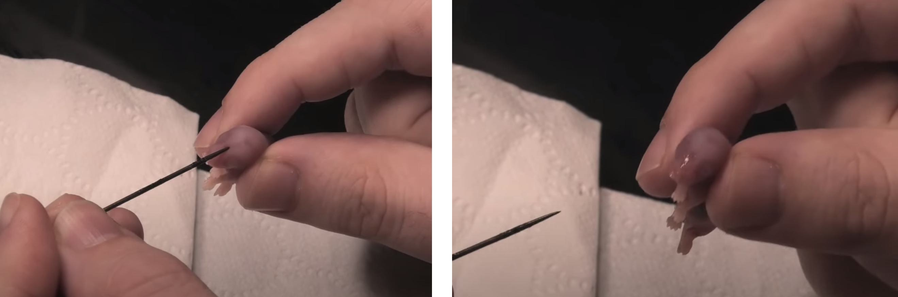

* 尝试不同种类的食物，比如原来喂小鼠，可以尝试喂带毛鹌鹑苗或日龄鸡崽
* 特殊食品，比如Reptilink的小香肠，或者在老鼠上点上Reptilink的Anole Juice。
* 如果之前没有UVB，提供适当的UVB照射可能能促进进食。（Laszlo, 1969&nbsp;）IV&nbsp;
* 注意有无其他疾病，如果有疾病特征，或者做了上述措施都没有用，去看兽医。

【】【强制喂食】【】

注意强制喂食时不能挡住glottis，不然会憋死：https://youtu.be/yh3V3mN33Qs

## 吐食

吐食的处理，见[蛇病-吐食](#吐食问题)

## 饲料动物的处死和人道主义问题

Live Vs Frozen for Snakes Pt 1: SHOCKING Truths
https://www.youtube.com/watch?v=fyHhFvrlqiw

III

人道的死亡主要包括三个方面：最小化疼痛、最小化压力，并尽量缩短过程以减少痛苦。

喂活食有一定的人道主义问题，但冻食也有。

活食的人道主义问题显而易见，小鼠被捕食过程中会造成疼痛和恐惧。但这一过程相对迅速，研究表明【下方Ref】一般小鼠在40\~60秒内就会死亡。不过这个数值可能随蛇的年龄、技能、认知发展、种类以及与啮齿动物的大小比例而有变化。

Brad R. Moon, The mechanics and muscular control of constriction in gopher snakes (Pituophis melanoleucus) and a king snake (Lampropeltis getula). J. Zool., Lond. (2000) 252, 83. (附件/蛇绞死老鼠的肌肉机制和速度.pdf)

二氧化碳箱处死法也有福利问题，养殖场一般用二氧化碳箱法处死老鼠。二氧化碳箱法处死老鼠通常需要2\~3分钟（蛇的绞杀死亡更快是因为绞杀不仅导致窒息，还会立即导致循环和心脏停止），并且二氧化碳造成的迅速晕厥不一定是无痛的。2013年，Newcastle大学发表共识认为二氧化碳对老鼠和大鼠的厌恶程度远低于实际需要引起无意识的程度。因此，他们一致认为应寻找二氧化碳的改良方法。

Mark J. Prescott. A Good Death? Report of the Second Newcastle Meeting on Laboratory Animal Euthanasia. Animals 2016, 6, 50. (附件/二氧化碳箱法处死的人道主义问题.pdf)

University of Newcastle, Newcastle Consensus Meeting on Carbon Dioxide Euthanasia of Laboratory Animals. (附件/Newcastle大学CO2安乐死方法人道注意共识及可能的替代方案.pdf)

这些方法都比老鼠药、粘鼠板、老鼠夹等人道的多。

一定注意人员安全
应当安装传感器

----

CO2法

箱内所需浓度？

血pH的快速上升会造成麻醉效果。吸入7.5%的CO2可减少疼痛，吸入30%的CO2可以快速导致深度麻醉

方法有直接把动物放到CO2箱中，也有gradual displacement

CO2造成压力有三个途径：1. 碳酸疼痛，2. 缺氧感，3. 直接通过离子通道刺激amygdala（扁桃腺？）导致恐惧反应。这些压力因素有巨大的物种差异。

人、大鼠、猫对CO2的伤害响应于CO2>40%时触发，人汇报难受是30~50% CO2，超过50%有明显疼痛。大鼠中使用100%的CO2会触发nociceptor（导致负面体验？），但10~50%不会。这说明gradual displacement可能是更好的方法。

箱内CO2释放出后的屋内CO2浓度是否危险？

气源可以使用蚁人动力的气阀，配3/8-24UNF螺口的气瓶

箱子的尺寸和所需CO2的量？

确定负面体验的方法是平行箱实验（aversion experiment），即设置两个条件相似的箱子，使鸟自由选择进入哪一个。如果鸟避免了其中一个，说明该箱会导致负面感受。

（AVMA guidelines for the euthanasia of animals）
对火鸡来说，发现会自愿走入90% Ar，或60% Ar + 30% CO2的箱子中，但只有50%走入了70% CO2的箱子中。

超过40%浓度的CO2气氛可以同时麻醉并随后杀死动物。

可能出现无意识挣扎情况

未孵化鸟类的环境通常有高浓度二氧化碳，所以刚孵化鸟类的二氧化碳耐受能力高。此时需要80%~90%的CO2

施加CO2时，有的文献报道有行为stress，但有的没有，并不是都能重复，说明可能与施加方法有关。

鸟类比鼠类更愿意接受可以导致失去肢体控制能力的高浓度CO2环境，并很快就失去意识。

7日龄鸡在97% CO2下于12s内失去意识，一日龄鸡在90% CO2下12秒内失去意识。5周龄鸡在60% CO2下17秒内失去意识。

使用gradual displacement的方法，动物在被高浓度CO2导致疼痛之前就失去了意识，所以是更温和的方法。对禽类gradual displacement of CO2可以比N2和Ar有更少的convulsion.

CO2可能导致无意识挣扎，如扑扇翅膀。可能导致观察样本损坏，让操作者难受。CO2导致的无意识挣扎比N2、Ar少。更慢的施加气体可以减少这种现象。

注意CO2比空气重，必须完全的排出空气，否则动物可能通过伸长脖子呼吸上方空气导致处死失败。

不能用干冰或液态二氧化碳直接做CO2源，是压力因素。

对鼠类，建议使用0.3~0.7 倍容器体积/min的速度做gradural displacement

CO2气流应该在呼吸停止后继续保持一分钟。

幼年动物必须长时间保持在CO2气氛中保证死亡。幼年动物耐受CO2能力强，达到快速麻醉的浓度可能高达80~90%。对一日龄鸡，要保证致死，需要在>75%浓度下保持5分钟。

不能将动物突然置于100%CO2中，这不人道。如果不能用gradual displacement，可以先使动物失去意识，再放入100%CO2箱中。将禽类放在少一些浓度的CO2箱中是可行的（少多少啊？Immersion of poultry in lesser concentrations is acceptable with conditions as it does not appear to be distressing.）。

应当确认死亡，避免CO2撤除后“复活”

---

惰性气体法（如Ar或N2）
研究发现100%的Ar或100%的N2环境可以快速杀死动物（11s昏厥，22s停止抽搐，1min内无心电），十秒内施用惰性气体再快速换为空气时鸟类无明显反应，说明鸟类没有N2和Ar的传感器。

大鼠可以感知氧气浓度的变化，在平行箱实验中会避免纯N2, Ar环境；N2, Ar比CO2好一点，但区别不大。在gradual displacement过程中，大鼠会在O2 ~7%时主动逃离环境，几乎不会无意识的昏迷。

但鸟类（鸡、火鸡）就没有上述问题。会主动进入90% Ar的房间

认为用于鸡的处死是可接受的

注意惰性气体没有对应传感器，必须注意同屋人员的安全问题

---

即使是惰性气体，gradual displacement也造成aversion

--- 

要点：

此处“试剂”指的是CO2, N2, Ar等窒息试剂

1. 昏迷时间与吸入试剂的浓度有很大关系。所以必须了解向密闭空间进行气体输送的规律。

2. 提前让动物吸入试剂可能加快处死时间，但这本身就造成压力，所以还不如gradual displacement也造成aversion

3. 加入试剂必须纯，比如不能用点火生成的CO2

4. 快速加入气体可能有对应的声音或冷风，这会造成压力和逃跑行为。应当使用措施减小噪音，并避免气流直接吹向动物。

5. 应该采取动物喜欢的环境进行处死，比如老鼠应该处死于黑暗的房间里，猪应该集体处死。

6. 必须确认动物死亡再撤出处死环境。如果动物没有死，必须立即继续处死，否则第一次未成功处死带来的生理伤害（如肺和上呼吸道损伤）可能产生痛苦。

--- 

鹌鹑方案

处死盒，圆筒状气密饭盒，1500 ml，盖子打孔两个：第一个孔用热熔胶装4 mm导气管，长度伸至罐子底部，绑上一次性筷子，第二个是小孔，用小号钉子扎小洞

导气管接流速计出口，满量程400 ml/min

导气管入口接CO2一次性气弹控压阀，8 mm咀口；控压阀接气弹，气弹接口3/8-24UNF，

gradual displacement with CO2，每分钟0.3倍体积，即每分钟450 ml，1~2分钟达到高浓度。维持CO2 5分钟。

一盒可以放六只鹌鹑，不做上下分割。

鹌鹑在盒中会感到紧张，应该尽快转移处置

以100 ml/min流速触底加CO2时，约2~3分钟开始出现呼吸异常状态，随后一分钟内不再作动，贴住CO2放气孔，维持较小气流，保持7分钟。7分钟后取出鹌鹑，对应已死亡的鹌鹑用颈椎脱位法进一步确保死亡。

每盒体积等于3 g CO2

房屋尺寸306*370*250 = 28立方米，每盒CO2放到空气中对卧室来说会导致房间CO2上升28 ppm

若失误将整瓶放出，上升203 ppm，仍然安全。不要买更大的气瓶。

https://www.youtube.com/watch?v=GBU8rGGU2V8&pp=ygUfQ2VydmljYWwgZGlzbG9jYXRpb24gIGV1dGhhbnNpYQ%3D%3D

---

颈椎脱位术（Cervical Dislocation）

其本质是使脖子呈过度后仰角。右手拇指从脑后固定头顶，食指和中指自然夹住脖子；左手握住身体（固定好翅、腿，手势如同隔着塑料袋捡起一条狗屎），突然用力使头后仰并拉伸至极限角度和长度，不歪头、不扭头；先后仰、再低头、再后仰，并重复数次以保证死亡。

颈椎脱位时将能听到明确的声音和瘆人的手感；其声音和手感都类似于用烤鸡皮包住一根（不是一包）弯曲的干方便面。然后一弯鸡皮，干方便面碎了。

https://www.youtube.com/watch?v=vWsGc0xtiLY&pp=ygUfQ2VydmljYWwgZGlzbG9jYXRpb24gIGV1dGhhbnNpYQ%3D%3D

颈椎脱位后会有挣扎，但属于死后挣扎。如果已用CO2正确处死，不会有任何动作。

https://www.youtube.com/watch?v=VQjfIjIBaQ0

对小的动物，如小鼠，可找一隔板使其抓住板子，左手用螺丝刀等物卡住脖子（设想其是菜刀切头、但刀钝切不下去的感觉），右手抓住尾巴基部或下半身，用力向上、向头拉拽，使脖子呈后仰90度并拉长。

https://www.youtube.com/watch?v=opwXJ7MgjPE&pp=ygUfQ2VydmljYWwgZGlzbG9jYXRpb24gIGV1dGhhbnNpYQ%3D%3D

---

处死后先称重，清洗口腔（水冲），肛门（一定要像挤最后的牙膏一样从肛门前侧腹面把残余的屎挤出来，几乎每只都有，水冲，肛门不容易观察到的话可以浸湿肛周羽毛再观察），然后充分浸湿体表，使其亲水，以方便清洗体表，封袋速冻。

---

鹌鹑的饲养：

保温：

Youtube: 第一周95F=35C，第一周之后每三天降低5F = 2.5 C

卖家：1-5天36度，6-10天34.5度，11-15天32.5度，16-20天31.5度

开始时每平方小于95只，养到20天每平方小于65只

提供防溺水下水水盆。不要使用一般的碗，打湿羽毛可能影响健康。折衷方案是一个碗里放上鹅卵石，直至石头露出表面。一定注意换水，有时在水嘴里拉屎，会影响其他鹌鹑的卫生

提供饲料要够细，不吃饲料的话用手戳戳作为示范（不需要）。饲料用一次性盘子承接，鹌鹑不大时需要撕出一个缺口

箱子0.6 m * 0.35 m，养22只

会在食盘里拉屎，及时更换

第一天来的时候寄了32只，死亡7只；第二天死亡两只，第三天死亡一只，第二天体重13克；第七天有一只垂危，主动处死；另在第七天处死18只冷冻；其余三只继续养；第七天体重24~34克。

铺尿垫，撒上玉米芯，尿垫和玉米芯可能要一天清两次，屎特别多；实在来不及的话撒上新的玉米芯隔开

每日清理垫材；嫌多可以考虑隔一日清理一次，但是要掺入新的垫材并搅拌，保证干燥。

水盆放在热灯下面，保证水温

# 探索/娱乐

【】【】【】

自然界的（非伏击型）捕食者通常具有探索欲

# 同类社交

玉米蛇除交配外无社群需求，除非饲养环境超级大（如动物园那种十几平米面积、两三米高的超大栖地），都推荐独居IV。（冬眠期间除外，冬眠时的玉米蛇在完成逐步降温后可以在群居放在相对较小的盒子中”冷藏“（注意不是一般的食物冰箱温度），复苏时再分房。在野外时可也见多条玉米蛇（甚至不同物种的蛇）共享一个相对温暖的冬眠洞穴。III）

两公蛇共养会造成打斗和压力，可能形成支配个体和从属个体，导致从属个体出现压力导致的拒食、免疫力下降和营养不良等问题III；

公母混养除短暂交配之外，亦有前述问题，野外玉米蛇交配后也是各奔东西、再也不见；

两母蛇有些时候可以和平共处，但有风险且无好处，不应尝试。

下图是两条少年白化玉米蛇被养在一起，喂食时一条蛇误咬另一条蛇，并最终完全吞下，导致一条蛇死亡，另一条病危IV。

不要为了节约栖地成本而共栖玉米蛇，节约栖地成本的钱都会加倍花在兽医诊费上。

“网上有人共栖就没有问题”不构成应该共栖的理由，要看出过什么问题、概率多少、风险回报率如何，而不是有人没出问题就没问题。不是100%发生的风险也是风险。就算某种疾病痊愈率98%，也不是要主动得病的理由。

# 蜕皮

见[解剖与生理-皮肤-蜕皮](#蜕皮)一章。

## 卡皮

【】【】【】
鼻孔内卡皮可能造成呼吸有声

正常情况下不会卡皮，蛇蜕应该完整无缺。卡皮（尤其是反复卡皮）一定说明饲养有问题或者动物有问题，不要单纯去撕了皮就不思考根本原因了。

B站乌拉圭vs袋鼠对守宫卡皮的回复，其中许多问题可以用于对蛇蜕皮问题的参考：
希望避免卡皮时，除温湿度、皮肤病、营养不良、寄生虫，外伤史还有那些要排除的因素：
 有些特别的点，比如昼夜温差、蜕皮时夜间最低温度（针对某些品种，尤其平时昼夜温差大的，在蜕皮时稍微抬高夜间温度1-2度、能提高蜕出整块皮的概率）、比如在窝里睡眠时的湿度，比如钙（摄入、D3、uvb），比如微量元素（尤其维B，有些食物补维B，有些食物破坏维B），比如对或饲料虫做的gutloading，比如垫材本身的保水性（地面湿度）。根据不同物种，在蒙皮期间做个check list、每天检查一下，还是能看出蜕皮差异的，有时候哪怕平时不小心疏忽了些、也能靠临蒙皮时抱佛脚给拽回来。​

# 摄像头

非常非常推荐在栖地里装一个摄像头，没有摄像头可能会错过养爬宠80%的趣味。一方面。爬宠没法直接表达自己的需求，想知道它们的好恶就必须长时间观察它的行为。玉米蛇属晨昏动物，但有许多饲主描述它们的玉米蛇在夜间（房间灯光关掉后）更活跃。II

通过摄像头观察活动度对识别蛇的特殊状态（如蜕皮期、是否生病、喂食后何时差不多消化完毕等）有很明显的作用。

# 清洁和消毒

【】【2019医书有一章未整理】【】
（Mader, 2019&nbsp;）IV

伏地魔消毒

【造景缸如何铲屎】
如何铲屎，溜蛇，手电筒
【生态缸】

煮沸法消毒时必须至少保持沸腾1\~3分钟。注意有些材料无法煮沸消毒，煮沸杀灭了生物污染物，但会产生化学污染物。

。立即清除废物和被污染的基质，并至少每3-4个月更换所有基质一次。

III
水盆的清洁，Reptifile
如果在此之前被弄脏，则使用如F10SC、Rescue或氯己定等动物安全的消毒剂清洗后再填充。

Bioactive enclosure

Bioactive enclosure只是方便饲主，并不一定能提高动物福利。https://youtu.be/DM4vbvm5j1Y

【消毒】

【】【Snake Discovery有两个视频】【】

* 用肥皂水刷洗是其他消毒方法的第一步，不首先去除多余的有机质会影响消毒剂效果
* 高温
  * 水煮：水煮适合消毒土壤
  * 喷湿后微波加热（可能是瓦泥小守宫说的）
  * 水煮人工合成聚合物材质的装饰物（如假植）常导致其因接近熔点而变形，
  * 蒸汽消毒机
  * 烘干机用于消毒织物材质的丰荣物
* 75% 乙醇/异丙醇水溶液，比如挥发干净后再放蛇，对蛇有毒（毒性多少？）。
* F10SC，对宠物安全（可能是瓦泥小守宫说的）
* 活得生物质不做消毒，定期弃去（如苔藓）
* Loritorrini推荐的对cork bark管状躲避的消毒：如果来源与爬行动物无关，且没有其他爬行动物用过，可以不做消毒。如果要消毒，首先用肥皂水刷洗；然后用accelrated过氧化氢产品浸泡（比如Accel或Rescue品牌）

  

https://www.fda.gov/animal-veterinary/minor-useminor-species/508-compliant-description-label-f10r-brand-antiseptic-solution#:~:text=The%20active%20ingredients%20in%20F10,Polyhexanide%20is%20a%20cationic%20biocide.

Indications:
For the treatment and control of upper and lower respiratory tract disease associated with bacterial, fungal, or viral organisms susceptible to benzalkonium chloride and polyhexanide in raptors, pet birds, captive small mammals, and captive reptiles.

For use as a topical antiseptic for surface wounds on raptors, pet birds, captive small mammals, captive reptiles, and captive exotic/zoo mammals.

Use only when there is a reasonable certainty that the treated animal will not be consumed by humans or food-producing animals.

Dosage and Administration:
Dilute the concentrate 1:250 with normal saline solution prior to use.

Nebulization:

To Nebulize the glottis, trachea, lungs and air sacs for individual birds, reptiles and small mammals use a chamber connected to a nebulizing unit capable of producing a particle size smaller than 5μm but which allows the resulting “fog” to build-up inside the chamber within 5 minutes and continue for 20 to 40 minutes. Repeat 2 times a day for 2 to 4 weeks (up to 8 weeks in severe cases) until the signs of illness resolve. In raptors, withhold food for 3 hours after nebulization as crop emptying may be delayed.
For larger animals or groups of small animals, place them in a suitable sized enclosed room in which a standing fog can be achieved in 5 minutes using a portable electrical atomizer/fogger or a static pressure system capable of producing a particle size of ± 10 to 12μm. Repeat 2 times a day for 2 to 4 weeks (up to 8 weeks in severe cases) until the signs of illness resolve.
Nasal and Sinus Flushing:

To remove accumulated mucous and inflammatory material in the upper respiratory tract, syringe into the nasal and sinus cavities (consisting of the external nares, operculum, nasal concha, infraorbital sinus and choanal slit) with the animal’s head down and mouth open to avoid aspiration and allow drainage out of the oral cavity. This treatment should be repeated daily for 10-14 days until the signs of illness resolve.
Surface Wounds:

For wound irrigation flush as necessary. For skin decontamination apply as a wash or spray and allow to air dry.
Contraindications:
Do not use with soaps or other chemicals

Warnings:
Not for use in humans. Keep out of reach of children.
If accidentally ingested, do not induce vomiting. Give milk or water to drink.
If accidental eye contact, hold eye open and rinse with water for 10 minutes.
Seek medical help if necessary.

Effectiveness:
The active ingredients Benzalkonium chloride and Polyhexanide act on the cell membrane causing it to rupture, resulting in the loss of essential cell components. Additionally, non-toxic ampholytic surfactants and sequesterants in the drug formulation aid in the penetration of the cell or spore wall. Examples of clinical cases successfully treated with F10® brand Antiseptic Solution include upper respiratory tract disease associated with Pseudomonas spp. and Aspergillus spp. in birds, upper respiratory tract disease associated with Pasteurella spp., Pseudomonas spp., Aspergillus spp. and Mycoplasma spp. in small mammals, acute pneumonia and aspiration pneumonia in neonatal mammals, and upper and lower respiratory tract disease associated with Proteus mirabillis, Pseudomonas aeruginosa, Aeromonas spp. and Mycoplasma spp. in reptiles. All resulted in positive outcomes.

---

Wikipedia 对F10SC的PHMB组分

Products containing PHMB are used for inter-operative irrigation, pre- and post-surgery skin and mucous membrane disinfection, post-operative dressings, surgical and non-surgical wound dressings, surgical bath/hydrotherapy, chronic wounds like diabetic foot ulcer and burn wound management, routine antisepsis during minor incisions, catheterization, first aid, surface disinfection, and linen disinfection.[5] PHMB eye drops have been used as a treatment for eyes affected by Acanthamoeba keratitis.[6]

It is sold as a swimming pool and spa disinfectant in place of chlorine or bromine based products under the name Baquacil.

PHMB is also used as an ingredient in some contact lens cleaning products, cosmetics, personal deodorants and some veterinary products. It is also used to treat clothing (Purista), purportedly to prevent the development of unpleasant odors.

The PHMB hydrochloride salt (solution) is used in the majority of formulations.

Safety
Edit
In 2011, Polyhexamethylenbiguanide was classified as category 2 carcinogen by the European Chemical Agency, but it is still allowed in cosmetics in small quantities if exposure by inhalation is impossible.

In 2018, the European Commission decided to ban the use of PHMB as a preservative[citation needed]. It is currently used as an algaecide and disinfectant.

土壤的消毒

丰荣物的消毒

# 互动

## 上手

上手（英文用词是Handling）

如何抱你的玉米蛇
在你捡起你的玉米蛇之前，确保它醒着，可以通过用纸巾卷轻轻敲击它或用蛇钩轻轻划过它的身体来实现。这将帮助它意识到现在是处理时间，而不是进食时间。一旦它的舌头开始抖动，你就知道蛇醒了。

Reptifiles
III
玉米蛇大多不抗拒上手。如果出现不让上手的情况，参见[遇到难以上手的凶蛇怎么办](#遇到难以上手的凶蛇怎么办)。

让蛇适应上手非常重要，这不仅是不上手不好玩，如果蛇一直对上手非常恐惧、紧张，后续清理栖地、身体检查、疾病处理等都要求上手，会不断引起紧张，反而对蛇不利，早解决早完事。

上手时要提供一些支撑物，同时不要只持握身体的一处（别像晾毛巾似的拿一个点吊着），上半身和下半身都要有支撑点（可以两手，卷起来的时候也可以一手同时拿着上半身和下半身）。

II
不要抓的地方：
* 不要抓头部，一般不让抓。为了观察口腔等特殊目的要用稍大的力量控制。

* 蛇对接触下半身更敏感，一上来就碰下半身会让蛇紧张。刚要上手的第一下最好碰的是上半身。你可以先碰上半身，再沿着蛇滑动到下半身就没问题了。“下半身”不包括尾巴（泄殖孔以下部分），尾巴可以“随便”玩，反应不强，不过显然不能拎尾巴做主要受力点。

玉米蛇通常不需要蛇勾。

如果玉米蛇蜷缩着把自己卡在狭小空间里不出来，不要硬抠，可以使用黑色布袋等黑暗空间将其引诱到更容易抓的地方。

II
玉米蛇很喜欢找“支撑结构”丰富的地方，比如：
* 小蛇很喜欢岔开的手指，两手岔开手指在手指间穿梭能玩很久
* 很喜欢“蹬着鼻子上脸”，尤其喜欢缠眼镜（从镜片和眼皮之间传过去）、耳机线：
  https://i0.wp.com/www.reptifiles.com/wp-content/uploads/2017/09/corn-snake-666912_1920.jpg?ssl=1
* 缠你的脖子（除非是婴幼儿，不用担心它绞杀你，它用力时从尾巴解开即可）

对部分玉米蛇，正确处理互动关系可以实现一开栖地就主动上手的效果。

注意[识别玉米蛇醒了没有](#判断蛇是否睡觉)

### 什么时候不要上手 

IV：
* 刚回家/刚换新环境后应该静养一至两周，不喂食。静养结束、消化期结束再上手。
* 喂食后的72小时内：有人将此标准定为24\~48小时，但我的摄像头记录显示蛇进食后72小时才会自主活动，所以确定此标准。如果你有摄像头，可以自己观察合适的时间。喂食后过早上手可能引起[吐食](#吐食)，非常危险。
* 蜕皮期：见[特殊状态：蜕皮](#蜕皮)
* 手上刚摸过老鼠的时候不要上手，好好洗手再摸，否则你的手指头就是好吃的老鼠。
* 疾病状态（必要的疾病检查除外），比如吐食后治疗期间就不应上手。

### 遇到难以上手的凶蛇怎么办

玉米蛇是最容易上手的蛇之一。很凶的玉米蛇并不多见。不过刚孵出来的婴儿蛇除外。刚孵出来的蛇就是非常凶，但是被咬了也没啥事。

解决凶蛇只能是多上手，目标是对它强化你既不是捕食者、也不是食物。

III

对成年蛇每天上手两次、每次约15分钟（[Ref](https://youtu.be/a9tTGSGwpBQ)），但注意[特殊时期](#什么时候不要上手)不要上手，坚持上手几个星期后一般就不激动了。在攻击行为缓解后可降低上手频率，直至正常的除特殊时期外、每2\~3天一次、每次不超过15分钟

初期可以时间短一些，如5分钟，但是要保证蛇冷静下来再放回去，不冷静不撒手，否则会强化警戒行为。

具体处理：
1. 不要被蛇吓到。许多蛇只是做出攻击预备动作（玉米蛇S形，猪鼻蛇扁颈），甚至反复朝你弹射（但不张嘴咬），或者嘶嘶你，但真上手可能不咬。

2. 做到“confident grab”。蛇会把面前的物体当作目标，把手悬停在蛇的前上方会让蛇更紧张。所以要直接自信的上手捞起来，让手在蛇下面，而不是在蛇前面，即所谓confident grab。

3. 正确的持握动作。首先接触的部位要选取蛇的上1/3身体，并且不要过于靠近头部，将上半身捞起后用另一只手提供第二个支点。直接接触下半身会加剧防御行为。给出空间允许蛇在手上爬动，不要捏住蛇。蛇攻击行为稍微缓解后可以放手上用另一只手的手指顺着蛇身摸它的背，从脖子往下滑动到尾部，同样避免接触头部、或者不从上半身开始直接接触下半身。上手的十五分钟持续摸它。

4. 给予正确的反馈。不要在看到防御行为后就不上手了，否则蛇会知道做出防御行为就能避免上手，加剧防御行为。同样也不要在被嘶嘶、被咬之后就把蛇放下，否则同样会加剧这样的学习反馈。不管蛇做什么动作，都坚持够上手的时间，通常一两分钟之后就好多了，这时蛇就知道“这要是捕食者，我早挂了，所以其实没事”。蛇不冷静就别放回去。

5. 正确的时间。不要在睡觉的时候把它叫醒。比如玉米蛇是晨昏+半夜行动物，猪鼻蛇是日行动物。同样可以通过摄像头动作判断蛇醒了的时间。

6. 避免让蛇觉得上手和食物有关系。蛇咬人分两种，一种是“tag”，是防御性的，咬上之后会立刻松嘴；另一种是食物性的，咬上之后不会松嘴，而且有时有对手的绞杀行为。如果是后者，说明蛇不是在防御，而是把上手和进食建立了联系。训练时可以用蛇勾把蛇勾出爬箱后、从后方接近身体上手。另外这种情况更应该坚持定期上手，不要只在喂食时上手。喂食时用长镊子，减少喂食时让蛇闻到的手的气味。更进阶的做法是对蛇做目标棒行为训练（油管Lori Torrini），使蛇知道只有展示目标棒时才是喂食。

7. 栖地放的尽可能高一点，让蛇平视或俯视你。如果平时蛇放的太低，一打开柜子就仰视你，会自然的把你作为捕食者对待。（来自冬青视频）
8. Lori Torrini的YouTube频道有更高端的目标棒训练方法。可以参考。这是一条玉米蛇的成功目标棒训练视频

9. 如果真被咬了，看[蛇咬的处理](#被咬了怎么办)

另外[那个冯柚子](http://b23.tv/kksQOcf)曾拍视频演示较凶的小蛇可以通过创造黑暗空间使其（暂时？）温顺。

## 行为训练

目标棒训练

【】【油管Lori Torrini】【】

下面是一条玉米蛇的成功目标棒训练

## 被咬了怎么办

III

中小型无毒蛇的咬伤一般不严重，及时处理恢复很快。有些蛇唾液中含抗凝成分，流血比一般伤口多，乍一看会比实际更严重。

如果咬人不撒嘴（不是“tag”，就是捕食型的咬人）：
* 接一碗水，把蛇头没入水中，一般可马上撒嘴
* 可以准备酒精/二锅头，浸水不撒嘴就**少量**喷洒酒，会马上撒嘴。不要喷多了，酒精对蛇的毒性比对人高（人对酒精的抗性是很大的进化buff，使得人可以食用部分腐败的水果）。
* 不要“拔蛇”，蛇的牙齿是倒钩，咬了之后往外拽既会增加你自己的创伤，还会拔断蛇牙。蛇牙可以再生，但是断牙可能导致口腔炎，造成更大问题。正确的做法是用上面两种方法让蛇自己撒嘴，实在要“手法撒嘴”也应该是把蛇头继续往前推，这会导致牙齿从你的皮肤中脱离，并且因为皮肤曲率会让蛇嘴进一步长大，就撒开了。

* 注意伤口消毒。
* 注意上述措施不适用于其他微毒蛇的咬伤，如猪鼻蛇，微毒蛇应避免其持续注入毒液，及时使其脱离，否则整个手都能肿起来、还非常疼，疼好几天，比如有人对猪鼻蛇的毒液特别敏感，可能引起比一般人更严重的红肿疼痛等反应，这种特殊情况及时就医。

# 特殊状态：冬眠和繁殖

因不做繁殖，不记录繁殖相关的问题。

令蛇冬眠可以提高蛇的繁育成功率，但不做繁殖时冬眠对蛇无益处I

蛇的冬眠有需仔细控制的条件和流程，不要觉得可以把蛇突然放到冰箱里让它睡三个月。况且一般冰箱的温度也过低。

在缺乏冬季低温的温暖沿海地带的玉米蛇并不冬眠

# 特殊状态：隔离

见蛇的医疗-隔离章节

# 总结：为什么我家蛇总是躲着不动、看不见

【】【上面所有因素+时间+小时候】【】

# 伏地魔栖地

注意这个栖地设计不适合幼蛇，前面板的预留形变缝隙太大。

## 尺寸与结构框架

107.0 × 90.0 × 61.5 cm

框架尺寸和所需铝型材尺寸见“栖地铝型材”

所有铝型材均为1515欧标

铝型材下方四个角位用三维连接件固定（注意预留连接件的厚度）

铝型材中与亚克力连接处装U型条、增大摩擦力并作为热胀冷缩缓冲

亚克力和铝框尺寸的关系

两侧各有一个CNC打孔亚克力，配3D打印器件，穿孔锁盖堵孔过线

3D打印件填缝，以容许较大的建设误差（约3 mm），注意小蛇的逃逸问题

3D打印件制作平行1515合并器，3D打印件制作底面支撑件，解决底面受力问题，传递给下层框架

中间有中梁解决跨度造成的形变问题，中梁底座为3D打印，同时起到压住底面中心的作用，防止热胀冷缩翘起脱离

船型螺母和四方螺母（注意XX店的铝型材四面偏离旋转对称，四个槽有的地方能塞进四方螺母，有的塞不进去）

上方用旧的铝型材做框架支撑灯具

## 地板/背景板

地板是6 mm 聚丙烯板

【】【背景板】【】
背景板可攀爬，
用螺丝、垫片前方穿入，背板打洞，从背板后面用防松螺母固定
背景板下方安排承接物防止坠落摔伤

垫材：
  * 育归湿椰土：水煮灭菌？
  * 育归苔藓：用温水浸泡后清洗三次、晾干后放入。注意高湿地区不放（如水盆下面、湿躲避下面，否则会发霉长白毛，进而可能导致霉菌性呼吸道感染）
  * 椰砖：可能比龟育椰土安全？因为干燥状态难以养活病原体
  * 杉树皮：不再放置？Reptifiles说有误食风险（对吗？）

注意应该勤翻土，尤其是湿度高的区域，及时与干燥区域的土做交换。

## 光源与加热

* 定时电源：向日葵远控插排
* 可见光：普瑞德12 V铁磁奶白罩0.51 
  * 上方-左侧-前后中央安装，悬空15 cm
  * 可见光
  * 夏日11:00\~18:00
  * 冬日12:00\~17:00
* 可见光+IRA：OSRAM 75 W 64841FL反射卤钨灯杯
  * 串联调光功率控制器
  * 配Ringder温控器，温控器仅作保护控制，设定36度 °C，灯通过调光功率控制器使其常亮。
  * 后方纱窗靠右，悬吊，使红外灯下网距不锈钢纱窗15 cm，保证不可接触过热表面且分散红外线光束。
  * 温控悬吊于灯正下方，纱窗+铁丝拧固定，尼龙扎带防止滑动。
  * 50 W用满后在7月份空调下能升到33.5度，还是需要75W的
* IRB+IRC：Sparkzoo 50 W 碳纤维远红外灯泡
  * 串联调光功率控制器
  * 配Ringder温控器
  * 后方纱窗靠左，悬吊，使红外灯下网距不锈钢纱窗15 cm，保证不可接触过热表面且分散红外线光束。
  * 与LED可见光保持光热一致性
  * 温控悬吊于灯正下方，纱窗+铁丝拧固定，尼龙扎带防止滑动。
  * 温度设置 34\~35 °C，此时吊床表面在33\~34 °C，提供晒点；下方树枝为略低温晒点30\~32 °C。
  * 仅当卤灯功率不够时开启
  * 50 W 就行，75 W 用不着
* 加热垫：【】【】【】
  * 左-底面以下-前后中间放置，中心底结构铝条压在加热垫上，使既有局部经空气传热的加热，同时底面铝条快速导热可以为栖地其他地方加热。
  * 栖地内贴底测温，设置30.5 °C，此时土面温度为28 °C
  * 自带挡位型功率控制器
  * 仅当室温过低或特殊时期（如感染需加温）时使用，使用时常开
  * 

## 躲避

* 湿躲避：
  * 陶瓷渗水躲避，17 * 11 * 7 cm
  * 加热垫和热灯中间的半冷区
  * 目前太小，考虑换大
  * 湿躲避同时充当一个水碗
* DHP热区躲避：
  * Exoterra，18.5 * 20 * 7 cm
  * DHP下方不被遮挡处
  * 长藤攀爬物在此压住，提供石洞较重的幻觉，增加躲避安全感【】【Reptiles and research栖地布置视频】【】。
* 加热垫热区/冷区躲避：
  * 夏天冷区，冬天过冷时为加热垫热区
* 吊床
  * 全栖地最高温晒点，干燥
* 毛线袋
  * 恒冷区，半吊挂，干燥
  * 同时作为满足挖掘需求的丰荣物【】【打洞视频】【】

## 攀爬

* 背景板：【】【】【】
  * 粗糙背景板，可攀爬【】【照片】【】
  * 多点\[螺丝+透背板自紧螺母\]固定，一定拧紧，尤其是边缘，否则会钻到背景板里面。
* 背景板防护网
  * 弹性线针织
  * 于左后上、右后上两角由铁丝拧固定，预留铁丝拧下垂长度，挂号后拉近使背景板有弹性张力
  * 下方用丰荣物顶到背景板上，兜起防啪嗒
  * 不能用螺丝固定，否则坠落受力集中于螺丝杆上造成伤害
  * 考虑下方用长度小于背景板厚度的螺丝使防护网兜住（如何方便清洗？）
* 树枝三个
  * 后方
    * 贴后墙
    * 使伏地魔在后方躲避出发时可以立即攀爬，避免后槽和前景攀爬物、丰荣物之间的空地导致恐惧。
    * 最高处可盘，为次高温晒点 
    * 可直接从树枝上背板
  * 长藤
    * 主攀爬物
    * 左侧避开热区，提供冷区高点
    * 压住DHP热区躲避
  * 短纵藤
    * 上吊床和天猫通道的楼梯
* 天猫通道
  * 通道1从摄像头通向公共点
    * 提供一个爬门后的去处，避免反复爬门反复摔
  * 通道2从公共点横穿栖地
    * 途径晒点，帮助发现晒点
    * 提供爬左侧信号线的去处，不要抱着信号线不放
* 门上支点
  * 【】【】【】
* 假植
  * 背板缓冲
    * 【】【】【】
    * 【】【】【】
  * 前景遮挡
    * 【】【】【】
    * 【】【】【】
    * 【】【】【】
  * 秃草
  * 装饰小植
    * 【】【】【】
    * 【】【】【】
  * 前门树木
    * 爬门摔下时缓冲
  * 松果
    * 气味丰荣
    * 粗糙物
    * 屋里湿度指示计
  * 假植固定方法
    * 【】【】【】

## 摄像头方案

Mercury MIPC3312三个，拆壳，网线电源线剪断用端子重接，装入3D打印壳子，硬件水平破坏麦克风。

2304\*1296\*20 fps，H264编码，每天每摄像头30GB（H265黑群晖不认）

黑群晖装在2012年旧台式上，内装旧硬盘3\*2T+4T+500G，Vmware搭两个黑群晖DS3622xs+虚拟机，Automated Redpill Loader引导，一个虚拟4\*2T组SHR2，承载两个主摄像头；一个虚拟2T组Basic，承载次要摄像头。

主服务器Unraid 单保护16TB次级转储，不做其他备份。

【】【】【】

## 传感器方案

【】【】【】

## 建设元件清单和价格

### 结构件

| 价格                               |物品|
|----------------------------------|---|
| ￥36.5+37.5+161.5+78.5+8.5\*6 |欧标1515铝型材框架（10元每米）|
 | ￥70+270+50+83+133+19             |亚克力件|
 | ￥0.9*38                          |U型槽条6U 1530|
 | ￥120                             |PP大底|
 | ￥77                              |定制304不锈钢纱窗（包边焊接，给打孔，源通不锈钢|纱窗纱网）
 | ￥1.2\*20+2\*16+4.4*4             | L 外框连接片|
 | ￥1.10\*16+1.5\*2+1.3*8           |L 槽内连接件|
 | ￥1.5\*3+￥2.2\*10                 |L 角件（只能用于空框，不能用于中间填亚克力的）|
 | ￥1.2\*20+2\*3+4.4\*4             | T 外框连接片|
 | ￥1.3*8                           |垂直连接板|
 | ￥1.7*4                           |三维连接件|
 | ￥2*2                             |2020十字连接板（底面加固）| 
 | ￥0.25\*150+0.4\*126              |M3 T型螺母（1515）|
 | ￥0.2*60                          |四方螺母|
 | ￥0.75*40                         |吊耳螺丝（挂东西很好用）|
 | ￥2.25+6.6                        |自锁螺母M4（背板固定,60个）|
 | ￥0.1*56                          |垫片|
 | ￥123.8                           | M3/M4 各种长度螺丝套装（用了很少一部分）|
 | ￥0.9*6                           |304不锈钢合页（25\*25\*1.0)|
 | ￥39.6                            |	登山钩（8只）|
 | ￥24.9+10.6                       |热熔胶和热熔胶枪|
 | | 避难所箱子|
 | | 转移盒|

### 电器

| 价格     | 物品                              |
|--------|---------------------------------|
| ￥124.5 | 【定时电源】向日葵远控插排                   |
| ￥55.9  | 【普通插排】10孔                       |
| ￥49    | 【普通插排】3孔+3USB                   |
| ￥14.9  | 【LED灯条】普瑞德12 V铁磁奶白罩0.51         |
| ￥35    | 【卤灯】OSRAM 50 W 64832FL反射卤钨灯杯    |
| ￥36.5  | 【卤灯】OSRAM 75 W 64841FL反射卤钨灯杯    |
| ￥68    | 【DHP】Sparkzoo 50 W 碳纤维远红外灯泡     |
| ￥25    | 【调光控制器】                         |
| ￥19.9  | 【灯座及调光控制器】                      |
| ￥19.9  | 【灯座及调光控制器】                      |
| ￥59    | 【温控器】Ringder（徐州睿德）温控器AC-112        |
| ￥59    | 【温控器】Ringder（徐州睿德）温控器RC-112R        |
| ￥59    | 【温控器】Ringder（徐州睿德）温控器AC-112（避难所）   |
| ￥66    | 【温控器】得力温度控制器10A+2米气温探头 DL336101 |
| ￥29.61 | 插排延长线（得力温控器没有线）                 |
|        | 加热垫（220 V配挡位式功率控制器）             |
| ￥42    | 应急加热垫（5 V）                      |
| ￥7.6   | 加热垫保温反射膜                        |
|        | 厨房秤    |

### 3D打印件

* 侧面板亚克力走线孔盖、和钥匙扳手
* 前门锁固定件
* 封槽条
* 缝槽条带走线孔
* 探头防雨壳
* 摄像头壳
* 摄像头架子
* LCD2004屏幕架
* 1515铝型材平行合并器
* ￥4盲孔铜花母（50个），用于3D打印件嵌入螺母孔，很好用

### 电子元件

* ESP32
* 洞洞板
* LCD2004屏幕配PCF8574
* AHT10 / SHT20传感器
* SCD40传感器
* SGP30传感器
* 导线若干
* XH2.54冷压端子+压线钳+胶头
* 2.54单排座
* 浇花水泵
* 关门提示LED灯带
* 电阻、电容套装
* NE555P
* 微动电键
  
### 摄像头系统

* ￥109*3 Mercury 3312三个
* 300 Mbps 4口 有线路由器
* 黑群NAS及硬盘

### 丰荣物

* 水盆（大）
* 水盆（小）
* ￥52 小石头躲避
* 恐龙蛋
* 大石头躲避
* 假山躲避
* ￥14.8 陶瓷渗水湿躲避
* 假花（小）
* 假花（大）
* 攀爬藤（3个）
* 假叶
* 有底躲避（避难所）
* 织物
* 【】【】【】
* 【】【】【】

### 耗材

* 老鼠（顽主宠物生活馆，20只同城闪送162）
* F10SC（30 ml ￥48）
* Reptisafe？
* 椰土（育归天下爬宠用品总店，￥16一盒，完全换要8盒，消毒换每次2盒）
* 苔藓（育归天下爬宠用品总店，￥19一盒，每次换土1盒）
* 椰土砖（？）

### 耗电

加热垫：7月测试功率12\~18 W
可见光：20 W
DHP：【】【】【】
卤灯：7月测试50W用满，待更换75W。
摄像头：9 W
摄像头服务器？（两个服务器加起来280W，不知道其中一个多少）

### 弃用

* ￥40*3 公牛定时插座三个（太大，占好几个插孔，时间不准）
* ￥68 【DHP】Sparkzoo 75 W 碳纤维远红外灯泡（功率过大），后来玻璃部分从金属座中脱落开了，导致220 V金属导线呈裸露悬吊状态，不安全。
* ￥68 【DHP】Sparkzoo 50 W 碳纤维远红外灯泡（后来坏掉了）
* ￥42.24 防烫网（黑色，毫无用处，还是特别烫）两个 

* ￥80 304不锈钢消毒筐定制（改成上放）
* ￥125 304不锈钢消毒筐定制（改成上放）
* 304不锈钢消毒筐定制（改成上放）
* ￥26 爬宠蛇臂灯架配调光控制器
* ￥50 登山钩（10只）
* ￥0.9*3 （镀锌？）L 角件（如图这种角件通过螺丝和铝型材发生欧姆接触且环境潮湿时（比如湿土或者被蛇撒尿）会发生严重的电化学腐蚀，不但搞坏角件，还搞坏铝）

* ￥2*4 厚的活页
* ￥17.20 纱窗网（极难自己固定，加工过程中划得满手是伤口，必须要商家帮忙包边固定焊接好）
* ￥1.8*2 硅胶耐高温E27陶瓷灯座（因不再于栖地里放灯，弃去）硅胶长时间加热后老化。且留的电线过短，很难固定。
* 旧的避难所箱子

### 拉黑商家

* 精屹铝业（铝型材四面槽不一样深，导致有的面无法插入四方螺母、三维连接件等部件）
* 宇昊通五金店（发来的三维连接件顶丝尺寸不对，拧到底后仍然多一块，无法安装其他件，询问售后不理）

## 安装

  * 见Fusion 360图纸
  * 注意平行四边形形变和上门梁的重力形变

## Checklist

## 清洁方法

* 水碗
  * 每日换水，换水时牙刷充分清洗所有表面（包括下表面），不加洗涤剂
  * Life Support 1.5 days之后闪光
  * 水煮法消毒
* 垫材
  * 每次蜕皮后搞大清洁，分拣掉所有苔藓弃去，余土水煮
  * 用蒸锅煮土，炒锅预热下锅水
  * 热土可防收纳箱（PP）
  * 热土晾凉需要至少6小时
  * 补充新土
  * 垫材如果两次蜕皮才换可能导致滋生一种小飞虫的幼虫，体现为图中移动的小白点，大小接近肉眼分辨极限。
  * 不要每次只换一半
  * 清理时余土用吸尘器吸掉
  * 注意观察潮湿区域（水盆下面，湿躲避下面）的苔藓有无发霉（纯白色白毛）
* 植物、躲避
  * 每次蜕皮时消毒。（中间应该清洁至少一次？） 
  * F10SC稀释250倍，悬吊被消毒物，充分喷淋浸润
  * 喷淋后悬吊静置半小时以上
  * 充分用水冲干净，浸泡于大缸水中进一步除去消毒剂（虽然F10非常安全）
  * 换水，加自来水，加Reptisafe（多少量？如果有F10残留，发生什么反应？）
  * 换水，充分冲洗干净使用
* 栖地表面+背景板：
  * 乙醇擦洗/喷淋
  * 洗完后用传感器VOC值确认乙醇已挥发干净
  * 注意乙醇对爬宠的毒性比对人类大得多
* 铲屎
  * 称重法及时找屎
  * 充分铲去周围土壤
  * 屎的下方用沾有F10SC稀释液（250:1）的纸巾擦拭，然后用自来水浸湿的纸巾擦掉F10SC。
  * 拉到背板上应该如何清洁消毒？

## YQ储备底线

- [ ]  鼠 12只
- [ ]  干椰土 8块
- [ ]  苔藓 2盒
- [ ]  树皮 1袋
- [ ]  5L 饮用水 6桶
- [ ]  ESP32 1个
- [ ]  SHT20备用件 4个
- [ ]  可用充电宝 2个

# 蛇的医疗

## 遇到医疗问题怎么办

* 如果你已经知道是什么疾病，可以查阅（正儿八经的）兽医教科书和文献进一步判断
* 可找靠谱的渠道在线问诊
  * 花钱的那种，别去给人发私信像免费使用别人的知识和经验；
  * 有的宠物医院的网站或公众号有在线问诊功能；有些兽医会开微博问答；有的医院先电话联系时可以主动询问能否把图/视频发过去做初步判断；
  * 在“信息来源”一章列出了个人接触过的部分医生（但我仅能利用读到的更高等级证据时判断哪些医生不好，但没有能力完全判断哪些医生好，只能说“尚未发现不好”）
* 及时去医院
* **不要**“上网查”（即不要用非学术的网页搜索引擎、搜各种无法证实可信度的网站上的信息，各种场合下的“网友回复”只能作为进一步检索的线索，不能直接作为依据）。

## 控制蛇头的正确方法

许多头部疾病、口腔疾病（如眼镜卡皮、鼻孔卡皮、口腔炎、呼吸道感染等）需控制蛇头仔细观察，这也是查体的重要环节。许多玉米蛇抗拒被触碰头部，导致没法观察、没法拍照。因此需要学习控制蛇头的正确方法。

一般来说，手的拇指和中指用来支撑头部的侧面，手指位置在枕骨（occiput）后方。食指放在头顶上。用另一只手用来支撑蛇的身体。通过这种方式固定蛇的头部，可以给craniumcervical
junction提供更大的支撑，蛇只有一个occiput，操作不当容易脱臼。
（Mader, 2019&nbsp;）IV

由专业兽医演示的控制蛇的头部进行口腔检查的手法：

## 新蛇查体

买蛇时应该注意检查动物的下列方面（Mader, 2019&nbsp;）IV&nbsp;，尽可能在买之前就检查好，当然给钱之前卖家不让上手也可以理解，但是至少在交钱之后要当场上手检查一下 （<a href="https://reptifiles.com/corn-snake-care-guide/shopping-list/">Reptifiles - M. Healey, Year?</a>&nbsp;）III：
* 精神上是否警觉
* 有无开放伤口或伤疤（野蛇大部分有伤，有伤疤时要高度怀疑是不是野蛇）
* 口腔损伤
* 呼吸道疾病
* 粪便是否正常
* 掉鳞
* 蜕皮不净（尤其注意眼鳞卡皮、尾尖卡皮、鼻孔内卡皮）
* 是否有外部寄生虫，如[蛇螨](#蛇螨)
* [呼吸道感染](#呼吸道感染和肺炎)
* 肌肉力量：蛇的“核心力量”应该非常强，让蛇尾卷在手上，前2/3呈悬吊状态时，蛇应该可以用“腹肌”用力把头部拉回手上才对。肌肉力量弱通常体现有严重疾病。如果肌肉力量看着不弱，但是感觉动作不协调，头歪、无法稳定姿态，说明有神经系统疾病，更加致命。
* 体型：不应该[太胖](#过胖)、[太瘦](#消瘦与体重降低)。
* 泄殖孔：关注卡粪、有螨、气味腺肿胀
* 延脊椎摸一遍，可能有kink，即脊椎畸形。有的话就不要买。
* 考虑进行专业体检，如寄生虫化验。尤其是如果你家还有其他爬行动物时更要注意

尽可能当面交易。如果必须网络交易，要做好连续、不间断的开箱视频等防备措施（注意录制开箱视频前打开飞行模式，防止中途电话导致视频中断）。注意索要相关凭证。（Mader, 2019&nbsp;）IV

建议购买人工圈养繁殖的动物（Captive-bred，CB）。虽然CB比野苗（Wild caught, WC）贵一些，野蛇常出饲养适应问题、喂食问题、且经常有病。同时人工圈养繁殖的动物不对野外种群造成压力。（Mader, 2019&nbsp;）IV

一定不要以“救助有病动物”或者“让动物脱离极差环境”的心态用买蛇来救助。垃圾繁育者、垃圾宠物店的东西一定不要买。你从那儿买了只会让这些垃圾继续在同样环境里让更多动物遭殃。III

去逛了宠物店、爬展之后（尤其是摸蛇之后）一定要充分清洁（想象按新冠污染的标准清洁），否则可能往家里传递爬行动物传染病。IV

如果你了解同一个卖家的其他动物，可以通过你了解的别的物种的情况考察即将购买的新物种的情况。（比如你养过守宫，像买玉米蛇，可以先去看看同一家店的守宫养的怎么样。）II

购买的时候除了检查蛇之外，还应该索取这些信息III：

* 繁殖状态：玉米蛇繁育非常成熟，一般不出现野苗。但可以了解一下术语：
  * WC = wild caught 动物直接从野外捡的
  * CH = captive hatch 捡的野蛋，拿回来孵化的
  * CB = captive breed 自家蛇下的蛋自家孵化。
  * 价格WC<<CH<<CB，但应该买CB，一是可以认为100%有寄生病；二是WC饲养要求高非常多，动不动死给你看；三是CB常更温顺（证据？）。
* 何种变异类型
* 性别
* 出生日期（出蛋日），并据此衡量体型发育是否合理。
* 必须已经开食，最好是稳定开食（即已进食三次）。
* 确定是否能喂冻食、喂的哪种东西、以往喂大鼠还是小鼠。已经稳定的吃冻食三次被称作“稳冻”
* 末次进食时间（不应该间隔太长，也不应该刚吃完饭就运输）
* 末次蜕皮日期
* 以前的健康问题（问一句，但还是要自己检查）

考虑做粪便检查和常规病原体检查，尤其是你已经有一大堆爬行动物的时候，先花点钱查病很值IV

## 新蛇、病蛇的隔离

（Mader, 2019&nbsp;）IV&nbsp;，（<a href="https://www.youtube.com/watch?v=81VGRjUFbZA">Sinclair, 2020</a>&nbsp;）III&nbsp;

如果你家已经有爬行动物，买新的蛇必须隔离，生有传染病的蛇也要立即隔离。

家里已有其他爬行动物时，新蛇必须隔离后再加入已有种群。新旧蛇的距离越远越好，最好不在一个屋。隔离期间，应该观察新蛇的行为、蜕皮、喂食和粪便情况、和一般健康状况。在照料蛇的时候必须分隔所有的器具。先搞旧蛇，再弄新蛇。搞完新蛇后注意清洁消毒所有沾染物，包括你自己、你的衣服、蛇的器具如蛇勾、喂食夹、清洁工具等等（当然更理想的情况是直接分开两个人来照顾）。

隔离被定义为新动物到达一个群体后，被隔离进行观察、适应新环境、疾病测试以及如有需要的后续治疗或迁移的一段时间。无意中将传染性病原体引入已建立的爬行动物群体，一死一大批，可能会导致情感和经济的双重打击。

隔离的作用既有保护既有种群，也为新蛇提供缓冲时间，减少压力，有充分的证据表明，运输和暴露于新环境可能会带来压力，可能使动物更容易感染并更有可能排出传染性病原体（参见压力一章）。

亚特兰大动物园规定未知来源的爬行动物至少隔离90天。这样才能度过大多数病原体的潜伏期。Sinclair认为最好有六个月。

如果爬行动物来源已知（且可信），并且有详细的健康记录，在评估期间（disease risk assessment）未发现潜在有害因素，则隔离可以调整至14天。

新蛇的隔离栖地应该平衡容易清洁的程度和丰荣程度，使得既不太增加彻底情节的难度，又要通过恰当丰荣减少给蛇的压力（尤其考虑到蛇的迁移本来就是很大的压力事件）。

隔离栖地的垫材目前认为直接用纸是较好的选择。一是便宜、容易更换，二是因为它白、且不会污染样品，所以便于收集粪便和尿酸做寄生虫等检查。

虽然隔离期间的福利可以适当的为易清洁性做出牺牲，但因为隔离期并不短，不应该为了隔离而长期的压制动物需求，很多丰荣物和栖地布置有更易情节的版本，如攀爬物可从自然且有褶皱的软木树枝换成塑料儿童玩具等

隔离动物应该有详细的记录，包括体态、体重、食欲、行为、排便、粪便外观等，注意有无吐食、腹泻、拒食、体重减轻、蜕皮异常、乏力不动、移动异常、脱水。

隔离期间发现问题就应该延长隔离，并尽快诊断筛查病因。

要严格防止隐孢子虫病（cryptosporidiosis，常缩略为crypto）, intranuclear coccidiosis（核内球虫病）和变形虫症/阿米巴症（amoebiasis）。隐孢子虫和核内球虫的检查金标准是PCR监测，北京上海各有一些地方能做；变形虫可以用粪便染色的方法做。

血清学检查作用有限，可以用于给蛇检查副黏液病毒病（ophidian paramyxovirus）；阳性有病，阴性不一定没病。

注意外部寄生虫，如蛇螨（Ophionyssus natricis），应该反复多次检查有无外部寄生虫（有时寄生虫夹在鳞片之间看不到，需要等待他们运动到外面的时候才能看到），如果是野苗，要格外注意注意蜱虫。

其他要主义的疾病有Herpesviruses, Sunshinevirus, Ferlavirus 和 adenovirus，如果你的已有种群足够大、足够珍贵，应该一定注意花点钱做筛查。

如果同时有多只动物在隔离期内，最好采取全进全出（all in/all out）的策略，根据最后到达的动物计算隔离期，不要像方舱似的搞轮换，后者非常可笑。

注意，和其他爬行动物接触的人也具有传染爬行动物疾病的风险，比如爬友互相串门互相上手可能导致疾病传播，逛爬展、逛宠物店更是重要传播途径，应该格外注意这些时候的隔离消毒工作，最好在这些活动之后换洗衣服。

注意和其他爬行动物接触的器具也是传染源，比如一家店同时卖动物和动物用品（比如垫材），那他们的垫材拿回来也应该隔离或者通过煮沸等方式彻底消毒，否则可能传染蛇螨等疾病。

## 日常健康监测

（Mader, 2019&nbsp;）IV&nbsp;

每次上手时的体格检查

鼻子嘴的状态
呼吸声
鳞的状态
vent的状态

称重的频率

体重降低很危险

蜕皮后的检查

鼻子卡皮

眼鳞卡皮

尾巴尖

每三周掰开口腔看看

## 药品箱

Snake Discovery有一个视频

ReptiFiles

* silver ointment
* 消毒剂（Betadine, povidone iodine）
* chlorhexidine solution (ex: Nolvasan)
* 纱布
* 用于固定纱布的Vetrap弹性包扎带
* 小型防水创可贴
* 非杀精的避孕套，用于包扎蛇和蜥蜴的尾巴
* 一次性压舌板
* 棉签：消毒、喂药、用棉签棒掰开嘴
* 镊子
* 用于寻找螨虫的放大镜
* Nix lice treatment，用于螨虫和对新爬行动物的预防性治疗
* 无味Pedialyte，用于给脱水的爬行动物补水
* NutriBAC或Bene-Bac Plus益生菌补充剂，用于从驱虫药和抗生素中恢复
* EmerAid Omnivore and the EmerAid Critical Care System 肉食配方
* 注射器
* 厨房秤，用于监控体重
* 常规兽医和带急诊动物医院的电话号码
* 请务必检查任何药品的有效期，并根据需要进行更换。

## 消瘦与体重降低

【】【】【】
原因很多，有的很危险

## 脱水

III
Reptifile

【症状】
皮肤轻轻捏起后不会立即恢复原状（而是保持捏起的形状）
眼帽凹陷

【病因】
没水喝（常出现于越狱找回的蛇）
湿度过低
不愿喝水

【治疗】
【】【Snake Discovery有个视频】【】

治疗脱水的玉米蛇最有效的方法之一是给它进行温暖的电解质浴。

您将需要一个小型热垫，恒温器，几瓶运动饮料或电解质补充剂（如Pedialyte），以及带盖的塑料桶。将热垫放在桶下，设定温度为80-82°F（27-28°C），然后用电解质溶液（运动饮料75%，水25%）填充至2英寸深。让水温上升约15分钟，然后将蛇放入并盖上盖子。让蛇浸泡15-20分钟。

用湿布冲洗掉蛇身上的电解质残留物，然后再将其放回饲养环境中。

## 蜕皮问题

见[玉米蛇的自然需求和圈养模拟-卡皮](#卡皮)一章

## 吐食问题

III

【】【Reddit 有 Regurgitation Procedure】【】

吐食对蛇非常危险，一定要重视预防和治疗。尤其是如果连续吐食两次可能有生命危险。

吐食和粪便的区分：
* 吐食通常还有老鼠的粗略形状，有时有骨骼，取决于吐食前消化了几天。
* 粪便是有点臭，吐食是令人终生难忘的臭（不过某些垫材会缓解臭味）。
* 粪便里有略黄的尿酸，吐食里不会有。

【病因】
* 急性压力：吃饭之后受惊或感到压力，比如吃完饭不久就上手。蛇应激状态下会把食物吐出来以方便逃跑。
* 慢性压力：狭小环境个体中的敏感个体、或不正确共栖关系中弱势个体的慢性压力会影响免疫，导致长期的慢性肠胃疾病，导致吃饱就吐。（<a href="https://www.bilibili.com/video/BV1eP411a7NB/">冬青-cyan, 2023</a>&nbsp;）III&nbsp;
* 外界温度不适合消化。温度过冷时甚至可能导致食物在肚子里腐败。消化期间温度过高（如空间狭小且一只加热，缺乏冷区，缺乏昼夜温差）也会吐食。（<a href="https://www.bilibili.com/video/BV1eP411a7NB/">冬青-cyan, 2023</a>&nbsp;）III&nbsp;
* 吃太多、太大、太难消化，超过一定时间没有消化时蛇会吐出食物防止食物在体内腐败。（<a href="https://www.bilibili.com/video/BV1eP411a7NB/">冬青-cyan, 2023</a>&nbsp;）III&nbsp;
* 有消化系统疾病，如细菌或寄生虫导致的肠炎。有时其他系统的疾病也可能引起压力，间接导致吐食。
* 食物本身有问题

【治疗】
* 一定要重视
* 蛇的吃事物的时候会以特定的方式把骨头顺过来咽下去，吐食时会使得骨头像倒刺一样在消化道内反着走，很可能导致消化道划伤状态。
* 吐食导致肠道菌群环境紊乱。
* 停止上手，必要检查除外。
* 及时检查，及时就医。
* 两周后没有问题可以喂一个最小号老鼠（2\~3克）；另一说法是喂平时老鼠大小的1/2到1/4。保持不上手，观察情况。
* 如果上述食物被正常消化、排便，可以逐步增大食物的分量，在一两个月的时间内恢复到正常食量。
* 注意保留粪便和呕吐物，就医时化验可能要用。
* 如果二次吐食，必须就医。注意带着粪便/呕吐物。
* 

## 腐鳞

## 隐孢子虫感染（Cryptosporidiosis）

非常危险，死亡率高，传染性强。

可通过细胞染色和PCR方法来检测。尤其注意新蛇是否有此问题。

https://www.reddit.com/r/cornsnakes/comments/14ua5dr/11_month_old_corn_snake_has_swollen_stomach_all/?utm_medium=android_app&utm_source=share

## 骨折

脊柱骨折
下贴的评论
https://www.reddit.com/r/cornsnakes/comments/14ua5dr/11_month_old_corn_snake_has_swollen_stomach_all/?utm_medium=android_app&utm_source=share

## 蛇螨

III

【】【Snake Discovery有一个视频】【】

寄生虫疾病。虫很小但肉眼可见。生存方式是吸食爬行动物的血液。

【预防】
一般性传染病预防：控制传染源，切断传播途径，保护易感蛇群。

* 避免接触感染动物，如宠物店、爬展、野蛇（野蛇的蛇螨感染极为普遍）。
* 接触（除自家动物之外的）其他爬行动物之后充分清洁。
* 避免物品传播：
  * 从爬宠店购买的用品要用次氯酸钙等消毒剂处理。最好避免从有动物的爬宠店买东西。
  * 垫材最好不要从有动物的爬宠店买（最好直接从和爬宠没有任何关系的地方买，比如可靠的花店，不过要自己核查垫材的种类是不是适合爬宠）
  * 垫材最好经过隔离措施，比如在家放置2个月再用；也可以走高温消毒流程，比如放锅里用开水煮一遍（然后放凉，用手挤掉多余水后使用）也可以喷湿之后放微波炉加热。

【症状】
* 瘙痒：蛇反复蹭东西蹭地板
* 乏力、对事物兴趣减退或拒食
* 泡澡（泡澡可能有其他原因，也可能是正常的，注意甄别）
* 能肉眼看到螨虫，主要集中于眼镜、耳朵、泄殖孔、和褪下来的皮上；上手之后也可能跑到你手上。尺寸很小，有的时候像是皮肤上的斑点；和斑点区分除了用显微镜之外；还可以注意斑点是不是会移动。
* 能看到螨虫的粪便，体现在鳞片上看着像有灰尘。

【病因】
接触传染源。

【治疗】
Reptifile：
推荐用Nix治疗蛇螨，这本来是给人用的，但它也可以用来帮助除去蛇螨感染，因为它能杀死蛇螨和它们的卵。Nix可能比你在宠物店能找到的其他专门的爬行动物螨虫药更有效。然而，用于蛇的使用方法与用于人类的方法非常不同，如果不小心，很容易导致蛇死亡，所以不要按照包装盒上的说明使用。此外，如果你的蛇明显生病，体型小，或者非常年轻，开始治疗之前请先跟兽医讨论治疗方案。

材料

干净的喷雾瓶
56毫升的Nix
1加仑的蒸馏水
适合浸泡的大小合适的盆
操作步骤

将Nix药膏倒入蒸馏水的壶中稀释。摇晃几分钟直到混合均匀。混合后，将溶液倒入喷雾瓶。

如果只在你收藏的一个爬行动物/一个饲养箱中发现了螨虫，那么假设在那个房间里养的所有爬行动物都被螨虫感染了。螨虫也能通过附着在你的手或衣服上转移到其他房间的爬行动物身上。因此，这种治疗必须用于所有的蛇和它们的饲养箱，以确保你不必重复治疗。

将每个爬行动物从饲养箱中取出，放入浸泡盆中。用Nix溶液大量喷洒动物。不要避免喷洒它们的头部、眼睛、耳朵、热坑或其他任何地方——化学药物必须涂抹在所有地方。

在动物浸泡的同时，将饲养箱中的所有底材移除并丢弃。不要在室内进行这个操作——装有感染底材的袋子必须立即放在室外，以防止再次感染。

喷洒整个饲养箱的内外，包括所有的饲养箱家具。特别是要关注角落和缝隙，因为这些地方是螨虫喜欢藏身和产卵的地方。还要在饲养箱周围的地板和/或支架上喷洒2英尺的范围。不要擦拭这些表面——残留的药物有助于防止螨虫的再次出现。

将底材替换为纸或纸巾。在你确信螨虫已经彻底消失之前，使用纸质底材是非常必要的，因为它能帮助你发现可能在初次治疗后存活下来的螨虫。等待3周是安全的时间期限，之后你可以再次使用你平时的底材。

把水碗拿走，水碗和新鲜水应该在24小时后才能放回饲养箱。

将爬行动物放回饲养箱，再次喷洒它、饲养箱、家具和纸。这是为了确保Nix溶液在有机会杀死可能隐藏在爬行动物鳞片下的所有螨虫之前，不会因为在水碗中浸泡而从蛇身上洗掉。

如果/当你的爬行动物在治疗期间排便，移除纸张并清洁区域，但是要在替换的纸和被污染的表面上重新应用Nix溶液。

在7天后重复这个步骤，然后在再过7天后再重复一次，总共进行3次治疗。这样可以确保你杀死了每一个螨虫。

【预防】
参见上面的措施，还是传染病三原则。

## 外伤

III

【症状】

* 出血
* 无鳞
* 红肿（常见于丰荣不足、环境不适而顶缸导致的吻部损伤）

【原因】

* 顶缸
* 缸内有尖锐物体（如树枝上有木刺、假植的铁丝露出）
* 从高出跌落而没有缓冲
* 越狱
* 喂活食时猎物反咬或抓伤

【治疗】
Reptifile：
* 用温热的chlorhexidine溶液清洗伤口，并用棉签在受影响的区域涂抹聚维酮碘。抗生素软膏也有用。不用包扎（你根本固定不住）。
* 把土质垫材撤了，换厨房纸等易消毒易清洁的垫材。保持干燥。
* 愈合过程中有蜕皮的话注意卡皮
* 不准泡澡

## 呼吸道感染和肺炎

本节资料来源：

* 这篇文献很好：（<a href="https://www.vetexotic.theclinics.com/article/S1094-9194(02)00020-8/pdf">Schumacher, 2003</a>&nbsp;&nbsp;）IV&nbsp;
* （<a href="https://www.msdvetmanual.com/exotic-and-laboratory-animals/reptiles/bacterial-diseases-of-reptiles">默沙东手册, 2020</a>&nbsp;）IV&nbsp;
* （<a href="https://www.youtube.com/watch?v=00o2dd47-SY">Snake Discovery, 2018</a>&nbsp;）III&nbsp;
* （<a href="https://www.bilibili.com/video/BV1Ze411j7ed">那个冯柚子, 2022</a>&nbsp;）I&nbsp;
* （<a href="https://www.petmd.com/reptile/conditions/skin/c_rp_pneumonia">PetMD, 2023</a>&nbsp;）III&nbsp;
* （<a href="https://reptifiles.com/sudan-plated-lizard-care/health/respiratory-infection">Reptifiles, Year?</a>&nbsp;）III&nbsp;

呼吸道感染常被缩写为RI（respiratory infection）。

【预防】

* 正确的饲养环境，包括温湿度、光照、栖地设计、共栖关系、水、食物等等。III
* 新蛇一定要注意充分、正确的隔离，至少隔离90天。注意做新蛇的静脉血检和粪检。III

【症状】

有部分下述症状可能指示有呼吸道感染，但具体还需兽医判断，不要自行给药治疗。

* 口中有唾液。正常的蛇掰开嘴后应该几乎看不到唾液；有呼吸道感染的蛇可见拉丝的粘稠唾液。严重者可直接在嘴角上看到吹泡泡现象 IV。下方视频对比了正常的蛇和疑似感染的蛇

有人建议健康蛇应该每三周掰开嘴看一下以尽早发现有无未发现的呼吸道感染（[Snake Discovery，2018](https://www.youtube.com/watch?v=00o2dd47-SY)）。III

* 有浆、脓性鼻涕 IV
* 张嘴呼吸 IV
    * 蛇没有（有效）膈肌，所以无法咳嗽，无法主动排出呼吸系统炎症所分泌的粘液，只能张着嘴辅助呼吸、并促进粘液流出。
    * 可能表现为长时间“合不拢嘴”：

    * 或者像拿出水的鱼一样**反复、持续的**一下一下大张嘴呼吸。（注意偶尔打哈欠是正常的，尤其是刚吃完饭的时候要重新调整口腔关节）：

* 呼吸有异常声音：正常的蛇呼吸时听不到声音；呼吸道感染的蛇常被描述为有”拉风箱声”或“连续捏爆泡泡纸”的声音 III。
* 蛇想使上半身尽可能伸直、不愿意蜷缩。III
* 观察口腔牙齿状况，有无牙龈红肿，是否有口腔炎。III
* 严重者有呼吸困难。III
* 严重者、长时间患病者可导致败血病。III

【诊断】IV
* 病史询问和体格检查，检查是否有上述情况。
* 气管灌洗液培养，需要麻醉。
* CT效果还好，但是同样需要麻醉以使蛇伸直。
* X光平片效果不好。
  【】【】【】

【直接病因】IV
* 病原体感染（尤其是接触其他病蛇）
* 温湿度不适宜。
* 通风差。
* 卫生条件差。
* 受伤（如被重物砸伤、肺部的穿刺伤等）或吸入异物。

【间接病因（导致免疫缺陷状态）】IV
* 长期压力（包括栖地设计和布置问题、也包括不合理的共栖）。
* 长期营养不良。

【病原体】IV

细菌为主，但病毒、真菌、寄生虫也是可能的病原体。

细菌主要来自气单胞菌属（_Aeromonas_）、假单胞菌属（_Pseudomonas_）、变形杆菌属（_Proteus_）、克雷伯氏菌屬（_Klebsiella_）和沙门氏菌属（_Salmonella_）。

具体感染何种细菌可以通过培养气管洗液得出.

如果施用抗生素治疗后短期好转，然后重新恶化，则应考虑合并病毒感染。

有时可以从呼吸道感染的爬行动物中发现真菌感染，但大多数情况下真菌是细菌感染后的二次感染。

寄生虫感染通常伴随细菌和真菌感染

【治疗】IV

* 修正错误的饲养条件，如不合理的温度、湿度、光照、环境设计、共栖关系、喂食情况。
* 适当提高温度，使温度处于适宜温度区间的上限。提高环境温度可以促进免疫相应（其原理与恒温动物的发烧一致，曾有观察表明受感染的蛇会主动寻找更高温的环境使自己“发烧”），也可以促进呼吸道粘液的排出。
* （通过取样测试确定为细菌感染后）给予系统性抗生素治疗。可选择将抗生素、乙酰半胱氨酸加入稀释的盐水中进行雾化吸入的方式给药，也可结合经口给药。
* 抗生素在爬行动物体内的药代动力学数据很少，通常是已知某种广谱抗生素对爬行动物细菌病原体有效就给动物使用。
* 若使用口服抗生素，注意肠道菌群的重建问题。
* 病毒感染无有效疗法。
* 抗真菌药物在爬行动物体内的药代动力学数据很少，因此其使用成败皆有。因为真菌感染通常伴生细菌感染，所以抗真菌和抗生素治疗通常一同进行。
* 雾化吸入可以使药物直接递送于病变表面，适用于严重、长期感染的爬行动物。
* 雾化吸入每天3\~4次，每次20\~30分钟。
* 避免过长的雾化治疗，因为可能导致支气管痉挛和肺分流（Pulmonary shunting）。
* 雾化时使用盐水有助于松解粘稠的呼吸道分泌物、帮助清除坏死组织。
* 对严重、长期患病的个体，注意支持治疗。
* 可伴随使用化痰剂、蛋白水解剂和盐水冲洗。
* 应谨慎使用支气管扩张剂，因为有潜在的心血管副作用。选择性β-2激动剂（如Salbutamol, Terbutaline）比非选择性拟交感神经药（如Epinephrine, Ephedrine）要好。

【具体用药】IV
* 细菌感染，因为通常是革兰氏阴性菌导致的感染，常用推荐的广谱抗生素有：
    * Amikacin（阿米卡星，5 mg/mL 盐水溶液雾化给药，每日4\~6次）
    * Ceftazidime（头孢他啶，20 mg/kg 肌肉注射，1\~3天一次，可和Amikacin联合施用）
    * Enrofloxacin（恩诺沙星，5\~10 mg/kg 肌注或口服，0.5\~2天一次）
    * Piperacillin（哌拉西林，10 mg/ml 盐水溶液雾化给药，每日4\~6次）
    * Metronidazole（甲硝唑，治疗厌氧菌感染，20 mg/kg，口服，2天一次）
    * Doxycycline（兽医黄源，多西环素，5\~10 mg/kg，口服，qd，枝原体属）
* 抗真菌药物：
    * Itraconazle（伊曲康唑，10\~20 mg/kg，口服，qd）
    * Ketoconazole（酮康唑，15\~30 mg/kg，口服，qd）
    * Amphotericin B（两性霉素B，1 mg/mL 盐水溶液雾化给药，bid）
* 抗寄生虫药物：
    * Ivermectin（伊维菌素，0.2\~0.4 mg/kg，肌注或皮下注射，两周一次）
    * Fenbendazole（芬苯达唑，50\~100 mg/kg，两周一次）
    * Metronidazole（甲硝唑，20 mg/kg，口服，两天一次）
    * 抗寄生虫治疗常需要与抗生素治疗同时使用
* 有鼻炎的爬行动物可以通过用洗鼻局部施用1:10的enrofloxacin的盐水溶液
*

## 口腔炎（stomatitis）

## 卡蛋

【】【】【】

## 神经病

【】【】【】
（注意不是精神病）

这是神经病吗？
http://b23.tv/h7LAjtM

## 气味腺炎症

【】【】【】

## 易误解问题：心跳

有时能从体外看到玉米蛇的心跳，这不是异常。从体外看心跳的特点是（王研博医生口述）：

* 位于特定位置，如下图所示
* 呈后半身抬高，头部下沉姿态时较为明显，平放时不明显。头较低时回心血增多，起伏会更明显。
* 频率 60 bpm 左右

给蛇采血时有时就需要尾高头低看心跳（如果看不见就用B超观察）

## 爬行动物用药剂量和血液指标正常值范围

【】【】【】
附件\爬行动物用药剂量和正常血液指标 From D. Mader, Current Therapy in Reptile Medicine and Surgery (2013, Saunders).pdf

# 应急预案

## 越狱

【】【这是一个很好的丢蛇、找蛇的案例视频：https://www.youtube.com/watch?v=8e_WsWUGkXw&t=1299s】【】

首先以栖地为中心尽快开始找，了解蛇的习性，找温暖、黑暗、狭窄的地方，想象蛇贴着地爬的样子（可以把手机摄像头贴地观察代入蛇的视角）

【】【】【】
如果一时半会没找到

以全家为单位防逃跑。包括而不限于：窗户、门、各类走线孔（尤其是空调制冷管）、各类通风管道、所有开放的下水口（用完即封）。

移除所有的杀虫剂，包括已经播撒的杀虫剂也要擦干净（注意有的杀虫剂是特意防水的，用水擦不掉，要查阅其成分决定用什么溶剂擦拭），许多杀虫剂对人低毒、但对爬行动物剧毒。

移除所有容易触及的粘性物质，尤其是粘鼠板（粘了老鼠再被蛇绞了会非常凄惨），也包括胶带。

各处播撒面粉，或其他无毒的粉状物，经常查看有无爬动痕迹。

在家中各处地面上放水碗

定期在家中各处放乳鼠，包上一动就哗哗响的劣质塑料袋，竖起耳朵听。没有吃掉的乳鼠在4小时内扔掉。可以考虑用“乳鼠汁”涂抹形成气味踪迹（scent trail）但事后要清理消毒。

如果你家有猫狗或其他较大的肉食性动物（包括大的鼠类），严格控制活动范围，放出来时目不转睛的看着。一方面防止这些动物把蛇咬死拍死，另一方面这些动物可能比你更擅长找蛇，可以提示你蛇在哪儿。（但不建议为了找蛇故意把猫狗放出来，风险太高。）

不要轻易放弃，蛇丢了半年甚至一年又找到的案例并不少，甚至有的还胖了。

放回去之前注意体检、隔离、并亡羊补牢

https://reptifiles.com/how-to-find-lost-snake/

Reddit帖子

## YQ应急预案

按 Notion/应急预案/YQ权益争取预案 依次争取：不去 - 留一人在家 - 去但不给钥匙

判断是否带走。若不带走，按顺序执行：

- [ ]  不要喂食！饿着更安全。喂食若是吐了没人管会危险。饿两个月也没问题。
- [ ]  加水加满
- [ ]  插插排电源，插用电器电源（温控器、加热垫到温控器、灯光（定时插座）、摄像头）
- [ ]  确认定时插座模式
- [ ]  插网线
- [ ]  如有时间，放到柜顶
- [ ]  如有时间，加土（干）
- [ ]  喷水
- [ ]  在通风口安装活性炭片吸收消杀喷雾
- [ ]  把蛇置入避难所
- [ ]  夹好夹子并压上重物
- [ ]  打开空调自动模式
- [ ]  如有时间，调整定时器使之与太阳相同时间
- [ ]  如有时间，接上自动换水泵
- [ ]  关掉主卧大灯，否则箱内太亮
- [ ]  如有时间，确认摄像头可用
- [ ]  如有时间，安装衣柜门并用电钻安装限位钉（零件工具在衣柜下方）
- [ ]  如有时间，移除额几照片，灯开常亮
- [ ]  如有时间，栖地移除躲避、水碗，小植物移到中央
- [ ]  如有时间，周围物品扔到阳台，移入真的植物
- [ ]  路上充足够的电费

若带走：

- [ ]  避难所盒整体拿走，填入毛巾缓冲丰荣物。网线直接剪断。
- [ ]  应急行李箱套装
- [ ]  铅布转运盒+转运袋
- [ ]  插排
- [ ]  Reptisafe (床头)
- [ ]  如有时间，带一只老鼠+冰袋
- [ ]  如有空间，饮用水一桶

## 停电

有钱人可以买UPS。

买不起UPS但冬天室内气温维持不了18 °C以上的，应该准备一个USB加热垫（如下图）和足够大的充电宝。

加热垫买最小号即可，一个 5 W 的加热垫加一个大号充电宝能支撑几十小时。

最好买**不带**快充的充电宝，其充电电路会自动限流充电电流为 5 V - 1 A，相当于自带一层功率控制防止过热。

另外也可以选择买一摞化学加热包（heat pack)，其原理是还原性金属细粉（如铁粉）与空气中氧气的氧化还原反应放热，撕开包装即开始反应。这些加热包本是用于需要保温的快递运输的，但也可以用于应急加热。

停电时撕开加热包包装，把加热包隔着保温材料放到临时饲养箱下方。**严谨使宠物蛇的皮肤直接接触加热包，很容易导致烫伤。**

注意加热包有有效时间（12 h \~ 72 h）和加热温度（通常分档）。购买前应该看好参数，购买后提前测试，g根据温度高低调整隔热层的厚度。

提前准备USB加热垫+充电宝（土豪可准备UPS）保证温度。应急状态下不需要考虑光照等其他问题。停电时不要喂食。

冰箱中冷冻的小鼠一旦超温（一说超过-10 °C，一说超过-4 °C）就应丢掉不再使用，不能重新冻起来留用。

注意测试停电后设备恢复工作状态问题，不要有”来电后不自动启动“甚至”来电后高档加热“之类的功能。

## 出差

注意温度。比如夏天外界气温高的时候可能需要一直开空调，否则开着窗就中午38 °C，关着窗就屋里闷着全天下不来30 °C，直接搞成中暑。同理，冬天没人看着也一样，注意非加热区温度。

注意水

注意喂食日期

## 气象灾害

## 火灾

Snake Discovery 视频

事先准备好一个逃生专用盒。盒中要有

如果逃生时实在来不及拿蛇（尤其是当养了许多蛇的时候），直接把栖地的门敞开。蛇被烤难受时会自己爬出来，找阴凉地方躲藏。火灾过后有时可以发现躲在犄角旮旯里的蛇还活着。

## 死亡

宠物医院可以接收尸体

【病理检验】

意外死亡后最好进行病理检验，可以了解原因。冬青-Cyan曾提到”中农大的一个朋友“可以为宠物进行病理死因调查（但没有提供其他信息）。（<a href="https://www.bilibili.com/video/BV1564y1276y">冬青-Cyan, 2021</a>&nbsp;）III&nbsp;

# 信息来源

### 可供借鉴的法规、书籍列表

证据等级>=IV

* 德国NTV出版社书籍

* 德国、英国动物福利法和相关规章

* 【[默沙东兽医手册](https://www.msdvetmanual.com/?species=all-animals+reptiles+reptiles-lab+reptiles-pet+reptiles-zoo-wild)】

* 【[Arcadia 系列的书籍](https://www.arcadiareptile.com/books/)】和 John Courteney-Smith (Arcadia的科学总监) 的书籍（Reptiles and Research推荐）

### 学者

* 【Gary Ferguson】福克森区

* 【Frances Baines】爬行动物的光照需求学者

* 【Kevin Arbuckle】动物饲养、动物福利、蛇类毒液、进化方面的学者。Swansea University两爬副教授

* 【Tracy Langkilde】两爬、动物压力方面的学者。Pennsylvania State University

* 【Zachary J. Loughman】 Professor of Biology, Chair of the Dept. of Organismal Biology, Ecology & Zoo Science, West Liberty University，从小想研究爬行动物，但因为找工作的原因去研究了crayfish，后来似乎从2020年转回了爬行动物和动物园学，2022年有一些特别相关的会议论文摘要，但估计还没有发表。

* 【Thomas Griffiths】 光照、光源布置方面的专家，为许多动物园做过顾问

### 其他可信专家

证据等级>=III

* 【[Reptiles and Research](https://www.youtube.com/@ReptilesandResearch)】（Youtube, 极少见的基于文献证据、而不只是个人经验的爬行动物研究频道，主要作者Liam Sinclair目前在英国某大学Animal Management专业毕业）

* 【Liam Sinclair】（上述频道的作者，在 https://www.reptileforums.co.uk/ 上有一些文字作品；注意有一个与之同名的动物学教授，说的不是这个教授）

* 【[Reptiles and Research Website](https://reptilesandresearch.org/)】（上述频道的官网）

* 【[冬青-Cyan](https://space.bilibili.com/485572109)】 (Bilibili，具体教育和工作背景不明，但非常专业，亦常进出德国重要动物园的后台，基于动物园和爬宠店介绍爬行动物丰荣知识)

* 【[瓦泥小守宫](https://space.bilibili.com/470067118)】 (Bilibili，翻译介绍爬行动物文献、和国外动物福利规章)

* 【[乌拉圭vs袋鼠](https://space.bilibili.com/1535308589)】 Bilibili 德国博主，曾与冬青合作创作与动物福利相关的内容。

* 【[Lori Torrini](https://www.youtube.com/channel/UCp9jjIgZ_PX3n4UgznGnlwg) 】(Youtube，特色是蛇的目标棒训练)

* 【[Snake Discovery](https://www.youtube.com/@SnakeDiscovery)】 (Youtube)

### 兽医

一些兽医（有渠道付费问诊，遇到蛇病问题比向一般网友提问靠谱得多）：

* 王研博，现在在北京立德异宠动物医院，地址在农大旁边，电话62871928；曾经在美联众合转诊中心。（在询问蛇的呼吸道感染问题时几乎靠记忆复述了就诊前查到的所有较新文献和教科书内容。用视频询问[蛇腹心跳问题](#易误解问题：心跳)时做出正确解释。）

* 黄源（微博“兽医黄源Vet”）

### 网站

* [iNaturalist](https://www.inaturalist.org/observations?place_id=any&taxon_id=73887) 一个收集自然条件下观察记录的网站，用于考察物种的天然生境

* 【[The Reptile Database](http://www.reptile-database.org/)】

* 【[Reptifiles](https://reptifiles.com/corn-snake-care-guide/)】（Reptiles and Research推荐）

### 不可信列表

（列入条件：在其作品中发现过多次严重的知识或理念错误，与多个更可靠消息来源矛盾；且一定是观念或方法错误，而不是失误）

* 爬行天下（认为人工繁育的球蟒不需要丰荣；多次为支撑特定观点挑选证据，导致观众感受到的事实情况严重偏向一侧）

* Prehistoric Pets、国内叫“加州爬宠大叔Jay”。这一频道有严重动物虐待行为，下面是 Prehistoric Pets 的部分已知动物虐待问题：
  * 大型动物栖地远远小于最小福利要求，如大型蛇的栖地长度不足体长1/2，鳄鱼栖地和发育不良的鳄鱼体长差不多且无水域，简直就是Snake Discovery频道里头畸形鳄鱼Rex类似物的生产基地。
  * 无数次把新生蛇直接从蛋里拔出来，并且“科普”说这种措施没问题。甚至出现拔出来之后发现拔早了、再塞回去的情况。
  * 不顾动物福利追求罕见花色，繁殖明知有缺陷的特殊基因。比如明知有严重视力问题还故意选配出特殊白化基因的鬣蜥。
  * 极其严重的过度饲喂，并且明确表示为了获得类似最大/最重圈养蛇的新闻效果。严重到谷歌图片搜索obese + 蛇的种类都常常搜到以他的视频截图为典型案例的文章。
  * 频繁故意把大量蛇堆在一起，包括大量大型蛇，下面的蛇都能看出来压变形。甚至故意把大量蛇堆在高处以拍摄自己被许多蛇砸到地上的镜头。频繁故意用食物把鳄鱼从栖地“钓”出来。频繁故意触发蛇的应激攻击行为。
  * 明确表示他的动物生存的主要目的是繁殖，并且令明知有严重健康风险的动物繁殖并导致动物死亡。典型案例如其世界纪录网纹蟒。
  * 不叫兽医处理动物健康问题（即使问题已经明显很严重，即使是动物园部分的展示动物），并且多次对需要治疗、手术的情况“科普”表示不需要处理，事后还在不同渠道反复修改死亡发生的描述和采取的处理措施。
  * 动物栖地丰容水平差（以现代动物园标准来说）或布置错误，完全不匹配展示物种需求。
  * 更令人难受的其实是他对待爬行动物的整体态度，他的视频处处体现出他脑子里就是觉得爬行动物是个道具，不是动物。
  * 感兴趣可以谷歌搜索Prehistoric Pets, Reddit （排除他自己的分区）爬行动物爱好者对其批评态度几乎是公认的。也可以看他的动物园Yelp评价的打分分布，尤其是有的一星评价里提到很多问题，比如很多动物有明显健康问题，有的栖地全是屎、有的栖地里角落留有许多只臭了的没吃的老鼠。

* GoHerping（基本上是 folklore husbandry 大集合，把网上不靠谱的饲养方法再总结一遍，辅以其个人经验。其知识视频简单易懂，但是各个知识点的正确程度差异很大，上一句正确、下一句凑合、再下一句和权威材料矛盾，吐槽都无从下口）
* 北京荣安动物医院某医生（用视频询问[蛇腹心跳问题](#易误解问题：心跳)被其认为是食物）
* 北京观赏动物医院某医生（为豹纹守宫开出了远远超出文献所示剂量的处方；并且不知道豹纹守宫的断尾大多数能长回来）

----------------------------------------END----------------------------------------
